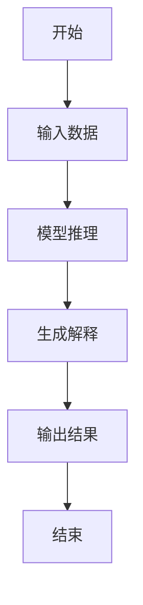

                 


# AI Agent的可解释性设计与实现

**关键词**：AI Agent、可解释性、设计实现、技术博客、系统架构

**摘要**：  
AI Agent的可解释性设计是当前人工智能领域的重要研究方向之一。随着AI技术的广泛应用，AI Agent的决策过程需要更加透明和可解释，以便用户能够理解其行为并信任其结果。本文从AI Agent的基本概念出发，系统地分析了可解释性设计的核心原理、算法实现、系统架构以及实际应用中的关键问题。通过具体的案例分析和代码实现，本文详细探讨了如何在实际项目中实现可解释性设计，并给出了相应的最佳实践建议。

---

## 第一部分: AI Agent的可解释性设计基础

### 第1章: AI Agent的基本概念与问题背景

#### 1.1 AI Agent的定义与核心要素
- **AI Agent的定义**：AI Agent（人工智能代理）是指能够感知环境、自主决策并采取行动的智能实体。它可以是一个软件程序、机器人或其他智能系统。
- **AI Agent的核心要素**：
  - **感知能力**：通过传感器或数据输入获取环境信息。
  - **决策能力**：基于感知信息，通过算法生成决策。
  - **行动能力**：根据决策执行具体操作。
  - **学习能力**：通过反馈优化自身行为。
- **AI Agent的分类**：
  - 基于规则的AI Agent。
  - 基于模型的AI Agent。
  - 基于机器学习的AI Agent。

#### 1.2 可解释性AI Agent的必要性
- **AI Agent决策的可解释性问题**：AI Agent的决策过程通常依赖复杂的算法，导致其行为难以被人类理解。
- **可解释性在实际应用中的重要性**：
  - 增强用户信任。
  - 符合法律法规要求。
  - 便于调试和优化。
- **可解释性AI Agent的边界与外延**：
  - 解释的范围：从简单规则到复杂模型。
  - 解释的形式：从文本说明到可视化展示。

---

### 第2章: 可解释性设计的核心概念与联系

#### 2.1 可解释性设计的原理
- **可解释性设计的基本原理**：
  - 简洁性：模型的设计应尽量简洁，便于解释。
  - 可视化：通过图表等方式直观展示决策过程。
  - 可追溯性：能够追踪决策的每一步骤。
- **可解释性与模型复杂性的关系**：
  - 简单模型通常更易解释。
  - 复杂模型（如深度学习模型）通常更难解释。

#### 2.2 核心概念对比分析
- **可解释性与不可解释性模型的对比**：
  | 对比维度         | 可解释性模型               | 不可解释性模型             |
  |------------------|--------------------------|--------------------------|
  | 解释能力         | 强                      | 弱或无                   |
  | 应用场景         | 需要解释性的领域（如医疗、金融） | 无严格解释性要求的领域    |
  | 开发复杂性       | 较低                    | 较高                     |
- **不同AI Agent模型的可解释性特征对比**：
  - 基于规则的模型：高度可解释。
  - 基于树的模型（如决策树）：中等可解释性。
  - 基于神经网络的模型：低可解释性。

#### 2.3 实体关系图与流程图
- **AI Agent可解释性设计的ER实体关系图**：
```mermaid
er
    entity(AI Agent) {
        id
        state
        action
        explanation
    }
    entity(Context) {
        id
        input
        output
    }
    entity(User) {
        id
        query
        feedback
    }
    AI Agent --> Context: interacts with
    AI Agent --> User: responds to
```
- **可解释性设计的流程图**：


---

## 第二部分: 可解释性设计的算法原理

### 第3章: 基于规则的可解释性模型

#### 3.1 基于规则的模型原理
- **规则定义**：通过人工定义一系列条件语句，指导AI Agent的行为。
- **优点**：
  - 高度可解释。
  - 开发简单。
- **缺点**：
  - 需要手动维护规则。
  - 无法处理复杂场景。

#### 3.2 规则生成与优化
- **规则生成**：通过数据挖掘技术自动生成规则。
- **规则优化**：通过合并、删除冗余规则，提升规则的简洁性。

---

### 第4章: 基于树的可解释性模型

#### 4.1 决策树模型原理
- **决策树构建**：通过训练数据生成一棵树状结构，叶子节点代表最终决策。
- **优点**：
  - 可视化能力强。
  - 解释性好。
- **缺点**：
  - 对噪声数据敏感。
  - 需要剪枝处理以避免过拟合。

#### 4.2 决策树的可解释性实现
- **决策树可视化**：通过图表展示决策过程。
- **路径解释**：为每个决策路径生成解释文本。

---

### 第5章: 基于神经网络的可解释性模型

#### 5.1 深度学习模型的可解释性挑战
- **模型复杂性**：神经网络通常由大量参数组成，难以直接解释。
- **黑箱问题**：深度学习模型的决策过程通常不透明。

#### 5.2 可解释性技术
- **模型解释方法**：
  - **特征重要性分析**：通过计算特征对模型输出的影响程度。
  - **注意力机制**：在模型中引入注意力机制，突出关键特征。
- **可视化工具**：
  - **Activation Maximization**：通过最大化特定神经元的激活值，找到影响模型决策的输入特征。
  - **梯度上升方法**：通过计算梯度，生成能够触发特定决策的输入样本。

---

## 第三部分: 可解释性设计的系统架构

### 第6章: 系统分析与架构设计

#### 6.1 系统功能设计
- **领域模型设计**：
  - **功能模块**：
    - 数据采集模块。
    - 模型训练模块。
    - 解释生成模块。
    - 用户交互模块。
  - **功能流程**：
    ```mermaid
    graph TD
        A[用户输入] --> B[数据采集]
        B --> C[模型训练]
        C --> D[解释生成]
        D --> E[用户输出]
    ```

#### 6.2 系统架构设计
- **分层架构**：
  - **数据层**：负责数据的存储和管理。
  - **模型层**：负责模型的训练和推理。
  - **解释层**：负责解释的生成和展示。
  - **交互层**：负责用户与系统的交互。

#### 6.3 接口设计与交互流程
- **API设计**：
  - 输入接口：接收用户请求。
  - 输出接口：返回模型决策和解释。
- **交互流程图**：
  ```mermaid
  sequenceDiagram
      User -> AI Agent: 发送请求
      AI Agent -> 解释生成模块: 生成解释
      AI Agent -> User: 返回决策和解释
  ```

---

## 第四部分: 项目实战与案例分析

### 第7章: 项目实战

#### 7.1 环境安装与配置
- **工具安装**：
  - 安装Python和相关库（如scikit-learn、xgboost、shap）。
  - 安装可视化工具（如graphviz、matplotlib）。

#### 7.2 核心实现代码
- **基于规则的AI Agent实现**：
  ```python
  class AIAGENT:
      def __init__(self, rules):
          self.rules = rules

      def decide(self, input_data):
          for rule in self.rules:
              if rule.condition(input_data):
                  return rule.action
          return default_action
  ```

- **基于决策树的AI Agent实现**：
  ```python
  from sklearn.tree import DecisionTreeClassifier
  model = DecisionTreeClassifier()
  model.fit(X_train, y_train)
  ```

- **基于神经网络的AI Agent实现**：
  ```python
  import torch
  class SimpleNet(torch.nn.Module):
      def __init__(self, input_size, output_size):
          super(SimpleNet, self).__init__()
          self.fc1 = torch.nn.Linear(input_size, 128)
          self.fc2 = torch.nn.Linear(128, output_size)
  
      def forward(self, x):
          x = torch.relu(self.fc1(x))
          x = torch.sigmoid(self.fc2(x))
          return x
  ```

#### 7.3 案例分析与代码解读
- **案例1：医疗诊断AI Agent**
  - 数据集：医学诊断数据。
  - 模型：决策树模型。
  - 解释：通过决策树可视化，展示诊断过程。
- **案例2：金融风险评估AI Agent**
  - 数据集：金融风险数据。
  - 模型：基于规则的模型。
  - 解释：生成规则解释文本。

---

## 第五部分: 最佳实践与总结

### 第8章: 最佳实践

#### 8.1 可解释性设计的注意事项
- **选择合适的模型**：根据应用场景选择可解释性要求高的模型。
- **保持简洁**：避免过度复杂的模型。
- **提供多种解释方式**：结合文本、图表等多种形式。

#### 8.2 小结与展望
- **小结**：本文系统地介绍了AI Agent的可解释性设计与实现，从理论到实践，详细探讨了多种可解释性模型及其实现方法。
- **展望**：未来的研究方向包括更高效的解释生成算法和更智能化的解释展示方式。

---

## 参考文献
1. Goodfellow, I., Bengio, Y., & Courville, A. (2016). *Deep Learning*. MIT Press.
2. Hastie, T., Tibshirani, R., & Friedman, J. (2009). *The Elements of Statistical Learning*. Springer.
3. Molnar, C. (2019). *Interpretable Machine Learning. A Guide*. [https://christophm.github.io/interpretable-ml-book/](https://christophm.github.io/interpretable-ml-book/)

---

通过以上内容，您可以根据实际需求进一步扩展和深化各个部分的内容。

