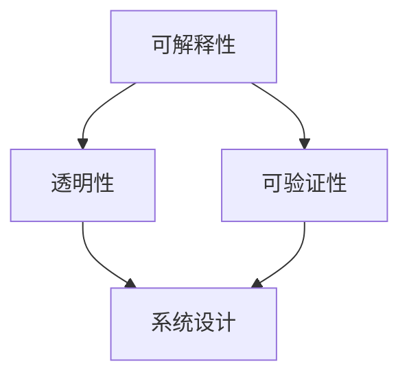
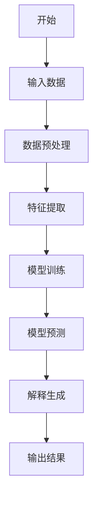
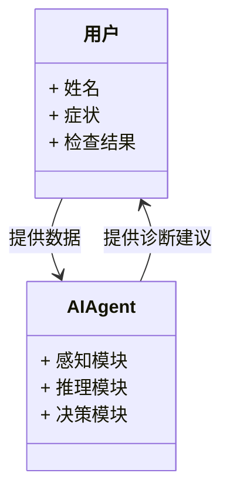

                 


# AI Agent的可解释性设计原则

## 关键词：AI Agent, 可解释性, 透明性, 算法设计, 系统架构, 项目实战

## 摘要：本文深入探讨了AI Agent的可解释性设计原则，从核心概念、算法原理、系统架构到项目实战，全面解析如何在AI Agent中实现可解释性设计。文章通过实际案例和详细的技术分析，为AI开发者和研究人员提供了实用的设计指导和最佳实践。

---

# 第一部分: AI Agent与可解释性概述

## 第1章: AI Agent与可解释性概述

### 1.1 问题背景

#### 1.1.1 AI Agent的基本概念
AI Agent（智能体）是指能够感知环境、自主决策并采取行动以实现特定目标的实体。它可以是一个软件程序、机器人或其他智能系统，通过与环境交互来完成任务。AI Agent的核心功能包括感知、推理、规划和执行。

#### 1.1.2 可解释性问题的提出
随着AI Agent在医疗、金融、自动驾驶等领域的广泛应用，其决策过程的透明性和可解释性变得至关重要。用户和利益相关者需要理解AI Agent的决策依据，以建立信任并确保系统的可靠性和合规性。

#### 1.1.3 可解释性的重要性
可解释性是AI系统获得用户信任的关键因素。它不仅帮助用户理解AI Agent的行为，还能在出现问题时进行追溯和修正，确保系统的责任可追究和决策可验证。

### 1.2 问题描述

#### 1.2.1 AI Agent的决策过程
AI Agent的决策过程通常包括以下几个步骤：
1. **感知**：通过传感器或数据输入获取环境信息。
2. **推理**：基于感知的信息，利用知识库或模型进行逻辑推理。
3. **规划**：根据推理结果，制定行动计划。
4. **执行**：执行预定的动作以实现目标。

#### 1.2.2 可解释性在AI Agent中的作用
可解释性通过提供决策的依据和过程，帮助用户理解AI Agent的行动逻辑，增强系统的透明性和可信度。这对于需要遵守严格监管的行业尤为重要。

#### 1.2.3 当前AI Agent面临的挑战
当前AI Agent在可解释性方面面临的主要挑战包括：
- **黑箱模型**：许多高级AI算法（如深度神经网络）被视为“黑箱”，难以解释其决策过程。
- **复杂性**：复杂的算法和数据可能导致决策过程难以被人类理解。
- **动态环境**：动态和不确定的环境增加了决策过程的复杂性，使得可解释性更加困难。

### 1.3 问题解决

#### 1.3.1 可解释性设计的目标
- 提供清晰的决策依据和过程。
- 建立透明的系统架构，便于理解和追溯。
- 确保决策的可验证性和可解释性。

#### 1.3.2 可解释性设计的原则
- **透明性**：系统的设计和决策过程应尽可能透明。
- **可理解性**：决策过程和结果应以用户可理解的方式呈现。
- **可验证性**：决策过程和结果应可被验证和审核。

#### 1.3.3 可解释性设计的实现路径
- **选择可解释的算法**：优先使用如决策树、规则模型等可解释性较强的算法。
- **记录决策过程**：详细记录AI Agent的决策过程和依据，便于追溯和分析。
- **可视化技术**：利用图表和可视化工具直观展示决策过程和结果。

### 1.4 边界与外延

#### 1.4.1 可解释性与不可解释性的边界
- **可解释性**：系统的行为可以通过明确的逻辑和规则被人类理解。
- **不可解释性**：系统的行为无法被人类理解和分解。

#### 1.4.2 可解释性设计的适用范围
可解释性设计适用于需要用户信任和监管合规的领域，如医疗、金融、法律等。对于一些实时性和性能要求极高的应用，可解释性可能需要在一定程度上妥协。

#### 1.4.3 可解释性设计的局限性
- **性能限制**：过于强调可解释性可能导致系统性能下降。
- **复杂性**：复杂的决策过程可能难以完全解释。
- **用户认知**：用户对解释的理解程度可能影响系统的实际效果。

### 1.5 概念结构与核心要素

#### 1.5.1 AI Agent的构成要素
AI Agent通常由以下几个部分组成：
- **感知模块**：负责获取环境信息。
- **推理模块**：对感知信息进行分析和推理。
- **决策模块**：基于推理结果制定行动计划。
- **执行模块**：执行预定的动作。

#### 1.5.2 可解释性的核心要素
- **决策依据**：决策所依赖的数据和规则。
- **推理过程**：决策过程中使用的逻辑和推理步骤。
- **结果解释**：对决策结果的解释和说明。

#### 1.5.3 可解释性设计的系统架构
一个典型的可解释性设计系统架构包括：
- **数据输入层**：接收环境数据。
- **推理层**：进行逻辑推理和决策。
- **解释层**：生成决策的解释信息。
- **输出层**：将解释信息传递给用户或系统。

---

## 第2章: 可解释性设计的核心概念

### 2.1 核心概念原理

#### 2.1.1 可解释性的定义与分类
可解释性是指AI系统的行为能够被人类理解和解释的程度。根据解释的深度和范围，可解释性可以分为：
- **局部可解释性**：解释模型在特定输入下的决策。
- **全局可解释性**：解释模型的整体行为和决策逻辑。

#### 2.1.2 可解释性与透明性的区别
- **透明性**：系统的设计和决策过程是公开和可理解的。
- **可解释性**：系统的行为可以被人类理解和解释。

透明性是可解释性的基础，但可解释性更关注系统行为的解释能力。

#### 2.1.3 可解释性与可验证性的关系
可验证性是指系统的行为可以被验证和审核。可解释性与可验证性密切相关，因为可解释的系统更容易被验证和审核。

### 2.2 核心概念特征对比

#### 2.2.1 表格对比可解释性与相关概念
| 概念     | 定义                               | 关注点               |
|----------|----------------------------------|--------------------|
| 可解释性 | 系统行为可以被理解和解释的程度   | 行为的解释和理解     |
| 透明性   | 系统设计和决策过程是公开和可理解 | 系统设计的公开性     |
| 可验证性 | 系统行为可以被验证和审核         | 行为的验证和审核     |

#### 2.2.2 图形化展示核心概念之间的关系


### 2.3 ER实体关系图

```mermaid
erd
actor 用户
actor 监管机构
actor 开发者
entity AI Agent
entity 决策过程
entity 数据源
```

---

## 第3章: 可解释性设计的算法原理

### 3.1 算法原理概述

#### 3.1.1 可解释性算法的基本原理
可解释性算法通常基于规则、树模型或线性模型，这些模型具有较高的可解释性。例如：
- **决策树**：通过树状结构展示决策逻辑，易于理解和解释。
- **规则模型**：基于预定义的规则进行决策，规则清晰明确。

#### 3.1.2 算法的可解释性评估标准
评估算法的可解释性可以从以下几个方面考虑：
- **可理解性**：算法的逻辑是否易于理解。
- **可解释性**：算法的决策过程是否可以被解释。
- **可验证性**：算法的决策是否可以被验证和审核。

### 3.2 算法实现

#### 3.2.1 使用Mermaid绘制算法流程图



#### 3.2.2 Python源代码实现

```python
# 示例代码：基于规则的可解释性算法
def decision_rule(input_data):
    if input_data['特征1'] > 0.5:
        return '决策1'
    else:
        return '决策2'

# 解释生成
def explain_decision(input_data, decision):
    if decision == '决策1':
        return "因为特征1的值大于0.5，所以做出决策1。"
    else:
        return "因为特征1的值小于等于0.5，所以做出决策2。"
```

#### 3.2.3 数学模型和公式

AI Agent的决策过程可以用以下公式表示：

$$
\text{决策} = f(\text{输入数据})
$$

其中，$f$ 是决策函数，$输入数据$ 是系统的输入数据。对于可解释性算法，$f$ 的形式通常是清晰的，如线性回归或决策树。

---

## 第4章: 系统分析与架构设计

### 4.1 问题场景介绍

#### 4.1.1 问题描述
以医疗诊断中的AI Agent为例，AI Agent需要根据患者的症状和检查结果做出诊断建议。由于医疗决策的高风险性，可解释性设计至关重要。

#### 4.1.2 项目介绍
项目目标是开发一个可解释的医疗诊断AI Agent，能够根据患者的症状和检查结果提供诊断建议，并解释决策过程。

### 4.2 系统功能设计

#### 4.2.1 领域模型设计



#### 4.2.2 系统架构设计


---

## 第5章: 项目实战

### 5.1 环境安装

#### 5.1.1 工具安装
- **Python**：用于编程和数据分析。
- **Jupyter Notebook**：用于算法开发和测试。
- **Mermaid**：用于绘制图表。

安装命令：
```bash
pip install mermaid
```

### 5.2 系统核心实现源代码

#### 5.2.1 代码实现

```python
# 示例代码：医疗诊断AI Agent
class MedicalAI:
    def __init__(self):
        self.symptoms = []
        self.rules = {
            '规则1': '如果症状1存在，则诊断为疾病A',
            '规则2': '如果症状2存在，则诊断为疾病B'
        }

    def process_input(self, input_data):
        self.symptoms = input_data['症状']
        return self.symptoms

    def make_decision(self):
        for rule in self.rules:
            if eval(self.rules[rule]):
                return rule
        return '无明确诊断'

    def explain_decision(self, rule):
        return self.rules[rule]
```

#### 5.2.2 代码解读
- **MedicalAI类**：包含AI Agent的核心功能，如处理输入、制定决策和生成解释。
- **process_input方法**：接收输入数据并提取症状。
- **make_decision方法**：根据预定义的规则进行决策。
- **explain_decision方法**：生成决策的解释。

### 5.3 代码应用解读与分析

#### 5.3.1 案例分析
假设输入数据为：
```python
input_data = {
    '症状': ['症状1', '症状2']
}
```

AI Agent会根据规则进行诊断，并生成相应的解释。

#### 5.3.2 详细讲解
在上述案例中，AI Agent首先检查规则1，发现症状1存在，因此诊断为疾病A，并生成相应的解释。如果症状1不存在，但症状2存在，则诊断为疾病B。

### 5.4 项目小结

#### 5.4.1 经验总结
- **选择合适的算法**：使用规则模型可以提高可解释性。
- **记录决策过程**：详细记录每一步的决策依据，便于追溯和分析。
- **可视化技术**：利用图表和可视化工具帮助用户理解决策过程。

#### 5.4.2 问题与反思
- **规则的复杂性**：过多的规则可能导致决策过程难以管理。
- **用户教育**：用户需要具备一定的知识才能理解解释内容。

---

## 第6章: 最佳实践、小结、注意事项和拓展阅读

### 6.1 最佳实践 Tips

#### 6.1.1 设计建议
- **优先选择可解释性强的算法**：如决策树、规则模型。
- **记录详细的决策日志**：便于问题追溯和分析。
- **提供多级解释**：根据用户需求提供不同深度的解释。

#### 6.1.2 技术选型建议
- **工具选择**：使用Jupyter Notebook进行算法开发，使用Mermaid进行图表绘制。
- **框架选择**：选择支持可解释性设计的框架，如Interpretable-Machine-Learning。

### 6.2 小结

#### 6.2.1 总结回顾
本文详细探讨了AI Agent的可解释性设计原则，从核心概念、算法原理到系统架构，全面解析了如何在AI Agent中实现可解释性设计。

#### 6.2.2 未来展望
随着AI技术的不断发展，可解释性设计将更加重要。未来的研究方向包括开发更高效的可解释性算法和制定行业标准。

### 6.3 注意事项

#### 6.3.1 实施中的注意事项
- **数据隐私**：确保数据处理过程中的隐私保护。
- **用户教育**：提高用户对解释的理解和使用能力。

#### 6.3.2 常见问题解答
- **如何平衡可解释性和性能？**：可以通过简化模型或选择合适的算法在两者之间找到平衡。
- **如何处理复杂环境下的可解释性？**：可以结合多种技术，如规则和解释生成工具。

### 6.4 拓展阅读

#### 6.4.1 推荐书籍和论文
- 《可解释的人工智能：模型、方法和应用》
- 《可解释性在机器学习中的应用》

#### 6.4.2 推荐阅读资料
- [Interpretable-Machine-Learning](https://github.com/1012497038/Interpretable-Machine-Learning)
- [Mermaid官方文档](https://mermaid-js.github.io/mermaid-docs/)

---

## 总结

本文通过详细分析AI Agent的可解释性设计原则，从理论到实践，为AI开发者和研究人员提供了全面的指导。通过实际案例和详细的技术分析，展示了如何在实际项目中实现可解释性设计。希望本文能为读者在设计和实现可解释的AI Agent时提供有价值的参考和启发。

