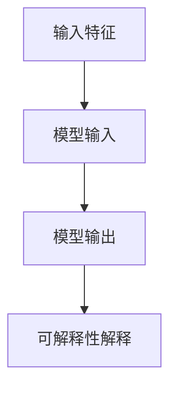
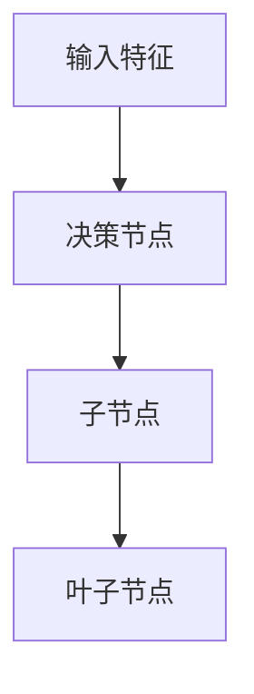
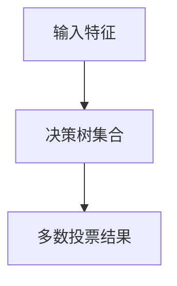
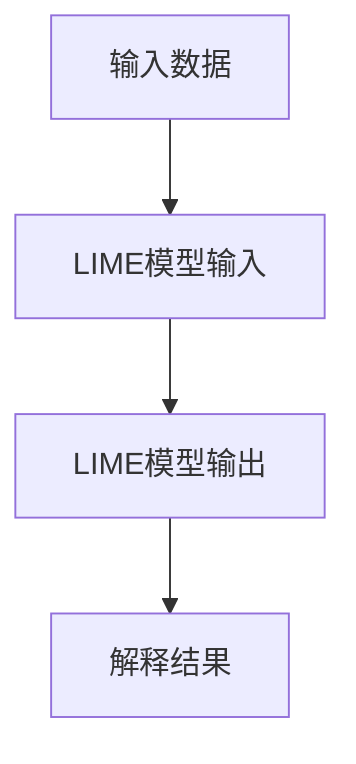

                 


# AI Agent的可解释性设计：提高模型决策的透明度

## 关键词：AI Agent，可解释性，决策透明度，算法解释，系统设计，项目实战

## 摘要：本文系统地探讨了AI Agent的可解释性设计，从基本概念、核心理论、算法实现到系统设计和项目实战，全面剖析了如何提高AI Agent决策的透明度，确保用户对AI决策过程的信任和理解。

---

# 第一部分: AI Agent的可解释性设计基础

## 第1章: AI Agent与可解释性概述

### 1.1 AI Agent的基本概念

#### 1.1.1 什么是AI Agent
AI Agent（人工智能代理）是指能够感知环境、自主决策并执行任务的智能实体。它可以是一个软件程序、机器人或其他智能系统，具备以下核心特征：

- **自主性**：能够在没有外部干预的情况下独立运作。
- **反应性**：能够感知环境并实时做出响应。
- **目标导向**：以特定目标为导向，优化决策以实现目标。

#### 1.1.2 AI Agent的核心特征
AI Agent的设计需要考虑以下几个核心特征：
1. **感知能力**：通过传感器或数据输入感知环境。
2. **决策能力**：基于感知信息，利用算法做出决策。
3. **执行能力**：根据决策执行具体操作。
4. **学习能力**：通过经验或数据优化决策策略。

#### 1.1.3 AI Agent的应用场景
AI Agent广泛应用于多个领域：
- **推荐系统**：根据用户行为推荐商品或内容。
- **自动驾驶**：实时感知环境并做出驾驶决策。
- **医疗诊断**：辅助医生进行疾病诊断和治疗方案选择。
- **金融交易**：自动执行股票交易或风险评估。

### 1.2 可解释性的重要性

#### 1.2.1 为什么需要AI Agent的可解释性
AI Agent的决策需要可解释，原因如下：
1. **用户信任**：用户需要理解AI的决策逻辑，才能信任其结果。
2. **责任追究**：当AI决策导致问题时，可解释性有助于追溯决策原因。
3. **合规性要求**：许多行业（如金融、医疗）需要符合监管要求，确保决策过程透明。

#### 1.2.2 可解释性在AI决策中的作用
可解释性有助于：
1. **提升用户体验**：用户更容易理解AI的决策逻辑。
2. **优化模型**：通过分析解释，发现模型的不足并进行改进。
3. **降低风险**：可解释性有助于识别模型中的潜在偏差或错误。

#### 1.2.3 可解释性与信任的关系
可解释性是建立用户信任的关键。当用户能够理解AI的决策过程时，他们更愿意依赖AI系统。

### 1.3 问题背景与目标

#### 1.3.1 当前AI Agent决策的不透明性
当前许多AI Agent的决策过程缺乏透明度，用户难以理解模型为何做出特定决策。

#### 1.3.2 可解释性设计的核心目标
设计可解释性AI Agent的目标是：
1. 提供清晰的决策理由。
2. 确保决策过程符合逻辑和用户预期。
3. 使用户能够验证和信任AI的决策。

#### 1.3.3 可解释性与模型复杂度的关系
模型复杂度越高，通常可解释性越低。因此，在设计AI Agent时需要在模型复杂度和可解释性之间找到平衡点。

### 1.4 本章小结
本章介绍了AI Agent的基本概念、核心特征和应用场景，强调了可解释性的重要性，并指出了设计可解释性AI Agent的目标和挑战。

---

## 第2章: 可解释性设计的核心概念

### 2.1 可解释性的维度

#### 2.1.1 属性可解释性
属性可解释性指模型对输入特征的解释能力。例如，在医疗诊断中，模型能够解释诊断结果的关键特征。

#### 2.1.2 决策可解释性
决策可解释性指模型对决策过程的解释能力。例如，在推荐系统中，模型能够解释推荐某个商品的原因。

#### 2.1.3 行为可解释性
行为可解释性指模型对执行行为的解释能力。例如，在自动驾驶中，模型能够解释为何选择特定的驾驶动作。

### 2.2 核心概念与联系

#### 2.2.1 可解释性与模型复杂度的关系
模型复杂度越高，通常可解释性越低。因此，在设计AI Agent时需要在模型复杂度和可解释性之间找到平衡点。

#### 2.2.2 可解释性与数据质量的关系
高质量的数据有助于提高模型的可解释性。数据中的噪声和偏差会影响模型的解释能力。

#### 2.2.3 可解释性与用户需求的关系
用户的需求不同，对可解释性的要求也不同。例如，医生可能需要详细的诊断解释，而普通用户可能只需要简单的推荐理由。

### 2.3 概念属性特征对比表

| 概念        | 属性      | 特征                          |
|-------------|-----------|------------------------------|
| 可解释性     | 解释性    | 高/低                        |
| 模型复杂度   | 属性      | 简单/复杂                    |
| 决策透明度   | 属性      | 高/低                        |

### 2.4 ER实体关系图

```mermaid
er
actor(AI Agent) -|-> decision: 可解释性
```

### 2.5 本章小结
本章探讨了可解释性的不同维度，并分析了可解释性与模型复杂度、数据质量和用户需求之间的关系。通过对比表和ER图，进一步明确了可解释性的核心概念。

---

## 第3章: 可解释性设计的算法原理

### 3.1 简单可解释模型

#### 3.1.1 线性回归模型

##### 3.1.1.1 线性回归的可解释性
线性回归模型的可解释性较高，每个特征的权重可以直接解释其对预测结果的影响。

##### 3.1.1.2 线性回归公式
线性回归的数学公式为：
$$y = \beta_0 + \beta_1x_1 + \beta_2x_2 + \dots + \beta_nx_n$$

##### 3.1.1.3 线性回归流程图


#### 3.1.2 决策树模型

##### 3.1.2.1 决策树的可解释性
决策树模型的可解释性较高，可以通过树状结构直观展示决策过程。

##### 3.1.2.2 决策树流程图


#### 3.1.3 随机森林模型

##### 3.1.3.1 随机森林的可解释性
随机森林模型的可解释性可以通过特征重要性分析来评估。

##### 3.1.3.2 随机森林流程图


### 3.2 可解释性增强算法

#### 3.2.1 LIME解释方法

##### 3.2.1.1 LIME的基本原理
LIME（Local Interpretable Model-agnostic Explanations）是一种通过局部可解释模型来解释全局模型的算法。

##### 3.2.1.2 LIME流程图


#### 3.2.2 SHAP值

##### 3.2.2.1 SHAP值的基本原理
SHAP（SHapley Additive exPlanations）是一种基于博弈论的解释方法，能够量化每个特征对预测结果的贡献。

##### 3.2.2.2 SHAP值公式
SHAP值的计算公式为：
$$\phi_i = \sum_{S \subseteq \{i\}} \phi_S(i)$$

#### 3.2.3 Attention机制

##### 3.2.3.1 Attention机制的基本原理
Attention机制通过关注输入数据中重要的部分来提高模型的可解释性。

##### 3.2.3.2 Attention机制公式
Attention机制的计算公式为：
$$\alpha_i = \frac{\exp(w_i^T x)}{\sum_{j}\exp(w_j^T x)}$$

### 3.3 算法原理图

#### 3.3.1 线性回归流程图


#### 3.3.2 决策树流程图


#### 3.3.3 随机森林流程图


### 3.4 本章小结
本章详细介绍了几种简单可解释模型和可解释性增强算法，包括线性回归、决策树、随机森林、LIME、SHAP和Attention机制，并通过流程图和公式展示了它们的原理和实现方式。

---

## 第4章: 可解释性设计的系统设计

### 4.1 系统设计概述

#### 4.1.1 系统功能设计
系统功能设计包括：
1. **输入处理**：接收输入数据并进行预处理。
2. **模型选择**：根据需求选择合适的可解释性模型。
3. **解释生成**：生成模型的可解释性解释。
4. **输出展示**：以用户友好的方式展示解释结果。

#### 4.1.2 系统架构设计
系统架构设计包括：
1. **数据层**：存储和管理输入数据。
2. **模型层**：实现可解释性模型。
3. **解释层**：生成和管理解释结果。
4. **展示层**：以可视化方式展示解释结果。

#### 4.1.3 系统交互设计
系统交互设计包括：
1. **用户输入**：用户输入数据或查询。
2. **系统响应**：系统根据输入生成解释结果。
3. **用户反馈**：用户对解释结果进行反馈。

### 4.2 系统设计的详细实现

#### 4.2.1 数据预处理
数据预处理是系统设计的重要步骤，包括数据清洗、特征选择和数据转换。

#### 4.2.2 模型选择
根据需求选择合适的可解释性模型，例如线性回归、决策树或随机森林。

#### 4.2.3 解释生成
通过LIME、SHAP等方法生成模型的可解释性解释。

#### 4.2.4 结果展示
以可视化方式展示解释结果，例如通过图表或文本说明。

### 4.3 本章小结
本章从系统设计的角度，详细探讨了AI Agent可解释性设计的实现过程，包括功能设计、架构设计和交互设计。

---

## 第5章: 可解释性设计的项目实战

### 5.1 项目背景

#### 5.1.1 项目目标
本项目旨在设计一个可解释的AI Agent，用于医疗诊断辅助系统。

#### 5.1.2 项目需求
项目需求包括：
1. 提供可解释的诊断结果。
2. 支持用户理解和验证诊断结果。

### 5.2 项目设计

#### 5.2.1 系统功能设计
系统功能设计包括：
1. **数据输入**：接收患者的症状和检查结果。
2. **模型选择**：选择合适的可解释性模型。
3. **解释生成**：生成诊断结果的解释。
4. **结果展示**：以可视化方式展示诊断结果和解释。

#### 5.2.2 系统架构设计
系统架构设计包括：
1. **数据层**：存储患者数据。
2. **模型层**：实现可解释性模型。
3. **解释层**：生成解释结果。
4. **展示层**：展示诊断结果和解释。

### 5.3 项目实现

#### 5.3.1 环境安装
需要安装以下工具和库：
- Python 3.x
- scikit-learn
- SHAP
- LIME

#### 5.3.2 核心代码实现

##### 5.3.2.1 数据预处理代码
```python
import pandas as pd
from sklearn.model_selection import train_test_split

# 加载数据
data = pd.read_csv('medical_dataset.csv')
X = data.drop('diagnosis', axis=1)
y = data['diagnosis']

# 划分训练集和测试集
X_train, X_test, y_train, y_test = train_test_split(X, y, test_size=0.2, random_state=42)
```

##### 5.3.2.2 模型训练代码
```python
from sklearn.ensemble import RandomForestClassifier

# 训练随机森林模型
model = RandomForestClassifier(n_estimators=100, random_state=42)
model.fit(X_train, y_train)
```

##### 5.3.2.3 解释生成代码
```python
import shap

# 使用SHAP生成解释
explainer = shap.TreeExplainer(model)
shap_values = explainer.shap_values(model, X_test)
```

##### 5.3.2.4 结果展示代码
```python
import matplotlib.pyplot as plt

# 可视化解释结果
shap.summary_plot(shap_values, X_test, plot_type="bar", feature_names=X.columns)
plt.show()
```

### 5.4 项目测试与优化

#### 5.4.1 测试结果分析
通过测试结果分析模型的可解释性和准确性。

#### 5.4.2 模型优化
根据测试结果优化模型参数和解释生成方法。

### 5.5 本章小结
本章通过一个具体的项目实战，详细展示了AI Agent可解释性设计的实现过程，包括环境安装、核心代码实现和结果展示。

---

## 第6章: 总结与展望

### 6.1 全文总结

#### 6.1.1 核心内容回顾
本文系统地探讨了AI Agent的可解释性设计，从基本概念、核心理论、算法实现到系统设计和项目实战，全面剖析了如何提高AI Agent决策的透明度。

#### 6.1.2 重要结论
1. 可解释性是提高用户信任和合规性的重要因素。
2. 简单可解释模型和可解释性增强算法是实现可解释性设计的关键。
3. 系统设计和项目实战是可解释性设计的重要实践。

### 6.2 未来展望

#### 6.2.1 技术发展
随着AI技术的不断发展，可解释性设计将更加重要。

#### 6.2.2 应用场景扩展
可解释性设计将在更多领域得到应用，例如金融、医疗和教育。

#### 6.2.3 挑战与机遇
尽管可解释性设计面临诸多挑战，但也带来了许多机遇，例如通过可解释性提高模型的准确性和用户信任。

### 6.3 本章小结
本章总结了全文的核心内容，并展望了可解释性设计的未来发展方向。

---

## 结束语

通过本文的系统探讨，我们深入理解了AI Agent的可解释性设计的重要性、实现方法和实际应用。未来，随着技术的不断发展，可解释性设计将成为AI领域的重要研究方向，为用户信任和决策透明度提供坚实保障。

