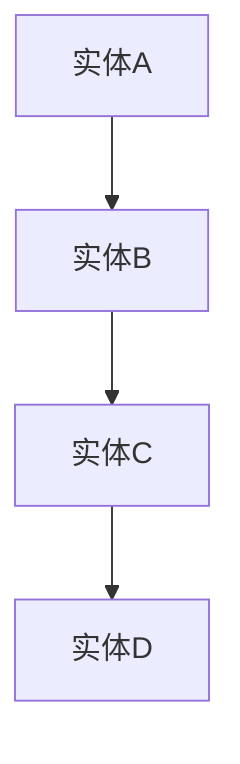
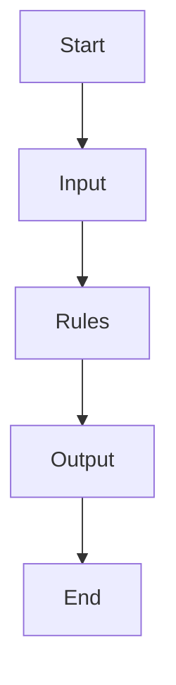
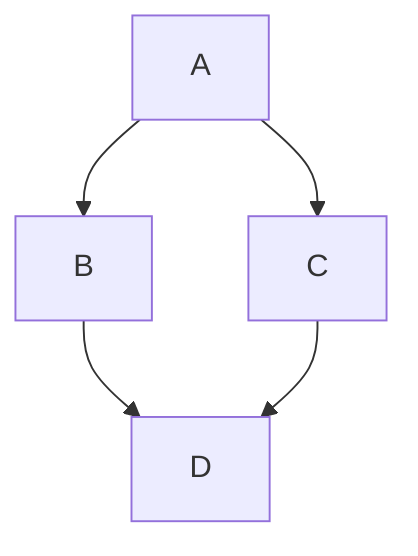
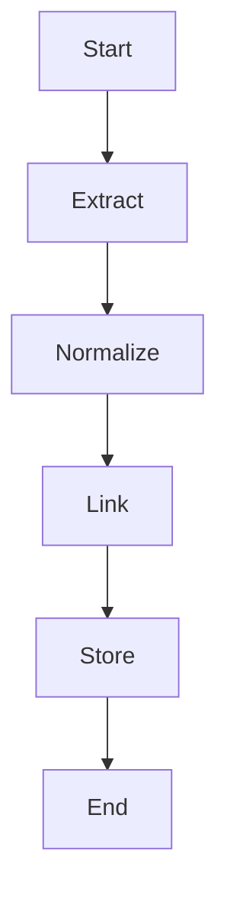
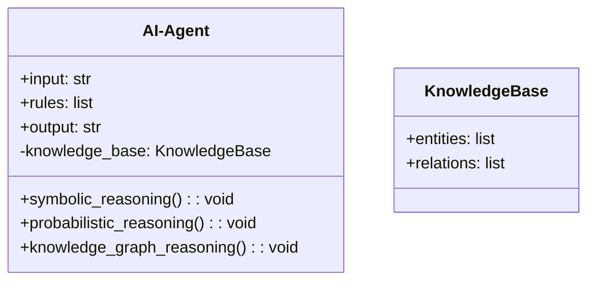
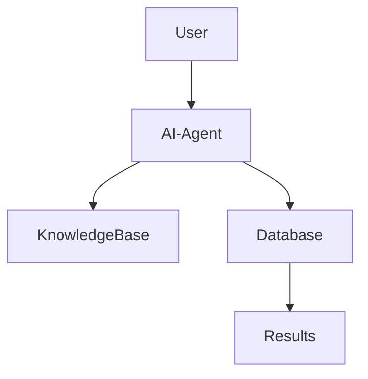
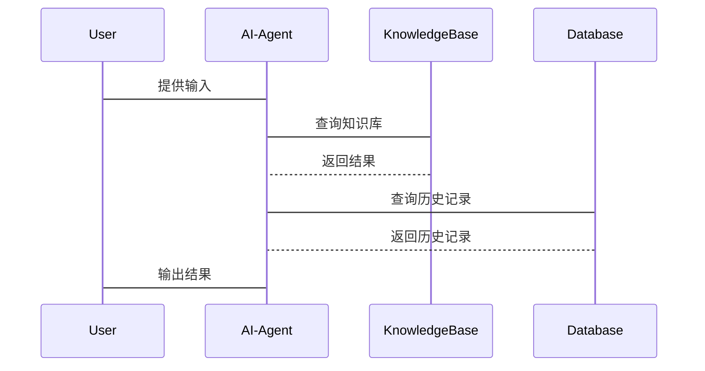

                 


# AI Agent的可解释推理：提高LLM决策的透明度

> 关键词：AI Agent, 可解释推理, LLM决策透明度, 透明AI, 可解释性, 推理算法, 知识图谱

> 摘要：本文深入探讨了AI Agent的可解释推理方法，详细分析了如何提高大型语言模型（LLM）的决策透明度。通过结合符号逻辑、概率论和知识图谱等多种推理方法，本文提出了系统化的解决方案，并通过实际案例展示了如何在复杂场景中实现可解释推理。文章还讨论了系统架构设计、算法实现和项目实战，为读者提供全面的技术指导。

---

# 第1章: AI Agent与可解释推理概述

## 1.1 问题背景与定义

### 1.1.1 AI Agent的基本概念
AI Agent（智能体）是指在计算机系统中能够感知环境并采取行动以实现目标的实体。它可以是一个软件程序、机器人或其他智能系统。

### 1.1.2 可解释推理的定义与特征
可解释推理是指AI Agent在做出决策时，能够提供清晰、合理且可验证的推理过程。其主要特征包括透明性、可验证性和可追溯性。

### 1.1.3 LLM决策透明度的重要性
LLM（Large Language Model）是一种基于深度学习的自然语言处理模型，其决策过程往往缺乏透明性。提高其决策透明度对于信任建设和实际应用至关重要。

## 1.2 可解释推理的核心要素

### 1.2.1 决策过程的透明性
AI Agent的决策过程需要能够被用户理解和验证，确保每个决策都有据可依。

### 1.2.2 推理过程的可验证性
推理过程需要符合逻辑，可以通过验证工具或方法进行检查。

### 1.2.3 结果的可追溯性
决策结果需要能够追溯到初始输入和推理过程，确保结果的可信性。

## 1.3 当前LLM的挑战与局限性

### 1.3.1 LLM的黑箱问题
LLM的决策过程往往被视为“黑箱”，难以解释其输出结果的原因。

### 1.3.2 可解释性在实际应用中的需求
在医疗、金融等领域，用户对AI决策的可解释性有较高要求，以确保决策的合法性和合规性。

### 1.3.3 提高LLM可解释性的必要性
通过提高可解释性，可以增强用户对AI系统的信任，并有助于发现和修正潜在的错误。

## 1.4 本章小结
本章介绍了AI Agent和可解释推理的基本概念，分析了当前LLM的挑战，并强调了提高决策透明度的重要性。

---

# 第2章: 可解释推理的核心概念与联系

## 2.1 可解释推理的原理

### 2.1.1 基于符号逻辑的推理
符号逻辑推理通过形式化规则进行推理，具有高度的可解释性。

### 2.1.2 基于概率论的推理
概率论推理通过计算事件发生的概率进行决策，适用于不确定性的场景。

### 2.1.3 基于知识图谱的推理
知识图谱推理通过构建知识网络，利用图结构进行推理，能够提供丰富的语义信息。

## 2.2 可解释推理的特征对比

### 2.2.1 不同推理方法的对比表格
以下是一个对比表格：

| 推理方法         | 可解释性 | 适用场景 | 实现复杂度 |
|------------------|----------|----------|------------|
| 符号逻辑推理     | 高       | 确定性场景 | 中         |
| 概率论推理       | 中       | 不确定性场景 | 高         |
| 知识图谱推理     | 高       | 复杂场景   | 中         |

### 2.2.2 ER实体关系图架构
以下是实体关系图的Mermaid表示：



---

# 第3章: 可解释推理的算法实现

## 3.1 基于符号逻辑的推理算法

### 3.1.1 算法流程图（Mermaid）



### 3.1.2 Python实现代码

```python
def symbolic_reasoning(rules, input):
    for rule in rules:
        if ruleMatches(rule, input):
            return apply_rule(rule)
    return default_output
```

### 3.1.3 数学模型与公式

符号逻辑推理基于布尔逻辑，其基本公式为：
$$
\text{如果 } P \land Q \text{，则 } R
$$

---

## 3.2 基于概率论的推理算法

### 3.2.1 贝叶斯网络的构建

贝叶斯网络是一种概率推理模型，其结构如下：



### 3.2.2 条件概率公式

条件概率公式为：
$$
P(A|B) = \frac{P(B|A)P(A)}{P(B)}
$$

### 3.2.3 算法实现与案例分析

```python
def bayesian_reasoning(prior_prob, likelihood, evidence):
    posterior = (prior_prob * likelihood) / evidence
    return posterior
```

---

## 3.3 基于知识图谱的推理算法

### 3.3.1 知识图谱构建流程

知识图谱构建流程如下：



### 3.3.2 算法实现与代码分析

```python
def knowledge_graph_reasoning(query, graph):
    results = []
    for node in graph.nodes:
        if graph.match(query, node):
            results.append(node)
    return results
```

### 3.3.3 数学模型与公式

知识图谱推理可以基于相似性计算，例如余弦相似度：
$$
\text{相似度} = \frac{\vec{A} \cdot \vec{B}}{|\vec{A}| |\vec{B}|}
$$

---

# 第4章: 可解释推理的系统架构设计

## 4.1 问题场景介绍

### 4.1.1 LLM决策透明度的需求
在金融交易中，用户需要了解AI的决策过程，以确保合规性。

### 4.1.2 可解释推理的应用场景
医疗诊断、法律咨询等领域都需要可解释推理。

## 4.2 系统功能设计

### 4.2.1 领域模型（Mermaid类图）



### 4.2.2 系统架构设计（Mermaid架构图）



### 4.2.3 系统接口设计
系统接口包括输入接口、推理接口和输出接口。

### 4.2.4 系统交互流程（Mermaid序列图）



---

# 第5章: 项目实战

## 5.1 环境安装与配置

### 5.1.1 开发环境搭建
安装Python、TensorFlow、Keras等工具。

### 5.1.2 依赖管理
使用pip管理依赖：
```bash
pip install numpy pandas tensorflow
```

## 5.2 核心代码实现

### 5.2.1 符号逻辑推理实现

```python
def symbolic_reasoning(rules, input):
    for rule in rules:
        if ruleMatches(rule, input):
            return apply_rule(rule)
    return default_output
```

### 5.2.2 概率论推理实现

```python
def bayesian_reasoning(prior_prob, likelihood, evidence):
    posterior = (prior_prob * likelihood) / evidence
    return posterior
```

### 5.2.3 知识图谱推理实现

```python
def knowledge_graph_reasoning(query, graph):
    results = []
    for node in graph.nodes:
        if graph.match(query, node):
            results.append(node)
    return results
```

## 5.3 案例分析与解读

### 5.3.1 案例背景
假设我们有一个医疗诊断系统，需要根据症状推理出可能的疾病。

### 5.3.2 推理过程
1. 输入症状：发热、咳嗽。
2. 符号逻辑推理：根据规则，发热和咳嗽可能指向感冒或肺炎。
3. 概率论推理：根据症状的概率，计算出感冒的概率为0.8，肺炎的概率为0.2。
4. 知识图谱推理：通过知识图谱匹配，确认肺炎的可能性更高。

## 5.4 项目小结
通过项目实战，我们验证了可解释推理算法的实际应用效果，并展示了如何在复杂场景中实现透明决策。

---

# 第6章: 可解释推理的最佳实践与未来展望

## 6.1 最佳实践

### 6.1.1 注重推理过程的可解释性
在设计AI系统时，优先考虑推理过程的透明性。

### 6.1.2 结合多种推理方法
根据具体场景选择合适的推理方法，如符号逻辑、概率论或知识图谱。

### 6.1.3 定期验证与优化
定期对推理过程进行验证和优化，确保系统的稳定性和可靠性。

## 6.2 小结与注意事项

### 6.2.1 小结
本文详细探讨了AI Agent的可解释推理方法，并通过实际案例展示了其应用。

### 6.2.2 注意事项
在实际应用中，需要综合考虑系统的性能、可扩展性和可解释性。

## 6.3 未来展望

随着技术的发展，可解释推理将更加智能化和多样化，为AI系统的广泛应用奠定基础。

---

# 参考文献

1. Russell, S., & Norvig, P. (2010). Artificial Intelligence: A Modern Approach.
2. Goodfellow, I., Bengio, Y., & Courville, A. (2016). Deep Learning.
3. Smolensky, R. (1986). The use of probabilistic methods in computational models of human reasoning.
4. ConceptDraw.com. Entity-Relationship Diagram (ERD) Examples.

---

# 索引

- AI Agent
- 可解释推理
- LLM决策透明度
- 符号逻辑推理
- 概率论推理
- 知识图谱推理

---

以上是《AI Agent的可解释推理：提高LLM决策的透明度》的详细目录大纲。

