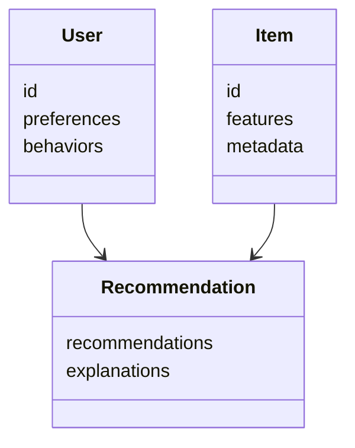

                 


# AI Agent的可解释推荐：提高LLM决策的透明度

## 关键词：
AI Agent、可解释推荐、LLM决策、透明度、推荐系统、决策透明度

## 摘要：
本文深入探讨AI Agent在推荐系统中的应用，重点分析如何提高大语言模型（LLM）决策的透明度。通过详细阐述可解释推荐的核心概念、算法原理、系统架构及实际案例，本文旨在帮助读者理解如何在实际应用中实现透明、可信赖的推荐系统。从背景介绍到项目实战，本文系统性地讲解了AI Agent在推荐系统中的重要作用及其提升决策透明度的具体方法。

---

## 第一部分: 背景介绍

### 第1章: 问题背景

#### 1.1 当前AI推荐系统的挑战
随着人工智能技术的快速发展，推荐系统已成为现代互联网服务的核心组成部分。然而，现有的推荐系统面临着以下挑战：
- **复杂性**：推荐系统的决策过程通常依赖复杂的算法，导致决策过程难以解释。
- **不可解释性**：用户往往无法理解推荐结果背后的原因，影响了对推荐系统的信任。
- **缺乏透明度**：大语言模型（LLM）的决策过程通常被视为“黑箱”，难以追溯和验证。

#### 1.2 可解释性的重要性
可解释性在推荐系统中至关重要，原因如下：
- **用户信任**：用户更倾向于信任能够解释推荐结果的系统。
- **系统调试**：可解释性使得系统故障排查更加容易。
- **合规性要求**：在某些行业（如金融、医疗），系统的可解释性是合规的基本要求。

#### 1.3 提高LLM决策透明度的目标
本文旨在通过AI Agent技术，提升LLM在推荐系统中的决策透明度，具体目标包括：
- **增强解释能力**：使推荐系统能够生成易于理解的解释。
- **提高决策透明度**：让用户清楚了解推荐结果的决策过程。
- **优化推荐效果**：通过透明的解释，进一步优化推荐算法，提升推荐质量。

---

## 第二部分: 核心概念与联系

### 第2章: 核心概念原理

#### 2.1 可解释推荐的基本原理
可解释推荐是指推荐系统能够为推荐结果提供清晰、可理解的解释。这种解释通常基于用户行为数据、物品特征或算法决策过程。

#### 2.2 AI Agent的决策过程
AI Agent通过以下步骤进行决策：
1. **信息收集**：从用户行为、历史数据中收集相关信息。
2. **分析与推理**：利用算法分析数据，推理出推荐结果。
3. **解释生成**：将推荐结果转化为易于理解的解释。

#### 2.3 LLM决策透明度的实现方法
通过以下方法实现LLM决策的透明度：
- **模型解释**：使用可解释的模型（如线性回归）代替复杂的深度学习模型。
- **解释生成**：对推荐结果生成自然语言解释，帮助用户理解推荐原因。

---

## 第三部分: 算法原理讲解

### 第3章: 算法原理

#### 3.1 基于规则的推荐算法
**原理**：通过预定义的规则（如“用户喜欢的动作片，推荐动作片”）生成推荐结果。
**优点**：规则简单，易于解释。
**缺点**：规则难以覆盖所有场景，推荐结果可能不够精准。

#### 3.2 基于解释的协同过滤算法
**原理**：通过分析用户相似性，生成推荐结果，并提供相似用户的解释。
**优点**：推荐结果具有较高的可解释性。
**缺点**：计算复杂度较高，适用于中小规模数据。

#### 3.3 基于模型的解释方法
**原理**：通过模型分析，提取推荐结果的关键特征，并生成解释。
**优点**：推荐结果准确，解释性强。
**缺点**：模型复杂，解释生成需要额外计算。

---

## 第四部分: 数学模型与公式

### 第4章: 数学模型

#### 4.1 基于相似度的推荐模型
公式：
$$
similarity(i, j) = \frac{\sum_{k=1}^{n} x_{ik} x_{jk}}{\sqrt{\sum_{k=1}^{n} x_{ik}^2} \cdot \sqrt{\sum_{k=1}^{n} x_{jk}^2}}
$$
其中，$similarity(i, j)$表示用户i和用户j的相似度，$x_{ik}$和$x_{jk}$表示用户i和用户j对物品k的评分。

#### 4.2 基于树状结构的解释模型
公式：
$$
importance(feature) = \frac{node\_value}{total\_nodes}
$$
其中，$importance(feature)$表示特征的重要性，$node\_value$表示节点值，$total\_nodes$表示总节点数。

---

## 第五部分: 系统分析与架构设计方案

### 第5章: 系统架构设计

#### 5.1 领域模型设计
Mermaid图：


#### 5.2 系统架构设计
Mermaid图：
```mermaid
client
    client --> AI-Agent: 发送请求
    AI-Agent --> LLM: 生成推荐
    LLM --> Explanation-Generator: 生成解释
    AI-Agent <-- Explanation-Generator: 返回解释
    AI-Agent --> client: 返回推荐结果和解释
```

---

## 第六部分: 项目实战

### 第6章: 实战案例

#### 6.1 电影推荐系统

##### 6.1.1 环境安装
安装所需库：
```
pip install pandas numpy scikit-learn
```

##### 6.1.2 核心代码实现
```python
from sklearn.metrics.pairwise import cosine_similarity
from sklearn.feature_extraction.text import TfidfVectorizer

# 假设我们有一个电影数据集，每个电影有描述文本
movies = [...]  # 数据集
tfidf = TfidfVectorizer()
tfidf_matrix = tfidf.fit_transform([movie.description for movie in movies])

# 计算余弦相似度
similarity_matrix = cosine_similarity(tfidf_matrix, tfidf_matrix)

# 返回最相似的电影
def get_recommendations(movie_id):
    similar_movies = similarity_matrix[movie_id]
    indices = similar_movies.argsort()[::-1]
    return [(movies[i].id, similar_movies[i]) for i in indices]
```

##### 6.1.3 代码解读
- 使用TF-IDF提取电影描述的特征向量。
- 计算电影之间的余弦相似度。
- 根据相似度生成推荐结果，并返回最相似的电影。

---

## 第七部分: 总结与扩展

### 7.1 最佳实践 tips
- **选择合适的模型**：根据数据规模和复杂度选择可解释性模型。
- **提供清晰的解释**：确保解释易于理解，避免技术术语。
- **持续优化**：定期更新模型，确保推荐结果的相关性和准确性。

### 7.2 小结
本文系统性地探讨了AI Agent在推荐系统中的应用，详细讲解了如何通过可解释推荐提升LLM决策的透明度。通过理论分析和实战案例，帮助读者理解如何在实际应用中实现透明、可信赖的推荐系统。

### 7.3 注意事项
- **数据隐私**：在处理用户数据时，需注意数据隐私保护。
- **模型选择**：根据具体需求选择合适的模型，避免盲目追求复杂性。
- **用户反馈**：及时收集用户反馈，优化推荐系统。

### 7.4 拓展阅读
- [可解释机器学习](https://christophm.github.io/interpretable-ml-book/)
- [大语言模型的决策透明度](https://arxiv.org/abs/2301.03284)

---

通过以上内容，读者可以全面理解AI Agent在推荐系统中的作用，掌握提升LLM决策透明度的具体方法，并能够在实际项目中应用这些技术。

