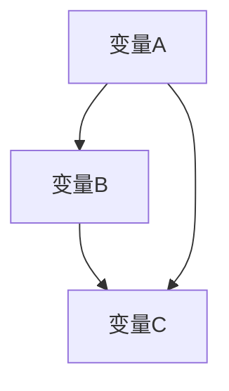
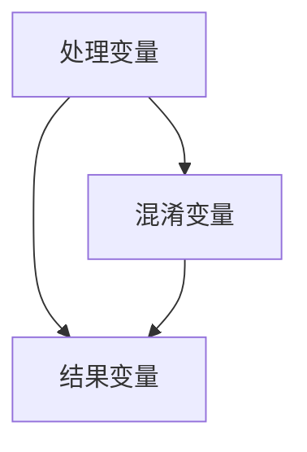
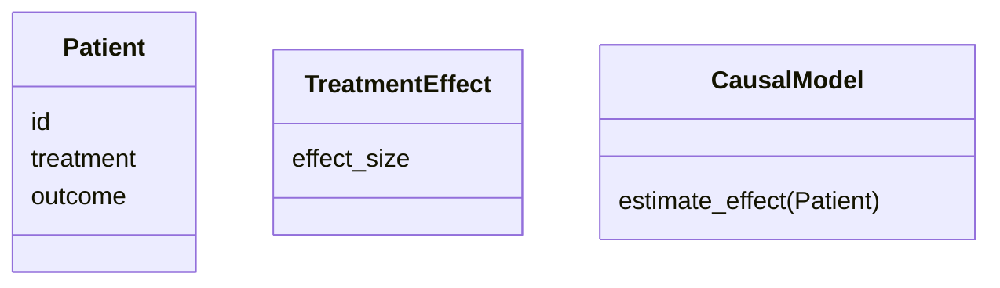

                 


# AI Agent的因果推理能力开发

## 关键词：AI Agent, 因果推理, 机器学习, 深度学习, 系统架构, 项目实战

## 摘要：本文详细探讨了AI Agent的因果推理能力开发，从基础概念到算法实现，再到系统设计与项目实战，全面解析因果推理的核心原理、数学模型和实际应用，帮助读者掌握AI Agent在复杂场景下的因果推理能力。

---

## 第1章：因果推理的背景与基础

### 1.1 问题背景

因果推理是理解事件间因果关系的关键，传统统计方法仅能发现相关性，无法揭示因果关系。AI Agent需具备因果推理能力，以应对复杂决策和推理任务。

#### 1.1.1 当前AI Agent的局限性
- **基于相关性的限制**：传统AI Agent依赖相关性，无法处理因果关系问题。
- **决策偏差**：因果推理缺失导致决策错误。
- **动态环境适应性不足**：无法有效处理因果关系变化。

#### 1.1.2 因果推理的重要性
- **提升决策准确性**：通过因果推理减少偏差。
- **增强适应性**：在动态环境中更好地调整策略。
- **推动AI技术进步**：因果推理是实现通用AI的重要基石。

#### 1.1.3 问题解决的边界与外延
- **边界**：因果推理能力的开发和应用。
- **外延**：AI Agent的交互、学习和决策优化。

### 1.2 核心概念与联系

#### 1.2.1 因果关系的数学模型
- **因果图**：节点表示变量，边表示因果关系。
- **潜在结果**：个体在不同处理下的结果。

#### 1.2.2 常用因果推理方法对比
| 方法 | 描述 | 优点 | 缺点 |
|------|------|------|------|
| 因果图 | 可视化因果关系 | 直观易懂 | 需准确构建因果图 |
| 潜在结果框架 | 定义个体处理效应 | 精确计算 | 计算复杂 |

#### 1.2.3 ER实体关系图


---

## 第2章：因果关系的数学基础

### 2.1 因果图模型

#### 2.1.1 因果图的基本结构
因果图由变量和因果边组成，表示变量间的因果关系。

#### 2.1.2 贝叶斯网络与因果图的关系
贝叶斯网络是概率图模型，因果图是其特例，用于表示因果关系。

#### 2.1.3 使用Mermaid绘制因果图


### 2.2 潜在结果框架

#### 2.2.1 潜在结果的定义
个体在不同处理下的结果，记为$Y(x)$。

#### 2.2.2 平均处理效应的计算
$$ATE = E[Y(x=1)] - E[Y(x=0)]$$

---

## 第3章：因果推理的常见方法

### 3.1 基于机器学习的因果推断

#### 3.1.1 倾向评分匹配
通过机器学习模型估计倾向评分，匹配处理组和对照组。

#### 3.1.2 双样本学习
使用两个样本分别估计处理效应。

#### 3.1.3 Python实现倾向评分匹配
```python
import sklearn

def propensity_score_matching(treatment, outcome):
    # 使用逻辑回归估计倾向评分
    model = sklearn.linear_model.LogisticRegression()
    model.fit(treatment, outcome)
    ps = model.predict_proba(treatment)[:, 1]
    # 使用倾向评分匹配进行平衡
    matched_pairs = []
    for t in treatment:
        matched_pairs.append((t, ps[t]))
    return matched_pairs
```

---

## 第4章：基于机器学习的因果推断

### 4.1 基于分类的因果推断

#### 4.1.1 分类器的构建
使用分类器区分处理组和对照组，估计倾向评分。

#### 4.1.2 Python实现分类器
```python
def causal_inference_classifier(treatment, outcome):
    model = sklearn.tree.DecisionTreeClassifier()
    model.fit(treatment, outcome)
    predictions = model.predict(treatment)
    return predictions
```

---

## 第5章：深度学习在因果推理中的应用

### 5.1 因果GAN

#### 5.1.1 GAN的基本原理
生成对抗网络通过生成器和判别器对抗训练，学习数据分布。

#### 5.1.2 因果GAN的结构


#### 5.1.3 Python实现因果GAN
```python
import torch

class Generator(torch.nn.Module):
    def __init__(self):
        super(Generator, self).__init__()
        self.fc = torch.nn.Linear(1, 10)

    def forward(self, x):
        return self.fc(x)

class Discriminator(torch.nn.Module):
    def __init__(self):
        super(Discriminator, self).__init__()
        self.fc = torch.nn.Linear(10, 1)

    def forward(self, x):
        return self.fc(x)
```

---

## 第6章：系统设计与实现

### 6.1 问题场景介绍

#### 6.1.1 问题背景
医疗数据分析中的因果推理问题，分析处理的效果。

#### 6.1.2 项目介绍
开发一个医疗数据分析系统，评估不同治疗方法的效果。

### 6.2 系统功能设计

#### 6.2.1 领域模型设计


#### 6.2.2 系统架构设计


---

## 第7章：项目实战

### 7.1 环境安装

#### 7.1.1 安装依赖
```bash
pip install numpy pandas scikit-learn
```

### 7.2 核心实现

#### 7.2.1 数据预处理
```python
import pandas as pd

data = pd.read_csv('medical_data.csv')
```

#### 7.2.2 特征工程
```python
from sklearn.preprocessing import StandardScaler

scaler = StandardScaler()
data_scaled = scaler.fit_transform(data)
```

#### 7.2.3 模型训练
```python
from sklearn.ensemble import RandomForestClassifier

model = RandomForestClassifier()
model.fit(data_scaled, labels)
```

#### 7.2.4 结果分析
```python
importances = model.feature_importances_
print(importances)
```

---

## 第8章：总结与展望

### 8.1 最佳实践 tips
- 数据质量至关重要。
- 选择合适的方法，平衡精度和计算效率。

### 8.2 小结
因果推理是AI Agent的核心能力，结合机器学习和深度学习方法，实现复杂场景下的因果推理。

### 8.3 注意事项
- 数据偏差可能导致错误结论。
- 保持对最新研究的关注，优化系统性能。

### 8.4 拓展阅读
推荐相关书籍和论文，深入学习因果推理。

---

## 参考文献
- [1] Pearl J. 因果关系模型、反事实推理和算法，2000.
- [2] Goodfellow I. 深度学习，2016.

---

# 结语
因果推理是实现AI Agent高级能力的关键，通过本文的学习，读者将掌握因果推理的核心原理和应用方法，为开发智能系统奠定基础。

