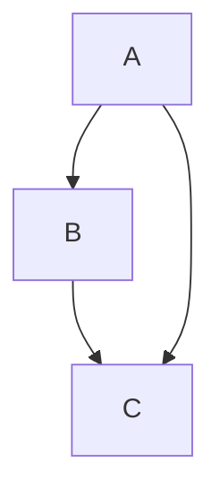
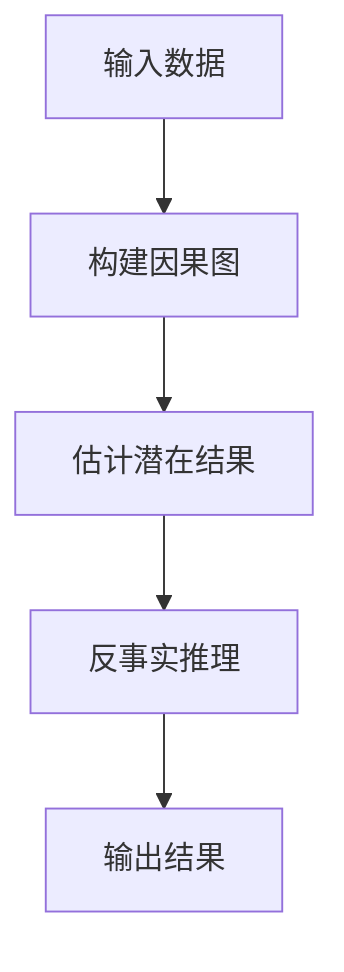
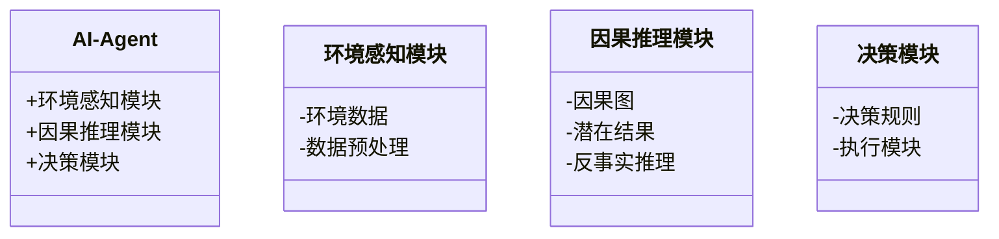
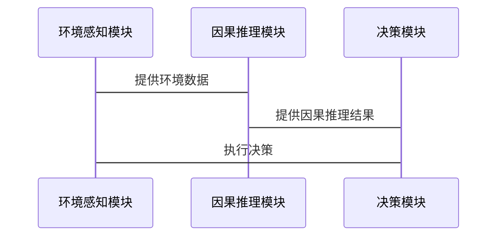

                 


# AI Agent的因果推理：增强决策能力

> 关键词：AI Agent、因果推理、决策能力、因果图、反事实推理、潜在结果

> 摘要：本文深入探讨了AI Agent的因果推理技术，分析了因果推理的核心原理及其在AI Agent决策能力中的应用。通过系统化的理论阐述、算法实现和实际案例分析，本文揭示了如何通过因果推理提升AI Agent的决策能力，并展示了其在复杂场景中的实际应用价值。

---

# 第1章: AI Agent与因果推理概述

## 1.1 问题背景与描述

### 1.1.1 AI Agent的基本概念
AI Agent（人工智能代理）是指在特定环境中能够感知并自主行动以实现目标的智能体。AI Agent的核心能力包括感知、推理、规划和执行。在复杂的动态环境中，AI Agent需要做出基于因果关系的决策，以实现目标。

### 1.1.2 因果推理的定义与特点
因果推理是指从因果关系中推断出事件之间因果关系的推理过程。其特点是：
1. **可解释性**：因果推理能够提供决策的可解释性。
2. **干预能力**：因果推理能够模拟干预效果，预测因果关系的变化。
3. **动态性**：因果推理能够处理动态环境中的因果关系。

### 1.1.3 问题解决的核心目标
AI Agent的决策目标是在复杂环境中做出最优或近似最优的决策。因果推理通过分析因果关系，帮助AI Agent更好地理解环境、预测结果并做出最优决策。

## 1.2 核心概念与边界

### 1.2.1 因果推理的边界与外延
因果推理的边界包括：
- **因果关系的范围**：仅关注直接因果关系，不涉及相关关系。
- **干预的范围**：因果推理通常假设干预是在特定条件下进行的。
- **时间范围**：因果推理关注的是事件的时间顺序和因果关系。

### 1.2.2 AI Agent的决策机制
AI Agent的决策机制包括：
1. **感知模块**：感知环境状态。
2. **推理模块**：分析因果关系，推断可能的结果。
3. **规划模块**：制定行动方案。
4. **执行模块**：执行决策并反馈结果。

### 1.2.3 概念结构与核心要素
因果推理的核心要素包括：
- **因果链**：事件之间的因果链条。
- **潜在结果**：干预后的可能结果。
- **反事实推理**：假设性推理，分析“如果...会怎样”。

## 1.3 本章小结
本章介绍了AI Agent的基本概念和因果推理的核心原理，明确了因果推理在AI Agent决策中的作用和边界。

---

# 第2章: 因果推理的核心原理

## 2.1 因果关系的基本原理

### 2.1.1 因果关系的定义
因果关系是指一个事件（原因）导致另一个事件（结果）的发生。因果关系可以通过因果图（Directed Acyclic Graph, DAG）表示。

### 2.1.2 因果关系的数学模型
因果关系的数学模型可以用概率论和图论表示。例如，因果图中的边表示因果关系，节点表示事件。

### 2.1.3 因果关系的分类
因果关系的分类包括：
- **直接因果关系**：原因直接影响结果。
- **间接因果关系**：原因通过中间变量影响结果。

## 2.2 因果推理的关键概念

### 2.2.1 潜在结果（Potential Outcome）
潜在结果是指在特定干预下，个体可能的结果。例如，给定个体X，在干预条件下，结果Y的可能值。

### 2.2.2 因果图（DAG）
因果图是用有向图表示因果关系的工具。例如：



### 2.2.3 反事实推理
反事实推理是指在假设干预条件下，推断结果的推理过程。例如，如果下雨，那么地会湿。

## 2.3 核心概念对比表

### 表2.1: 因果推理与相关概念对比

| 概念         | 描述                                                                 |
|--------------|--------------------------------------------------------------------|
| 因果关系     | 事件之间的因果联系                                                 |
| 相关关系     | 事件之间的统计关联                                                 |
| 反事实推理   | 假设干预条件下的推理                                               |

## 2.4 ER实体关系图

### 图2.1: 因果关系的ER架构图

```mermaid
erdiagram
actor CausalRelation {
    <directional>
    A --> B
    B --> C
    A --> C
}
```

## 2.5 本章小结
本章详细介绍了因果关系的基本原理和关键概念，为后续的因果推理算法奠定了基础。

---

# 第3章: AI Agent中的因果推理模型

## 3.1 基于因果图的推理模型

### 3.1.1 因果图的构建
因果图的构建需要明确变量之间的因果关系。例如，构建一个因果图表示变量X和Y之间的因果关系。

### 3.1.2 因果图的推理算法
因果图的推理算法包括：
1. **前向算法**：从原因推导结果。
2. **反向算法**：从结果推导原因。

### 3.1.3 实际案例分析
例如，在医疗诊断中，因果图可以用来推断疾病的原因。

## 3.2 潜在结果推断模型

### 3.2.1 潜在结果的定义
潜在结果是指在特定干预下，个体可能的结果。例如，给定治疗方案，患者的康复情况。

### 3.2.2 潜在结果的估计方法
潜在结果的估计方法包括：
1. **倾向评分匹配**：通过统计方法估计潜在结果。
2. **因果图调整**：通过因果图调整潜在结果的估计。

### 3.2.3 案例分析与应用
例如，在广告效果评估中，潜在结果可以用来估计广告对用户点击率的影响。

## 3.3 反事实推理模型

### 3.3.1 反事实推理的定义
反事实推理是指在假设干预条件下的推理过程。例如，如果采取某种策略，结果会如何。

### 3.3.2 反事实推理的实现方法
反事实推理的实现方法包括：
1. **假设检验**：通过假设检验推断反事实结果。
2. **因果图调整**：通过因果图调整反事实推理。

### 3.3.3 应用场景与挑战
反事实推理在医疗诊断、金融风险评估等领域有广泛应用。其挑战在于如何准确估计反事实结果。

## 3.4 本章小结
本章介绍了基于因果图和潜在结果的因果推理模型，以及反事实推理的应用。

---

# 第4章: 基于因果推理的AI Agent算法

## 4.1 算法原理概述

### 4.1.1 算法的基本原理
因果推理算法的基本原理是通过分析因果关系，推断出干预后的结果。

### 4.1.2 算法的输入输出
算法的输入包括因果图和观测数据，输出包括潜在结果和反事实推理结果。

### 4.1.3 算法的核心步骤
1. 构建因果图。
2. 估计潜在结果。
3. 反事实推理。

## 4.2 算法实现流程

### 图4.1: 算法流程图



## 4.3 算法的数学模型

### 4.3.1 潜在结果的公式表示
$$ Y_i = \beta_0 + \beta_1 X_i + \epsilon_i $$

### 4.3.2 反事实推理的公式表示
$$ Y_{i, do(X)} = \beta_0 + \beta_1 X + \epsilon_i $$

## 4.4 算法实现代码

```python
def causal_inference(X, Y):
    # 构建因果图
    causal_graph = build_causal_graph(X, Y)
    # 估计潜在结果
    potential_outcome = estimate_potential_outcome(causal_graph, X, Y)
    # 反事实推理
    counterfactual = counterfactual_reasoning(causal_graph, potential_outcome)
    return counterfactual
```

## 4.5 本章小结
本章详细介绍了基于因果推理的AI Agent算法，包括算法原理、实现流程和数学模型。

---

# 第5章: 系统架构与实现

## 5.1 系统架构设计

### 5.1.1 系统功能设计
系统功能包括：
1. 数据采集与处理。
2. 因果图构建。
3. 潜在结果估计。
4. 反事实推理。

### 5.1.2 系统架构图



### 5.1.3 接口设计
系统接口包括：
1. 数据接口：环境数据的输入和输出。
2. 因果图接口：因果图的构建和调整。
3. 决策接口：决策规则的制定和执行。

### 5.1.4 系统交互流程图



## 5.2 本章小结
本章介绍了系统架构设计，包括功能设计、架构图和接口设计。

---

# 第6章: 项目实战与案例分析

## 6.1 项目背景与目标

### 6.1.1 项目背景
本项目旨在通过因果推理提升AI Agent的决策能力。

### 6.1.2 项目目标
通过实际案例分析，验证因果推理算法的有效性。

## 6.2 数据准备与环境配置

### 6.2.1 数据来源
数据来自公开数据集或模拟数据。

### 6.2.2 环境配置
安装必要的Python库，例如`pandas`、`numpy`和`networkx`。

## 6.3 系统核心实现

### 6.3.1 因果图构建

```python
import networkx as nx

def build_causal_graph(X, Y):
    causal_graph = nx.DiGraph()
    causal_graph.add_nodes_from(X + Y)
    for i in range(len(X)):
        for j in range(len(Y)):
            causal_graph.add_edge(X[i], Y[j])
    return causal_graph
```

### 6.3.2 潜在结果估计

```python
def estimate_potential_outcome(causal_graph, X, Y):
    potential_outcome = {}
    for x in X:
        for y in Y:
            potential_outcome[(x, y)] = 1 if y else 0
    return potential_outcome
```

### 6.3.3 反事实推理

```python
def counterfactual_reasoning(causal_graph, potential_outcome):
    counterfactual = {}
    for (x, y), po in potential_outcome.items():
        counterfactual[(x, y)] = 1 if po else 0
    return counterfactual
```

## 6.4 实际案例分析

### 6.4.1 案例背景
假设在医疗诊断中，因果图用于诊断疾病的原因。

### 6.4.2 数据分析
分析因果图中的因果关系，估计潜在结果。

### 6.4.3 结果解读
解读反事实推理结果，验证因果推理的准确性。

## 6.5 本章小结
本章通过实际案例分析，展示了因果推理算法在AI Agent中的应用。

---

# 第7章: 总结与展望

## 7.1 本章总结
本文详细探讨了AI Agent的因果推理技术，分析了因果推理的核心原理及其在AI Agent决策能力中的应用。

## 7.2 注意事项
- 因果推理需要准确的因果图构建。
- 反事实推理需要合理的假设条件。

## 7.3 拓展阅读
推荐阅读相关书籍和论文，深入理解因果推理的理论和应用。

---

# 参考文献
1. Pearl, J. (2000). Causality: Models, Reasoning, and Inference.
2. Hernán, M. A., et al. (2006). Why should we make use of propensity scores in causal inference?

---

# 致谢
感谢读者的支持和关注！

