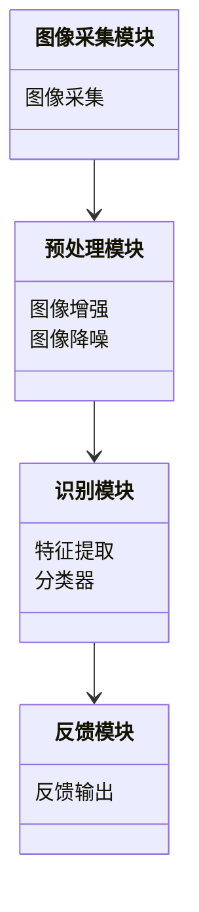

                 


# AI Agent的图像识别与处理技术

> 关键词：AI Agent, 图像识别, 图像处理, 深度学习, 目标检测, 图像分类

> 摘要：本文将详细探讨AI Agent在图像识别与处理技术中的应用。从基础概念到核心算法，从系统设计到项目实战，全面解析AI Agent如何通过图像识别技术提升智能化水平。本文将结合实际案例，深入分析图像处理技术的实现细节，帮助读者掌握AI Agent在图像识别领域的核心技能。

---

# 第一部分: AI Agent与图像识别基础

## 第1章: AI Agent与图像识别概述

### 1.1 AI Agent的基本概念

#### 1.1.1 AI Agent的定义与特点

AI Agent（人工智能代理）是指能够感知环境并采取行动以实现目标的智能实体。它具备以下特点：
- **自主性**：能够在没有外部干预的情况下自主决策。
- **反应性**：能够实时感知环境并做出反应。
- **目标导向**：所有行为都以实现特定目标为导向。
- **学习能力**：能够通过经验改进自身的性能。

#### 1.1.2 图像识别在AI Agent中的作用

图像识别是AI Agent感知环境的重要方式之一。通过图像识别，AI Agent可以：
- 识别场景中的物体、人物或文字。
- 理解图像中的语义信息。
- 基于图像做出决策，如自动驾驶中的障碍物检测。

#### 1.1.3 AI Agent与图像识别的结合场景

AI Agent与图像识别的结合场景广泛，例如：
- **自动驾驶**：通过识别道路、车辆和行人进行导航。
- **智能安防**：识别监控画面中的异常行为或可疑物体。
- **医疗影像分析**：辅助医生诊断病灶位置和类型。

---

### 1.2 图像识别的基本原理

#### 1.2.1 图像识别的定义与核心任务

图像识别是指通过计算机对图像进行分析和理解，以识别图像中的物体、场景或文字的过程。其核心任务包括：
- **图像分类**：将图像归类到预定义的类别中。
- **目标检测**：在图像中定位并识别特定目标。
- **图像分割**：将图像分割为有意义的区域。

#### 1.2.2 图像识别的关键技术与挑战

图像识别的关键技术包括：
- **特征提取**：提取图像中具有代表性的特征。
- **分类器设计**：基于特征进行分类的算法。
- **数据标注**：为训练数据打标签。

挑战主要在于：
- **光照变化**：不同光照条件下物体的外观可能发生变化。
- **遮挡问题**：目标部分被遮挡时难以识别。
- **计算资源**：复杂的图像处理需要大量计算资源。

#### 1.2.3 AI Agent与图像识别的结合场景

AI Agent与图像识别的结合可以实现：
- **智能监控**：实时监控视频画面，识别异常行为。
- **增强现实**：通过识别图像中的物体，叠加虚拟信息。
- **智能助手**：识别用户手势或周围环境，提供更智能化的服务。

---

### 1.3 图像处理的基础知识

#### 1.3.1 图像的表示与基本操作

图像通常以矩阵形式表示，每个元素表示一个像素的值。常见的图像操作包括：
- **缩放**：调整图像的大小。
- **旋转**：改变图像的方向。
- **裁剪**：截取图像的特定区域。

#### 1.3.2 常见图像格式与转换

常见的图像格式包括：
- **JPEG**：适用于照片和复杂图像。
- **PNG**：支持透明背景和无损压缩。
- **BMP**：图像质量高，但文件较大。

图像格式的转换可以通过OpenCV或Pillow等库实现。

#### 1.3.3 图像分辨率与压缩技术

图像分辨率决定了图像的清晰度，常见的分辨率包括：
- **低分辨率**：适合移动设备屏幕。
- **高分辨率**：适合打印或高清晰度显示。

压缩技术可以减少图像文件的大小，例如JPEG压缩。

---

## 第2章: 图像识别的核心概念与原理

### 2.1 图像识别的核心概念

#### 2.1.1 图像分类

图像分类是图像识别中最常见的任务之一。通过训练分类器，可以将图像分为多个类别。例如，使用卷积神经网络（CNN）进行分类。

#### 2.1.2 目标检测

目标检测不仅需要识别图像中的物体，还需要定位物体的位置。常见的目标检测算法包括YOLO和Faster R-CNN。

#### 2.1.3 图像分割

图像分割将图像分割为多个区域，每个区域对应一个语义类别。常见的图像分割算法包括U-Net和FCN。

---

### 2.2 图像识别的数学模型与公式

#### 2.2.1 常见的图像处理公式

图像增强可以通过以下公式实现：
$$
\text{new\_pixel} = \text{old\_pixel} \times \alpha + \beta
$$
其中，$\alpha$是缩放因子，$\beta$是偏移量。

#### 2.2.2 图像相似度计算公式

常见的图像相似度计算公式包括：
$$
\text{相似度} = \frac{1}{n}\sum_{i=1}^{n} |I_1(i) - I_2(i)|
$$
其中，$I_1$和$I_2$是两张图像，$n$是像素数量。

#### 2.2.3 图像特征提取的数学模型

卷积神经网络（CNN）的卷积层可以提取图像的空间特征，池化层可以降低计算复杂度。

---

### 2.3 图像识别的算法原理

#### 2.3.1 基于传统特征的图像识别

传统特征提取方法包括SIFT和HOG。SIFT（尺度不变特征变换）用于提取图像中的局部特征，HOG（方向梯度直方图）用于描述图像的纹理信息。

#### 2.3.2 基于深度学习的图像识别

深度学习通过CNN提取图像的高层次特征，例如AlexNet、VGGNet和ResNet。

#### 2.3.3 常见图像识别算法对比分析

以下是几种常见图像识别算法的对比：

| 算法名称 | 特点 | 适用场景 |
|----------|------|----------|
| SIFT     | 鲁棒性强，适合小目标检测 | 图像匹配、目标识别 |
| HOG      | 均匀性好，适合纹理分析 | 人脸识别、目标检测 |
| CNN      | 特征提取能力强，适合大规模数据 | 图像分类、目标检测 |

---

## 第3章: 图像预处理技术

### 3.1 图像增强与降噪

#### 3.1.1 常见的图像增强方法

图像增强可以通过调整亮度、对比度和饱和度实现。例如，使用OpenCV库中的函数：

```python
import cv2

# 读取图像
img = cv2.imread('input.jpg')

# 调整亮度
alpha = 1.5
beta = 0
adjusted = cv2.addWeighted(img, alpha, img, 0, beta)

# 保存结果
cv2.imwrite('output.jpg', adjusted)
```

#### 3.1.2 图像降噪算法

常见的降噪算法包括高斯滤波和中值滤波。例如，使用高斯滤波：

```python
# 高斯滤波
kernel_size = 3
sigma = 1
kernel = cv2.getGaussianKernel(kernel_size, sigma)
kernel = kernel * kernel.T

denoised = cv2.filter2D(img, -1, kernel)
```

#### 3.1.3 图像增强对AI Agent性能的影响

图像增强可以提高图像质量，从而提高AI Agent的识别准确率。例如，增强后的图像可以更好地适应不同光照条件。

---

### 3.2 图像分割与边缘检测

#### 3.2.1 常见的图像分割算法

图像分割算法包括阈值分割和区域分割。例如，使用Otsu算法进行阈值分割：

```python
# Otsu算法
gray = cv2.cvtColor(img, cv2.COLOR_BGR2GRAY)
ret, binary = cv2.threshold(gray, 0, 255, cv2.THRESH_OTSU)
```

#### 3.2.2 边缘检测技术

边缘检测算法包括Canny和Sobel。例如，使用Canny边缘检测：

```python
# Canny边缘检测
edges = cv2.Canny(gray, 50, 150)
```

#### 3.2.3 图像分割在AI Agent中的应用

图像分割可以用于目标检测和图像分割任务，例如医学影像分析和自动驾驶中的障碍物检测。

---

### 3.3 图像特征提取

#### 3.3.1 常见特征提取方法

特征提取方法包括主成分分析（PCA）和局部二值模式（LBP）。例如，使用PCA提取特征：

```python
# PCA特征提取
from sklearn.decomposition import PCA

pca = PCA(n_components=50)
features = pca.fit_transform(data)
```

#### 3.3.2 特征向量的构建与应用

特征向量用于表示图像的特征，例如在图像分类任务中用于训练分类器。

#### 3.3.3 特征提取对图像识别的影响

有效的特征提取可以提高分类器的准确率，例如使用深度学习模型提取的特征具有更强的判别能力。

---

## 第4章: 图像识别算法的优化与调优

### 4.1 常见图像识别算法的优化策略

优化策略包括数据增强、学习率调整和模型剪枝。例如，使用数据增强提高模型的泛化能力：

```python
# 数据增强
from tensorflow.keras.preprocessing.image import ImageDataGenerator

datagen = ImageDataGenerator(rotation_range=20, horizontal_flip=True)
```

#### 4.1.2 模型调优

模型调优包括调整批量大小、学习率和优化器。例如，使用Adam优化器：

```python
from tensorflow.keras.optimizers import Adam

model.compile(loss='categorical_crossentropy', optimizer=Adam(lr=0.001), metrics=['accuracy'])
```

#### 4.1.3 优化算法对比分析

以下是几种优化算法的对比：

| 算法名称 | 特点 | 适用场景 |
|----------|------|----------|
| SGD      | 基础算法，收敛慢 | 简单任务 |
| Adam     | 收敛快，适合大规模数据 | 复杂任务 |
| RMSprop  | 增量自适应 | 适合小批量数据 |

---

## 第5章: 图像识别系统的系统设计与架构

### 5.1 系统功能设计

系统功能包括图像采集、预处理、识别和反馈。例如：

1. **图像采集**：通过摄像头获取图像。
2. **预处理**：对图像进行增强和降噪。
3. **识别**：使用CNN进行图像分类。
4. **反馈**：根据识别结果做出相应反馈。

#### 5.1.1 领域模型设计

领域模型包括图像采集模块、预处理模块、识别模块和反馈模块。例如：



#### 5.1.2 系统架构设计

系统架构包括前端、后端和数据库。例如：


#### 5.1.3 系统接口设计

系统接口包括图像采集接口、预处理接口和识别接口。例如：

```mermaid
sequenceDiagram
    用户 --> 调用图像采集接口
    图像采集模块 --> 返回图像
    用户 --> 调用预处理接口
    预处理模块 --> 返回预处理后的图像
    用户 --> 调用识别接口
    识别模块 --> 返回识别结果
    用户 <-- 反馈识别结果
```

---

## 第6章: 项目实战

### 6.1 项目背景与目标

项目背景：开发一个基于AI Agent的图像识别系统，用于智能安防监控。

项目目标：实现对监控画面中异常行为的检测和识别。

### 6.2 系统实现

#### 6.2.1 环境安装

安装所需的库和工具，例如：

```bash
pip install tensorflow keras opencv-python
```

#### 6.2.2 核心代码实现

实现图像采集、预处理和识别功能：

```python
import cv2
import numpy as np
from tensorflow.keras.models import load_model

# 图像采集
cap = cv2.VideoCapture(0)
while True:
    ret, frame = cap.read()
    cv2.imshow('摄像头', frame)
    if cv2.waitKey(1) == ord('q'):
        break
cap.release()
cv2.destroyAllWindows()

# 图像预处理
def preprocess_image(image):
    # 调整大小
    resized = cv2.resize(image, (224, 224))
    # 转换为张量
    x = np.array([resized])
    return x

# 图像识别
model = load_model('image_classifier.h5')
x = preprocess_image(frame)
preds = model.predict(x)
print(preds)
```

#### 6.2.3 项目总结与分析

项目实现了一个基于AI Agent的图像识别系统，能够实时监控画面并识别异常行为。通过不断优化算法和调整参数，可以进一步提高识别准确率。

---

## 第7章: 总结与展望

### 7.1 总结

本文详细探讨了AI Agent在图像识别与处理技术中的应用，从基础概念到系统设计，再到项目实战，全面解析了AI Agent如何通过图像识别技术提升智能化水平。

### 7.2 未来展望

未来，AI Agent在图像识别领域的应用将更加广泛。随着深度学习技术的不断进步，图像识别的准确率和效率将不断提高。同时，多模态融合和实时性优化也将成为研究的热点。

---

通过本文的学习，读者可以全面掌握AI Agent在图像识别与处理技术中的核心技能，并能够将其应用到实际项目中。

