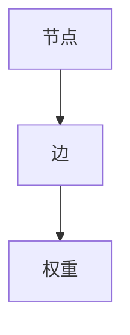
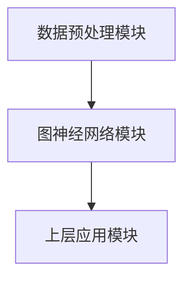
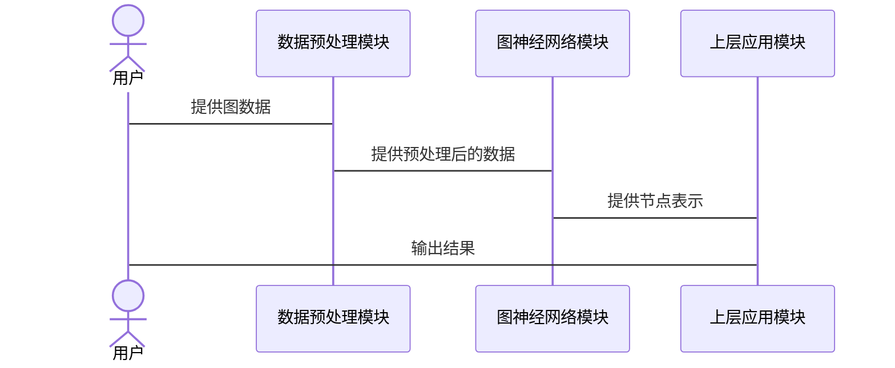

                 


# AI Agent的图神经网络技术应用

> 关键词：AI Agent，图神经网络，图结构，节点表示，算法原理，系统架构，项目实战

> 摘要：本文详细探讨了AI Agent在图神经网络技术中的应用，从基本概念到核心算法，再到系统设计和项目实战，全面解析了AI Agent如何利用图神经网络进行智能决策和交互。通过理论与实践相结合，本文为读者提供了深入理解和应用AI Agent图神经网络技术的指导。

---

# 第一部分: AI Agent的图神经网络技术基础

## 第1章: AI Agent与图神经网络概述

### 1.1 AI Agent的基本概念

#### 1.1.1 AI Agent的定义与特点
- **定义**：AI Agent（智能体）是指能够感知环境、做出决策并采取行动的智能系统。
- **特点**：
  - **自主性**：能够在没有外部干预的情况下自主运行。
  - **反应性**：能够实时感知环境并做出反应。
  - **目标导向**：具有明确的目标，驱动其行为。
  - **学习能力**：能够通过经验或数据进行学习和优化。

#### 1.1.2 图神经网络的基本概念
- **定义**：图神经网络（Graph Neural Network, GNN）是一种专门处理图结构数据的深度学习模型。
- **特点**：
  - **节点间关系**：能够捕捉节点之间的复杂关系。
  - **全局视角**：能够从全局角度理解图的结构和属性。
  - **动态性**：能够处理动态变化的图结构。

#### 1.1.3 AI Agent与图神经网络的结合
- **结合点**：
  - AI Agent可以通过图神经网络处理复杂的关系型数据。
  - 图神经网络为AI Agent提供了强大的图数据处理能力，支持其进行智能决策。

### 1.2 图神经网络的应用场景

#### 1.2.1 社交网络分析
- **场景**：通过分析社交网络中的用户关系，识别关键节点、社区划分等。

#### 1.2.2 推荐系统
- **场景**：基于用户的行为和偏好，推荐个性化的内容或产品。

#### 1.2.3 群智计算
- **场景**：通过多个智能体协同工作，实现复杂任务的分布式计算。

#### 1.2.4 网络安全
- **场景**：检测网络中的异常行为，识别潜在的安全威胁。

### 1.3 本章小结
本章介绍了AI Agent和图神经网络的基本概念，并探讨了它们结合的应用场景，为后续内容奠定了基础。

---

# 第二部分: 图神经网络的核心概念与原理

## 第2章: 图结构与节点表示

### 2.1 图的基本概念

#### 2.1.1 图的定义与表示
- **定义**：图是由节点（顶点）和边（边）组成的结构，表示为$G = (V, E)$。
- **表示**：节点表示为集合$V$，边表示为集合$E$。

#### 2.1.2 图的属性与特征
- **节点属性**：节点的特征信息，如用户的行为、兴趣等。
- **边属性**：边的权重或标签，表示节点之间的关系强度或类型。

### 2.2 节点表示与图嵌入

#### 2.2.1 节点嵌入的基本概念
- **定义**：节点嵌入是一种将节点转换为低维向量表示的方法。
- **目的**：捕捉节点的语义信息，便于后续的计算和分析。

#### 2.2.2 图嵌入的方法与技术
- **基于矩阵分解的方法**：如节点嵌入的矩阵分解技术。
- **基于深度学习的方法**：如图卷积网络（GCN）。

### 2.3 图神经网络的核心原理

#### 2.3.1 图卷积操作
- **定义**：图卷积操作是对图中节点进行卷积操作，考虑其邻居节点的信息。
- **公式**：
  $$
  h_v^{(l+1)} = \sigma\left(\sum_{u \in N(v)} W h_u^{(l)} + W h_v^{(l)}\right)
  $$
  其中，$N(v)$表示节点$v$的邻居节点集合，$\sigma$是激活函数。

#### 2.3.2 图注意力机制
- **定义**：通过注意力机制，赋予不同邻居节点不同的权重，以捕捉重要的信息。
- **公式**：
  $$
  \alpha_{uv} = \frac{\exp(e_u^T e_v)}{\sum_{k \in N(v)} \exp(e_u^T e_k)}
  $$
  其中，$e_u$和$e_v$是节点的嵌入向量，$\alpha_{uv}$是注意力权重。

#### 2.3.3 图池化操作
- **定义**：图池化操作是对图中的节点进行下采样，减少计算量的同时保留重要信息。

### 2.4 图实体关系的ER架构设计



---

## 第3章: 图神经网络的算法原理

### 3.1 图卷积网络（GCN）

#### 3.1.1 GCN的基本原理
- **定义**：GCN通过在图中传播信息，逐步更新节点的表示。
- **流程**：
  1. 初始化节点嵌入。
  2. 对每个节点，聚合其邻居节点的信息。
  3. 使用激活函数更新节点表示。
  4. 重复上述步骤直到收敛。

#### 3.1.2 GCN的数学公式
- **传播规则**：
  $$
  h_v^{(l+1)} = \sigma\left(\sum_{u \in N(v)} \frac{1}{|N(v)|} W h_u^{(l)}\right)
  $$

#### 3.1.3 GCN的实现流程
1. **输入**：图的邻接矩阵$A$和节点特征矩阵$X$。
2. **计算**：通过GCN层更新节点表示。
3. **输出**：节点的最终表示。

### 3.2 图注意力网络（GAT）

#### 3.2.1 GAT的基本原理
- **定义**：GAT通过注意力机制，赋予每个邻居节点不同的权重。
- **流程**：
  1. 初始化节点嵌入。
  2. 计算注意力权重。
  3. 聚合邻居节点的信息，更新节点表示。
  4. 重复上述步骤直到收敛。

#### 3.2.2 GAT的数学公式
- **注意力权重计算**：
  $$
  \alpha_{uv} = \frac{\exp(e_u^T e_v)}{\sum_{k \in N(v)} \exp(e_u^T e_k)}
  $$
- **节点更新规则**：
  $$
  h_v^{(l+1)} = \sum_{u \in N(v)} \alpha_{uv} h_u^{(l)}
  $$

#### 3.2.3 GAT的实现流程
1. **输入**：图的邻接矩阵$A$和节点特征矩阵$X$。
2. **计算**：通过GAT层更新节点表示。
3. **输出**：节点的最终表示。

### 3.3 图神经网络的其他算法

#### 3.3.1 图自编码网络（Graph Autoencoder）
- **定义**：通过自编码的方式，学习图的低维表示。
- **流程**：
  1. 编码器将图的节点表示压缩到低维空间。
  2. 解码器将低维表示还原为原始节点表示。

#### 3.3.2 图生成网络（Graph GAN）
- **定义**：通过生成对抗网络，生成符合图结构的数据。
- **流程**：
  1. 生成器生成新的图结构。
  2. 判别器判断生成的图是否真实。
  3. 通过交替训练优化生成器和判别器。

#### 3.3.3 图强化学习（Graph RL）
- **定义**：通过强化学习，训练智能体在图环境中进行决策。
- **流程**：
  1. 智能体与图环境交互，获取奖励。
  2. 根据奖励更新策略，优化决策过程。

---

# 第三部分: 图神经网络的系统分析与架构设计

## 第4章: 图神经网络的系统分析

### 4.1 系统分析的背景与目标
- **背景**：图神经网络在实际应用中的复杂性。
- **目标**：设计一个高效、可扩展的图神经网络系统。

### 4.2 系统功能设计
- **功能模块**：
  - 数据预处理模块：读取图数据，进行特征提取。
  - 图神经网络模块：实现GCN或GAT等算法。
  - 上层应用模块：根据节点表示进行预测或决策。

### 4.3 系统架构设计



### 4.4 系统接口设计
- **输入接口**：接收图数据和节点特征。
- **输出接口**：输出节点的表示或预测结果。

### 4.5 系统交互流程



---

## 第5章: 图神经网络的项目实战

### 5.1 项目环境安装
- **工具**：Python、TensorFlow、Keras、NetworkX。
- **安装命令**：
  ```bash
  pip install tensorflow.keras networkx
  ```

### 5.2 核心功能实现

#### 5.2.1 数据预处理
```python
import networkx as nx

G = nx.Graph()
G.add_nodes_from([...])
G.add_edges_from([...])
```

#### 5.2.2 图神经网络实现

```python
import tensorflow as tf
from tensorflow.keras import layers

class GCNLayer(layers.Layer):
    def __init__(self, input_dim, output_dim):
        super(GCNLayer, self).__init__()
        self.weights = tf.keras.layers.Dense(output_dim, input_dim)

    def call(self, inputs):
        A, X = inputs
        XW = self.weights(X)
        output = tf.sparse_ops.sparse_tensor_dense_matmul(A, XW)
        return output
```

### 5.3 代码解读与分析
- **数据预处理**：将图数据转换为邻接矩阵和节点特征矩阵。
- **模型训练**：使用训练数据训练图神经网络模型。
- **模型预测**：输入新的图数据，预测节点的表示或分类结果。

### 5.4 实际案例分析
- **案例**：社交网络中的用户推荐。
- **步骤**：
  1. 收集用户的行为数据，构建社交网络图。
  2. 使用GCN或GAT训练模型，得到用户的表示向量。
  3. 基于用户表示向量进行推荐。

### 5.5 项目小结
通过本章的实战，读者可以掌握图神经网络的实现步骤和应用场景。

---

# 第四部分: 总结与展望

## 第6章: 总结与展望

### 6.1 最佳实践 tips
- **数据预处理**：确保图数据的质量和完整性。
- **模型调优**：通过参数调节和超参数优化，提升模型性能。

### 6.2 小结
本文从理论到实践，全面介绍了AI Agent在图神经网络中的应用，为读者提供了深入的理解和实践指导。

### 6.3 注意事项
- **计算资源**：图神经网络需要较高的计算资源，建议使用GPU加速。
- **数据隐私**：处理敏感数据时，需注意数据隐私和安全。

### 6.4 拓展阅读
- **推荐书籍**：《Graph Neural Networks: Methods and Applications》
- **推荐论文**：《Graph Attention Networks》

---

# 结语

通过本文的学习，读者可以全面掌握AI Agent在图神经网络中的应用，从理论到实践，逐步深入理解并掌握相关技术。未来，随着图神经网络技术的不断发展，AI Agent将在更多领域展现出强大的应用潜力。

