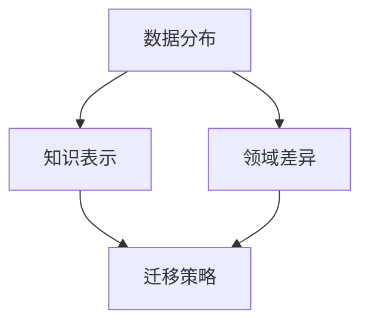
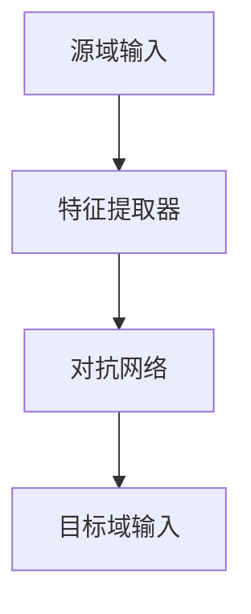
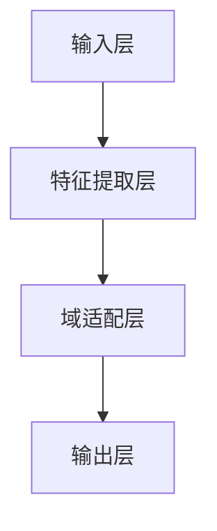
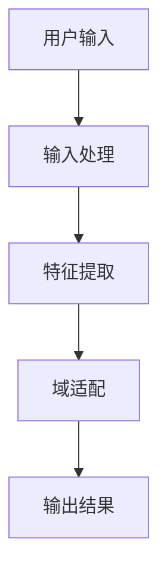

                 


# AI Agent的域适应技术：跨领域知识迁移

## 关键词：
AI Agent, 域适应技术, 跨领域知识迁移, 人工智能, 迁移学习

## 摘要：
本文深入探讨了AI Agent在跨领域知识迁移中的域适应技术，从理论基础到实际应用进行全面解析。文章首先介绍了AI Agent的基本概念和域适应技术的重要性，然后详细分析了域适应的核心问题、算法原理、系统架构设计，最后通过实际项目实战展示了域适应技术的应用。通过本文的学习，读者将能够理解并掌握AI Agent在跨领域知识迁移中的关键技术与应用方法。

---

## 第1章: AI Agent与域适应技术概述

### 1.1 AI Agent的基本概念
AI Agent（人工智能代理）是一种能够感知环境、自主决策并执行任务的智能实体。AI Agent可以是软件程序、机器人或其他智能系统，其核心目标是通过感知和行动来实现特定任务目标。

#### 1.1.1 AI Agent的定义与分类
- **定义**：AI Agent是一种具有自主性、反应性、目标导向和社交能力的智能实体。
- **分类**：
  - **简单反射型Agent**：基于当前输入做出反应，如PID控制器。
  - **基于模型的反射型Agent**：维护内部状态，能够根据当前状态和环境信息做出决策。
  - **目标驱动型Agent**：根据目标选择最优行动。
  - **效用驱动型Agent**：通过最大化效用函数来优化决策。

#### 1.1.2 域适应技术的定义
域适应技术是指在不同领域之间迁移知识或模型的技术，旨在利用源领域数据或知识来提升目标领域任务的性能。

#### 1.1.3 域适应技术的重要性
- **减少数据需求**：在目标领域数据稀缺的情况下，域适应技术可以利用源领域的数据进行训练。
- **提升泛化能力**：通过跨领域知识迁移，模型可以更好地适应不同领域的需求。
- **降低开发成本**：减少在目标领域从 scratch 开发模型的成本和时间。

### 1.2 域适应技术的核心问题
域适应技术的核心问题在于如何处理源领域和目标领域之间的数据分布差异，同时保持模型的泛化能力。

#### 1.2.1 跨领域知识迁移的背景
- 在实际应用中，数据分布往往在不同领域之间存在显著差异，例如自然语言处理中的中文和英文领域。
- 域适应技术能够帮助模型在这些领域之间进行有效的知识迁移。

#### 1.2.2 域适应技术的核心挑战
- 数据分布差异：源领域和目标领域之间的数据分布可能不同。
- 样本数量差异：目标领域的样本数量可能比源领域少。
- 隐含假设：源领域和目标领域之间可能存在未明确定义的联系。

#### 1.2.3 域适应技术的边界与外延
- **边界**：域适应技术仅关注领域之间的知识迁移，不涉及任务本身的改变。
- **外延**：域适应技术可以与其他技术（如迁移学习、多任务学习）结合，形成更复杂的模型。

### 1.3 域适应技术的核心要素
- **数据分布差异**：源领域和目标领域的数据分布差异是域适应技术的核心问题。
- **知识表示方法**：如何将知识表示为可以跨领域迁移的形式。
- **跨领域迁移策略**：选择合适的迁移策略以实现有效的知识迁移。

---

## 第2章: 域适应技术的核心概念与联系

### 2.1 域适应技术的核心原理
域适应技术的核心原理在于通过建模数据分布差异，调整模型参数或特征表示，以适应目标领域的数据分布。

#### 2.1.1 数据分布差异的建模
数据分布差异可以通过概率分布函数来建模，例如源领域和目标领域的数据分布分别为$P_S(x)$和$P_T(x)$。

#### 2.1.2 知识表示的可迁移性
知识表示的可迁移性是域适应技术的关键，通过将知识表示为领域无关的形式，可以实现跨领域迁移。

#### 2.1.3 跨领域迁移策略
跨领域迁移策略包括对抗训练、分布匹配和自适应表示等方法。

### 2.2 域适应技术的核心概念对比
- **数据分布差异与知识表示的对比**：数据分布差异关注的是数据本身的分布，而知识表示关注的是如何表示这些数据。
- **跨领域迁移与单领域优化的对比**：跨领域迁移需要考虑多个领域的数据，而单领域优化仅关注单个领域。
- **不同域适应方法的优缺点对比**：例如对抗训练和分布匹配在实现难度和效果上有所不同。

### 2.3 域适应技术的ER实体关系图


---

## 第3章: 域适应技术的算法原理

### 3.1 域适应技术的主流算法
- **基于对抗训练的域适应**：通过对抗网络来匹配源领域和目标领域的数据分布。
- **基于分布匹配的域适应**：通过优化数据分布的相似性来实现迁移。
- **基于自适应表示的域适应**：通过自适应的特征表示来实现跨领域迁移。

### 3.2 对抗训练的域适应算法


### 3.3 分布匹配的域适应算法
$$p(x) = \sum_{i=1}^{n} \alpha_i p_i(x)$$

### 3.4 自适应表示的域适应算法
$$y = f(x, \theta)$$

---

## 第4章: 域适应技术的系统分析与架构设计

### 4.1 系统分析
- **问题场景介绍**：例如，如何将自然语言处理模型从英文领域迁移到中文领域。
- **项目目标与范围**：设计一个能够跨领域迁移的AI Agent。
- **系统功能需求**：包括数据输入、特征提取、域适配和结果输出。

### 4.2 系统架构设计


### 4.3 接口设计与交互流程
#### 4.3.1 系统接口设计
- **输入接口**：接收源领域和目标领域的数据。
- **输出接口**：输出迁移后的模型或结果。

#### 4.3.2 系统交互流程


---

## 第5章: 域适应技术的项目实战

### 5.1 环境安装与配置
- **开发环境搭建**：例如，安装Python、TensorFlow等工具。
- **依赖库安装**：安装必要的库，如`tensorflow`, `numpy`等。
- **数据集准备**：准备源领域和目标领域的数据集。

### 5.2 核心代码实现
#### 5.2.1 特征提取模块
```python
def extract_features(data):
    # 特征提取逻辑
    return features
```

#### 5.2.2 域适配模块
```python
def domain_adaptation(source_data, target_data):
    # 域适配逻辑
    return adapted_model
```

#### 5.2.3 输出模块
```python
def output_result(model, input_data):
    # 输出逻辑
    return result
```

### 5.3 代码应用解读与分析
- **代码结构分析**：模块化的代码结构有助于理解和维护。
- **代码功能实现**：详细解释每个模块的功能和实现细节。
- **代码优化建议**：例如，如何优化特征提取和域适配的效率。

### 5.4 实际案例分析
- **案例背景**：例如，将图像分类模型从一个数据集迁移到另一个数据集。
- **案例分析**：详细分析迁移过程中的问题和解决方案。

### 5.5 项目小结
- **项目总结**：总结项目的成果和经验。
- **优化方向**：提出进一步优化的建议。

---

## 第6章: 最佳实践与拓展阅读

### 6.1 最佳实践
- **数据预处理**：确保源领域和目标领域的数据质量。
- **模型选择**：选择适合的域适应算法。
- **性能评估**：通过准确率、召回率等指标评估迁移效果。

### 6.2 小结
- 域适应技术是实现AI Agent跨领域知识迁移的核心技术。
- 通过合理的算法设计和系统架构，可以有效提升模型的泛化能力。

### 6.3 注意事项
- 数据分布差异可能会影响迁移效果，需谨慎处理。
- 域适应技术可能需要大量的计算资源，需优化模型复杂度。

### 6.4 拓展阅读
- 建议阅读相关领域的最新论文和书籍，以深入理解域适应技术的最新进展。

---

## 结语
通过本文的学习，读者将能够理解AI Agent的域适应技术的核心原理和实际应用。域适应技术是实现跨领域知识迁移的关键，未来随着技术的发展，其应用将更加广泛和深入。

