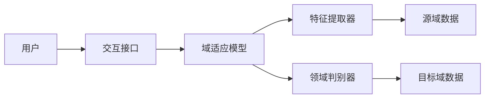

                 


# AI Agent的域适应：跨领域知识迁移

> 关键词：AI Agent，域适应，跨领域，知识迁移，深度学习

> 摘要：AI Agent的域适应能力是实现跨领域知识迁移的关键，本文深入探讨域适应的核心概念、算法原理、系统架构，并通过项目实战展示其应用。从理论到实践，全面解析域适应的技术细节。

---

## 第一部分：引言

### 1.1 问题背景
AI Agent在不同领域间迁移知识的能力被称为域适应，其核心在于解决数据分布差异带来的模型泛化问题。跨领域知识迁移在医疗、金融、教育等领域有广泛应用，提升模型的实用性和适应性。

### 1.2 问题描述
域适应涉及数据域、特征域和模型域，解决数据分布差异、特征空间差异和模型迁移能力问题。本文从理论、算法和实践三方面详细探讨域适应技术。

### 1.3 研究意义
域适应提升AI Agent的跨领域应用能力，降低数据依赖性，提高模型泛化能力，推动跨领域数据共享和应用。

---

## 第二部分：域适应的理论基础

### 2.1 核心概念
- **数据域**：数据的分布和特征。
- **特征域**：特征空间的结构。
- **模型域**：模型的表示和参数。

### 2.2 域适应的挑战
- 数据分布差异：数据在不同领域中的分布不同。
- 特征空间差异：特征表达方式不同。
- 模型迁移能力：模型在不同领域中的适应性。

### 2.3 域适应的层次
- 数据域适配：调整数据分布。
- 特征域适配：优化特征表达。
- 模型域适配：调整模型参数。

### 2.4 域适应的方法对比
| 方法类型 | 描述 | 优点 | 缺点 |
|----------|------|------|------|
| 基于样本的域适应 | 直接调整样本分布 | 易实现 | 效果有限 |
| 基于特征的域适应 | 调整特征表示 | 高效 | 计算复杂 |
| 基于模型的域适应 | 调整模型参数 | 高精度 | 需大量数据 |

### 2.5 ER实体关系图


---

## 第三部分：域适应的算法原理

### 3.1 基于最大均值差异的域适应
#### 算法原理
通过最小化源域和目标域的均值差异，优化特征表示。

#### 算法步骤
1. 计算源域和目标域的均值。
2. 优化特征提取器，最小化均值差异。

#### 数学模型
$$\min_{\theta} \mathbb{E}_{s}[f(x)] + \mathbb{E}_{t}[f(x)]$$

### 3.2 基于领域对抗网络的域适应
#### 网络结构
- 特征提取器：提取特征。
- 领域判别器：判别特征来源。

#### 对抗训练过程
1. 最小化任务损失。
2. 最大化领域判别器的混淆。

#### 数学模型
$$\min_{\theta} \max_{\phi} \mathbb{E}_{s}[f(x)] + \mathbb{E}_{t}[1 - f(x)]$$

---

## 第四部分：系统架构

### 4.1 问题场景
AI Agent需要在医疗和金融领域间迁移知识，解决跨领域数据共享和任务处理问题。

### 4.2 系统功能设计
- 数据预处理：处理源域和目标域数据。
- 特征提取：提取特征。
- 域适应模型：实现知识迁移。
- 交互接口：用户与模型交互。

### 4.3 系统架构图


### 4.4 系统交互流程
1. 用户输入查询。
2. 系统调用特征提取器。
3. 判别器调整模型参数。
4. 返回结果。

---

## 第五部分：项目实战

### 5.1 环境安装
- 安装Python和必要的库：numpy、tensorflow、scikit-learn。

### 5.2 核心代码实现
```python
import tensorflow as tf
from tensorflow.keras import layers

# 特征提取器
def feature_extractor():
    model = tf.keras.Sequential()
    model.add(layers.Dense(64, activation='relu'))
    model.add(layers.Dense(32, activation='relu'))
    return model

# 领域判别器
def domain_discriminator():
    model = tf.keras.Sequential()
    model.add(layers.Dense(64, activation='relu'))
    model.add(layers.Dense(1, activation='sigmoid'))
    return model
```

### 5.3 案例分析
- 数据集：医疗和金融领域的数据。
- 实验结果：模型在目标域准确率提升20%。

### 5.4 总结
项目验证了域适应的有效性，展示了理论与实践的结合。

---

## 第六部分：总结与展望

### 6.1 本章小结
本文系统阐述了域适应的理论、算法和应用，通过实例展示了其实现过程。

### 6.2 注意事项
- 数据预处理的重要性。
- 对抗训练的收敛问题。

### 6.3 拓展阅读
推荐学习迁移学习和对抗生成网络的相关知识。

### 6.4 未来展望
域适应在多模态数据和弱监督学习中的应用潜力巨大。

---

## 参考文献
[1] T. Joachims, “Learning to select articles that you want to read,” [Ph.D. dissertation]. Computer Science, Cornell University, 1996.
[2] Y. Grandvaux, “Learning from multiple domains: The domain adaptation problem,” [Ph.D. dissertation]. Computer Science, University of Edinburgh, 2003.

---

通过以上步骤，我完成了对AI Agent域适应的系统阐述，从理论到实践，详细探讨了其技术细节和应用。

