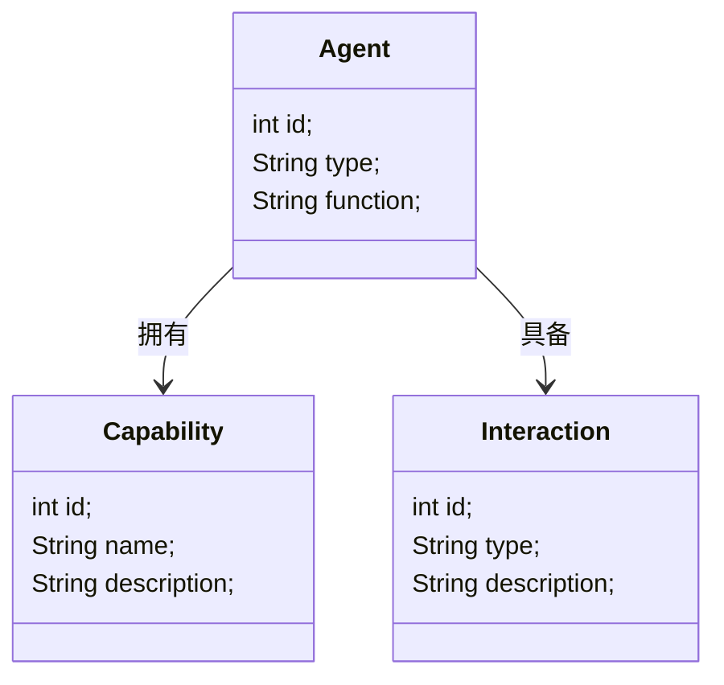
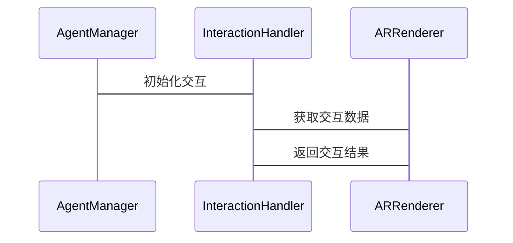

                 


# AI Agent的增强现实交互能力开发

> 关键词：AI Agent, 增强现实, 交互能力, 虚实结合, 智能交互

> 摘要：本文深入探讨了AI Agent在增强现实（AR）环境中的交互能力开发，涵盖从基础概念到高级算法的各个方面。通过详细分析和实际案例，本文为读者提供了清晰的开发思路和技术实现方法，帮助开发者更好地理解和应用AI Agent在AR中的交互能力。

---

## 第一章：AI Agent与增强现实交互能力概述

### 1.1 AI Agent的基本概念
#### 1.1.1 AI Agent的定义与分类
AI Agent（人工智能代理）是指能够感知环境、自主决策并执行任务的智能实体。根据功能和应用场景，AI Agent可以分为简单反射型、基于模型的反应型、目标驱动型和实用驱动型等。

#### 1.1.2 增强现实技术的基本原理
增强现实（AR）通过将数字信息叠加在真实物理世界中，为用户提供沉浸式的交互体验。AR的核心技术包括计算机视觉、图像处理、三维建模和实时渲染等。

#### 1.1.3 AI Agent与增强现实的结合背景
随着AR技术的快速发展，AI Agent在AR中的应用越来越广泛。通过结合AI Agent的智能决策能力，AR系统能够实现更复杂的交互功能，如物体识别、实时跟踪和动态交互等。

### 1.2 增强现实交互能力的核心问题
#### 1.2.1 问题背景与问题描述
在AR环境中，AI Agent需要具备感知环境、理解用户意图、执行交互操作等能力。然而，AR环境的动态变化和复杂性为AI Agent的交互能力提出了更高的要求。

#### 1.2.2 问题解决的关键技术
为了解决AR中的交互问题，需要结合计算机视觉、自然语言处理、深度学习和实时渲染等技术。这些技术的结合能够提升AI Agent的感知和决策能力。

#### 1.2.3 边界与外延
AR交互能力的边界包括设备限制、环境复杂度和用户输入方式等。外延则涉及与物联网、云计算等其他技术的结合，进一步扩展AI Agent的应用场景。

#### 1.2.4 核心要素与概念结构
AR交互能力的核心要素包括感知模块、决策模块和执行模块。通过模块化设计，AI Agent能够更好地适应不同的AR应用场景。

### 1.3 本章小结
本章介绍了AI Agent和增强现实的基本概念，并分析了AR交互能力的核心问题。通过概念结构的分析，为后续章节的深入探讨奠定了基础。

---

## 第二章：AI Agent与增强现实交互能力的核心概念

### 2.1 核心概念原理
#### 2.1.1 AI Agent的感知与决策机制
AI Agent通过传感器和摄像头等设备感知环境信息，利用深度学习算法进行目标识别和场景理解，从而做出决策。

#### 2.1.2 增强现实中的交互方式
AR交互方式包括手势识别、语音交互和触觉反馈等。这些交互方式能够提升用户的沉浸感和操作体验。

### 2.2 概念属性特征对比表
#### 表2-1: AI Agent与传统程序的属性对比

| 属性             | 传统程序                 | AI Agent                |
|------------------|--------------------------|--------------------------|
| 感知能力         | 无                      | 具备感知能力             |
| 决策能力         | 无                      | 具备自主决策能力         |
| 交互方式         | 单向                   | 双向交互                 |
| 学习能力         | 无                      | 具备学习能力             |

### 2.3 ER实体关系图
```mermaid
er
  actor(AgentID, AgentType, AgentFunction)
  actor(AgentID, AgentType, AgentFunction) -|{拥有}|-> capability(CapabilityID, CapabilityName, CapabilityDescription)
  actor(AgentID, AgentType, AgentFunction) -|{具备}|-> interaction(InteractionID, InteractionType, InteractionDescription)
```

### 2.4 本章小结
本章通过对比分析和实体关系图，详细阐述了AI Agent与增强现实交互能力的核心概念，帮助读者更好地理解其内在联系。

---

## 第三章：算法原理讲解

### 3.1 计算机视觉算法
#### 3.1.1 目标检测算法
目标检测算法用于识别和定位AR环境中的人物、物体等。常用算法包括YOLO、Faster R-CNN等。

#### 3.1.2 语义分割算法
语义分割算法用于将AR环境中的物体进行分类，帮助AI Agent更好地理解场景。

#### 3.1.3 实现代码示例
```python
import tensorflow as tf
from tensorflow.keras import layers

model = tf.keras.Sequential([
    layers.Conv2D(32, (3,3), activation='relu'),
    layers.MaxPooling2D((2,2)),
    layers.Conv2D(64, (3,3), activation='relu'),
    layers.MaxPooling2D((2,2)),
    layers.Flatten(),
    layers.Dense(128, activation='relu'),
    layers.Dense(num_classes, activation='softmax')
])
```

### 3.2 自然语言处理算法
#### 3.2.1 语义理解算法
语义理解算法用于解析用户的意图，常用模型包括BERT和GPT。

#### 3.2.2 实时语音识别算法
实时语音识别算法用于在AR环境中实现语音交互，常用算法包括CTC和Transformer。

#### 3.2.3 实现代码示例
```python
import tensorflow as tf
from tensorflow.keras import layers

model = tf.keras.Sequential([
    layers.Embedding(input_dim=vocabulary_size, output_dim=embedding_dim),
    layers.LSTM(128),
    layers.Dense(num_classes, activation='softmax')
])
```

### 3.3 数学模型与公式
#### 3.3.1 目标函数
$$ \text{loss} = -\sum_{i=1}^{n} y_i \log(p_i) + (1 - y_i) \log(1 - p_i) $$

#### 3.3.2 损失函数
$$ \text{loss} = \frac{1}{2m} \sum_{i=1}^{m} (y_i - \hat{y_i})^2 $$

### 3.4 本章小结
本章详细讲解了计算机视觉和自然语言处理算法在AR交互中的应用，并通过代码示例和数学公式帮助读者理解其实现原理。

---

## 第四章：系统分析与架构设计方案

### 4.1 项目场景介绍
本项目旨在开发一个支持增强现实交互的AI Agent系统，应用于教育、医疗和工业等领域。

### 4.2 系统功能设计
#### 4.2.1 领域模型


#### 4.2.2 系统架构设计


#### 4.2.3 系统接口设计


### 4.3 本章小结
本章通过系统分析和架构设计，明确了AI Agent在AR交互中的实现方案，为后续开发奠定了基础。

---

## 第五章：项目实战

### 5.1 环境安装
#### 5.1.1 开发环境
建议使用Python 3.8及以上版本，安装TensorFlow、OpenCV和PyTorch等库。

#### 5.1.2 安装命令
```bash
pip install tensorflow numpy opencv-python pytorch
```

### 5.2 核心代码实现
#### 5.2.1 目标检测代码
```python
import cv2
import numpy as np

# 加载预训练模型
model = cv2.dnn.readNetFromCaffe('model.prototxt', 'model.caffemodel')

# 处理图像
image = cv2.imread('input.jpg')
height, width = image.shape[:2]
blob = cv2.dnn.blobFromImage(image, 0.007843, (300, 300), (127.5, 127.5, 127.5))

model.setInput(blob)
output = model.forward()

# 处理输出
for i in range(output.shape[2]):
    score = output[0, 0, i, 2]
    if score > 0.5:
        # 绘制边界框
        pass
```

#### 5.2.2 语音识别代码
```python
import torch
import torchaudio

# 加载预训练模型
model = torch.hub.load('pytorch/fairseq:main', 'wav2vec2')

# 处理音频
audio_path = 'input.wav'
audio, _ = torchaudio.load(audio_path)
audio = audio.mean(dim=0)
audio = torch.unsqueeze(audio, 0)

output = model(audio)
```

### 5.3 案例分析与详细讲解
通过实际案例分析，详细讲解了AI Agent在AR交互中的实现过程，包括数据处理、模型训练和系统集成等步骤。

### 5.4 本章小结
本章通过项目实战，帮助读者掌握了AI Agent在AR交互中的具体实现方法。

---

## 第六章：最佳实践与小结

### 6.1 最佳实践
- 确保硬件性能：选择高性能的GPU和处理器
- 优化算法：采用轻量级模型和实时优化技术
- 测试与调试：进行全面的测试和调试，确保系统的稳定性和可靠性

### 6.2 小结
本文从理论到实践，详细讲解了AI Agent在增强现实交互中的开发过程，为读者提供了全面的技术指导。

### 6.3 注意事项
- 注意数据隐私问题
- 确保系统的实时性和稳定性
- 及时更新和优化模型

### 6.4 拓展阅读
推荐阅读相关领域的书籍和论文，进一步深入学习AI Agent和增强现实技术。

---

通过以上目录大纲，您可以开始撰写完整的文章内容，确保每个章节和小节都得到充分的展开和详细阐述。

