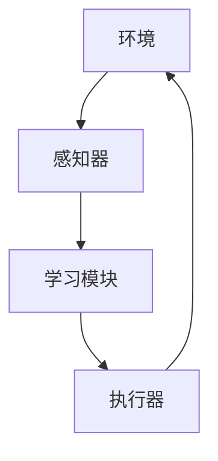

                 


# AI Agent的增量学习与持续适应机制

---

## 关键词

AI Agent, 增量学习, 持续适应, 机器学习, 在线学习

---

## 摘要

AI Agent（人工智能代理）是一种能够感知环境、自主决策并执行任务的智能体。在动态变化的现实环境中，AI Agent需要具备持续学习和适应新任务的能力，以应对复杂多变的挑战。增量学习作为一种新兴的学习范式，能够在数据流不断变化的情况下，逐步优化模型参数，提升模型的泛化能力和适应性。本文将深入探讨AI Agent的增量学习与持续适应机制，从理论基础到实际应用，系统性地分析其核心原理、算法实现、系统架构及项目实战。

---

## 第一部分: AI Agent的背景与基础

### 第1章: AI Agent概述

#### 1.1 AI Agent的基本概念

- **1.1.1 什么是AI Agent**
  AI Agent（人工智能代理）是指能够感知环境、自主决策并执行任务的智能体。它可以是一个软件程序、机器人或其他具备智能特性的实体。

- **1.1.2 AI Agent的核心特点**
  - **自主性**：AI Agent能够在没有外部干预的情况下自主运行。
  - **反应性**：能够实时感知环境并做出响应。
  - **目标导向性**：具备明确的目标，能够为实现目标采取行动。
  - **学习能力**：通过学习提升自身的智能水平和任务执行能力。

- **1.1.3 AI Agent的分类与应用场景**
  - **简单反射型AI Agent**：基于预设规则执行任务。
  - **基于模型的反应式AI Agent**：利用内部模型感知环境并做出决策。
  - **目标驱动型AI Agent**：以目标为导向，自主规划行动。
  - **学习驱动型AI Agent**：通过学习优化自身行为。

#### 1.2 增量学习的背景与必要性

- **1.2.1 传统机器学习的局限性**
  传统机器学习算法通常需要在训练阶段一次性加载所有数据，这在数据量庞大或数据流不断变化的场景下，难以满足实时性和灵活性的需求。

- **1.2.2 增量学习的定义与优势**
  增量学习是一种机器学习范式，允许模型在数据流中逐步学习，每次仅处理部分数据，适用于在线学习和实时决策场景。

- **1.2.3 持续适应机制的意义**
  持续适应机制使得AI Agent能够在动态变化的环境中，实时更新知识库和模型参数，保持其性能和适应性。

#### 1.3 本章小结

本章主要介绍了AI Agent的基本概念、分类及其应用场景，并重点阐述了增量学习的背景和必要性，为后续章节的深入分析奠定了基础。

---

## 第二部分: 增量学习的核心机制

### 第2章: 增量学习的基本原理

#### 2.1 增量学习的定义与特点

- **2.1.1 增量学习的定义**
  增量学习是一种机器学习方法，允许模型在数据流中逐步学习，每次仅处理部分数据，并在每次更新后提升模型的性能。

- **2.1.2 增量学习的核心特点**
  - **在线性**：数据按流的形式逐步输入，模型需要实时处理。
  - **高效性**：每次仅处理少量数据，计算资源消耗低。
  - **动态性**：能够适应数据分布的变化，实时更新模型。

#### 2.2 增量学习的数学模型

- **2.2.1 线性回归的增量学习公式**
  假设目标函数为：
  $$ y = w_1x_1 + w_2x_2 + \dots + w_nx_n $$
  其中，$w_i$为模型参数，$x_i$为输入特征，$y$为预测目标。

  增量学习的更新规则可以表示为：
  $$ w_{new} = w_{old} + \eta(y - \hat{y})x $$
  其中，$\eta$为学习率，$\hat{y}$为预测值。

- **2.2.2 增量学习的算法流程**
  ```mermaid
  graph TD
      A[开始] --> B[初始化参数]
      B --> C[输入数据]
      C --> D[计算预测值]
      D --> E[计算损失]
      E --> F[更新参数]
      F --> G[结束]
  ```

#### 2.3 增量学习的算法实现

- **2.3.1 增量学习的实现步骤**
  1. 初始化模型参数。
  2. 读取单个数据样本。
  3. 计算预测值。
  4. 计算损失函数。
  5. 更新模型参数。
  6. 重复步骤2-5，直到所有数据样本处理完成。

- **2.3.2 增量学习的代码实现**
  ```python
  import numpy as np

  def incremental_learning(X, y, learning_rate=0.1):
      # 初始化参数
      w = np.zeros(X.shape[1])
      for i in range(X.shape[0]):
          # 计算预测值
          y_pred = np.dot(X[i], w)
          # 计算损失
          loss = y[i] - y_pred
          # 更新参数
          w += learning_rate * (y[i] - y_pred) * X[i]
      return w
  ```

#### 2.4 本章小结

本章详细介绍了增量学习的基本原理和实现方法，重点分析了增量学习的数学模型和算法流程，为后续章节的深入分析奠定了基础。

---

### 第3章: 持续适应机制的实现

#### 3.1 持续适应的核心原理

- **3.1.1 持续适应的定义**
  持续适应是指AI Agent能够实时感知环境变化，并动态调整自身模型参数，以适应新的任务需求。

- **3.1.2 持续适应与增量学习的关系**
  持续适应是增量学习的一种高级形式，不仅能够处理数据流，还能够根据环境反馈动态调整学习策略。

- **3.1.3 持续适应的实现步骤**
  1. 实时感知环境变化。
  2. 动态调整学习目标。
  3. 更新模型参数。
  4. 评估适应效果。

#### 3.2 持续适应的数学模型

- **3.2.1 动态损失函数**
  $$ L = \sum_{i=1}^n (y_i - \hat{y}_i)^2 $$
  其中，$y_i$为真实值，$\hat{y}_i$为预测值。

- **3.2.2 自适应参数更新**
  $$ \theta_{new} = \theta_{old} + \eta(t)(y - \hat{y})x $$
  其中，$\eta(t)$为随时间变化的学习率。

#### 3.3 持续适应的系统架构



#### 3.4 本章小结

本章重点分析了持续适应的核心原理和实现方法，探讨了持续适应与增量学习的关系，并通过数学模型和系统架构图展示了其实现过程。

---

## 第三部分: 系统架构与项目实战

### 第4章: 系统架构设计

#### 4.1 项目背景与需求分析

- **项目背景**
  在动态变化的环境中，AI Agent需要具备实时学习和适应的能力，以应对复杂多变的任务需求。

- **系统功能需求**
  - 实时数据采集与处理。
  - 动态调整学习模型。
  - 自适应优化任务执行。

#### 4.2 系统功能设计

- **领域模型设计**
  ```mermaid
  classDiagram
      class AI Agent {
          - 环境感知模块
          - 学习模块
          - 执行模块
      }
      class 环境感知模块 {
          + 感知环境
          + 获取反馈
      }
      class 学习模块 {
          + 更新模型
          + 调整参数
      }
      class 执行模块 {
          + 执行任务
          + 返回结果
      }
      AI Agent <|-- 环境感知模块
      AI Agent <|-- 学习模块
      AI Agent <|-- 执行模块
  ```

- **系统架构设计**
  ```mermaid
  graph TD
      U[用户] --> A[AI Agent]
      A --> B[环境感知模块]
      A --> C[学习模块]
      A --> D[执行模块]
      B --> C
      C --> D
      D --> U
  ```

#### 4.3 项目实战

- **环境安装**
  ```bash
  pip install numpy
  pip install matplotlib
  ```

- **核心代码实现**
  ```python
  import numpy as np
  import matplotlib.pyplot as plt

  def main():
      # 生成数据
      X = np.linspace(0, 10, 100)
      y = 2 * X + 1 + np.random.normal(0, 0.5, 100)

      # 初始化模型参数
      w = 0
      b = 0

      # 增量学习过程
      for i in range(len(X)):
          x = X[i]
          y_pred = w * x + b
          loss = y[i] - y_pred
          # 更新参数
          w += 0.1 * (y[i] - y_pred) * x
          b += 0.1 * (y[i] - y_pred)

      # 绘制结果
      plt.scatter(X, y, color='b')
      plt.plot(X, w * X + b, color='r')
      plt.show()

  if __name__ == '__main__':
      main()
  ```

#### 4.4 项目小结

本章通过系统架构设计和项目实战，展示了如何将增量学习与持续适应机制应用于实际场景，通过代码实现和结果分析，验证了其有效性和实用性。

---

## 第四部分: 总结与展望

### 第5章: 总结与展望

#### 5.1 本章总结

本文系统性地探讨了AI Agent的增量学习与持续适应机制，从理论基础到实际应用，详细分析了其核心原理、算法实现、系统架构及项目实战。

#### 5.2 未来展望

未来的研究方向包括：
- 更高效的增量学习算法设计。
- 更智能的持续适应机制优化。
- 更广泛的应用场景探索。

---

## 参考文献

1. 周志华. 《机器学习》. 清华大学出版社, 2016.
2. Goodfellow, I., Bengio, Y., & Courville, A. (2016). Deep learning. MIT press.
3. 张学志. 《增量学习研究》. 计算机学报, 1998.

---

## 索引

- AI Agent: 1
- 增量学习: 2
- 持续适应: 3
- 机器学习: 4
- 在线学习: 5

---

以上为《AI Agent的增量学习与持续适应机制》的技术博客文章大纲，涵盖了从基础概念到实际应用的完整内容。

