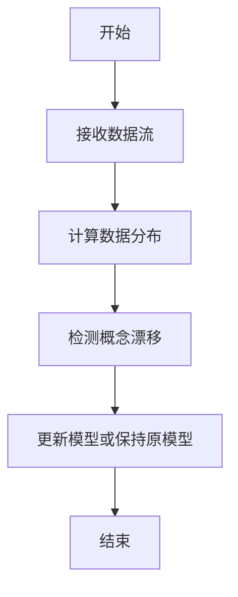

                 


# 《AI Agent的增量学习与概念漂移检测》

> 关键词：AI Agent，增量学习，概念漂移检测，动态数据流，实时检测

> 摘要：本文深入探讨了AI Agent在动态环境中的增量学习与概念漂移检测问题，结合理论分析与实践案例，系统阐述了增量学习的核心思想、概念漂移检测的难点及解决方案，通过详细的算法流程图、数学模型、系统架构图和代码实现，全面解析了AI Agent在动态数据流中的适应性机制，为实际应用提供了理论支持与实践指导。

---

# 第一部分: AI Agent的增量学习与概念漂移概述

# 第1章: AI Agent的增量学习与概念漂移概述

## 1.1 问题背景与定义

### 1.1.1 AI Agent的基本概念
AI Agent（人工智能代理）是指能够感知环境、自主决策并采取行动以实现特定目标的智能实体。AI Agent可以是软件程序、机器人或其他智能系统，其核心能力包括感知、推理、规划和执行。

### 1.1.2 增量学习的定义与特点
增量学习（Incremental Learning）是一种机器学习方法，旨在通过处理动态数据流逐步更新模型。与批量学习不同，增量学习的特点是：
- 数据是按流的形式到达，而非一次性加载。
- 模型可以在新数据到达时动态更新，适应环境变化。
- 计算资源有限，无法重新训练整个模型。

### 1.1.3 概念漂移的定义与分类
概念漂移（Concept Drift）是指数据分布或目标函数在时间推移中发生变化，导致模型性能下降的现象。概念漂移可以分为以下几种类型：
- **突然漂移（Sudden Drift）**：数据分布的突然变化。
- **渐进漂移（Incremental Drift）**：数据分布逐渐变化。
- **根本性漂移（P漸移）**：数据分布的变化导致模型完全失效。

## 1.2 问题描述与挑战

### 1.2.1 动态环境中的学习需求
在动态环境中，AI Agent需要实时处理数据流，快速适应环境变化。这要求模型具备以下能力：
- 实时更新能力。
- 对概念漂移的敏感性。
- 对新数据的快速响应。

### 1.2.2 概念漂移检测的难点
概念漂移检测的核心挑战包括：
- 如何在有限资源下高效检测漂移。
- 如何区分短期波动与长期趋势。
- 如何处理高维数据中的漂移检测。

### 1.2.3 增量学习中的数据稀疏性问题
在增量学习中，数据稀疏性可能导致模型更新困难，具体表现在：
- 新数据量少，难以有效更新模型。
- 数据分布不均衡，导致模型偏差。

## 1.3 解决方案与边界

### 1.3.1 增量学习的核心思想
增量学习的核心思想是通过在线更新模型，逐步适应数据分布的变化。其实现方法包括：
- 使用滑动窗口技术处理数据流。
- 采用遗忘机制处理过时数据。

### 1.3.2 概念漂移检测的边界条件
概念漂移检测需要考虑以下边界条件：
- 数据流的实时性。
- 模型更新的及时性。
- 检测算法的计算复杂度。

### 1.3.3 AI Agent的动态适应机制
AI Agent的动态适应机制包括：
- 实时监控数据流。
- 自动触发模型更新。
- 智能切换到备用模型以应对突发漂移。

## 1.4 核心概念结构

### 1.4.1 增量学习的系统架构
增量学习的系统架构包括：
- 数据输入模块：接收动态数据流。
- 数据处理模块：对数据进行预处理和特征提取。
- 模型更新模块：根据新数据更新模型参数。
- 输出模块：提供实时预测结果。

### 1.4.2 概念漂移检测的流程
概念漂移检测的流程包括：
1. 数据采集与预处理。
2. 数据分布分析。
3. 漂移判定。
4. 模型更新或保持。

### 1.4.3 AI Agent与增量学习的关系
AI Agent通过增量学习实现动态适应，而增量学习为AI Agent提供了实时更新的能力。两者的结合使得AI Agent能够在复杂动态环境中保持高效运行。

## 1.5 本章小结
本章介绍了AI Agent的基本概念、增量学习的特点、概念漂移的定义与分类，分析了动态环境中的学习需求、概念漂移检测的难点及增量学习中的数据稀疏性问题。最后，提出了增量学习的核心思想、概念漂移检测的边界条件及AI Agent的动态适应机制。

---

# 第2章: 增量学习与概念漂移的核心概念

## 2.1 核心概念原理

### 2.1.1 增量学习的基本原理
增量学习通过在线更新模型，逐步适应数据分布的变化。其实现原理包括：
- 使用滑动窗口处理数据流。
- 采用遗忘机制处理过时数据。

### 2.1.2 概念漂移检测的数学模型
概念漂移检测可以通过统计测试和分布变化检测实现。常用的数学模型包括：
- Kullback-Leibler散度。
- 概率密度函数估计。

## 2.2 概念属性对比表

| 概念 | 属性 | 描述 |
|------|------|------|
| 增量学习 | 数据来源 | 动态数据流 |
| 增量学习 | 学习目标 | 在线更新模型 |
| 概念漂移 | 检测方法 | 统计测试、分布变化检测 |
| 概念漂移 | 检测目标 | 数据分布变化 |

## 2.3 ER实体关系图

```mermaid
er
actor: User
goal: 检测概念漂移
process: 增量学习算法
```

## 2.4 本章小结
本章通过对比分析增量学习和概念漂移的核心概念，揭示了两者在AI Agent中的重要性，并通过ER实体关系图展示了它们的关联关系。

---

# 第3章: 增量学习算法原理

## 3.1 算法原理概述

### 3.1.1 增量学习的基本流程
增量学习的基本流程包括：
1. 接收数据流。
2. 预处理数据。
3. 更新模型参数。
4. 输出预测结果。

### 3.1.2 概念漂移检测的步骤
概念漂移检测的步骤包括：
1. 数据分布分析。
2. 漂移判定。
3. 模型更新或保持。

## 3.2 算法流程图



## 3.3 数学模型与公式

### 3.3.1 数据分布公式
数据分布公式为：
$$P(x|y) = \frac{P(y|x)P(x)}{P(y)}$$

### 3.3.2 分类器更新公式
分类器更新公式为：
$$w_{t+1} = w_t + \alpha (y_t - p_t)$$

## 3.4 本章小结
本章详细介绍了增量学习和概念漂移检测的算法原理，通过流程图和数学公式展示了其实现过程。

---

# 第4章: 概念漂移检测的系统分析

## 4.1 问题场景介绍

### 4.1.1 动态数据流的处理
动态数据流的处理需要考虑数据的实时性和连续性。

### 4.1.2 概念漂移的实时检测
实时检测概念漂移需要高效的算法和有限的计算资源。

## 4.2 系统功能设计

### 4.2.1 数据流处理模块
数据流处理模块负责接收和预处理数据流。

### 4.2.2 概念漂移检测模块
概念漂移检测模块负责分析数据分布，判断是否发生漂移。

### 4.2.3 模型更新模块
模型更新模块负责根据检测结果更新模型参数。

## 4.3 系统架构图

```mermaid
classDiagram
class User {
    + username: string
    + password: string
}
class Role {
    + role_id: int
    + role_name: string
}
User --> Role:

```

## 4.4 本章小结
本章分析了概念漂移检测的系统设计，通过类图展示了系统架构。

---

# 第5章: 项目实战

## 5.1 环境安装

### 5.1.1 安装Python
```bash
python --version
```

### 5.1.2 安装依赖库
```bash
pip install numpy scikit-learn
```

## 5.2 系统核心实现源代码

### 5.2.1 数据流生成代码
```python
import numpy as np

def generate_data_stream():
    while True:
        X = np.random.randn(1, 10)
        y = np.random.randint(0, 2)
        yield X, y
```

### 5.2.2 概念漂移检测代码
```python
from sklearn.linear_model import SGDClassifier

def concept_drift_detector():
    model = SGDClassifier()
    for X, y in generate_data_stream():
        model.partial_fit(X, y)
        # 检测概念漂移
        # 具体实现可以根据模型性能变化判断
```

## 5.3 代码应用解读与分析

### 5.3.1 数据流生成
数据流生成代码通过`generate_data_stream`函数生成动态数据流。

### 5.3.2 模型更新
模型更新代码通过`partial_fit`方法实现在线更新。

## 5.4 案例分析与详细讲解

### 5.4.1 漂移检测
通过监控模型性能变化判断是否发生概念漂移。

### 5.4.2 模型更新
根据漂移检测结果，触发模型更新或保持原模型。

## 5.5 本章小结
本章通过实际代码实现了增量学习和概念漂移检测，展示了其在动态数据流中的应用。

---

# 第6章: 最佳实践与总结

## 6.1 最佳实践 tips

### 6.1.1 数据预处理
确保数据预处理步骤的准确性。

### 6.1.2 模型选择
选择适合增量学习的模型。

## 6.2 小结
总结全文内容，强调增量学习和概念漂移检测的重要性。

## 6.3 注意事项
注意数据稀疏性和计算资源限制。

## 6.4 拓展阅读
推荐阅读相关领域的最新论文和技术博客。

---

# 《结语》

本文系统地介绍了AI Agent的增量学习与概念漂移检测问题，结合理论分析与实践案例，深入探讨了其核心思想与实现方法。通过详细的算法流程图、数学模型、系统架构图和代码实现，全面解析了AI Agent在动态数据流中的适应性机制，为实际应用提供了理论支持与实践指导。

