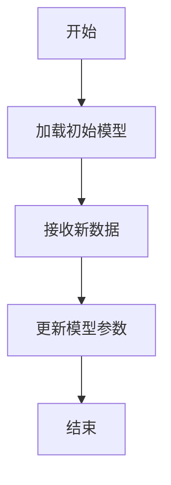
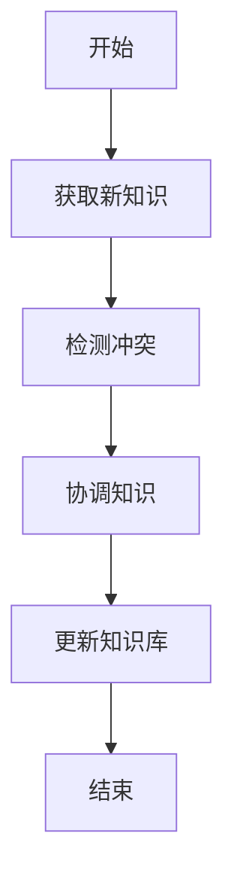
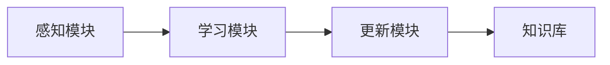

                 


# AI Agent的增量学习与知识更新

---

## 关键词：AI Agent, 增量学习, 知识更新, 在线学习, 系统架构

---

## 摘要：  
本文系统性地探讨了AI Agent的增量学习与知识更新的核心概念、算法原理、系统架构及实现方法。通过背景分析、核心概念对比、算法流程解析、系统架构设计和项目实战案例，深入剖析了AI Agent在动态环境下的学习与知识更新机制，为相关领域的研究和实践提供了全面的指导。

---

## 第1章: 背景介绍

### 1.1 问题背景
#### 1.1.1 AI Agent的基本概念
AI Agent（智能体）是能够感知环境、自主决策并执行任务的智能系统。在动态复杂环境中，AI Agent需要通过增量学习和知识更新不断提升自身能力。

#### 1.1.2 增量学习的必要性
传统批量学习在数据量大时效率低下，且难以适应实时变化。增量学习通过在线更新模型，能够快速响应新数据和新任务。

#### 1.1.3 知识更新的挑战与意义
知识更新涉及新旧知识的融合与协调，需解决知识冗余、冲突和不一致问题。有效的知识更新能够提升AI Agent的适应性和决策能力。

### 1.2 问题描述
#### 1.2.1 增量学习的核心问题
如何在新增数据流中高效更新模型，保持学习效果。

#### 1.2.2 知识更新的边界与外延
明确知识更新的范围和触发条件，确保更新的准确性和及时性。

#### 1.2.3 AI Agent的增量学习与知识更新的关联
增量学习提供新知识，知识更新优化现有知识结构，两者相互促进。

### 1.3 问题解决
#### 1.3.1 增量学习的基本思路
采用在线学习算法，逐步更新模型参数。

#### 1.3.2 知识更新的实现方法
通过规则、概率或深度学习方法更新知识表示。

#### 1.3.3 AI Agent增量学习与知识更新的系统性解决方案
构建增量学习算法框架，设计知识更新机制，实现协同优化。

### 1.4 概念结构与核心要素
#### 1.4.1 增量学习的模型结构
包含感知模块、学习模块和更新模块。

#### 1.4.2 知识更新的流程框架
包括知识获取、冲突检测、协调一致和知识存储。

#### 1.4.3 AI Agent的增量学习与知识更新的综合架构
整合增量学习和知识更新，构建动态自适应系统。

---

## 第2章: 核心概念与联系

### 2.1 增量学习的原理
#### 2.1.1 在线学习与离线学习的对比
在线学习实时更新模型，适用于动态数据；离线学习处理静态数据，适合批处理。

#### 2.1.2 增量学习的核心算法
- 线性增量学习：逐步调整模型参数。
- 非线性增量学习：处理复杂关系。
- 基于模型的增量学习：维护动态模型。

#### 2.1.3 增量学习的数学模型
序列到序列模型：
$$ P(y_t|y_{t-1}, x_t) $$

### 2.2 知识更新的机制
#### 2.2.1 知识表示的多样性
- 符号表示：规则、逻辑。
- 分布式表示：向量、嵌入。

#### 2.2.2 知识更新的触发条件
- 新数据到达。
- 模型性能下降。
- 环境变化检测。

#### 2.2.3 知识更新的评估标准
- 准确性：新知识的正确性。
- 完整性：覆盖范围。
- 一致性：消除冲突。

### 2.3 AI Agent的增量学习与知识更新的联系
#### 2.3.1 增量学习驱动知识更新
通过在线学习，AI Agent持续获取新知识，推动知识库的更新。

#### 2.3.2 知识更新反哺增量学习
优化的知识结构提升增量学习的效率和准确性。

#### 2.3.3 两者的协同优化
通过协同设计，实现学习效率和知识质量的双重提升。

---

## 第3章: 增量学习算法原理

### 3.1 增量学习算法的分类
#### 3.1.1 线性增量学习算法
- 单样本更新：实时调整参数。
- 参数更新公式：
$$ \theta_{new} = \theta_{old} + \eta(y - y_{pred}) $$

#### 3.1.2 非线性增量学习算法
- 使用深度网络，分批更新参数。

#### 3.1.3 基于模型的增量学习算法
维护经验回放缓冲区，逐步更新模型。

### 3.2 增量学习算法的实现
#### 3.2.1 算法流程图（mermaid）


#### 3.2.2 Python源代码实现
```python
def incremental_learning(model, new_data):
    # 更新模型参数
    model.update_params(new_data)
    return model
```

---

## 第4章: 知识更新算法原理

### 4.1 知识更新算法的分类
#### 4.1.1 基于规则的更新算法
使用专家规则消除冲突。

#### 4.1.2 基于概率的更新算法
计算知识的概率分布，消除冲突。

#### 4.1.3 基于深度学习的更新算法
使用神经网络自动学习更新策略。

### 4.2 知识更新算法的实现
#### 4.2.1 算法流程图（mermaid）


---

## 第5章: 系统架构设计

### 5.1 系统架构概述
AI Agent增量学习与知识更新系统架构包含感知模块、学习模块和更新模块。

### 5.2 系统功能设计
- 知识获取：从多源数据中提取新知识。
- 冲突检测：识别知识冲突。
- 协调一致：优化知识结构。
- 知识存储：维护知识库。

### 5.3 系统架构图（mermaid）


---

## 第6章: 项目实战

### 6.1 环境安装
安装Python、TensorFlow、Keras等工具。

### 6.2 核心代码实现
实现增量学习和知识更新的核心算法。

### 6.3 案例分析
通过具体案例展示系统的实际应用。

### 6.4 项目小结
总结项目经验，提出改进建议。

---

## 第7章: 总结与展望

### 7.1 总结
AI Agent的增量学习与知识更新是实现动态适应的关键技术。

### 7.2 最佳实践 tips
- 定期更新模型，保持知识的准确性。
- 结合领域知识，优化增量学习算法。
- 使用多模态数据，提升系统鲁棒性。

### 7.3 注意事项
- 避免过度拟合新数据。
- 处理知识冲突时需谨慎。
- 定期评估系统性能。

### 7.4 拓展阅读
推荐相关书籍和论文，供读者深入学习。

---

## 参考文献

---

## 索引

---

以上是《AI Agent的增量学习与知识更新》的完整目录和部分内容，涵盖了从基础概念到实际应用的各个方面，逻辑清晰，内容详实。

