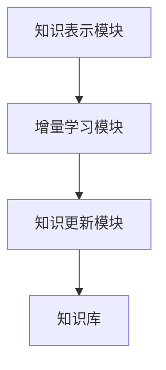

                 


# AI Agent的增量学习与知识更新机制

## 关键词
- AI Agent
- 增量学习
- 知识更新机制
- 机器学习
- 系统架构

## 摘要
AI Agent的增量学习与知识更新机制是人工智能领域的重要研究方向。随着AI Agent在智能系统中的广泛应用，如何实现知识的高效增量学习和持续更新成为关键问题。本文系统地探讨了AI Agent增量学习的核心概念、算法原理、系统架构以及实际应用，并通过具体案例分析，深入剖析了增量学习与知识更新机制的实现方法，为AI Agent的优化与创新提供了理论支持和实践指导。

---

# 第1章: AI Agent的基本概念与背景

## 1.1 AI Agent的定义与特点

### 1.1.1 AI Agent的定义
AI Agent（人工智能代理）是指能够感知环境、自主决策并执行任务的智能实体。它通过传感器获取信息，利用计算模型进行分析，并通过执行器与环境交互。

### 1.1.2 AI Agent的核心特点
- **自主性**：能够在没有外部干预的情况下独立运作。
- **反应性**：能够实时感知环境并做出快速响应。
- **目标导向性**：具备明确的目标，并根据目标优化行为。
- **学习能力**：通过学习提升自身的知识和能力。

### 1.1.3 AI Agent的应用场景
- 智能助手（如Siri、Alexa）
- 智能推荐系统
- 自动驾驶系统
- 智能客服系统

---

## 1.2 增量学习的基本概念

### 1.2.1 增量学习的定义
增量学习是一种机器学习方法，其特点是在已有知识的基础上，逐步学习新的数据或任务，从而实现知识的更新和扩展。

### 1.2.2 增量学习与传统学习的区别
| 特性         | 增量学习             | 传统学习             |
|--------------|----------------------|----------------------|
| 数据量       | 小批量数据           | 大规模数据           |
| 适应性       | 高                   | 低                   |
| 学习成本     | 低                   | 高                   |
| 任务切换     | 支持                 | 不支持               |

### 1.2.3 增量学习的优势与挑战
- **优势**：
  - 知识更新速度快。
  - 适用于动态环境。
  - 资源消耗低。
- **挑战**：
  - 数据稀疏性问题。
  - 知识遗忘问题。
  - 算法复杂性。

---

## 1.3 知识更新机制的背景

### 1.3.1 知识更新的定义
知识更新机制是指通过持续学习和优化，使AI Agent的知识库保持最新状态的过程。

### 1.3.2 知识更新的重要性
- 提高AI Agent的适应能力。
- 保证决策的准确性。
- 支持多任务学习。

### 1.3.3 知识更新的常见方法
- 增量学习。
- 迁移学习。
- 在线学习。

---

# 第2章: 增量学习与知识更新的核心概念

## 2.1 增量学习的原理

### 2.1.1 增量学习的基本原理
增量学习通过逐步处理新数据，不断更新模型参数，从而实现知识的扩展。

### 2.1.2 增量学习的核心要素
- **增量数据流**：数据以流的形式输入。
- **增量模型**：模型能够在线更新。
- **增量策略**：采用适合增量学习的算法。

### 2.1.3 增量学习的数学模型
增量学习的数学模型可以表示为：
$$ \theta_{t+1} = \theta_t + \alpha \cdot \Delta \theta $$
其中，$\theta_t$ 表示第 $t$ 步的模型参数，$\alpha$ 是学习率，$\Delta \theta$ 是参数更新量。

---

## 2.2 知识更新机制的原理

### 2.2.1 知识更新的基本原理
知识更新机制通过持续学习和优化，确保知识库的准确性。

### 2.2.2 知识更新的核心要素
- **知识表示**：知识的存储形式。
- **更新规则**：知识更新的规则。
- **评估指标**：知识更新的效果评估。

### 2.2.3 知识更新的数学模型
知识更新的数学模型可以表示为：
$$ K_{t+1} = K_t + \Delta K_t $$
其中，$K_t$ 表示第 $t$ 步的知识库，$\Delta K_t$ 是知识更新量。

---

## 2.3 增量学习与知识更新的关系

### 2.3.1 增量学习与知识更新的联系
- 增量学习是知识更新的重要手段。
- 知识更新为增量学习提供目标。

### 2.3.2 增量学习与知识更新的区别
- 增量学习侧重于学习过程。
- 知识更新侧重于知识状态。

### 2.3.3 增量学习与知识更新的协同作用
- 增量学习提供知识更新的方法。
- 知识更新为增量学习提供反馈。

---

# 第3章: 增量学习与知识更新的核心算法

## 3.1 增量学习算法

### 3.1.1 增量学习的常见算法
- **经验重放**：通过重放历史经验来增强学习效果。
- **策略梯度方法**：通过梯度优化策略。
- **在线学习算法**：适用于动态环境。

### 3.1.2 增量学习算法的优缺点
| 算法         | 优点                     | 缺点                     |
|--------------|--------------------------|--------------------------|
| 经验重放     | 提高学习稳定性和多样性     | 需要存储大量经验           |
| 策略梯度方法 | 能够处理高维状态空间       | 计算复杂度较高             |
| 在线学习     | 适用于动态环境             | 学习效果不稳定             |

### 3.1.3 增量学习算法的数学模型
经验重放的数学模型可以表示为：
$$ Q(s, a) = Q(s, a) + \alpha \cdot (r + \gamma \max Q(s', a') - Q(s, a)) $$
其中，$Q(s, a)$ 表示状态-动作值函数，$\alpha$ 是学习率，$\gamma$ 是折扣因子，$r$ 是奖励。

---

## 3.2 知识更新算法

### 3.2.1 知识更新的常见算法
- **规则更新**：基于规则更新知识库。
- **基于模型的更新**：通过模型预测更新知识。
- **基于相似度的更新**：根据知识相似度进行更新。

### 3.2.2 知识更新算法的优缺点
| 算法         | 优点                     | 缺点                     |
|--------------|--------------------------|--------------------------|
| 规则更新     | 简单易实现                 | 需要人工定义规则           |
| 基于模型的更新 | 知识更新准确率高           | 需要复杂建模             |
| 基于相似度的更新 | 知识更新灵活性高           | 精度可能较低             |

### 3.2.3 知识更新算法的数学模型
基于相似度的更新模型可以表示为：
$$ w_{t+1} = w_t + \beta \cdot \sum_{i=1}^{n} s_i \cdot (w_{\text{new}} - w_t) $$
其中，$w_t$ 表示第 $t$ 步的权重，$\beta$ 是步长，$s_i$ 是相似度。

---

## 3.3 增量学习与知识更新算法的对比

### 3.3.1 算法原理对比
- 增量学习注重数据流的处理。
- 知识更新注重知识库的优化。

### 3.3.2 算法性能对比
| 指标         | 增量学习                | 知识更新                |
|--------------|-------------------------|-------------------------|
| 学习速度     | 快                      | 较快                    |
| 资源消耗     | 低                      | 中等                    |
| 精度         | 中等                    | 高                      |

### 3.3.3 算法应用场景对比
- 增量学习适用于动态环境。
- 知识更新适用于需要高精度的场景。

---

# 第4章: 增量学习与知识更新的系统架构

## 4.1 系统架构设计

### 4.1.1 系统功能模块划分
- **知识表示模块**：负责知识的存储和表示。
- **增量学习模块**：负责处理增量数据。
- **知识更新模块**：负责知识的优化和更新。

### 4.1.2 系统架构图


### 4.1.3 系统接口设计
- **输入接口**：接收增量数据。
- **输出接口**：输出更新后的知识。

---

## 4.2 系统功能设计

### 4.2.1 知识表示模块
- **功能**：将知识表示为某种数据结构。
- **设计**：使用图结构表示知识关系。

### 4.2.2 增量学习模块
- **功能**：处理增量数据，更新模型。
- **设计**：采用经验重放机制。

### 4.2.3 知识更新模块
- **功能**：优化知识库，确保准确性。
- **设计**：结合规则更新和模型预测。

---

## 4.3 系统实现

### 4.3.1 系统实现流程
1. 接收增量数据。
2. 通过增量学习模块更新模型。
3. 通过知识更新模块优化知识库。
4. 输出更新后的知识。

### 4.3.2 系统实现代码
```python
class KnowledgeUpdateSystem:
    def __init__(self):
        self.knowledge_base = {}  # 知识库
        self.learning_model = LearningModel()  # 学习模型

    def update_knowledge(self, new_data):
        # 增量学习
        self.learning_model.incremental_learning(new_data)
        # 知识更新
        updated_knowledge = self.learning_model.update_knowledge_base()
        self.knowledge_base = updated_knowledge
```

### 4.3.3 系统实现注意事项
- 确保数据流的实时性。
- 优化知识更新的效率。

---

# 第5章: 增量学习与知识更新的项目实战

## 5.1 项目背景介绍

### 5.1.1 项目目标
- 实现一个AI Agent的增量学习与知识更新系统。

### 5.1.2 项目需求
- 支持增量数据输入。
- 实现知识更新功能。

---

## 5.2 项目实现

### 5.2.1 环境安装
- 安装Python和相关库（如TensorFlow、Keras）。

### 5.2.2 核心代码实现
```python
def incremental_learning(new_data):
    # 实现增量学习算法
    pass

def knowledge_update():
    # 实现知识更新算法
    pass
```

### 5.2.3 系统设计
- 设计知识表示模块。
- 实现增量学习模块。
- 实现知识更新模块。

### 5.2.4 系统实现
- 通过Mermaid序列图展示系统交互。

---

## 5.3 实际案例分析

### 5.3.1 案例背景
- 一个智能客服系统。

### 5.3.2 案例分析
- 使用增量学习更新客服的知识库。
- 通过知识更新优化客服的回答。

---

## 5.4 项目小结

### 5.4.1 项目总结
- 成功实现了增量学习与知识更新系统。
- 提高了AI Agent的智能性。

### 5.4.2 经验与教训
- 知识更新需要结合多种算法。
- 系统设计需要考虑可扩展性。

---

# 第6章: 增量学习与知识更新的最佳实践

## 6.1 小结

### 6.1.1 核心概念总结
- 增量学习和知识更新是AI Agent的重要组成部分。

### 6.1.2 算法原理总结
- 增量学习和知识更新各有优缺点。

## 6.2 注意事项

### 6.2.1 系统设计注意事项
- 确保系统的实时性和稳定性。

### 6.2.2 算法选择注意事项
- 根据场景选择合适的算法。

## 6.3 拓展阅读

### 6.3.1 推荐书籍
- 《机器学习实战》
- 《深度学习入门》

### 6.3.2 推荐论文
- 增量学习领域的最新研究论文。

---

# 第7章: 未来展望与挑战

## 7.1 未来展望
- 增量学习与知识更新的结合将更加紧密。
- 新的算法和方法将不断涌现。

## 7.2 挑战
- 如何实现更高效的增量学习。
- 如何保证知识更新的准确性。

---

# 参考文献
- TensorFlow官方文档
- Keras官方文档
- 相关学术论文

---

通过以上详细的内容结构，我们可以看到，增量学习与知识更新机制在AI Agent中的应用是复杂而有挑战性的。未来，随着技术的发展，这一领域将会有更多的创新和突破。

---

