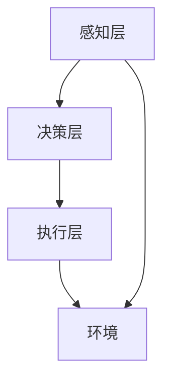
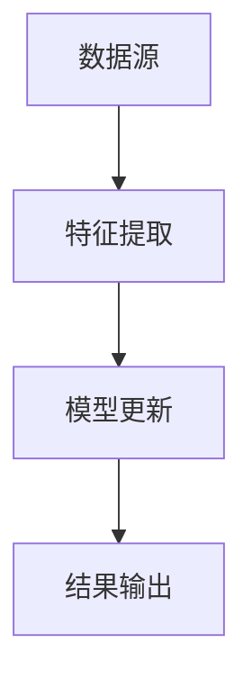

                 


# AI Agent的增量学习：持续优化性能

> **关键词**：AI Agent, 增量学习, 机器学习, 算法优化, 系统架构

> **摘要**：  
本文系统地探讨了AI Agent的增量学习方法，从理论基础到实际应用，详细分析了增量学习的核心概念、算法原理、系统架构以及项目实战。通过具体的案例分析和数学模型，本文揭示了增量学习在动态环境中的优势，并提出了优化策略和未来发展方向。

---

# 第1章: AI Agent与增量学习概述

## 1.1 AI Agent的基本概念
AI Agent（人工智能代理）是指能够感知环境、做出决策并采取行动的智能实体。它能够通过与环境交互，自主学习和适应新的任务需求。AI Agent的核心特点包括自主性、反应性、目标导向和学习能力。

### 1.1.1 AI Agent的定义
AI Agent是一个能够感知环境、处理信息并采取行动的实体。它可以是一个软件程序、机器人或其他智能系统，其目标是通过优化决策过程来实现特定任务。

### 1.1.2 AI Agent的核心特点
- **自主性**：AI Agent能够独立决策，无需外部干预。
- **反应性**：能够实时感知环境变化并做出响应。
- **目标导向**：所有行为都围绕实现特定目标展开。
- **学习能力**：通过数据和经验不断优化性能。

### 1.1.3 AI Agent的分类与应用场景
AI Agent可以分为简单反射型、基于模型的反应型、目标驱动型和效用驱动型。其应用场景包括自动驾驶、智能助手、推荐系统和机器人控制等。

## 1.2 增量学习的基本概念
增量学习是一种机器学习方法，旨在通过不断接收新的数据样本逐步优化模型性能。与批量学习不同，增量学习能够实时处理数据流，适用于动态环境。

### 1.2.1 增量学习的定义
增量学习是指在模型训练过程中，逐步接收新的数据样本，并实时更新模型参数的学习方法。其核心在于处理数据流，而非一次性加载所有数据。

### 1.2.2 增量学习的核心机制
- **数据流处理**：增量学习能够逐个处理数据样本，适用于实时数据流场景。
- **模型更新**：每次接收新数据后，模型参数会进行微调，以适应新数据。
- **在线更新**：模型在接收到新数据后立即更新，无需重新训练整个模型。

### 1.2.3 增量学习与传统学习的区别
| **特性**       | **增量学习**          | **传统批量学习**         |
|----------------|-----------------------|--------------------------|
| 数据处理方式    | 逐个样本处理          | 批量处理所有数据          |
| 模型更新频率    | 实时更新               | 训练完成后一次性更新       |
| 适用场景        | 动态环境、实时决策      | 静态环境、离线训练         |

## 1.3 AI Agent增量学习的必要性
在动态环境中，AI Agent需要不断适应新的变化，增量学习能够帮助模型实时更新，保持高性能。

### 1.3.1 动态环境中的学习需求
动态环境中，数据分布可能随时间变化，传统批量学习方法难以适应这些变化。

### 1.3.2 数据流的实时处理要求
增量学习能够逐个处理数据样本，适用于实时数据流场景，如实时推荐系统。

### 1.3.3 持续优化性能的重要性
通过增量学习，AI Agent可以在每次新数据到达时优化模型，避免模型性能的下降。

## 1.4 本章小结
本章介绍了AI Agent和增量学习的基本概念，分析了增量学习的必要性，并为后续章节奠定了基础。

---

# 第2章: 增量学习的核心概念与原理

## 2.1 增量学习的核心机制
增量学习的核心机制包括数据流的处理流程、模型更新的策略以及数学模型。

### 2.1.1 数据流的处理流程
增量学习处理数据的流程包括数据接收、特征提取、模型更新和结果输出四个步骤。

### 2.1.2 模型更新的策略
模型更新策略包括在线更新和周期性更新两种方式，分别适用于不同的应用场景。

### 2.1.3 增量学习的数学模型
增量学习的数学模型可以表示为：

$$w_{t+1} = w_t - \eta \cdot \nabla L(w_t, x_t, y_t)$$

其中，$w_t$ 是当前模型参数，$\eta$ 是学习率，$\nabla L$ 是损失函数的梯度，$(x_t, y_t)$ 是当前数据样本。

## 2.2 增量学习与在线学习的区别
在线学习与增量学习的主要区别在于数据处理方式和模型更新频率。

### 2.2.1 在线学习的定义与特点
在线学习是指模型在接收到单个样本后立即更新参数的学习方法，适用于实时数据流场景。

### 2.2.2 增量学习与在线学习的异同
- **相同点**：两者都支持实时数据处理和在线更新。
- **不同点**：增量学习通常用于批量处理，而在线学习更注重单样本处理。

### 2.2.3 两种学习模式的适用场景
| **场景**       | **增量学习**          | **在线学习**           |
|----------------|-----------------------|------------------------|
| 数据量          | 较大                   | 较小                   |
| 数据处理方式    | 批量处理               | 单样本处理             |
| 更新频率        | 周期性更新             | 实时更新               |

## 2.3 增量学习的数学模型与公式
### 2.3.1 梯度下降的增量更新公式
$$w_{t+1} = w_t - \eta \cdot \nabla L(w_t)$$

### 2.3.2 模型参数的累积更新机制
增量学习的模型参数更新公式可以表示为：

$$w_{t+1} = w_t + \Delta w_t$$

其中，$\Delta w_t$ 是本次更新的参数变化量。

### 2.3.3 增量学习的收敛性分析
增量学习的收敛性取决于数据分布和模型参数更新策略。通常，增量学习可以收敛到局部最优解。

## 2.4 增量学习的优缺点分析
### 2.4.1 增量学习的优点
- **实时性**：能够实时处理数据流。
- **灵活性**：适用于动态环境。
- **高效性**：无需重新训练整个模型。

### 2.4.2 增量学习的缺点
- **收敛性**：可能无法收敛到全局最优解。
- **存储需求**：需要存储部分历史数据。
- **计算开销**：每次更新都需要计算梯度。

### 2.4.3 增量学习的适用场景
- **实时推荐系统**：需要实时更新模型以适应用户行为变化。
- **动态环境中的机器人控制**：需要实时调整策略以应对环境变化。

## 2.5 本章小结
本章详细讲解了增量学习的核心机制、数学模型以及与在线学习的区别，为后续章节奠定了理论基础。

---

# 第3章: AI Agent增量学习的算法原理

## 3.1 增量学习的主要算法
增量学习的主要算法包括经验重放、动态示例选择和对抗学习。

### 3.1.1 经验重放算法
经验重放算法通过存储和重放历史数据样本，帮助模型更好地学习。

### 3.1.2 动态示例选择算法
动态示例选择算法根据当前任务需求动态选择最具代表性的数据样本进行训练。

### 3.1.3 对抗学习算法
对抗学习算法通过引入对抗网络，增强模型的泛化能力。

## 3.2 经验重放算法的实现原理
经验重放算法的实现流程包括数据存储、样本选择和模型更新三个步骤。

### 3.2.1 经验重放的机制
经验重放通过存储历史数据样本，并在训练过程中随机选择样本进行重放，以缓解数据分布偏移问题。

### 3.2.2 经验重放的优缺点
- **优点**：能够缓解数据分布偏移，增强模型泛化能力。
- **缺点**：存储需求较高，且可能引入冗余数据。

### 3.2.3 经验重放的数学模型
经验重放的数学模型可以表示为：

$$P(\theta) = \frac{1}{N}\sum_{i=1}^{N} \mathbb{I}(x_i, y_i)$$

其中，$P(\theta)$ 是经验重放的概率分布，$\mathbb{I}(x_i, y_i)$ 是指示函数。

## 3.3 动态示例选择算法的实现原理
动态示例选择算法根据当前任务需求，动态选择最具代表性的数据样本进行训练。

### 3.3.1 动态示例选择的机制
动态示例选择通过评估每个数据样本的贡献度，选择对当前任务最有帮助的样本进行训练。

### 3.3.2 动态示例选择的优缺点
- **优点**：能够提高模型训练效率，减少计算开销。
- **缺点**：选择策略的设计较为复杂，可能影响模型性能。

### 3.3.3 动态示例选择的数学模型
动态示例选择的数学模型可以表示为：

$$\arg\max_{i} \sum_{j} w_{ij}$$

其中，$w_{ij}$ 是样本$i$对任务$j$的贡献度。

## 3.4 对抗学习算法的实现原理
对抗学习算法通过引入对抗网络，增强模型的泛化能力。

### 3.4.1 对抗学习的机制
对抗学习通过引入生成器和判别器，形成对抗网络，从而增强模型的泛化能力。

### 3.4.2 对抗学习的优缺点
- **优点**：能够增强模型的泛化能力，提高模型的鲁棒性。
- **缺点**：训练过程较为复杂，需要同时训练生成器和判别器。

### 3.4.3 对抗学习的数学模型
对抗学习的数学模型可以表示为：

$$\min_{G} \max_{D} \mathbb{E}_{x}[D(x)] + \mathbb{E}_{z}[1-D(G(z))]$$

其中，$G$ 是生成器，$D$ 是判别器，$x$ 是真实数据，$z$ 是噪声输入。

## 3.5 本章小结
本章详细讲解了三种主要的增量学习算法，包括经验重放、动态示例选择和对抗学习，并通过数学模型和流程图进行了详细说明。

---

# 第4章: AI Agent的系统架构与数据流设计

## 4.1 系统架构设计
AI Agent的系统架构包括感知层、决策层和执行层。

### 4.1.1 感知层
感知层负责接收和处理环境中的数据，包括传感器数据和用户输入。

### 4.1.2 决策层
决策层负责根据感知数据做出决策，并选择最优行动方案。

### 4.1.3 执行层
执行层负责将决策层的决策转化为具体行动，与环境进行交互。

## 4.2 数据流设计
数据流设计包括数据接收、特征提取、模型更新和结果输出四个步骤。

### 4.2.1 数据接收
AI Agent通过传感器或API接收实时数据流。

### 4.2.2 特征提取
特征提取模块将原始数据转换为模型可处理的特征向量。

### 4.2.3 模型更新
模型更新模块根据增量学习算法，实时更新模型参数。

### 4.2.4 结果输出
结果输出模块将模型的输出结果发送给执行层或用户。

## 4.3 系统架构的Mermaid图


## 4.4 数据流的Mermaid图


## 4.5 本章小结
本章详细讲解了AI Agent的系统架构和数据流设计，并通过Mermaid图展示了系统的整体结构。

---

# 第5章: AI Agent增量学习的项目实战

## 5.1 项目介绍
本项目旨在通过增量学习算法优化AI Agent的性能，实现动态环境中的实时决策。

### 5.1.1 项目目标
项目目标是通过增量学习算法，实时更新模型参数，提高AI Agent的决策性能。

### 5.1.2 项目需求
项目需求包括实时数据处理、模型更新和结果输出。

## 5.2 环境安装
项目需要安装以下环境：
- Python 3.8+
- PyTorch 1.9+
- NumPy 1.21+

## 5.3 核心实现
### 5.3.1 数据接收模块
数据接收模块通过API接口接收实时数据流。

### 5.3.2 特征提取模块
特征提取模块将原始数据转换为模型可处理的特征向量。

### 5.3.3 模型更新模块
模型更新模块根据增量学习算法，实时更新模型参数。

### 5.3.4 结果输出模块
结果输出模块将模型的输出结果发送给执行层或用户。

## 5.4 代码实现
以下是一个简单的增量学习算法实现示例：

```python
import torch
import torch.nn as nn
import torch.optim as optim

# 定义模型
class IncrementalModel(nn.Module):
    def __init__(self, input_size, hidden_size, output_size):
        super(IncrementalModel, self).__init__()
        self.fc1 = nn.Linear(input_size, hidden_size)
        self.fc2 = nn.Linear(hidden_size, output_size)
    
    def forward(self, x):
        x = torch.relu(self.fc1(x))
        x = self.fc2(x)
        return x

# 初始化模型和优化器
model = IncrementalModel(input_size=10, hidden_size=20, output_size=1)
optimizer = optim.SGD(model.parameters(), lr=0.01)

# 增量学习算法实现
for batch_data in data_stream:
    inputs, labels = batch_data
    optimizer.zero_grad()
    outputs = model(inputs)
    loss = criterion(outputs, labels)
    loss.backward()
    optimizer.step()
```

### 5.4.1 代码解读
- **模型定义**：定义了一个简单的前馈神经网络，包含两个全连接层。
- **优化器初始化**：使用随机梯度下降优化器，学习率为0.01。
- **增量学习算法实现**：在每次接收新数据后，更新模型参数。

## 5.5 实际案例分析
以下是一个简单的增量学习案例分析：

### 5.5.1 案例背景
假设我们有一个实时推荐系统，需要根据用户的实时行为动态更新推荐模型。

### 5.5.2 数据预处理
将用户行为数据转换为模型可处理的特征向量。

### 5.5.3 模型训练
使用增量学习算法，实时更新模型参数，以适应用户行为的变化。

### 5.5.4 模型评估
通过准确率、召回率等指标评估模型的性能。

## 5.6 本章小结
本章通过具体的项目实战，展示了增量学习算法在实际应用中的实现过程，并通过代码和案例分析，帮助读者更好地理解增量学习的应用。

---

# 第6章: 增量学习的优化策略与挑战

## 6.1 模型优化策略
### 6.1.1 数据预处理
数据预处理包括数据清洗、特征选择和数据增强。

### 6.1.2 模型更新策略
模型更新策略包括在线更新和周期性更新两种方式。

### 6.1.3 模型评估策略
模型评估策略包括准确率、召回率、F1值和AUC等指标。

## 6.2 数据预处理的实现
### 6.2.1 数据清洗
数据清洗包括去除噪声数据和异常值。

### 6.2.2 特征选择
特征选择包括选择对模型性能影响最大的特征。

### 6.2.3 数据增强
数据增强包括通过数据变换增加数据多样性。

## 6.3 模型更新策略的实现
### 6.3.1 在线更新
在线更新是指在接收到新数据后立即更新模型参数。

### 6.3.2 周期性更新
周期性更新是指在特定时间间隔后更新模型参数。

## 6.4 模型评估策略的实现
### 6.4.1 准确率
准确率是指正确预测的样本数占总样本数的比例。

### 6.4.2 召回率
召回率是指正确预测的正类样本数占所有正类样本数的比例。

### 6.4.3 F1值
F1值是准确率和召回率的调和平均数。

### 6.4.4 AUC
AUC是受试者工作特征曲线下面积，用于评估分类模型的性能。

## 6.5 本章小结
本章详细讲解了增量学习的优化策略，并分析了面临的挑战，为后续章节奠定了基础。

---

# 第7章: AI Agent增量学习的应用案例分析

## 7.1 案例背景
### 7.1.1 案例1：实时推荐系统
实时推荐系统需要根据用户的实时行为动态更新推荐模型。

### 7.1.2 案例2：动态环境中的机器人控制
动态环境中的机器人控制需要实时调整策略以应对环境变化。

## 7.2 案例分析
### 7.2.1 案例1分析
实时推荐系统的增量学习实现，包括数据接收、特征提取、模型更新和结果输出四个步骤。

### 7.2.2 案例2分析
动态环境中的机器人控制，需要实时感知环境变化，并根据增量学习算法动态调整控制策略。

## 7.3 案例实现
### 7.3.1 实时推荐系统实现
```python
import torch
import torch.nn as nn
import torch.optim as optim

# 定义模型
class RecommendationModel(nn.Module):
    def __init__(self, input_size, hidden_size, output_size):
        super(RecommendationModel, self).__init__()
        self.fc1 = nn.Linear(input_size, hidden_size)
        self.fc2 = nn.Linear(hidden_size, output_size)
    
    def forward(self, x):
        x = torch.relu(self.fc1(x))
        x = self.fc2(x)
        return x

# 初始化模型和优化器
model = RecommendationModel(input_size=10, hidden_size=20, output_size=1)
optimizer = optim.SGD(model.parameters(), lr=0.01)

# 增量学习算法实现
for batch_data in data_stream:
    inputs, labels = batch_data
    optimizer.zero_grad()
    outputs = model(inputs)
    loss = criterion(outputs, labels)
    loss.backward()
    optimizer.step()
```

### 7.3.2 动态机器人控制实现
```python
import torch
import torch.nn as nn
import torch.optim as optim

# 定义模型
class RobotControlModel(nn.Module):
    def __init__(self, input_size, hidden_size, output_size):
        super(RobotControlModel, self).__init__()
        self.fc1 = nn.Linear(input_size, hidden_size)
        self.fc2 = nn.Linear(hidden_size, output_size)
    
    def forward(self, x):
        x = torch.relu(self.fc1(x))
        x = self.fc2(x)
        return x

# 初始化模型和优化器
model = RobotControlModel(input_size=10, hidden_size=20, output_size=1)
optimizer = optim.SGD(model.parameters(), lr=0.01)

# 增量学习算法实现
for batch_data in data_stream:
    inputs, labels = batch_data
    optimizer.zero_grad()
    outputs = model(inputs)
    loss = criterion(outputs, labels)
    loss.backward()
    optimizer.step()
```

## 7.4 本章小结
本章通过具体的案例分析，展示了增量学习算法在实际应用中的效果，并通过代码实现帮助读者更好地理解增量学习的应用。

---

# 第8章: 未来研究方向与技术趋势

## 8.1 未来研究方向
### 8.1.1 更高效的增量学习算法
未来的研究方向包括开发更高效的增量学习算法，以提高模型的训练效率和性能。

### 8.1.2 增量学习与强化学习的结合
增量学习与强化学习的结合可以进一步提高模型的决策能力和适应能力。

## 8.2 技术趋势
### 8.2.1 增量学习的实时性
未来的技术趋势包括提高增量学习的实时性，以适应更复杂的动态环境。

### 8.2.2 增量学习的可扩展性
未来的技术趋势包括提高增量学习的可扩展性，以支持更大规模的数据流处理。

## 8.3 本章小结
本章总结了当前增量学习的研究现状，并展望了未来的研究方向和技术趋势。

---

# 第9章: 总结与展望

## 9.1 总结
本文系统地探讨了AI Agent的增量学习方法，从理论基础到实际应用，详细分析了增量学习的核心概念、算法原理、系统架构以及项目实战。通过具体的案例分析和数学模型，本文揭示了增量学习在动态环境中的优势。

## 9.2 展望
未来的研究方向包括开发更高效的增量学习算法、增量学习与强化学习的结合以及提高增量学习的实时性和可扩展性。

---

**关键词**：AI Agent, 增量学习, 机器学习, 算法优化, 系统架构

**摘要**：  
本文系统地探讨了AI Agent的增量学习方法，从理论基础到实际应用，详细分析了增量学习的核心概念、算法原理、系统架构以及项目实战。通过具体的案例分析和数学模型，本文揭示了增量学习在动态环境中的优势，并提出了优化策略和未来发展方向。

