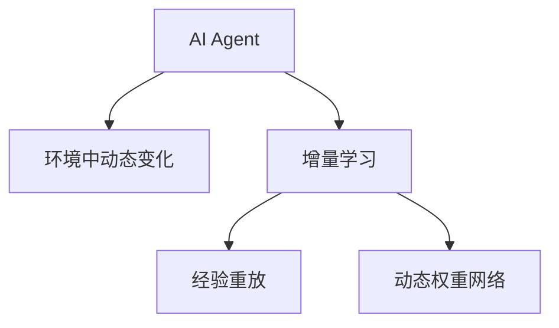
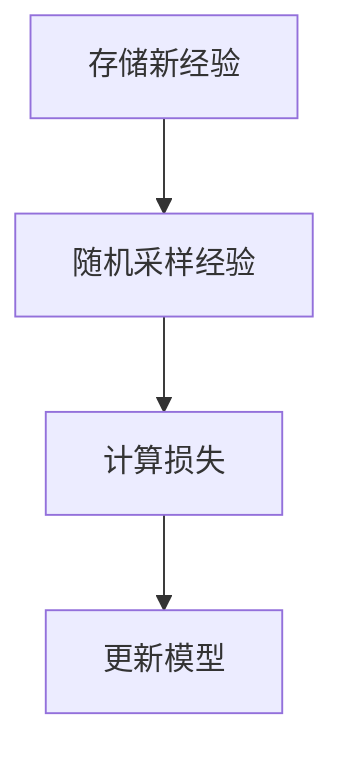

                 

# AI Agent的增量学习：适应动态变化的环境

## 关键词：AI Agent, 增量学习, 动态环境, 在线学习, 适应性算法

## 摘要：  
AI Agent在动态环境中需要不断适应新的变化，增量学习作为一种有效的学习方式，能够帮助AI Agent在实时环境中不断优化和调整策略。本文从AI Agent的基本概念出发，详细分析了增量学习的核心算法和系统架构设计，并通过实际案例展示了增量学习在动态环境中的应用效果。文章最后提出了增量学习的实践建议和未来研究方向。

---

# 第1章: AI Agent与增量学习概述

## 1.1 AI Agent的基本概念

### 1.1.1 AI Agent的定义与特点  
AI Agent（人工智能代理）是指在计算机系统中能够感知环境并采取行动以实现目标的实体。AI Agent具有以下特点：  
- **自主性**：能够独立决策，无需外部干预。  
- **反应性**：能够实时感知环境并做出反应。  
- **目标导向性**：所有行为均以实现特定目标为导向。  

### 1.1.2 增量学习的基本概念  
增量学习（Incremental Learning）是一种机器学习方法，旨在通过逐步接收新数据或新经验来更新模型，而非一次性训练整个数据集。增量学习的核心在于模型能够“在线”适应新变化，而非仅依赖于离线训练的数据。  

### 1.1.3 动态环境中的AI Agent  
动态环境是指环境状态、规则或目标会随着时间推移而发生变化的环境。在这种环境中，AI Agent需要不断调整其策略以应对新的挑战。增量学习是动态环境中AI Agent的核心能力之一，因为它允许模型在实时运行中不断优化。

---

## 1.2 增量学习的背景与问题背景  

### 1.2.1 动态环境的定义与特征  
动态环境具有以下特征：  
- **不确定性**：环境的变化往往是不可预测的。  
- **实时性**：变化可能即时发生，要求模型能够快速响应。  
- **多样性**：环境中的元素可能多种多样，导致模型需要具备广泛适应性。  

### 1.2.2 增量学习的核心问题  
增量学习的核心问题包括：  
1. 如何高效地更新模型以适应新数据？  
2. 如何在有限的计算资源下实现在线学习？  
3. 如何处理数据稀疏性或噪声干扰？  

### 1.2.3 增量学习的边界与外延  
增量学习的边界在于其“在线”特性，即模型必须在数据流中实时更新。其外延则包括了在线学习、经验重放、动态权重网络等技术。

---

## 1.3 增量学习的核心概念与联系  

### 1.3.1 核心概念原理  
增量学习的核心概念包括：  
- **经验重放**：通过存储和复用历史经验来优化模型。  
- **动态权重网络**：通过动态调整模型权重来适应新数据。  

### 1.3.2 核心概念属性特征对比表  
以下是增量学习相关概念的属性对比：  

| 概念       | 动态性 | 在线性 | 适应性 |
|------------|--------|--------|--------|
| 经验重放    | 高     | 高     | 高     |
| 动态权重网络 | 高     | 中     | 高     |

### 1.3.3 ER实体关系图  
以下是AI Agent与增量学习的核心关系图：  

---

## 1.4 本章小结  

本章介绍了AI Agent的基本概念和增量学习的核心思想，分析了动态环境的特征及其对AI Agent的挑战。通过对比和图示，明确了增量学习的核心概念及其在动态环境中的重要性。下一章将深入探讨增量学习的核心算法及其数学模型。

---

# 第2章: 增量学习的核心算法原理  

## 2.1 经验重放算法  

### 2.1.1 经验重放的基本原理  
经验重放（Experience Replay）是一种增量学习技术，通过存储和复用历史经验来优化模型。经验重放的核心思想是将过去的经验存储在记忆库中，并在后续学习过程中随机抽取这些经验进行训练。

### 2.1.2 经验重放的数学模型  
经验重放的数学模型可以表示为：  
$$L = -\sum_{i=1}^{n} \log P(y_i|x_i)$$  
其中，$x_i$ 表示输入，$y_i$ 表示目标输出，$P$ 表示概率分布。经验重放通过随机采样的方式更新模型参数，以减少梯度消失问题。

### 2.1.3 经验重放的流程图  
以下是经验重放的流程图：  

---

## 2.2 动态权重网络  

### 2.2.1 动态权重网络的原理  
动态权重网络（Dynamic Weight Networks）是一种通过动态调整权重来适应新数据的增量学习方法。其核心思想是将模型的权重表示为动态参数，这些参数可以在每次输入时调整以适应新数据。

### 2.2.2 动态权重网络的数学模型  
动态权重网络的数学模型可以表示为：  
$$w(t+1) = w(t) + \alpha \cdot \nabla L$$  
其中，$w(t)$ 表示时间$t$的权重，$\alpha$ 表示学习率，$\nabla L$ 表示损失函数的梯度。通过动态调整权重，模型能够逐步适应新数据的变化。

---

## 2.3 增量学习算法的比较与选择  

### 2.3.1 算法选择的依据  
在选择增量学习算法时，需要考虑以下因素：  
1. 环境的动态性：动态性越高，算法需要更强的实时性。  
2. 数据的稀疏性：稀疏性越高，算法需要更高效的记忆机制。  
3. 计算资源：算法的计算复杂度必须在允许范围内。  

### 2.3.2 常见算法的优缺点对比  
以下是常见增量学习算法的优缺点对比：  

| 算法       | 优点                     | 缺点                     |
|------------|--------------------------|--------------------------|
| 经验重放    | 能够复用历史经验           | 记忆库容量有限           |
| 动态权重网络 | 能够快速调整权重         | �易受噪声干扰            |
| 在线强化学习 | 能够在动态环境中优化策略   | 训练时间较长             |

---

## 2.4 本章小结  

本章详细介绍了增量学习的核心算法，包括经验重放和动态权重网络。通过数学模型和流程图的分析，明确了这些算法的工作原理及其适用场景。下一章将从系统设计的角度，探讨如何将这些算法应用于实际的AI Agent系统中。

--- 

接下来将依次展开系统分析与架构设计、项目实战、最佳实践等部分，确保文章结构完整，内容详实。

