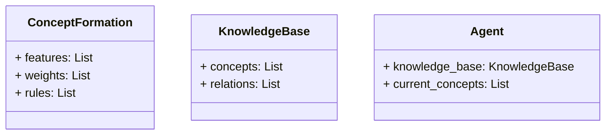

                 


# AI Agent的增量式概念形成与知识重构

> 关键词：AI Agent, 增量式概念形成, 知识重构, 概念动态更新, 知识图谱, 概念形成算法, 系统架构设计

> 摘要：AI Agent通过增量式概念形成和知识重构技术，能够逐步构建和更新知识体系，适应动态变化的环境。本文将详细探讨这一过程，从核心概念、算法原理到系统设计和项目实战，为读者提供全面的指导。

---

# 第1章 AI Agent与增量式概念形成概述

## 1.1 AI Agent的基本概念
### 1.1.1 AI Agent的定义与特点
- **定义**：AI Agent是具有感知、决策和行动能力的智能体，能够与环境交互。
- **特点**：
  - 自主性
  - 反应性
  - 目标导向
  - 学习能力

### 1.1.2 增量式学习的背景与意义
- **背景**：数据流式环境中的动态知识更新需求。
- **意义**：提高AI Agent的适应性和灵活性。

### 1.1.3 知识重构的核心思想
- **知识重构**：动态调整知识表示，适应新信息。
- **核心思想**：通过增量式学习，优化知识结构。

## 1.2 增量式概念形成的基本原理
### 1.2.1 概念形成的过程
- **初始概念**：基于少量数据形成初步概念。
- **动态更新**：随新数据调整概念边界。

### 1.2.2 概念的动态更新机制
- **触发条件**：新数据与现有概念不匹配。
- **更新策略**：局部调整或全局重构。

### 1.2.3 知识重构的必要性
- **适应性**：应对环境变化。
- **准确性**：提高知识表示的精确性。

## 1.3 本书的研究内容与结构
### 1.3.1 本书的核心问题
- AI Agent如何通过增量式概念形成和知识重构适应动态环境。

### 1.3.2 本书的主要内容
- 理论基础、算法实现、系统设计、项目实战。

### 1.3.3 本书的结构安排
- 分章节深入探讨各个主题，从基础到应用。

---

# 第2章 增量式概念形成的核心概念与联系

## 2.1 增量式概念形成的核心概念
### 2.1.1 概念形成的基本要素
- **实例**：具体数据点。
- **特征**：描述实例的属性。

### 2.1.2 概念的动态更新机制
- **规则**：定义概念的边界。
- **权重**：调整特征的重要性。

### 2.1.3 知识图谱的构建与更新
- **图谱结构**：节点与边的表示。
- **动态更新**：插入、删除和修改操作。

## 2.2 增量式概念形成的核心概念对比
### 2.2.1 概念属性对比分析
- **表格对比**：概念形成的关键属性及其特征。

### 2.2.2 概念间的关系分析
- **表格对比**：概念之间的包含、并列和从属关系。

### 2.2.3 概念形成过程中的关键因素
- **表格对比**：影响概念形成的主要因素，如数据量、特征数量。

## 2.3 增量式概念形成的ER实体关系图
```mermaid
er
actor: AI Agent
action: 概念形成
knowledge_base: 知识库
```

---

# 第3章 增量式概念形成的算法原理

## 3.1 增量式概念形成的算法概述
### 3.1.1 增量式学习的基本算法
- **算法流程**：数据流处理、概念更新。

### 3.1.2 增量式概念形成的定义与特点
- **定义**：基于新数据逐步更新概念。
- **特点**：实时性、高效性。

## 3.2 增量式概念形成的算法实现
### 3.2.1 基于特征加权的增量式概念形成
- **算法流程**：初始概念、特征权重调整、概念更新。

### 3.2.2 基于聚类的增量式概念形成
- **算法流程**：动态聚类、概念调整。

## 3.3 增量式概念形成算法的数学模型
### 3.3.1 基于概率分布的模型
$$P(c_i | x) = \frac{P(x | c_i) P(c_i)}{P(x)}$$

### 3.3.2 基于损失函数的优化模型
$$L = \sum_{i=1}^{n} (y_i - \hat{y_i})^2$$

---

# 第4章 增量式概念形成的系统分析与架构设计

## 4.1 系统功能设计
### 4.1.1 领域模型设计


### 4.1.2 功能模块
- **数据处理模块**：接收和预处理数据。
- **概念更新模块**：根据数据更新概念。
- **知识重构模块**：优化知识结构。

## 4.2 系统架构设计
### 4.2.1 系统架构图


## 4.3 系统接口设计
### 4.3.1 输入接口
- **数据输入**：接收新数据流。
- **查询接口**：检索现有概念。

### 4.3.2 输出接口
- **概念输出**：返回更新后的概念。
- **知识图谱更新**：输出修改后的知识结构。

---

# 第5章 增量式概念形成的项目实战

## 5.1 项目环境安装
### 5.1.1 环境配置
- Python 3.8+
- NumPy、Scikit-learn、Mermaid等库。

## 5.2 系统核心实现源代码
### 5.2.1 增量式概念形成算法实现
```python
def incremental_concept_formation(data_stream):
    current_concepts = initialize_concepts()
    for data in data_stream:
        update_concepts(current_concepts, data)
        update_weights(current_concepts, data)
    return current_concepts
```

### 5.2.2 知识重构实现
```python
def knowledge_reconstruction(concepts):
    knowledge_base = build_knowledge_base(concepts)
    optimize_knowledge_base(knowledge_base)
    return knowledge_base
```

## 5.3 代码应用解读与分析
### 5.3.1 代码结构分析
- **初始化概念**：基于初始数据构建初步概念。
- **数据处理**：逐条处理数据流，更新概念。
- **知识重构**：优化知识结构，提高准确性。

## 5.4 实际案例分析和详细讲解剖析
### 5.4.1 案例介绍
- 数据流处理：分类任务中的动态调整。

### 5.4.2 案例实现
```python
# 示例代码
from sklearn import datasets
import numpy as np

data_stream = datasets.load_iris().data
current_concepts = [{'class': 'Iris-setosa', 'features': [5.1, 3.5, 1.4, 0.2]}]

for data in data_stream:
    update_concepts(current_concepts, data)
    update_weights(current_concepts, data)
```

### 5.4.3 案例分析
- **初始概念**：基于少量数据形成。
- **动态更新**：随新数据调整权重和边界。
- **知识重构**：优化后的概念更准确。

## 5.5 项目小结
- **代码实现总结**：增量式概念形成的实现步骤。
- **案例分析总结**：动态调整带来的性能提升。

---

# 第6章 总结与展望

## 6.1 本书总结
- **核心内容回顾**：从理论到实践的详细探讨。
- **主要收获**：理解增量式概念形成的关键技术和实现方法。

## 6.2 研究展望
- **当前研究的局限性**：算法的实时性和效率问题。
- **未来方向**：结合强化学习、分布式系统等技术，提升性能和可扩展性。

## 6.3 最佳实践 tips
- **实践建议**：在实际应用中，结合具体场景选择合适的算法。
- **注意事项**：确保数据质量和多样性，避免过拟合。

## 6.4 拓展阅读
- 推荐相关书籍和论文，供进一步研究参考。

---

通过以上目录结构，我们可以系统地探讨AI Agent的增量式概念形成与知识重构的各个方面，从理论到实践，为读者提供全面而深入的指导。

