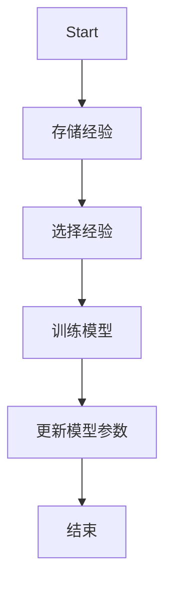
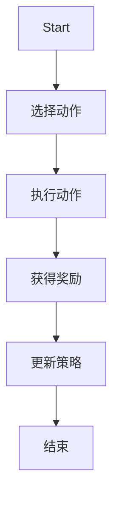
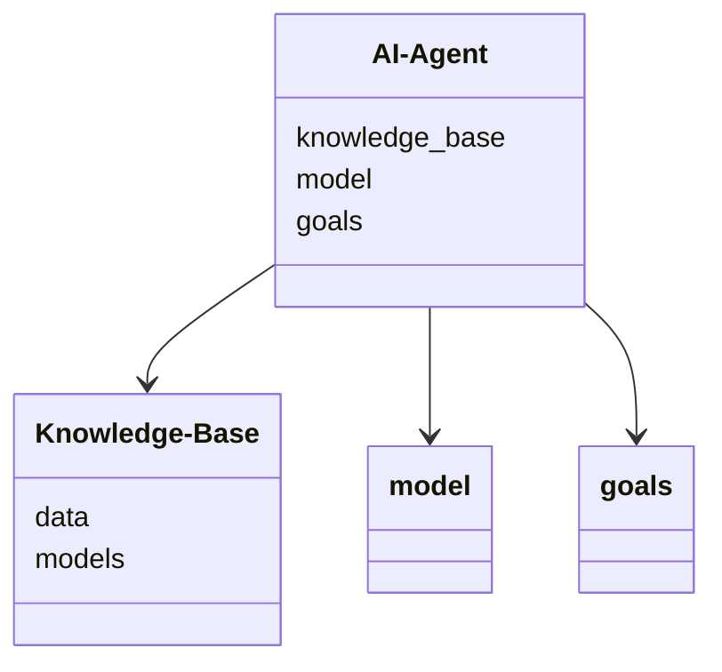

                 


# AI Agent的增量式终身学习框架

> 关键词：AI Agent，增量式学习，终身学习，机器学习，深度学习

> 摘要：本文系统地探讨了AI Agent在动态复杂环境下的增量式终身学习框架。从AI Agent的基本概念出发，分析了增量式终身学习的背景、核心概念、算法原理、系统架构、项目实战及最佳实践。通过理论分析与实践结合，全面阐述了如何构建高效、可扩展的AI Agent增量式终身学习系统。

---

## 第一部分: AI Agent的增量式终身学习框架概述

### 第1章: AI Agent的基本概念

#### 1.1 AI Agent的定义与特点
AI Agent（人工智能代理）是一种能够感知环境、自主决策并执行任务的智能实体。与传统的被动执行任务的程序不同，AI Agent具备以下核心特点：

- **自主性**：能够在没有外部干预的情况下独立运作。
- **反应性**：能够实时感知环境并做出响应。
- **目标导向**：基于明确的目标或任务进行决策。
- **学习能力**：通过与环境交互不断优化自身行为。

#### 1.2 AI Agent的核心任务
AI Agent的核心任务包括：
1. **感知环境**：通过传感器或数据输入获取环境信息。
2. **决策与规划**：基于当前状态和目标，制定行动计划。
3. **执行动作**：根据决策结果执行实际操作。
4. **学习优化**：通过经验积累优化自身行为。

#### 1.3 AI Agent与传统AI的区别
- **被动性**：传统AI程序通常需要明确的输入和指令，而AI Agent能够主动探索环境并做出决策。
- **动态性**：AI Agent能够适应动态变化的环境，而传统AI程序通常在静态环境中运行。
- **自主性**：AI Agent具备更强的自主性，能够独立完成任务。

---

### 第2章: 增量式终身学习框架的背景与问题描述

#### 2.1 问题背景
在实际应用中，AI Agent面临着以下挑战：
- **动态环境**：环境条件不断变化，要求AI Agent能够快速适应。
- **知识更新**：AI Agent需要不断更新知识库以应对新任务。
- **任务扩展**：随着任务复杂度的增加，AI Agent需要具备扩展能力。

#### 2.2 问题描述
增量式终身学习框架的目标是解决以下问题：
- **数据稀疏性**：在增量学习中，数据通常是稀疏的，难以直接应用传统机器学习方法。
- **知识表示**：如何有效地表示和更新AI Agent的知识库。
- **算法效率**：增量式学习算法需要高效地处理实时数据。

#### 2.3 边界与外延
- **边界条件**：增量式学习仅处理新增数据，不涉及已有数据的重新训练。
- **外延范围**：终身学习框架不仅适用于增量学习，还可扩展至其他学习范式。

---

### 第3章: 核心概念与联系

#### 3.1 核心概念原理
- **知识表示**：AI Agent通过符号逻辑或神经网络表示知识。
- **增量式学习**：通过处理新增数据逐步优化模型。
- **终身学习框架**：构建一个可持续学习和适应的系统架构。

#### 3.2 核心概念属性对比表
| 概念         | 特性                     |
|--------------|--------------------------|
| AI Agent     | 自主性、反应性、目标导向 |
| 增量式学习   | 处理稀疏数据、实时更新   |
| 终身学习     | 持续优化、适应变化       |

#### 3.3 ER实体关系图
```mermaid
erd
  entity AI-Agent {
    id
    knowledge-base
    goals
    actions
  }
  entity Knowledge-Base {
    id
    data
    models
  }
  entity Goals {
    id
    target
    constraints
  }
  entity Actions {
    id
    type
    result
  }
  AI-Agent -- Knowledge-Base
  AI-Agent -- Goals
  AI-Agent -- Actions
```

---

## 第二部分: 算法原理与数学模型

### 第4章: 增量式学习算法原理

#### 4.1 经验重放
经验重放是一种常用的增量式学习方法，通过存储和重放历史经验来优化模型。



代码实现：
```python
class ExperienceReplay:
    def __init__(self, capacity):
        self.capacity = capacity
        self.memory = []
    
    def remember(self, state, action, reward, next_state):
        self.memory.append((state, action, reward, next_state))
    
    def replay(self, model, batch_size):
        if len(self.memory) >= batch_size:
            minibatch = random.sample(self.memory, batch_size)
            for state, action, reward, next_state in minibatch:
                target = reward + model.predict(next_state)[0]
                model.train(state, target)
```

---

#### 4.2 策略梯度
策略梯度是一种基于概率分布的增量式学习方法。



数学公式：
$$
\nabla \theta = \sum_{t=1}^T \nabla \log \pi_\theta(a_t|s_t) \cdot R_t
$$

代码实现：
```python
class PolicyGradient:
    def __init__(self, action_space):
        self.action_space = action_space
        self.model = Model()
    
    def choose_action(self, state):
        probs = self.model.predict(state)
        action = np.random.choice(self.action_space, p=probs)
        return action
    
    def update_policy(self, trajectory):
        total_reward = sum(trajectory.rewards)
        for state, action in trajectory.states_actions:
            prob = self.model.predict(state)[action]
            gradient = (prob / (1 - prob)) * total_reward
            self.model.train(state, gradient)
```

---

## 第三部分: 系统分析与架构设计

### 第5章: 系统架构设计

#### 5.1 问题场景
AI Agent需要在动态环境中完成复杂任务，要求系统具备以下功能：
- **数据采集**：实时采集环境数据。
- **模型训练**：在线更新模型参数。
- **决策执行**：基于最新模型做出决策。

#### 5.2 系统功能设计


---

## 第四部分: 项目实战

### 第6章: 项目实战

#### 6.1 环境安装
```bash
pip install numpy tensorflow
```

#### 6.2 核心代码实现
```python
class Agent:
    def __init__(self, model):
        self.model = model
        self.memory = []
    
    def perceive(self, environment):
        state = environment.get_state()
        return state
    
    def decide(self, state):
        action = self.model.predict(state)
        return action
    
    def learn(self):
        if len(self.memory) > 0:
            # 提取小批量数据
            minibatch = random.sample(self.memory, min(len(self.memory), 32))
            # 训练模型
            for state, action, reward in minibatch:
                target = reward + self.model.predict(next_state)
                self.model.train(state, target)
```

---

## 第五部分: 最佳实践

### 第7章: 最佳实践

#### 7.1 小结
AI Agent的增量式终身学习框架能够有效应对动态环境中的复杂任务，通过经验重放和策略梯度等方法实现高效学习。

#### 7.2 注意事项
- **数据质量**：确保数据的多样性和代表性。
- **模型选择**：根据任务需求选择合适的模型。
- **性能优化**：通过并行计算和优化算法提升效率。

#### 7.3 拓展阅读
- 建议阅读《Reinforcement Learning: Theory and Algorithms》和《Deep Learning》。

---

通过本文的系统介绍，读者可以全面理解AI Agent的增量式终身学习框架的设计原理、实现方法和应用场景。

