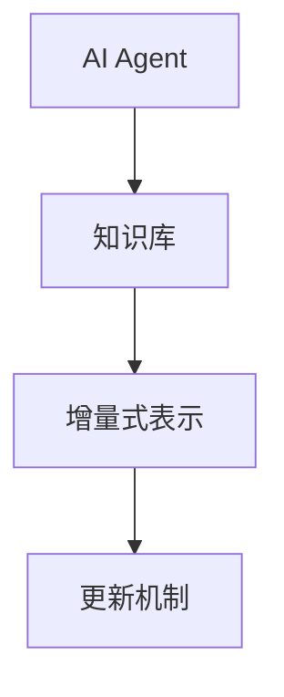
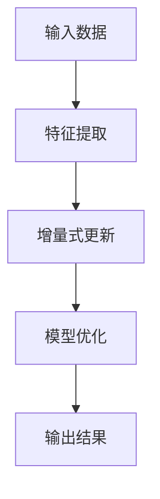
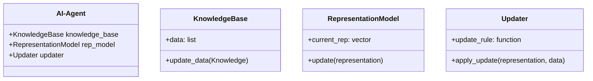
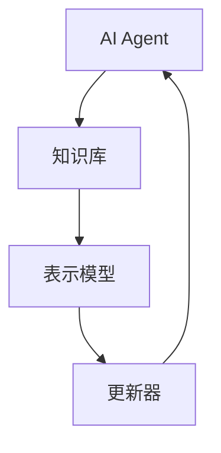
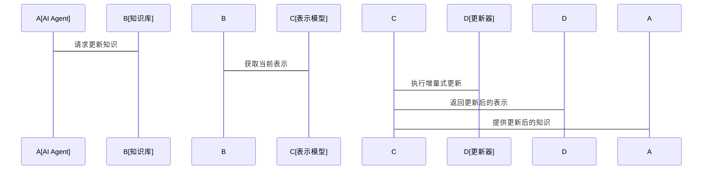

                 


# AI Agent的增量式表示学习与知识更新

## 关键词
AI Agent, 增量式学习, 知识表示, 知识更新, 动态环境

## 摘要
AI Agent的增量式表示学习与知识更新是人工智能领域的重要研究方向，旨在解决AI Agent在动态复杂环境中的自适应能力问题。本文从基础概念出发，详细阐述了增量式表示学习的核心原理、算法实现、系统架构设计以及实际项目中的应用。通过对比分析和实际案例，展示了如何通过增量式学习和知识更新提升AI Agent的性能和适应性。

---

## 第一部分: AI Agent的增量式表示学习与知识更新基础

### 第1章: 背景介绍与问题背景

#### 1.1 问题背景
- **AI Agent的基本概念**：AI Agent是一种能够感知环境、执行任务并做出决策的智能实体，广泛应用于自动驾驶、智能助手、机器人等领域。
- **增量式表示学习的定义**：增量式表示学习是指在已有知识的基础上，逐步更新和优化表示模型，以适应新数据或环境变化的学习方式。
- **知识更新的必要性**：在动态环境中，AI Agent需要实时更新知识以应对新任务和变化，否则会导致决策失误或性能下降。

#### 1.2 问题描述
- **AI Agent在动态环境中的挑战**：动态环境中的不确定性、多样性和实时性要求AI Agent具备快速学习和更新的能力。
- **知识表示的动态更新需求**：传统静态知识表示无法应对动态变化，需要增量式更新机制。
- **知识更新的边界与外延**：知识更新的边界在于如何平衡增量更新的效率和模型的稳定性，外延包括与在线学习、强化学习等其他学习范式的结合。

#### 1.3 问题解决
- **增量式学习的核心思想**：通过逐步优化表示模型，避免重新训练整个模型，提高效率。
- **知识表示更新的策略**：采用局部更新、渐进式遗忘和动态权重分配等策略，确保知识表示的准确性和适应性。
- **动态环境下的适应性优化**：通过反馈机制和在线评估，动态调整知识更新的频率和范围。

#### 1.4 问题外延
- **相关领域与概念对比**：将增量式表示学习与符号学习、在线学习等进行对比，分析其优缺点。
- **核心要素与组成结构**：增量式表示学习的核心要素包括表示模型、更新规则和评估机制。
- **与传统表示学习的区别**：传统表示学习是静态的，而增量式表示学习强调动态更新和适应性优化。

---

## 第二部分: AI Agent的核心概念与知识表示

### 第2章: AI Agent的核心概念与知识表示

#### 2.1 核心概念原理
- **AI Agent的定义与属性**：AI Agent具备感知、决策、执行和自适应能力，能够与环境交互并完成任务。
- **知识表示的层次结构**：知识表示可以分为符号表示、向量表示和图表示，每种表示方式都有其优缺点。
- **增量式学习的机制**：增量式学习通过逐步优化表示模型，实现知识的动态更新。

#### 2.2 核心概念对比
- **表示学习与符号学习的对比**：
  - 表示学习：通过神经网络等方法学习数据的低维表示，适用于非结构化数据。
  - 符号学习：基于逻辑推理和符号规则，适用于结构化数据。
- **增量式学习与在线学习的对比**：
  - 增量式学习：数据逐步到达，模型逐步更新。
  - 在线学习：实时处理数据流，模型持续更新。
- **知识表示的静态与动态特征**：
  - 静态表示：固定不变，适用于稳定环境。
  - 动态表示：实时更新，适用于动态环境。

#### 2.3 ER实体关系图


---

## 第三部分: 增量式表示学习的算法原理

### 第3章: 增量式表示学习的算法原理

#### 3.1 算法原理概述
- **对比生成式与判别式模型**：
  - 生成式模型（如GPT）：生成新数据，适用于文本生成任务。
  - 判别式模型（如BERT）：分类任务，适用于增量式更新。
- **知识更新的数学模型**：
  - 表示更新公式：$$v_{t+1} = v_t + \alpha (x_{t+1} - v_t)$$
  - 其中，$$v_t$$ 是当前表示，$$x_{t+1}$$ 是新数据，$$\alpha$$ 是学习率。
- **算法流程图**：


#### 3.2 算法实现
- **Python源代码实现**：
```python
class IncrementalLearner:
    def __init__(self, learning_rate=0.1):
        self.lr = learning_rate
        self.rep = None  # 当前表示

    def update(self, new_data):
        if self.rep is None:
            self.rep = new_data
        else:
            self.rep = self.rep + self.lr * (new_data - self.rep)
        return self.rep
```

#### 3.3 数学模型与公式
- **增量式更新公式**：
  $$v_{t+1} = v_t + \alpha (x_{t+1} - v_t)$$
  其中，$$\alpha$$ 是学习率，控制更新步长。
- **收敛条件**：
  当$$|v_{t+1} - v_t| < \epsilon$$时，算法收敛，$$\epsilon$$ 是预设阈值。

---

## 第四部分: 系统分析与架构设计方案

### 第4章: 系统分析与架构设计

#### 4.1 问题场景介绍
- **应用场景**：动态环境中的实时任务处理，如智能客服、推荐系统等。
- **系统目标**：实现AI Agent的增量式表示学习与知识更新，提升实时处理能力和适应性。

#### 4.2 系统功能设计
- **领域模型（类图）**：


#### 4.3 系统架构设计
- **架构图**：


#### 4.4 系统接口设计
- **输入接口**：接收新数据和更新指令。
- **输出接口**：提供更新后的表示和决策结果。

#### 4.5 系统交互
- **交互流程图**：


---

## 第五部分: 项目实战

### 第5章: 项目实战

#### 5.1 环境安装
- **Python环境**：Python 3.8+
- **依赖库**：numpy、scikit-learn、mermaid、matplotlib

#### 5.2 核心代码实现
- **增量式学习实现**：
```python
import numpy as np

class IncrementalLearner:
    def __init__(self, lr=0.1):
        self.lr = lr
        self.rep = None

    def fit(self, X):
        if self.rep is None:
            self.rep = X
        else:
            self.rep += self.lr * (X - self.rep)
        return self

    def predict(self, X):
        return self.rep
```

#### 5.3 代码应用解读
- **代码功能**：实现增量式表示更新，适用于动态数据流。
- **适用场景**：实时推荐系统、动态目标检测等。

#### 5.4 实际案例分析
- **案例分析**：在实时推荐系统中，使用增量式学习更新用户偏好，提升推荐精度。
- **具体步骤**：
  1. 初始化表示向量。
  2. 接收用户行为数据。
  3. 更新表示向量。
  4. 生成推荐结果。

#### 5.5 项目小结
- **项目总结**：通过增量式学习实现动态知识更新，提升系统实时性和适应性。
- **优化建议**：结合遗忘机制和强化学习，进一步优化更新效果。

---

## 第六部分: 总结与展望

### 第6章: 总结与展望

#### 6.1 核心内容回顾
- AI Agent的增量式表示学习与知识更新的核心思想是逐步优化表示模型，适应动态环境。
- 通过增量式学习和动态更新，提升系统的实时性和适应性。

#### 6.2 挑战与未来方向
- **挑战**：
  - 如何平衡更新效率与模型稳定性。
  - 如何处理高维数据和稀疏数据。
- **未来方向**：
  - 结合图神经网络，提升知识表示的语义能力。
  - 研究更高效的增量式更新算法。

#### 6.3 最佳实践 Tips
- **小结**：增量式学习适用于动态环境，但需注意更新策略的选择和优化。
- **注意事项**：
  - 定期评估模型性能，避免模型漂移。
  - 结合业务需求，选择合适的表示学习方法。
- **拓展阅读**：
  - 图神经网络与知识图谱。
  - 在线学习与增量式学习的结合。

---

通过以上详细内容的讲解，读者可以全面理解AI Agent的增量式表示学习与知识更新的核心思想、算法实现和实际应用。

