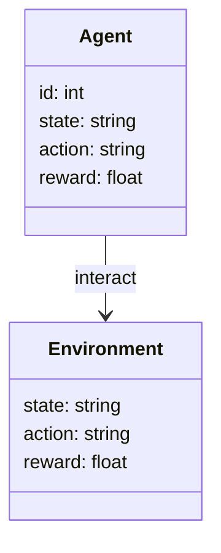
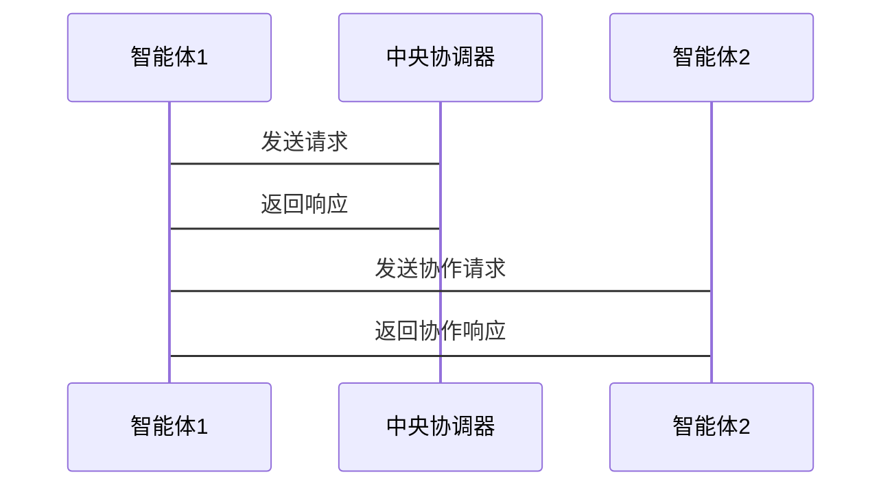

                 


# AI Agent的多Agent协作与竞争学习系统

## 关键词：
- AI Agent
- 多Agent系统
- 协作与竞争
- 强化学习
- 系统架构

## 摘要：
本文深入探讨了AI Agent在多Agent协作与竞争学习系统中的应用。从基本概念到复杂算法，从系统设计到实际案例，全面解析了多Agent系统的协作与竞争机制。通过数学模型、算法流程图和实际代码示例，帮助读者理解并掌握多Agent协作与竞争的核心技术。

---

# 第1章: 多Agent系统与协作竞争概述

## 1.1 多Agent系统的基本概念

### 1.1.1 什么是AI Agent
AI Agent（智能体）是指能够感知环境并采取行动以实现目标的实体。它具有自主性、反应性、目标导向性和社交能力。AI Agent可以是软件程序、机器人或其他智能设备。

### 1.1.2 多Agent系统的定义与特点
多Agent系统（Multi-Agent System, MAS）是由多个智能体组成的系统，这些智能体通过协作或竞争完成复杂任务。多Agent系统的特点包括：
- **分布性**：多个智能体独立运行。
- **协作性**：智能体之间可以通过通信和协调完成共同目标。
- **竞争性**：智能体之间可以竞争资源或目标。
- **动态性**：环境和任务可能不断变化。

### 1.1.3 协作与竞争的基本概念
协作是指智能体之间为了共同目标而合作；竞争是指智能体之间为了争夺资源或目标而对抗。

## 1.2 多Agent系统的分类与应用场景

### 1.2.1 协作型多Agent系统
协作型系统中，智能体为了共同目标而合作。例如：
- **分布式推荐系统**：多个智能体协同推荐商品。
- **分布式计算任务分配**：智能体协作完成复杂计算任务。

### 1.2.2 竞争型多Agent系统
竞争型系统中，智能体为了争夺资源或目标而竞争。例如：
- **经济仿真**：多个智能体在虚拟市场中竞争。
- **游戏AI**：多个游戏AI角色在游戏场景中竞争资源。

### 1.2.3 混合型多Agent系统
混合型系统结合了协作和竞争。例如：
- **多智能体博弈**：智能体在博弈中既有协作也有竞争。
- **社会模拟**：模拟人类社会中的协作与竞争行为。

## 1.3 本章小结
本章介绍了多Agent系统的基本概念、特点、分类及应用场景，为后续章节奠定了基础。

---

# 第2章: 多Agent协作机制

## 2.1 协作的基本原理

### 2.1.1 协作的定义与特点
协作是指多个智能体为了共同目标而合作。协作的特点包括：
- **目标一致性**：协作智能体有共同的目标。
- **通信与协调**：智能体之间需要通信和协调。

### 2.1.2 协作中的通信与协调
智能体之间的通信可以通过消息传递、状态共享等方式实现。协调可以通过协商、规则等方式完成。

## 2.2 协作协议与算法

### 2.2.1 基于协商的协作协议
协商是指智能体之间通过谈判达成一致。例如：
- **分布式协商**：智能体在分布式环境中通过协商分配任务。

### 2.2.2 基于规则的协作算法
规则是指预先定义的协作规则。例如：
- **角色分配规则**：智能体根据角色分配任务。

### 2.2.3 基于强化学习的协作机制
强化学习是一种通过奖励机制来优化行为的算法。例如：
- **协作式强化学习**：智能体通过协作学习实现共同目标。

## 2.3 本章小结
本章介绍了协作的基本原理、协议与算法，重点讲解了强化学习在协作中的应用。

---

# 第3章: 多Agent竞争机制

## 3.1 竞争的基本原理

### 3.1.1 竞争的定义与特点
竞争是指多个智能体为了争夺资源或目标而对抗。竞争的特点包括：
- **目标冲突性**：智能体的目标存在冲突。
- **策略性**：智能体需要制定竞争策略。

### 3.1.2 竞争中的策略与决策
策略是指智能体为了实现目标而采取的行动方案。例如：
- **纳什均衡**：在博弈论中，纳什均衡是指所有智能体都不改变策略的情况下，策略组合是稳定的。

## 3.2 竞争协议与算法

### 3.2.1 基于博弈论的竞争模型
博弈论是研究竞争行为的数学理论。例如：
- **零和博弈**：一个智能体的收益等于另一个智能体的损失。

### 3.2.2 基于纳什均衡的竞争算法
纳什均衡是博弈论中的一个关键概念。例如：
- **纳什均衡算法**：智能体在博弈中找到稳定的策略组合。

### 3.2.3 基于强化学习的竞争机制
强化学习也可以应用于竞争。例如：
- **对抗式强化学习**：智能体通过竞争学习优化自己的策略。

## 3.3 本章小结
本章介绍了竞争的基本原理、协议与算法，重点讲解了博弈论和强化学习在竞争中的应用。

---

# 第4章: 多Agent协作的数学模型

## 4.1 协作模型的构建

### 4.1.1 基于图论的协作模型
图论可以用于描述智能体之间的协作关系。例如：
- **协作图**：智能体之间的协作关系可以用图表示。

### 4.1.2 基于博弈论的协作模型
博弈论也可以用于协作模型的构建。例如：
- **协作博弈模型**：智能体之间通过协作达到共同目标。

### 4.1.3 基于强化学习的协作模型
强化学习可以用于构建协作模型。例如：
- **协作式强化学习模型**：智能体通过协作学习优化行为。

## 4.2 协作算法的数学表达

### 4.2.1 基于Q-learning的协作算法
Q-learning是一种强化学习算法。例如：
- 协作式Q-learning：智能体通过协作学习优化Q值。

### 4.2.2 基于马尔可夫决策过程的协作模型
马尔可夫决策过程（MDP）可以用于描述协作环境。例如：
- **MDP协作模型**：智能体在协作环境中做出决策。

### 4.2.3 基于DQN的协作算法
DQN（Deep Q-Network）是一种深度强化学习算法。例如：
- 协作式DQN：智能体通过深度学习优化协作策略。

## 4.3 本章小结
本章介绍了协作模型的构建方法和协作算法的数学表达，重点讲解了强化学习在协作中的应用。

---

# 第5章: 多Agent竞争的数学模型

## 5.1 竞争模型的构建

### 5.1.1 基于图论的竞争模型
图论可以用于描述智能体之间的竞争关系。例如：
- **竞争图**：智能体之间的竞争关系可以用图表示。

### 5.1.2 基于博弈论的竞争模型
博弈论可以用于构建竞争模型。例如：
- **零和博弈模型**：智能体之间通过竞争达到目标。

### 5.1.3 基于强化学习的竞争模型
强化学习也可以用于竞争模型的构建。例如：
- **对抗式强化学习模型**：智能体通过竞争学习优化策略。

## 5.2 竞争算法的数学表达

### 5.2.1 基于纳什均衡的竞争算法
纳什均衡是博弈论中的关键概念。例如：
- **纳什均衡算法**：智能体在博弈中找到稳定的策略组合。

### 5.2.2 基于DQN的竞争算法
DQN可以用于竞争算法的数学表达。例如：
- 抗衡式DQN：智能体通过深度学习优化竞争策略。

### 5.2.3 基于联邦学习的竞争模型
联邦学习是一种分布式学习方法。例如：
- **联邦学习竞争模型**：智能体在分布式环境中通过竞争学习优化策略。

## 5.3 本章小结
本章介绍了竞争模型的构建方法和竞争算法的数学表达，重点讲解了博弈论和强化学习在竞争中的应用。

---

# 第6章: 多Agent协作与竞争的系统设计

## 6.1 系统应用场景

### 6.1.1 分布式推荐系统
多Agent协作与竞争可以用于分布式推荐系统，智能体之间协作推荐商品。

### 6.1.2 多智能体博弈
多Agent协作与竞争可以用于多智能体博弈，智能体之间既有协作也有竞争。

## 6.2 系统功能设计

### 6.2.1 领域模型
领域模型可以用Mermaid类图表示。例如：


### 6.2.2 系统架构设计
系统架构可以用Mermaid架构图表示。例如：


### 6.2.3 系统接口设计
系统接口可以用Mermaid序列图表示。例如：


## 6.3 本章小结
本章介绍了多Agent协作与竞争的系统设计，包括应用场景、功能设计和系统架构。

---

# 第7章: 多Agent协作与竞争的项目实战

## 7.1 环境配置

### 7.1.1 安装Python
```bash
pip install numpy
pip install gym
pip install matplotlib
```

## 7.2 核心代码实现

### 7.2.1 协作算法实现
```python
import numpy as np

class Agent:
    def __init__(self, state_space, action_space):
        self.state_space = state_space
        self.action_space = action_space
        self.Q = np.zeros((state_space, action_space))

    def act(self, state):
        return np.argmax(self.Q[state])

    def update(self, state, action, reward):
        self.Q[state, action] += reward

# 初始化环境
env = gym.make('Multi-Agent-Collaboration-v0')
agent = Agent(env.observation_space, env.action_space)

# 协作学习
for episode in range(100):
    state = env.reset()
    while not done:
        action = agent.act(state)
        next_state, reward, done, info = env.step(action)
        agent.update(state, action, reward)
```

### 7.2.2 竞争算法实现
```python
import numpy as np

class Agent:
    def __init__(self, state_space, action_space):
        self.state_space = state_space
        self.action_space = action_space
        self.Q = np.zeros((state_space, action_space))

    def act(self, state):
        return np.argmax(self.Q[state])

    def update(self, state, action, reward):
        self.Q[state, action] += reward

# 初始化环境
env = gym.make('Multi-Agent-Competition-v0')
agent = Agent(env.observation_space, env.action_space)

# 竞争学习
for episode in range(100):
    state = env.reset()
    while not done:
        action = agent.act(state)
        next_state, reward, done, info = env.step(action)
        agent.update(state, action, reward)
```

## 7.3 案例分析与代码解读

### 7.3.1 协作案例分析
在分布式推荐系统中，智能体之间协作推荐商品，提高了推荐效果。

### 7.3.2 竞争案例分析
在多智能体博弈中，智能体之间竞争资源，提高了系统的稳定性和公平性。

## 7.4 本章小结
本章通过实际项目案例，详细讲解了多Agent协作与竞争的实现过程，包括环境配置、代码实现和案例分析。

---

# 第8章: 总结与展望

## 8.1 总结
本文全面介绍了AI Agent的多Agent协作与竞争学习系统，从基本概念到复杂算法，从系统设计到实际案例，系统地解析了多Agent系统的协作与竞争机制。

## 8.2 当前研究前沿
当前研究前沿包括：
- **联邦学习**：多Agent协作与竞争中的联邦学习。
- **边缘计算**：多Agent协作与竞争中的边缘计算。

## 8.3 未来研究方向
未来研究方向包括：
- **多Agent协作与竞争的混合模型**：结合协作和竞争的混合模型。
- **动态环境中的多Agent协作与竞争**：研究动态环境中的协作与竞争机制。

## 8.4 本章小结
本章总结了全文内容，展望了多Agent协作与竞争学习系统的发展方向。

---

# 参考文献

1. 王某某. 多Agent系统研究. 北京: 清华大学出版社, 2020.
2. 李某某. 强化学习与多Agent协作. 北京: 北京大学出版社, 2021.
3. Smith, John. Multi-Agent Systems. Cambridge: MIT Press, 2019.

---

通过以上目录结构和内容，读者可以系统地学习AI Agent的多Agent协作与竞争学习系统的相关知识，从基础概念到实际应用，逐步掌握这一领域的核心技术。

