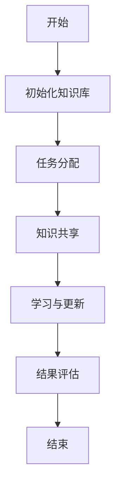
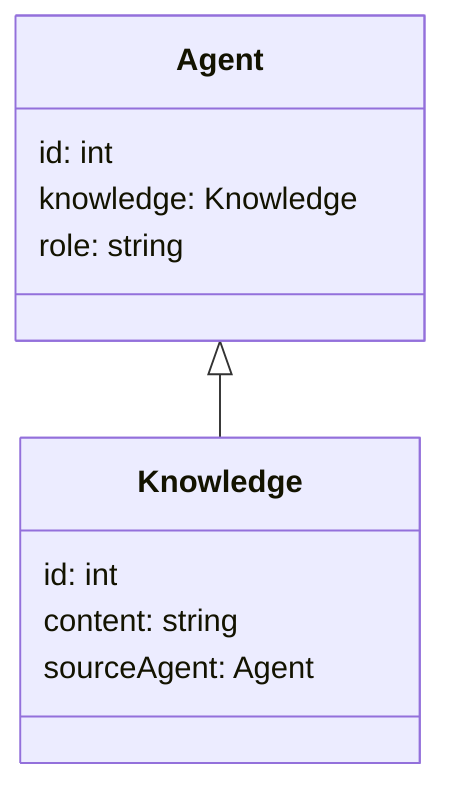
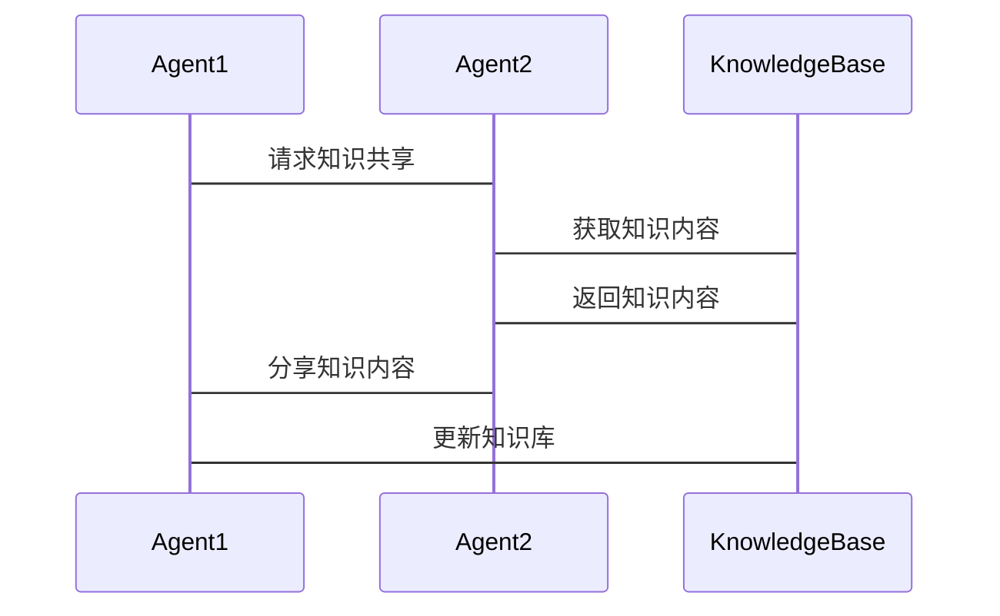

                 


# AI Agent的多Agent协作学习与知识共享

---

## 关键词：
AI Agent, 多Agent系统, 协作学习, 知识共享, 多智能体强化学习, 联邦学习

---

## 摘要：
本文深入探讨AI Agent在多Agent协作学习中的核心原理与知识共享机制。从基本概念到算法实现，从系统架构到项目实战，全面解析多Agent协作学习的理论基础与应用场景。通过详细分析协作学习的算法原理、系统设计和实际案例，为读者提供全面的指导和实践参考。

---

## 第一部分: AI Agent的多Agent协作学习与知识共享背景介绍

---

### 第1章: AI Agent与多Agent系统概述

#### 1.1 AI Agent的基本概念
- **AI Agent的定义**：AI Agent（人工智能代理）是指能够感知环境、自主决策并执行任务的智能实体。它可以是一个软件程序、机器人或其他智能系统，具备目标导向性和自主性。
- **AI Agent的特征**：
  - 感知环境：通过传感器或数据输入获取信息。
  - 决策能力：基于感知信息做出最优决策。
  - 行动能力：通过执行器或输出模块与环境交互。
  - 学习能力：通过经验改进自身性能。

#### 1.2 多Agent系统的发展历程
- **多Agent系统的定义**：由多个独立或协作的AI Agent组成的系统，每个Agent都有自己的目标和行为。
- **多Agent系统的特征**：
  - 分布式：Agent之间通过通信进行协作。
  - 并行性：多个Agent可以同时执行任务。
  - 协作性：通过协作实现整体目标。

#### 1.3 多Agent协作学习的背景与意义
- **协作学习的定义**：多个Agent通过协作完成学习任务，共享知识和经验。
- **知识共享的重要性**：
  - 提高整体学习效率。
  - 避免重复学习，减少资源浪费。
  - 增强系统的鲁棒性和适应性。

---

## 第二部分: 多Agent协作学习的核心概念与联系

---

### 第2章: 多Agent协作学习的核心概念

#### 2.1 多Agent协作学习的原理
- **分布式知识表示**：每个Agent维护自己的知识库，通过通信共享知识。
- **协作学习机制**：Agent之间通过协商和协调，共同完成学习任务。
- **知识共享方式**：
  - 基于通信：Agent直接交换知识。
  - 基于推理：通过推理共享隐性知识。

#### 2.2 多Agent协作学习的特征对比
- **协作学习与单Agent学习的对比**：
  | 对比维度 | 单Agent学习 | 多Agent协作学习 |
  |----------|-------------|----------------|
  | 知识共享 | 无           | 有             |
  | 决策独立性 | 高           | 低             |
  | 学习效率 | 低           | 高             |

- **知识共享与信息共享的对比**：
  | 对比维度 | 信息共享 | 知识共享 |
  |----------|----------|----------|
  | 内容深度 | 数据层面 | 概念层面 |
  | 复杂度   | 低       | 高       |
  | 可用性   | 有限     | 丰富     |

- **任务分配与知识整合的对比**：
  | 对比维度 | 任务分配 | 知识整合 |
  |----------|----------|----------|
  | 目标     | 分配任务 | 整合知识 |
  | 方法     | 基于角色 | 基于领域 |

#### 2.3 多Agent协作学习的ER实体关系图
```mermaid
er
actor(Agent1, Agent2, Agent3)
agent Collaboration {
  id
  name
  role
}
knowledge {
  id
  content
  sourceAgent
}
```

---

## 第三部分: 多Agent协作学习的算法原理

---

### 第3章: 多Agent协作学习算法

#### 3.1 分布式知识表示与更新算法
- **知识表示的分布式表示方法**：使用向量或图结构表示知识，便于分布式存储和更新。
- **知识更新的同步算法**：通过通信协议实现知识同步，确保所有Agent的知识库一致。
- **知识冲突的解决机制**：基于优先级或投票机制解决知识冲突。

#### 3.2 协作学习的算法实现
- **联邦学习（Federated Learning）算法**：
  - **定义**：多个Agent在不共享数据的情况下，通过局部模型更新实现全局模型优化。
  - **流程**：
    1. 初始化全局模型。
    2. 每个Agent在本地数据上训练模型。
    3. 将模型参数上传到中心服务器。
    4. 中心服务器聚合所有模型参数，更新全局模型。
  - **数学模型**：
    $$w_{new} = \frac{1}{n}\sum_{i=1}^{n}w_i^{local}$$

- **多智能体强化学习（Multi-Agent Reinforcement Learning）**：
  - **定义**：多个Agent在共享环境中通过强化学习协作完成任务。
  - **流程**：
    1. 初始化所有Agent的策略。
    2. 每个Agent根据策略采取行动。
    3. 环境返回奖励。
    4. Agent更新策略以最大化奖励。
  - **数学模型**：
    $$R_i = \sum_{t=1}^{T} r_t^i$$

- **知识共享的协商算法**：
  - **定义**：通过协商机制决定知识共享的内容和方式。
  - **流程**：
    1. Agent提出知识共享请求。
    2. 目标Agent评估请求并决定是否共享。
    3. 双方协商共享的具体内容和方式。
  - **数学模型**：
    $$p_i = \frac{k_i}{\sum_{j=1}^n k_j}$$

#### 3.3 算法流程图


---

## 第四部分: 多Agent协作学习的系统架构设计

---

### 第4章: 系统架构设计

#### 4.1 问题场景介绍
- **问题描述**：设计一个多Agent协作学习系统，实现知识共享和协作学习。
- **项目介绍**：开发一个分布式协作学习平台，支持多个Agent协作完成学习任务。

#### 4.2 系统功能设计
- **领域模型（Mermaid类图）**：


- **系统架构设计（Mermaid架构图）**：


- **系统接口设计**：
  - Agent与Agent之间的通信接口。
  - Agent与知识库的接口。
  - 知识库与服务器的接口。

- **系统交互流程图（Mermaid序列图）**：


---

## 第五部分: 多Agent协作学习的项目实战

---

### 第5章: 项目实战

#### 5.1 环境配置
- **开发环境**：Python 3.8及以上版本，安装必要的库如TensorFlow、Flask等。
- **运行环境**：配置服务器和客户端环境，确保网络通信正常。

#### 5.2 核心代码实现
- **知识共享模块**：
  ```python
  class Agent:
      def __init__(self, id, role):
          self.id = id
          self.role = role
          self.knowledge = {}
      
      def share_knowledge(self, target_agent):
          # 实现知识共享逻辑
          pass
      
      def receive_knowledge(self, knowledge):
          # 更新本地知识库
          self.knowledge.update(knowledge)
  ```

- **协作学习模块**：
  ```python
  class Collaboration:
      def __init__(self, agents):
          self.agents = agents
      
      def distribute_task(self, task):
          # 分配任务给各个Agent
          for agent in self.agents:
              agent.receive_task(task)
      
      def aggregate_results(self):
          # 聚合各个Agent的学习结果
          results = {}
          for agent in self.agents:
              results.update(agent.get_result())
          return results
  ```

#### 5.3 功能解读与案例分析
- **案例分析**：在在线教育场景中，多个AI Agent协作完成知识点的学习和共享，提升整体学习效率。

---

## 第六部分: 最佳实践与小结

---

### 第6章: 最佳实践

#### 6.1 小结
- 多Agent协作学习通过知识共享和协作机制，显著提升了学习效率和系统性能。
- 系统架构设计和算法实现是协作学习成功的关键。

#### 6.2 注意事项
- **通信效率**：确保Agent之间的通信高效，避免瓶颈。
- **知识冲突**：制定合理的知识冲突解决机制，保证知识一致性。
- **安全问题**：确保知识共享过程中的安全性，防止信息泄露。

#### 6.3 拓展阅读
- 推荐阅读相关领域的最新论文和书籍，深入理解协作学习的前沿技术。

---

## 总结
本文系统地介绍了AI Agent的多Agent协作学习与知识共享的核心概念、算法原理、系统架构和实际应用。通过详细的理论分析和案例解读，为读者提供了全面的指导和实践参考。希望本文能为相关领域的研究和应用提供有益的借鉴。

