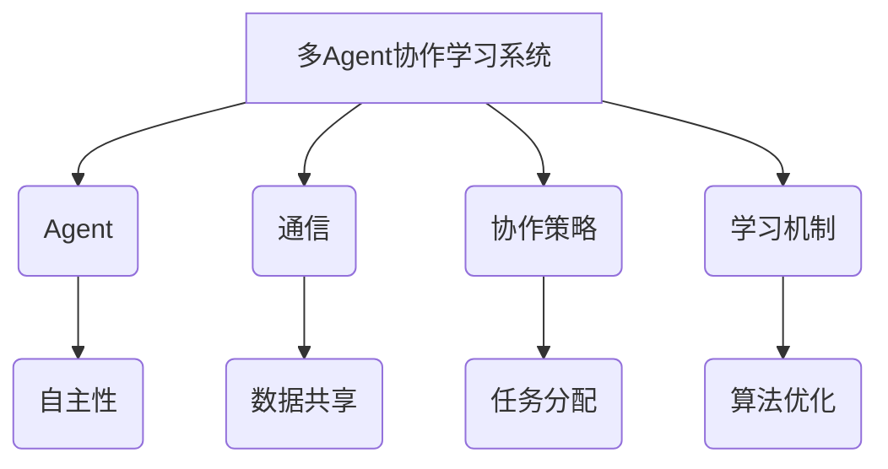
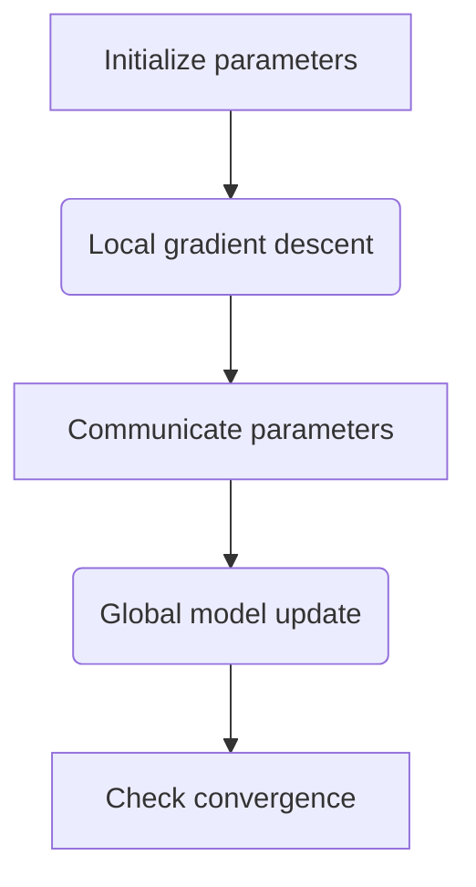
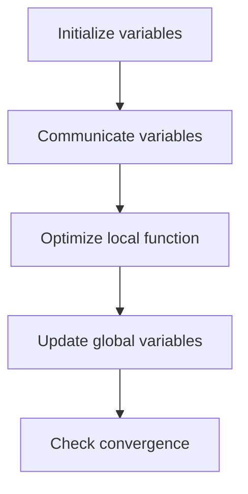
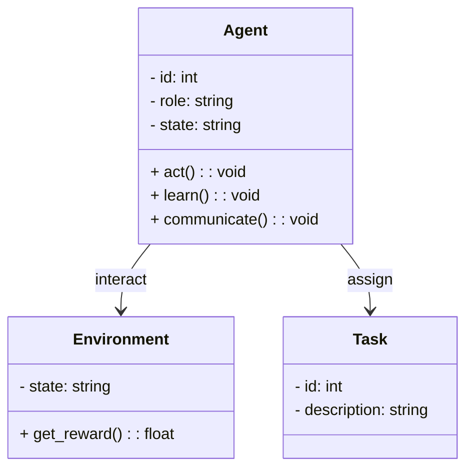
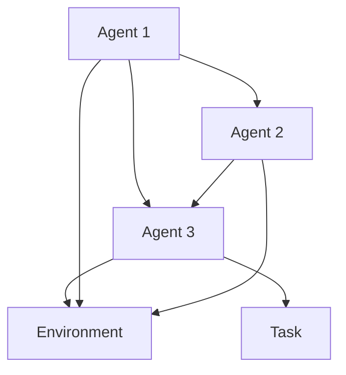
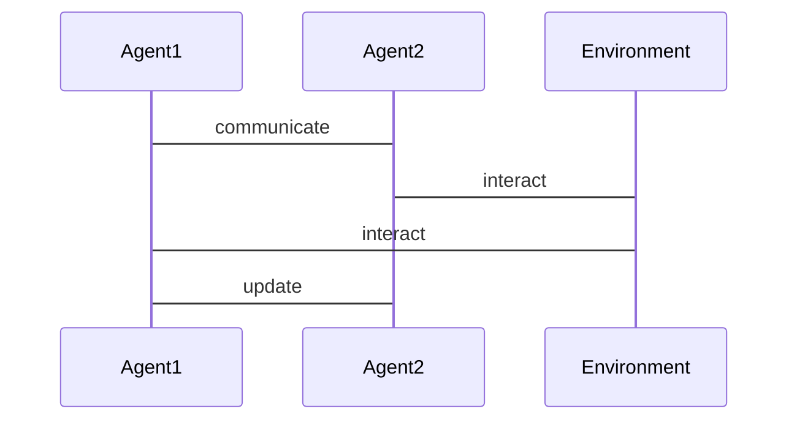

                 


# AI Agent的多Agent协作学习系统

## 关键词
AI Agent, 多Agent协作, 机器学习, 强化学习, 系统设计, 分布式学习

## 摘要
本文深入探讨了AI Agent的多Agent协作学习系统，从基本概念到复杂算法，再到系统设计与实现，全面解析了多Agent协作学习的核心原理、算法实现及实际应用。通过详细分析多Agent协作学习系统的背景、核心概念、算法原理、系统架构和项目实战，本文为读者提供了从理论到实践的完整指导。

---

## 第一章: 多Agent协作学习系统背景介绍

### 1.1 多Agent协作学习系统的概念
多Agent协作学习系统（Multi-Agent Collaborative Learning System, MACLS）是一种基于多个智能体（Agent）协作完成学习任务的系统。通过多个Agent之间的协作与通信，系统能够更高效地完成复杂任务，实现比单个Agent更强的智能表现。

#### 1.1.1 多Agent协作学习系统的定义
多Agent协作学习系统是指由多个具有自主性、反应性和协作性的智能体组成的系统，通过Agent之间的协作与通信，共同完成特定的学习任务。多Agent协作学习系统的核心在于Agent之间的协作机制，通过分布式学习、强化学习和协作优化等方法，实现复杂问题的高效解决。

#### 1.1.2 多Agent协作学习系统的背景与问题背景
随着人工智能技术的快速发展，单个Agent的学习能力已经难以应对复杂场景中的任务需求。通过多个Agent协作，可以利用分布式计算和协作学习的优势，提升系统的整体智能水平和任务处理能力。例如，在自动驾驶、机器人协作、分布式计算等领域，多Agent协作学习系统展现出巨大的应用潜力。

#### 1.1.3 多Agent协作学习系统的应用领域
多Agent协作学习系统广泛应用于以下领域：
- **自动驾驶**：多个智能体协作完成路径规划、交通控制等任务。
- **机器人协作**：多个机器人通过协作完成物流运输、仓储管理等任务。
- **分布式计算**：通过多Agent协作完成分布式任务处理和数据共享。
- **游戏AI**：多个游戏AI通过协作完成游戏任务。

### 1.2 多Agent协作学习系统的结构与组成
多Agent协作学习系统的结构通常包括以下几个部分：
- **Agent**：具有自主性、反应性和协作性的智能体。
- **通信机制**：Agent之间的通信与数据交换。
- **协作机制**：Agent之间的协作策略和任务分配。
- **学习机制**：通过学习算法提升协作效率和任务完成能力。

#### 1.2.1 多Agent协作学习系统的组成要素
多Agent协作学习系统由以下几个要素组成：
- **Agent**：具有自主决策和学习能力的智能体。
- **通信**：Agent之间的信息传递和数据共享。
- **协作策略**：Agent之间的任务分配和协作规则。
- **学习算法**：通过学习提升协作效率和任务完成能力。

#### 1.2.2 多Agent协作学习系统的边界与外延
多Agent协作学习系统的边界包括：
- **内部边界**：系统内部的Agent和协作机制。
- **外部边界**：系统与外部环境的交互和数据共享。
- **功能边界**：系统能够完成的具体任务和功能。

多Agent协作学习系统的外延包括：
- **扩展功能**：通过引入更多Agent或功能模块，提升系统的能力。
- **应用场景**：多Agent协作学习系统在不同领域的具体应用。

#### 1.2.3 多Agent协作学习系统的概念结构与核心要素组成
多Agent协作学习系统的概念结构如下：



---

## 第二章: 多Agent协作学习系统的核心概念与联系

### 2.1 AI Agent的基本概念
AI Agent（人工智能代理）是指能够感知环境并采取行动以实现目标的智能体。Agent可以是软件程序、机器人或其他智能设备。

#### 2.1.1 多Agent协作学习系统的核心原理
多Agent协作学习系统的核心原理在于通过多个Agent之间的协作与通信，共同完成学习任务。每个Agent都有自己的目标和任务，通过协作机制实现整体目标的优化。

#### 2.1.2 多Agent协作学习系统的属性特征对比
以下是多Agent协作学习系统中不同Agent的属性特征对比：

| 属性 | 单个Agent | 多Agent协作 |
|------|----------|------------|
| 自主性 | 独立决策 | 协作决策 |
| 反应性 | 单点反馈 | 多点反馈 |
| 学习能力 | 单点学习 | 分布式学习 |
| 任务目标 | 单点目标 | 集体目标 |

#### 2.1.3 多Agent协作学习系统的决策机制
多Agent协作学习系统的决策机制包括：
- **自主决策**：每个Agent根据自身信息做出决策。
- **协作决策**：通过通信和协作机制，多个Agent共同做出决策。
- **任务分配**：根据任务需求，将任务分配给不同的Agent。

#### 2.1.4 多Agent协作学习系统的协作策略
多Agent协作学习系统的协作策略包括：
- **基于角色的协作策略**：根据Agent的角色分配任务。
- **基于任务的协作策略**：根据任务需求动态分配Agent。
- **基于通信的协作策略**：通过通信实现信息共享和协作。

### 2.2 多Agent协作学习系统的协作策略与算法

#### 2.2.1 多Agent协作学习系统中的通信与协调机制
多Agent协作学习系统中的通信与协调机制包括：
- **直接通信**：Agent之间通过直接通信实现信息共享。
- **间接通信**：通过中间媒介实现信息共享。
- **协作协议**：定义Agent之间的通信规则和协作流程。

#### 2.2.2 多Agent协作学习系统中的协作策略
多Agent协作学习系统中的协作策略包括：
- **基于角色的协作策略**：根据Agent的角色分配任务。
- **基于任务的协作策略**：根据任务需求动态分配Agent。
- **基于优先级的协作策略**：根据任务优先级分配Agent。

#### 2.2.3 多Agent协作学习系统的协作优化算法
多Agent协作学习系统中的协作优化算法包括：
- **分布式优化算法**：通过分布式计算实现协作优化。
- **强化学习算法**：通过强化学习提升协作效率。
- **协作游戏算法**：通过协作游戏机制实现任务分配和优化。

---

## 第三章: 多Agent协作学习系统的算法原理

### 3.1 分布式学习算法

#### 3.1.1 分布式学习的基本原理
分布式学习是一种通过多个Agent协作完成学习任务的方法。每个Agent在本地进行学习，并通过通信共享信息，最终实现全局优化。

#### 3.1.2 分布式学习算法的数学模型
分布式学习算法的数学模型如下：
$$
\theta_{i}^{(k+1)} = \theta_{i}^{(k)} + \eta \cdot \nabla J_{i}^{(k)}
$$
其中，$\theta_{i}$ 表示第 $i$ 个Agent的参数，$\eta$ 是学习率，$J_{i}$ 是第 $i$ 个Agent的损失函数。

#### 3.1.3 分布式学习算法的实现与优化
分布式学习算法的实现步骤如下：
1. 初始化参数。
2. 每个Agent在本地进行梯度下降。
3. 通过通信将参数更新到全局模型。
4. 重复步骤1-3直到收敛。



### 3.2 强化学习算法

#### 3.2.1 强化学习的基本原理
强化学习是一种通过奖励机制来优化Agent行为的算法。Agent通过与环境交互，学习最优策略。

#### 3.2.2 强化学习算法的数学模型
强化学习算法的数学模型如下：
$$
Q(s, a) = Q(s, a) + \alpha (r + \gamma \max_{a'} Q(s', a') - Q(s, a))
$$
其中，$Q(s, a)$ 表示状态-动作值函数，$\alpha$ 是学习率，$\gamma$ 是折扣因子。

#### 3.2.3 强化学习算法的实现与优化
强化学习算法的实现步骤如下：
1. 初始化Q值函数。
2. 与环境交互，获取奖励。
3. 更新Q值函数。
4. 重复步骤1-3直到收敛。

```mermaid
graph TD
A[Initialize Q(s,a)] --> B[Take action and get reward] --> C[Update Q(s,a)] --> D[Check convergence]
```

### 3.3 协作优化算法

#### 3.3.1 协作优化的基本原理
协作优化是一种通过Agent之间的协作实现全局优化的算法。通过协作机制，多个Agent共同优化目标函数。

#### 3.3.2 协作优化算法的数学模型
协作优化算法的数学模型如下：
$$
f(x) = \sum_{i=1}^{n} f_i(x_i)
$$
其中，$x_i$ 表示第 $i$ 个Agent的变量，$f_i$ 是第 $i$ 个Agent的目标函数。

#### 3.3.3 协作优化算法的实现与优化
协作优化算法的实现步骤如下：
1. 初始化每个Agent的变量。
2. 通过通信共享变量。
3. 每个Agent优化自己的目标函数。
4. 通过通信更新全局变量。
5. 重复步骤1-4直到收敛。



---

## 第四章: 多Agent协作学习系统的系统分析与架构设计

### 4.1 问题场景介绍
本系统的目标是通过多Agent协作学习，实现复杂任务的高效完成。系统适用于多个Agent协作完成任务的场景，例如自动驾驶、机器人协作等。

### 4.2 系统功能设计

#### 4.2.1 系统功能设计的领域模型
以下是系统的领域模型：



#### 4.2.2 系统架构设计的架构图
以下是系统的架构图：



#### 4.2.3 系统接口设计
系统接口设计如下：
- **Agent接口**：定义Agent的行为和通信接口。
- **Environment接口**：定义环境与Agent的交互接口。
- **Task接口**：定义任务分配和完成接口。

#### 4.2.4 系统交互设计的交互序列图
以下是系统交互的序列图：



---

## 第五章: 多Agent协作学习系统的项目实战

### 5.1 环境安装
要运行本项目，需要安装以下环境：
- Python 3.6+
- PyTorch 1.0+
- numpy
- matplotlib

### 5.2 系统核心实现源代码

#### 5.2.1 分布式学习算法的代码实现
```python
import torch
import numpy as np

def distributed_learning(agents, global_model):
    for agent in agents:
        agent.update(global_model)
        agent.local_optimize()
    global_model.load(agents)
```

#### 5.2.2 强化学习算法的代码实现
```python
class Agent:
    def __init__(self, state_space, action_space):
        self.state_space = state_space
        self.action_space = action_space
        self.Q = np.zeros((state_space, action_space))
    
    def take_action(self, state):
        return np.argmax(self.Q[state])
    
    def update(self, reward, next_state):
        self.Q[state][action] += reward + 0.99 * np.max(self.Q[next_state])
```

#### 5.2.3 协作优化算法的代码实现
```python
import torch
import torch.nn as nn

class CollaborativeOptimizer:
    def __init__(self, agents):
        self.agents = agents
    
    def optimize(self):
        for agent in self.agents:
            agent.optimize()
            agent.communicate()
```

### 5.3 代码应用解读与分析
通过上述代码，我们可以实现多Agent协作学习系统的核心功能。每个Agent都可以独立进行学习，并通过通信实现协作优化。

### 5.4 实际案例分析和详细讲解剖析
以自动驾驶为例，多个Agent分别负责路径规划、障碍物检测和环境感知。通过协作优化算法，多个Agent可以共同完成自动驾驶任务。

### 5.5 项目小结
通过本项目，我们可以深入理解多Agent协作学习系统的实现原理和应用方法。代码实现展示了如何通过协作机制实现复杂任务的高效完成。

---

## 第六章: 总结与展望

### 6.1 总结
本文深入探讨了多Agent协作学习系统的背景、核心概念、算法原理、系统设计和项目实战。通过详细分析，我们了解了多Agent协作学习系统的实现方法和应用场景。

### 6.2 展望
未来，多Agent协作学习系统将在更多领域得到广泛应用。随着人工智能技术的不断发展，多Agent协作学习系统将变得更加智能化和高效化。

---

## 第七章: 最佳实践 tips、小结、注意事项、拓展阅读

### 7.1 最佳实践 tips
- **模块化设计**：建议将系统设计模块化，便于维护和扩展。
- **通信机制**：选择合适的通信机制，确保Agent之间的高效协作。
- **算法优化**：根据具体场景选择合适的算法，并进行优化。

### 7.2 小结
多Agent协作学习系统是一个复杂但非常有趣的研究领域。通过本文的学习，我们掌握了多Agent协作学习系统的实现方法和应用技巧。

### 7.3 注意事项
- **通信延迟**：注意通信延迟对系统性能的影响。
- **算法收敛性**：关注算法的收敛性和稳定性。
- **系统扩展性**：确保系统的扩展性和可维护性。

### 7.4 拓展阅读
- **分布式计算**：推荐阅读分布式计算的相关书籍。
- **强化学习**：推荐阅读强化学习的经典论文。
- **多Agent系统**：推荐阅读多Agent系统领域的最新研究成果。

--- 

通过以上内容，我们对多Agent协作学习系统的各个方面有了全面的了解。希望本文对读者在AI Agent的多Agent协作学习系统的研究和实践中有所帮助。

