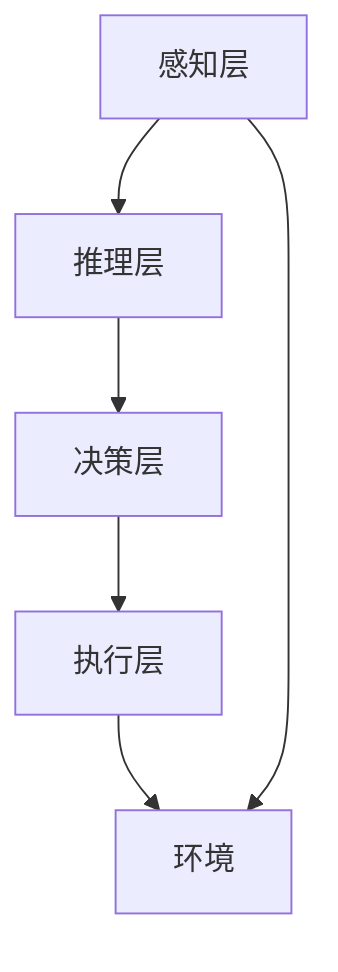

                 


# AI Agent的多Agent协同推理与决策

> 关键词：AI Agent, 多Agent系统, 协同推理, 决策算法, 系统架构

> 摘要：本文将深入探讨AI Agent在多Agent系统中的协同推理与决策机制，从基本概念到算法原理，再到系统设计和实际应用，全面解析多Agent协同推理与决策的核心技术与应用案例。

---

## 第1章: AI Agent与多Agent系统概述

### 1.1 AI Agent的基本概念

#### 1.1.1 什么是AI Agent

AI Agent（人工智能代理）是一种能够感知环境、自主决策并执行任务的智能实体。它具备以下核心特征：

- **自主性**：能够在没有外部干预的情况下独立运作。
- **反应性**：能够根据环境变化调整行为。
- **目标导向性**：基于目标驱动决策和行动。

#### 1.1.2 AI Agent的核心特征

- **感知能力**：通过传感器或数据接口获取环境信息。
- **推理能力**：通过逻辑推理或机器学习模型处理信息。
- **决策能力**：基于推理结果做出最优选择。
- **执行能力**：通过执行机构或API实现动作。

#### 1.1.3 AI Agent的分类与应用场景

- **简单反射型Agent**：基于预定义规则直接响应输入。
- **基于模型的反射型Agent**：利用内部模型进行推理和决策。
- **目标驱动型Agent**：基于目标导向进行决策。
- **效用驱动型Agent**：通过最大化效用函数实现目标。
- **学习型Agent**：通过机器学习提升推理与决策能力。

应用场景包括智能助手、自动驾驶、智能机器人、推荐系统等。

### 1.2 多Agent系统的基本概念

#### 1.2.1 多Agent系统的定义

多Agent系统是由多个相互作用的AI Agent组成的分布式系统，各Agent通过通信与协调完成复杂任务。

#### 1.2.2 多Agent系统的组成与特点

- **Agent**：具备自主性、反应性、目标导向性。
- **通信机制**：通过消息传递实现信息共享。
- **协同机制**：通过协商、协作完成任务。
- **分布式计算**：任务分解与分布式执行。

#### 1.2.3 多Agent系统的应用领域

- 智能交通管理
- 分布式计算与数据处理
- 集智决策系统
- 智慧城市

### 1.3 多Agent协同推理与决策的背景与意义

#### 1.3.1 协同推理与决策的定义

协同推理与决策是指多个Agent通过共享信息、协商和协作，共同完成复杂决策任务的过程。

#### 1.3.2 多Agent协同推理与决策的必要性

- 单一Agent难以处理复杂任务。
- 多Agent通过分工协作提高整体效率。
- 分布式计算环境下，协同推理与决策是必要能力。

#### 1.3.3 多Agent协同推理与决策的应用场景

- 智能交通系统：协同决策最优路径。
- 智慧医疗：多个医疗系统协同诊断与治疗。
- 智能电网：分布式能源管理与优化。

## 第2章: 多Agent协同推理与决策的核心概念与联系

### 2.1 多Agent系统中的核心概念

#### 2.1.1 Agent的属性与行为

- **状态**：Agent对环境的感知结果。
- **动作**：Agent执行的动作，影响环境状态。
- **目标**：Agent追求的最终状态。

#### 2.1.2 Agent之间的关系与交互

- **通信**：通过消息传递共享信息。
- **协作**：通过分工合作完成共同目标。
- **协商**：通过讨价还价达成一致。

#### 2.1.3 多Agent系统中的角色与职责

- **领导者**：制定计划与协调任务。
- **执行者**：负责具体任务的执行。
- **监督者**：监控系统运行并提供反馈。

### 2.2 多Agent系统中的通信机制

#### 2.2.1 通信协议的定义与作用

- **通信协议**：定义消息格式、传输方式和交互规则。
- **作用**：确保Agent之间信息的有效传递与共享。

#### 2.2.2 通信模型的构建与实现

- **通信模型**：定义Agent之间的通信流程与规则。
- **实现方式**：通过中间件或消息队列实现异步通信。

#### 2.2.3 通信中的信息传递与处理

- **消息传递**：Agent通过消息传递共享状态与意图。
- **信息处理**：接收方根据消息内容进行推理与决策。

### 2.3 多Agent系统中的协同机制

#### 2.3.1 协同推理的基本原理

- **分布式推理**：每个Agent基于局部信息进行推理。
- **信息共享**：通过通信机制共享全局信息。
- **协调一致**：通过协商达成一致的推理结果。

#### 2.3.2 协同决策的核心要素

- **决策目标**：明确的决策目标与优先级。
- **决策规则**：定义决策过程中的规则与约束。
- **决策结果**：基于推理结果做出最优选择。

#### 2.3.3 协同过程中的冲突与解决

- **冲突检测**：识别决策过程中的冲突。
- **冲突解决**：通过协商或仲裁机制解决冲突。
- **协作优化**：通过不断优化协作过程提高决策效率。

### 2.4 本章小结

---

## 第3章: 多Agent协同推理与决策的算法原理

### 3.1 分布式推理算法

#### 3.1.1 分布式推理的基本原理

- **分布式推理**：每个Agent基于局部信息进行推理，最终通过通信共享推理结果。
- **算法步骤**：
  1. Agent感知环境并获取局部信息。
  2. Agent基于局部信息进行推理。
  3. Agent通过通信机制共享推理结果。
  4. 全局推理结果由多个局部推理结果整合得出。

#### 3.1.2 分布式推理的实现步骤

1. **信息收集**：通过传感器或API获取环境信息。
2. **局部推理**：基于局部信息进行推理。
3. **信息共享**：通过通信机制共享推理结果。
4. **全局推理**：整合所有局部推理结果，得出全局推理结论。

#### 3.1.3 分布式推理的数学模型

- **局部推理模型**：每个Agent的推理结果表示为$P_i$，其中$i$表示第$i$个Agent。
- **全局推理模型**：全局推理结果$P$为所有局部推理结果的函数，即$P = f(P_1, P_2, ..., P_n)$。

### 3.2 协同决策算法

#### 3.2.1 协同决策的基本原理

- **决策目标**：通过多Agent协作，实现最优决策。
- **决策规则**：基于Agent之间的通信与协商，制定决策规则。
- **决策结果**：通过投票、协商或优化算法得出最终决策。

#### 3.2.2 协同决策的实现步骤

1. **信息收集**：通过通信机制收集所有Agent的决策建议。
2. **决策协商**：通过协商机制达成一致的决策。
3. **决策优化**：通过优化算法进一步提升决策质量。
4. **决策执行**：将决策结果执行到位。

#### 3.2.3 协同决策的数学模型

- **决策空间**：所有可能的决策选项构成决策空间$D$。
- **决策目标函数**：最大化或最小化某个目标函数$J(d)$，其中$d$表示决策。
- **协同决策模型**：通过优化算法（如多目标优化）在决策空间中寻找最优解。

### 3.3 协同推理与决策的算法实现

#### 3.3.1 分布式推理与决策的算法流程

1. **初始化**：定义多Agent系统的目标与约束条件。
2. **信息收集**：每个Agent感知环境并获取局部信息。
3. **局部推理**：每个Agent基于局部信息进行推理，生成局部推理结果。
4. **信息共享**：通过通信机制共享局部推理结果。
5. **全局推理**：整合所有局部推理结果，得出全局推理结论。
6. **决策协商**：通过协商机制达成一致的决策。
7. **决策优化**：通过优化算法进一步提升决策质量。
8. **决策执行**：将决策结果执行到位。

#### 3.3.2 分布式推理与决策的数学模型

- **局部推理模型**：$P_i = f_i(s_i)$，其中$s_i$表示第$i$个Agent的局部状态。
- **全局推理模型**：$P = f(P_1, P_2, ..., P_n)$。
- **决策目标函数**：$J(d) = \sum_{i=1}^{n} w_i d_i$，其中$w_i$表示第$i$个决策的权重，$d_i$表示第$i$个决策。

#### 3.3.3 协同推理与决策的算法实现

```python
class MultiAgentSystem:
    def __init__(self, agents):
        self.agents = agents

    def collect_info(self):
        # 收集所有Agent的局部信息
        info = [agent.perceive() for agent in self.agents]
        return info

    def distribute_info(self, info):
        # 分发全局信息给所有Agent
        for agent in self.agents:
            agent.receive_info(info)

    def make_decision(self):
        # 执行决策
        decisions = [agent.decide() for agent in self.agents]
        # 协商达成一致决策
        consensus = self.conensus_decision(decisions)
        return consensus

    def consensus_decision(self, decisions):
        # 简单的多数投票法
        from collections import Counter
        counts = Counter(decisions)
        return max(counts, key=counts.get)

    def execute_decision(self, decision):
        # 执行决策
        for agent in self.agents:
            agent.execute(decision)
```

#### 3.3.4 算法优化与复杂度分析

- **算法优化**：通过改进通信机制和优化算法，降低通信开销和计算复杂度。
- **复杂度分析**：分布式推理与决策的复杂度主要取决于通信次数和计算量，通常为$O(n)$，其中$n$表示Agent的数量。

### 3.4 本章小结

---

## 第4章: 多Agent协同推理与决策的系统设计

### 4.1 系统架构设计

#### 4.1.1 系统架构设计概述

- **分层架构**：将系统划分为感知层、推理层和决策层。
- **分布式架构**：Agent分布在网络中，通过通信机制协同工作。

#### 4.1.2 系统功能设计

- **信息感知**：通过传感器或API获取环境信息。
- **信息处理**：对感知到的信息进行处理和分析。
- **协同推理**：通过通信机制共享信息，进行协同推理。
- **决策制定**：基于推理结果制定决策。
- **决策执行**：将决策结果执行到位。

#### 4.1.3 系统架构图



### 4.2 系统实现

#### 4.2.1 通信机制的设计

- **消息队列**：使用消息队列（如RabbitMQ）实现异步通信。
- **消息格式**：定义统一的消息格式，确保Agent之间能够正确解析。

#### 4.2.2 信息共享与同步

- **分布式数据库**：使用分布式数据库（如MongoDB）存储共享信息。
- **数据同步**：通过数据同步机制确保所有Agent的数据一致性。

#### 4.2.3 协同推理与决策的实现

- **分布式计算**：通过分布式计算框架（如Spark）实现协同推理。
- **分布式决策**：通过分布式共识算法（如RAFT）实现决策一致性。

### 4.3 系统优化

#### 4.3.1 性能优化

- **并行计算**：通过并行计算提高推理效率。
- **负载均衡**：通过负载均衡技术分配任务，提高系统吞吐量。

#### 4.3.2 可靠性优化

- **容错设计**：通过冗余设计提高系统可靠性。
- **故障恢复**：通过自动故障恢复机制减少系统停机时间。

#### 4.3.3 安全性优化

- **身份认证**：通过身份认证确保通信的安全性。
- **数据加密**：通过数据加密技术保护数据安全。

### 4.4 本章小结

---

## 第5章: 多Agent协同推理与决策的项目实战

### 5.1 项目背景与目标

#### 5.1.1 项目背景

- **项目名称**：多Agent协同决策系统。
- **项目目标**：实现一个多Agent协同决策系统，完成复杂任务的决策与执行。

#### 5.1.2 项目需求

- **功能需求**：实现多Agent协同推理与决策。
- **性能需求**：系统具备高可用性和扩展性。
- **安全需求**：确保系统通信的安全性。

### 5.2 项目实现

#### 5.2.1 环境安装

- **开发环境**：Python 3.8及以上版本，安装必要的库（如pymongo、multiprocessing）。
- **运行环境**：安装在Linux系统上，配置网络通信。

#### 5.2.2 核心代码实现

```python
from multiprocessing import Process, Pipe

def agent(rank, pipe):
    # 每个Agent的逻辑
    pass

if __name__ == "__main__":
    # 创建多Agent系统
    n_agents = 5
    agents = []
    pipes = []

    for i in range(n_agents):
        parent_pipe, child_pipe = Pipe()
        pipes.append(parent_pipe)
        agents.append(Process(target=agent, args=(i, child_pipe)))

    # 启动所有Agent
    for agent in agents:
        agent.start()

    # 收集所有Agent的决策结果
    decisions = []
    for pipe in pipes:
        pipe.send("获取决策")
        decisions.append(pipe.recv())

    # 协商一致决策
    from collections import Counter
    counts = Counter(decisions)
    consensus = max(counts, key=counts.get)

    # 执行决策
    for pipe in pipes:
        pipe.send("执行决策")
        pipe.recv()

    # 等待所有Agent完成
    for agent in agents:
        agent.join()
```

#### 5.2.3 代码解读与分析

- **多进程通信**：通过多进程通信实现多Agent之间的信息共享。
- **决策协商**：通过多数投票法达成一致决策。
- **决策执行**：通过发送指令实现决策的执行。

#### 5.2.4 实际案例分析

- **案例名称**：多Agent协同决策系统。
- **案例描述**：实现一个由5个Agent组成的协同决策系统，完成复杂任务的决策与执行。
- **实现过程**：通过多进程通信实现信息共享与决策协商，最终达成一致决策并执行。

### 5.3 项目总结

#### 5.3.1 项目小结

- **项目成果**：成功实现一个多Agent协同决策系统。
- **经验总结**：通过多进程通信实现信息共享与决策协商，确保系统的高效性和可靠性。

#### 5.3.2 项目优化建议

- **算法优化**：通过改进算法提高系统的决策效率。
- **系统扩展**：通过模块化设计提高系统的可扩展性。

### 5.4 本章小结

---

## 第6章: 总结与展望

### 6.1 本章总结

- **总结内容**：本文详细探讨了AI Agent在多Agent系统中的协同推理与决策机制，从基本概念到算法原理，再到系统设计和实际应用，全面解析了多Agent协同推理与决策的核心技术与应用案例。

### 6.2 未来展望

- **技术发展**：随着人工智能技术的不断进步，多Agent协同推理与决策将更加智能化和高效化。
- **应用拓展**：多Agent协同推理与决策技术将在更多领域得到应用，如智能制造、智慧城市等。
- **挑战与机遇**：随着技术的发展，多Agent协同推理与决策将面临更多的挑战和机遇，需要我们不断探索和创新。

### 6.3 最佳实践 Tips

- **设计原则**：
  - **模块化设计**：通过模块化设计提高系统的可维护性和可扩展性。
  - **分布式架构**：通过分布式架构实现系统的高可用性和扩展性。
  - **安全性设计**：通过安全性设计确保系统的通信安全和数据安全。

- **注意事项**：
  - **通信延迟**：在设计多Agent系统时，需要考虑通信延迟对系统性能的影响。
  - **数据一致性**：需要通过数据一致性机制确保系统的数据一致性。
  - **系统容错性**：需要通过容错设计提高系统的可靠性。

- **拓展阅读**：
  - **推荐书籍**：《Multi-Agent Systems: Algorithmic, Complexity, and Theory》。
  - **推荐论文**：《Distributed Coordination of Multi-Agent Systems》。

### 6.4 本章小结

---

# 结语

通过本文的深入探讨，读者可以全面了解AI Agent在多Agent系统中的协同推理与决策机制，掌握其核心技术和应用案例。希望本文能够为读者提供有价值的参考和启发，进一步推动多Agent协同推理与决策技术的发展与应用。

