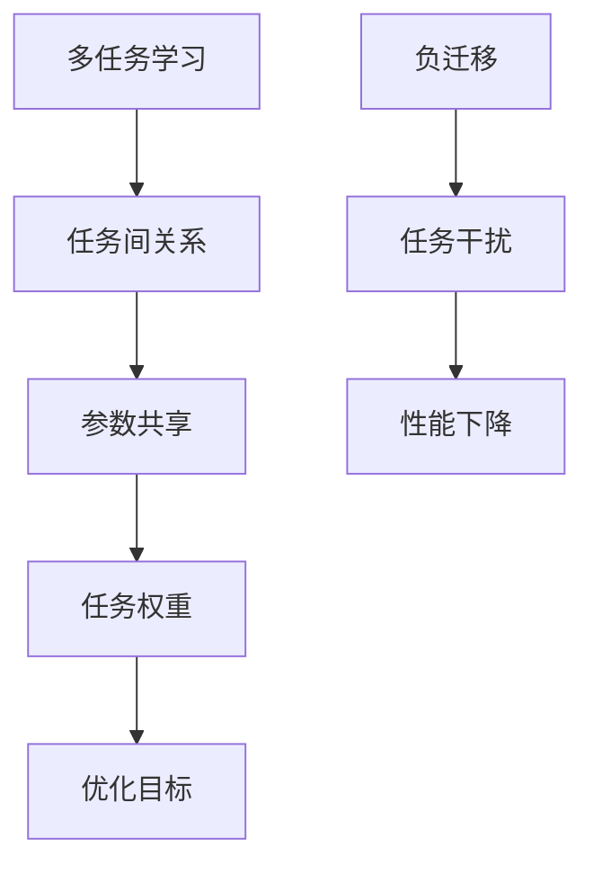
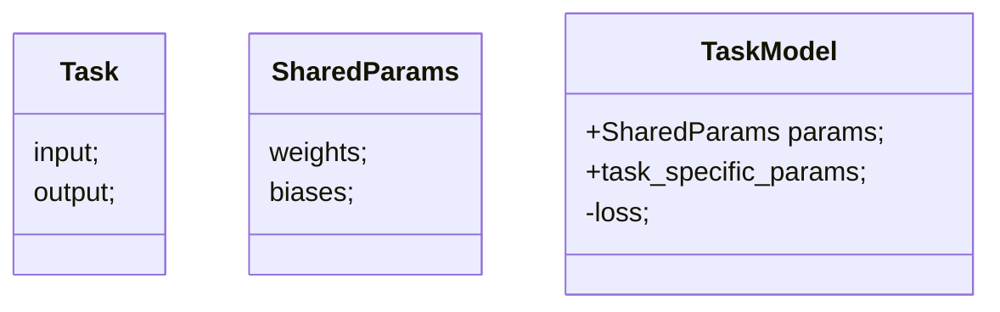
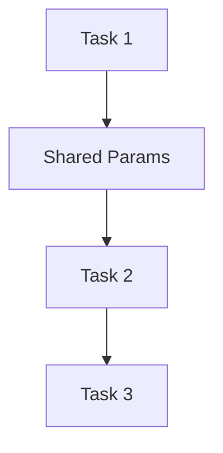
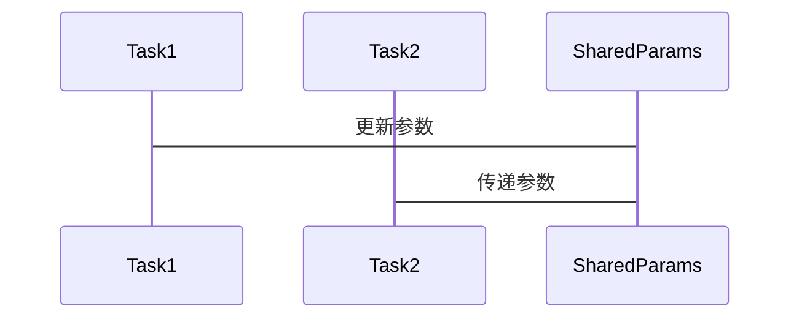

                 


# AI Agent的多任务学习与负迁移缓解

> 关键词：AI Agent, 多任务学习, 负迁移, 任务干扰, 参数共享, 模型优化

> 摘要：本文深入探讨了AI Agent在多任务学习中的挑战与解决方案，重点分析了负迁移现象及其对模型性能的影响。通过系统性地介绍多任务学习的核心原理、负迁移的产生机制以及缓解方法，本文提出了优化AI Agent多任务学习的系统架构和算法设计，旨在为AI开发者和研究者提供理论与实践相结合的指导。

---

# 第一部分: AI Agent的多任务学习与负迁移背景介绍

## 第1章: 问题背景与核心概念

### 1.1 问题背景
#### 1.1.1 多任务学习的定义与应用场景
多任务学习（Multi-Task Learning, MTL）是一种机器学习范式，旨在通过共享参数和特征来同时优化多个相关任务。其应用场景包括自然语言处理（如BERT）、计算机视觉（如多任务目标检测）以及AI Agent的智能决策系统等。

#### 1.1.2 AI Agent的定义与特点
AI Agent是一种智能实体，能够感知环境、执行任务并做出决策。AI Agent的核心特点包括自主性、反应性、目标导向性和学习能力。在多任务学习中，AI Agent需要同时处理多个任务，例如路径规划、目标识别和决策优化。

#### 1.1.3 负迁移的定义与表现形式
负迁移（Catastrophic Interference）是指在多任务学习中，学习一个新任务导致已有任务性能显著下降的现象。其表现形式包括任务遗忘、参数干扰和模型崩溃。

### 1.2 问题描述
#### 1.2.1 多任务学习中的负迁移现象
在AI Agent的多任务学习中，任务间的相互干扰会导致模型性能下降。例如，在学习新任务时，旧任务的权重被抑制，导致旧任务性能急剧下降。

#### 1.2.2 负迁移对AI Agent性能的影响
负迁移会降低AI Agent的整体性能，导致任务间协同不足，甚至出现任务冲突。这使得AI Agent无法高效地完成多个复杂任务。

#### 1.2.3 负迁移的潜在风险与挑战
负迁移可能导致模型训练不稳定，任务间难以有效协同，最终影响AI Agent的决策能力和用户体验。

### 1.3 问题解决思路
#### 1.3.1 多任务学习的目标与优化方向
通过优化任务间的参数共享机制，平衡各任务的学习权重，减少任务间的干扰。

#### 1.3.2 负迁移缓解的基本原则
采用任务分离、任务权重动态调整和参数保护等方法，减少负迁移的影响。

#### 1.3.3 AI Agent多任务学习的系统性解决方案
设计多任务学习框架，结合任务特性、模型结构和优化策略，实现任务间的协同与平衡。

### 1.4 边界与外延
#### 1.4.1 多任务学习的边界条件
多任务学习的边界包括任务相关性、参数共享程度和模型容量。

#### 1.4.2 负迁移的外延与相关概念
负迁移与任务遗忘、参数干扰等现象密切相关。

#### 1.4.3 AI Agent的多任务学习与其他任务的关系
AI Agent的多任务学习与其他任务（如单任务学习、元学习）存在相互关联和区别。

### 1.5 核心概念结构与组成
#### 1.5.1 多任务学习的核心要素
多任务学习的核心要素包括任务集合、参数共享、任务权重和优化目标。

#### 1.5.2 负迁移的核心特征
负迁移的核心特征包括任务间干扰、性能下降和权重抑制。

#### 1.5.3 AI Agent的多任务学习系统架构
AI Agent的多任务学习系统架构包括任务模块、参数共享层和优化模块。

---

# 第二部分: 多任务学习与负迁移的核心概念与联系

## 第2章: 多任务学习的核心原理

### 2.1 多任务学习的原理
#### 2.1.1 多任务学习的基本原理
多任务学习通过共享参数，同时优化多个任务的损失函数，提升模型的泛化能力。

#### 2.1.2 任务间关系的建模方法
任务间关系的建模方法包括参数共享、门控机制和任务权重动态调整。

#### 2.1.3 参数共享机制的作用
参数共享机制通过共享任务间的参数，降低模型的参数数量，提升模型的泛化能力。

### 2.2 负迁移的原理
#### 2.2.1 负迁移的产生机制
负迁移的产生机制包括任务间的参数竞争、梯度干扰和权重抑制。

#### 2.2.2 任务间干扰的数学模型
任务间干扰的数学模型可以用矩阵和向量表示，描述任务间参数的相互作用。

#### 2.2.3 负迁移的影响因素
负迁移的影响因素包括任务相关性、模型容量和优化策略。

### 2.3 多任务学习与负迁移的关系
#### 2.3.1 多任务学习中负迁移的内在联系
多任务学习中，负迁移是任务间参数竞争的自然结果。

#### 2.3.2 负迁移对多任务学习效果的影响
负迁移会导致任务间性能下降，影响多任务学习的整体效果。

#### 2.3.3 负迁移的缓解与多任务学习的优化
通过优化任务权重、参数共享机制和模型结构，可以有效缓解负迁移的影响。

---

## 第3章: 多任务学习与负迁移的核心概念对比

### 3.1 核心概念属性特征对比
| **概念** | **多任务学习** | **负迁移** |
|----------|----------------|------------|
| **核心目标** | 优化多个任务 | 减少任务干扰 |
| **主要挑战** | 任务间干扰 | 性能下降 |
| **解决方法** | 参数共享 | 任务权重调整 |

### 3.2 实体关系图


---

# 第三部分: 多任务学习与负迁移的算法原理

## 第4章: 基于MTL的负迁移缓解算法

### 4.1 MTL算法原理
#### 4.1.1 MTL的基本思想
通过共享参数，同时优化多个任务的损失函数。

#### 4.1.2 MTL的数学模型
$$ L = \sum_{i=1}^{n} \lambda_i L_i $$
其中，$\lambda_i$是任务权重，$L_i$是任务$i$的损失函数。

#### 4.1.3 MTL的优缺点
优点：提升模型的泛化能力；缺点：容易产生负迁移。

### 4.2 MTL算法实现
#### 4.2.1 算法流程
1. 初始化模型参数。
2. 计算每个任务的损失。
3. 更新模型参数，优化任务权重。

#### 4.2.2 Python代码示例
```python
import torch
import torch.nn as nn

class MTLModel(nn.Module):
    def __init__(self, input_dim, hidden_dim, output_dim):
        super(MTLModel, self).__init__()
        self.shared_layer = nn.Linear(input_dim, hidden_dim)
        self.task_layers = nn.ModuleList([nn.Linear(hidden_dim, output_dim) for _ in range(num_tasks)])
        
    def forward(self, x):
        features = self.shared_layer(x)
        outputs = [task_layer(features) for task_layer in self.task_layers]
        return outputs

# 示例代码
num_tasks = 2
model = MTLModel(input_dim=10, hidden_dim=5, output_dim=1)
criterion = nn.MSELoss()
optimizer = torch.optim.Adam(model.parameters(), lr=0.001)
```

### 4.3 MTL算法优化
#### 4.3.1 参数共享机制的优化
通过动态调整任务权重，减少任务间的参数竞争。

#### 4.3.2 任务权重的动态调整
$$ \lambda_i^{new} = \lambda_i^{old} \times \alpha $$
其中，$\alpha$是调整系数。

---

# 第四部分: 系统分析与架构设计

## 第5章: 系统分析与架构设计

### 5.1 系统分析
#### 5.1.1 问题场景介绍
AI Agent需要同时处理多个任务，任务间存在相互干扰。

#### 5.1.2 系统功能设计
AI Agent的多任务学习系统需要实现任务模块化、参数共享和任务权重动态调整。

### 5.2 系统架构设计
#### 5.2.1 领域模型


#### 5.2.2 系统架构图


#### 5.2.3 系统接口设计
系统接口包括任务输入、任务输出和任务权重调整接口。

#### 5.2.4 系统交互设计


---

# 第五部分: 项目实战

## 第6章: 项目实战

### 6.1 项目环境安装
安装PyTorch和必要的深度学习库。

### 6.2 核心代码实现
```python
import torch
import torch.nn as nn

class MultiTaskAgent(nn.Module):
    def __init__(self, input_dim, hidden_dim, output_dim):
        super(MultiTaskAgent, self).__init__()
        self.shared_layer = nn.Linear(input_dim, hidden_dim)
        self.task_layers = nn.ModuleList([nn.Linear(hidden_dim, output_dim) for _ in range(num_tasks)])
        
    def forward(self, x):
        features = self.shared_layer(x)
        outputs = [task_layer(features) for task_layer in self.task_layers]
        return outputs

# 训练过程
model = MultiTaskAgent(input_dim=10, hidden_dim=5, output_dim=1)
criterion = nn.MSELoss()
optimizer = torch.optim.Adam(model.parameters(), lr=0.001)

for epoch in range(num_epochs):
    inputs = torch.randn(batch_size, input_dim)
    outputs = model(inputs)
    loss = sum([criterion(output, target) for output, target in zip(outputs, targets)])
    optimizer.zero_grad()
    loss.backward()
    optimizer.step()
```

### 6.3 代码解读与分析
解释代码的功能和实现细节，分析模型的训练过程和优化策略。

### 6.4 案例分析
通过具体案例分析，验证模型的性能和负迁移缓解效果。

### 6.5 项目总结
总结项目成果，提出改进建议和未来研究方向。

---

# 第六部分: 最佳实践与总结

## 第7章: 最佳实践与总结

### 7.1 最佳实践
#### 7.1.1 参数共享策略
合理设置参数共享程度，避免任务间过度竞争。

#### 7.1.2 任务权重动态调整
根据任务的重要性动态调整权重，优化多任务学习效果。

#### 7.1.3 模型容量控制
选择适当的模型容量，平衡任务间的学习需求。

### 7.2 小结
本文系统性地介绍了AI Agent的多任务学习与负迁移缓解的核心原理、算法设计和系统架构，为AI开发者提供了理论与实践相结合的指导。

### 7.3 注意事项
在实际应用中，需注意任务相关性、模型容量和优化策略的选择。

### 7.4 拓展阅读
推荐相关领域的文献和资源，供读者深入学习。

---

通过以上内容，我们系统性地分析了AI Agent的多任务学习与负迁移缓解的问题，并提出了有效的解决方案，为实际应用提供了理论与实践的指导。

