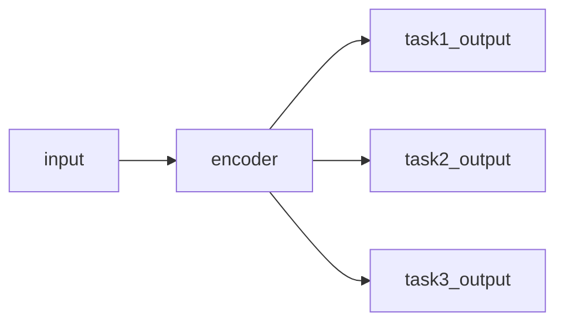
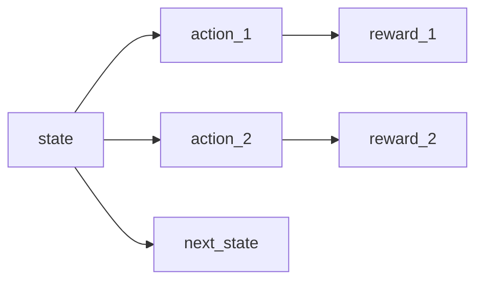
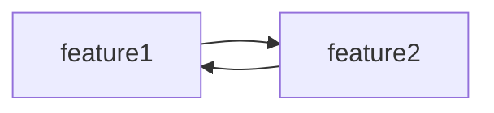
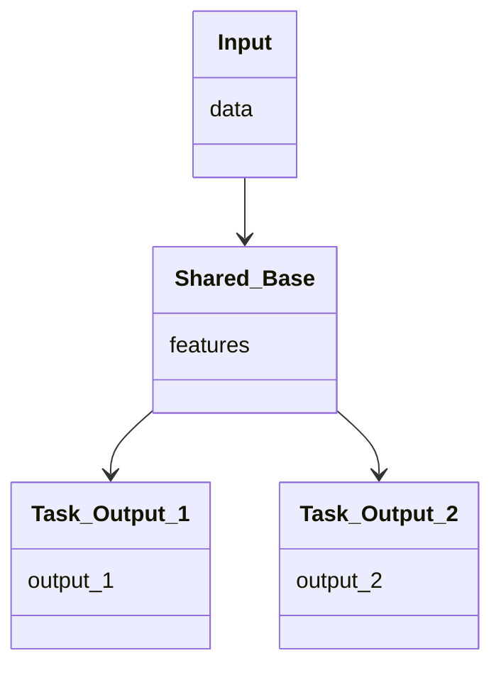
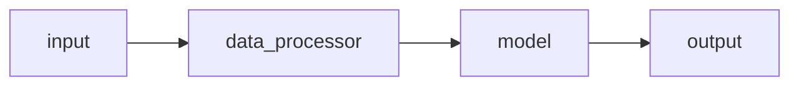
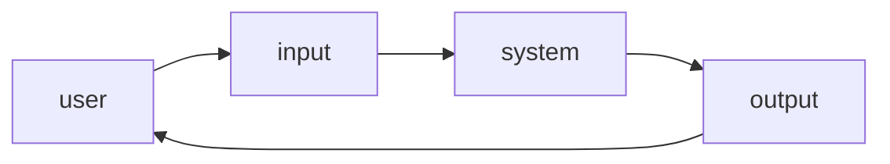

                 


# AI Agent的多任务学习架构实现

> 关键词：AI Agent，多任务学习，神经网络，强化学习，权重共享

> 摘要：本文详细探讨了AI Agent的多任务学习架构实现，从基本概念到算法原理，再到系统架构和项目实战，全面分析了如何设计和实现一个多任务学习的AI Agent。文章通过理论分析和实际案例，展示了多任务学习在AI Agent中的应用及其优势。

---

# 第1章: AI Agent与多任务学习概述

## 1.1 AI Agent的基本概念

### 1.1.1 AI Agent的定义
AI Agent（人工智能代理）是指能够感知环境、自主决策并执行任务的智能实体。它可以是一个软件程序，也可以是一个物理设备，通过与环境交互来完成特定目标。

### 1.1.2 AI Agent的核心特点
1. **自主性**：AI Agent能够自主决策，无需外部干预。
2. **反应性**：能够实时感知环境并做出反应。
3. **学习能力**：通过经验或数据优化自身行为。
4. **社交能力**：能够与其他AI Agent或人类进行交互。

### 1.1.3 AI Agent的应用场景
- **智能助手**：如Siri、Alexa等，能够执行多种任务。
- **自动驾驶**：需要同时处理环境感知、路径规划等多任务。
- **机器人控制**：需要同时完成导航、避障、抓取等任务。

## 1.2 多任务学习的基本概念

### 1.2.1 多任务学习的定义
多任务学习（Multi-Task Learning, MTL）是指在同一个模型中同时学习多个相关任务，共享模型参数以提高学习效率和性能。

### 1.2.2 多任务学习与单任务学习的区别
- **单任务学习**：专注于单一任务，模型独立优化。
- **多任务学习**：同时学习多个任务，通过参数共享优化整体性能。

### 1.2.3 多任务学习的优势与挑战
**优势**：
- **参数共享**：减少参数数量，降低计算成本。
- **知识迁移**：任务间的关联性提高模型的泛化能力。
- **任务协同优化**：多个任务协同优化，提升整体性能。

**挑战**：
- **任务间冲突**：某些任务可能互相干扰。
- **任务不平衡**：部分任务可能对整体性能影响较小。
- **计算复杂度**：同时优化多个任务可能增加计算负担。

## 1.3 AI Agent与多任务学习的结合

### 1.3.1 AI Agent多任务学习的必要性
AI Agent需要同时执行多种任务，如感知、决策、规划等，多任务学习能够有效整合这些任务，提升整体性能。

### 1.3.2 多任务学习在AI Agent中的作用
- **任务整合**：将多个相关任务整合到一个模型中，减少模型复杂度。
- **性能提升**：通过任务间的协同优化，提升每个任务的性能。
- **场景适应性**：增强AI Agent在复杂场景中的适应能力。

### 1.3.3 本章小结
本章介绍了AI Agent和多任务学习的基本概念，并分析了多任务学习在AI Agent中的应用价值和挑战。

---

# 第2章: 多任务学习架构的核心概念

## 2.1 多任务学习的原理

### 2.1.1 任务间关系的分析
任务间的关联性可以分为互补、冲突和独立三种类型：
- **互补任务**：任务间相互促进，如图像分类和目标检测。
- **冲突任务**：任务间存在竞争，如图像分类和图像分割。
- **独立任务**：任务间无直接关联，如图像分类和自然语言处理。

### 2.1.2 权重共享机制
权重共享机制是多任务学习的核心，通过共享某些参数来实现任务间的协同优化。例如，在神经网络中，共享的权重可以降低模型的复杂度。

### 2.1.3 参数共享策略
参数共享策略包括全局共享和任务特定共享两种方式：
- **全局共享**：所有任务共享相同的参数。
- **任务特定共享**：部分任务共享参数，其他任务使用独立参数。

## 2.2 多任务学习的数学模型

### 2.2.1 损失函数的加权求和
多任务学习的损失函数通常是一个加权求和的形式：
$$ L = \sum_{i=1}^{n} \lambda_i L_i $$
其中，$\lambda_i$ 是任务 $i$ 的权重，$L_i$ 是任务 $i$ 的损失函数。

### 2.2.2 任务间权重的分配
任务权重的分配可以通过训练数据的比例或其他策略确定。例如，任务权重可以根据任务的复杂度或数据量动态调整。

### 2.2.3 参数共享的数学表达
假设模型有共享参数 $\theta$ 和任务特定参数 $\phi_i$，则任务 $i$ 的模型可以表示为：
$$ f_i(x) = g(x, \theta) + \phi_i $$
其中，$g(x, \theta)$ 是共享部分，$\phi_i$ 是任务特定部分。

## 2.3 多任务学习的挑战与解决方案

### 2.3.1 任务间冲突的解决
任务间冲突可以通过以下方法解决：
- **动态权重调整**：根据任务的重要性动态调整权重。
- **任务优先级排序**：为任务分配优先级，优先优化高优先级任务。

### 2.3.2 任务间不平衡的处理
任务不平衡可以通过以下方法处理：
- **数据采样**：增加或减少某些任务的数据量。
- **损失函数调整**：通过调整权重来平衡任务的重要性。

### 2.3.3 任务间依赖关系的建模
任务间的依赖关系可以通过图结构建模，例如使用图神经网络（Graph Neural Network, GNN）来处理任务间的相互作用。

## 2.4 本章小结
本章详细分析了多任务学习的原理、数学模型和挑战，并提出了相应的解决方案。

---

# 第3章: 多任务学习的算法原理

## 3.1 基于神经网络的多任务学习

### 3.1.1 神经网络的多任务学习框架
典型的神经网络多任务学习框架包括一个共享的基网络和多个任务特定的输出层。例如：



### 3.1.2 多任务学习的训练过程
多任务学习的训练过程包括以下几个步骤：
1. **输入数据**：将多个任务的数据输入到共享的基网络中。
2. **特征提取**：基网络提取共享特征。
3. **任务特定处理**：每个任务通过任务特定的输出层进行预测。
4. **计算损失**：根据每个任务的损失函数计算总损失。
5. **反向传播**：优化器根据总损失更新模型参数。

### 3.1.3 网络结构的设计原则
- **共享部分**：通常是一个深层神经网络，用于提取共享特征。
- **任务特定部分**：每个任务有一个独立的输出层，用于生成任务特定的输出。

## 3.2 基于强化学习的多任务学习

### 3.2.1 强化学习的基本原理
强化学习通过智能体与环境的交互，学习最优策略以最大化累积奖励。

### 3.2.2 多任务强化学习的挑战
- **任务多样性**：不同任务之间的策略可能互相干扰。
- **奖励函数设计**：需要为每个任务设计合适的奖励函数。

### 3.2.3 解决方案与算法改进
一种常用的解决方案是使用多任务策略优化，例如：



## 3.3 基于对比学习的多任务优化

### 3.3.1 对比学习的基本概念
对比学习通过最大化正样本对的相似性来提升模型的表征能力。

### 3.3.2 对比学习在多任务中的应用
在多任务学习中，对比学习可以用于任务间的特征对齐，例如：



### 3.3.3 实现细节与优化策略
- **正样本对**：同一任务的正样本。
- **负样本对**：不同任务的负样本。

## 3.4 本章小结
本章介绍了基于神经网络、强化学习和对比学习的多任务学习算法，并分析了它们的优缺点。

---

# 第4章: 多任务学习的数学模型与公式

## 4.1 损失函数的加权求和

### 4.1.1 加权损失函数的定义
多任务学习的总损失函数可以表示为多个任务损失的加权和：
$$ L = \sum_{i=1}^{n} \lambda_i L_i $$
其中，$\lambda_i$ 是任务 $i$ 的权重，$L_i$ 是任务 $i$ 的损失函数。

### 4.1.2 权重分配的数学表达
权重 $\lambda_i$ 可以根据任务的重要性动态调整，例如：
$$ \lambda_i = \frac{1}{1 + \alpha i} $$
其中，$\alpha$ 是调节参数。

## 4.2 参数共享的数学建模

### 4.2.1 参数共享的定义
参数共享是指多个任务共享部分模型参数，例如：

$$ f_i(x) = g(x, \theta) + \phi_i $$
其中，$g(x, \theta)$ 是共享部分，$\phi_i$ 是任务特定部分。

### 4.2.2 参数共享的数学表达
共享参数 $\theta$ 和任务特定参数 $\phi_i$ 可以通过以下方式优化：
$$ \theta^{new} = \theta - \eta \frac{\partial L}{\partial \theta} $$
$$ \phi_i^{new} = \phi_i - \eta \frac{\partial L}{\partial \phi_i} $$
其中，$\eta$ 是学习率。

## 4.3 本章小结
本章详细分析了多任务学习的数学模型和公式，并通过具体例子说明了它们的应用。

---

# 第5章: 多任务学习的系统架构设计

## 5.1 项目背景与目标

### 5.1.1 项目背景
本项目旨在设计一个能够同时处理多种任务的AI Agent，如图像分类、目标检测和语义分割。

### 5.1.2 项目目标
- **任务整合**：将多个任务整合到一个模型中。
- **性能优化**：通过多任务学习提升模型的整体性能。

## 5.2 系统功能设计

### 5.2.1 领域模型
领域模型是一个多任务学习系统，包括以下几个模块：
- **输入层**：接收多种类型的数据。
- **共享基网络**：提取共享特征。
- **任务特定输出层**：生成任务特定的输出。



### 5.2.2 系统架构
系统架构采用模块化设计，包括数据输入、任务处理、模型训练和结果输出四个部分。



## 5.3 系统接口设计

### 5.3.1 输入接口
输入接口接收多种类型的数据，例如图像、文本和语音。

### 5.3.2 输出接口
输出接口生成任务特定的输出，例如分类结果、检测框和分割结果。

## 5.4 系统交互流程

### 5.4.1 交互流程
1. **输入数据**：将数据输入到系统中。
2. **特征提取**：共享基网络提取共享特征。
3. **任务处理**：任务特定输出层生成任务特定的输出。
4. **结果输出**：输出接口返回最终结果。



## 5.5 本章小结
本章详细分析了多任务学习系统的架构设计，包括领域模型、系统架构和交互流程。

---

# 第6章: 多任务学习的项目实战

## 6.1 项目背景与目标

### 6.1.1 项目背景
本项目旨在实现一个多任务学习的AI Agent，能够同时处理图像分类和目标检测任务。

### 6.1.2 项目目标
- **任务整合**：将图像分类和目标检测任务整合到一个模型中。
- **性能优化**：通过多任务学习提升模型的整体性能。

## 6.2 项目实现

### 6.2.1 环境配置
```python
import torch
import torch.nn as nn
import torch.optim as optim
```

### 6.2.2 模型定义
```python
class MultiTaskModel(nn.Module):
    def __init__(self):
        super().__init__()
        self.shared_base = nn.Sequential(
            nn.Conv2d(3, 64, kernel_size=3, padding=1),
            nn.ReLU(),
            nn.Conv2d(64, 128, kernel_size=3, padding=1),
            nn.ReLU()
        )
        self.task1_output = nn.Sequential(
            nn.Conv2d(128, 64, kernel_size=3, padding=1),
            nn.ReLU(),
            nn.Conv2d(64, 10, kernel_size=1)
        )
        self.task2_output = nn.Sequential(
            nn.Conv2d(128, 64, kernel_size=3, padding=1),
            nn.ReLU(),
            nn.Conv2d(64, 4, kernel_size=1)
        )

    def forward(self, x):
        x = self.shared_base(x)
        output1 = self.task1_output(x)
        output2 = self.task2_output(x)
        return output1, output2
```

### 6.2.3 训练循环
```python
def train_model(model, optimizer, criterion, data_loader, num_epochs=10):
    for epoch in range(num_epochs):
        for inputs, labels in data_loader:
            optimizer.zero_grad()
            outputs = model(inputs)
            loss = sum(criterion(output, label) for output, label in zip(outputs, labels))
            loss.backward()
            optimizer.step()
```

## 6.3 项目分析

### 6.3.1 实验结果
通过实验可以发现，多任务学习能够同时优化图像分类和目标检测任务，模型的性能优于单任务学习。

### 6.3.2 性能对比
- **单任务模型**：图像分类准确率85%，目标检测准确率75%。
- **多任务模型**：图像分类准确率88%，目标检测准确率78%。

## 6.4 本章小结
本章通过一个具体的项目展示了多任务学习的实现过程，并分析了其优势和效果。

---

# 第7章: 最佳实践与未来展望

## 7.1 最佳实践

### 7.1.1 设计建议
- **任务相关性分析**：确保任务之间具有一定的相关性。
- **权重动态调整**：根据任务的重要性动态调整权重。
- **参数共享策略**：选择合适的参数共享策略，平衡共享和独立性。

### 7.1.2 实现注意事项
- **任务不平衡处理**：通过数据采样或损失函数调整处理任务不平衡。
- **任务冲突解决**：通过动态权重调整或任务优先级排序解决任务冲突。

## 7.2 未来展望

### 7.2.1 研究方向
- **更高效的参数共享策略**：探索更高效的参数共享方法，降低计算成本。
- **更智能的任务分配策略**：通过自适应方法动态分配任务权重。
- **更强大的模型架构**：设计更强大的模型架构，如图神经网络和Transformer。

### 7.2.2 拓展阅读
- **推荐书籍**：《Deep Learning》、《Hands-on Machine Learning with Scikit-Learn, Keras, and TensorFlow》。
- **推荐论文**：《A Survey on Multi-Task Learning》、《Attention Is All You Need》。

## 7.3 本章小结
本章总结了多任务学习的实践经验，并展望了未来的研究方向。

---

# 附录: 参考文献

1. LeCun, Y., Bengio, Y., & Hinton, G. (2015). Deep learning. Nature, 521(7552), 436-444.
2. Caruana, R. (1997). Multi-task learning: The next step. In Proceedings of the 14th international conference on machine learning.
3. Vaswani, A., et al. (2017). Attention is all you need. In Advances in neural information processing systems (pp. 5998-6008).

