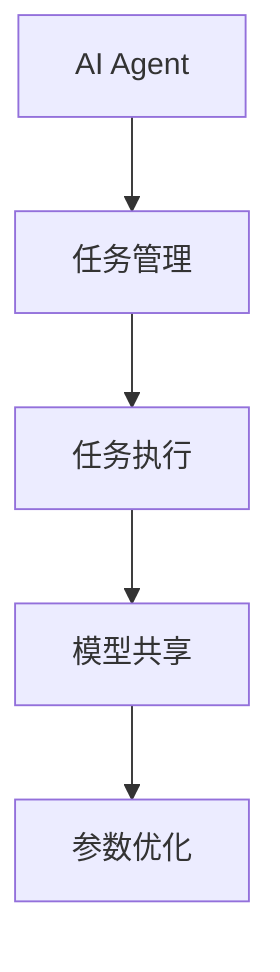
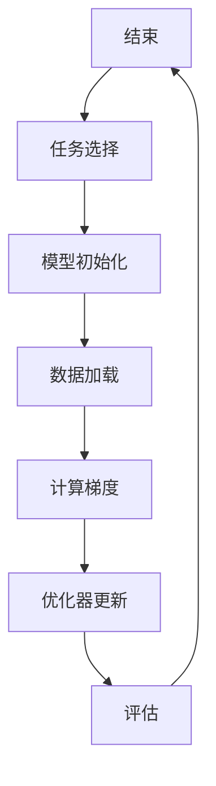
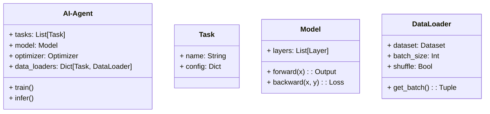

                 


# AI Agent的多任务学习：增强LLM的泛化能力

> 关键词：AI Agent, 多任务学习, 大语言模型, 泛化能力, 系统架构

> 摘要：本文深入探讨了AI Agent的多任务学习方法，分析其如何通过多任务学习增强大语言模型（LLM）的泛化能力。文章从背景介绍、核心概念、算法原理、系统架构到项目实战，全面解析了AI Agent多任务学习的实现与应用，旨在为读者提供系统性、实用性的技术指导。

---

## 第一部分: 背景介绍

### 第1章: AI Agent与多任务学习概述

#### 1.1 AI Agent的基本概念

##### 1.1.1 AI Agent的定义与特点
AI Agent（人工智能代理）是指能够感知环境、自主决策并执行任务的智能体。其特点包括：  
1. **自主性**：能够在没有外部干预的情况下独立运行。  
2. **反应性**：能够实时感知环境变化并做出响应。  
3. **目标导向**：通过设定目标来驱动行为。  
4. **学习能力**：能够通过经验改进自身性能。  

##### 1.1.2 AI Agent的核心功能
1. **感知**：通过传感器或接口获取环境信息。  
2. **决策**：基于感知信息进行推理和选择最优行动方案。  
3. **执行**：通过执行器将决策转化为实际操作。  

##### 1.1.3 AI Agent的应用场景
AI Agent广泛应用于自动驾驶、智能助手、机器人控制、游戏AI等领域。

---

#### 1.2 多任务学习的基本概念

##### 1.2.1 多任务学习的定义
多任务学习（Multi-Task Learning, MTL）是指在一个统一的模型中同时学习多个相关任务，通过共享模型参数来提升学习效率和泛化能力。

##### 1.2.2 多任务学习的优势
1. **减少数据需求**：通过共享参数，减少每个任务单独训练所需的数据量。  
2. **提升泛化能力**：通过跨任务学习，模型能够更好地泛化到新任务。  
3. **降低计算成本**：一次性训练多个任务，节省计算资源。  

##### 1.2.3 多任务学习的挑战
1. **任务干扰**：某些任务可能相互干扰，影响模型性能。  
2. **参数协调**：需要平衡不同任务之间的参数共享。  
3. **任务多样性**：任务过于多样化可能导致模型难以有效共享参数。  

---

### 第2章: 多任务学习与LLM的结合

#### 2.1 LLM的基本原理

##### 2.1.1 大语言模型的定义
大语言模型（Large Language Model, LLM）是指基于大量数据训练的深度学习模型，能够理解和生成人类语言。

##### 2.1.2 LLM的核心技术
1. **Transformer架构**：通过自注意力机制捕捉长距离依赖关系。  
2. **预训练与微调**：通过大规模数据预训练，再针对特定任务进行微调。  

##### 2.1.3 LLM的训练与推理
- **训练**：通过最大化似然估计，优化模型参数以拟合训练数据。  
- **推理**：基于训练好的模型，生成符合任务要求的输出。  

---

#### 2.2 多任务学习在LLM中的应用

##### 2.2.1 多任务学习如何增强LLM的泛化能力
通过多任务学习，LLM可以在单一模型中同时处理多种任务（如文本生成、问答、翻译等），从而提升模型的泛化能力。

##### 2.2.2 多任务学习在LLM中的实现方式
1. **参数共享**：在模型的不同部分共享参数，以减少参数数量。  
2. **任务权重调整**：通过动态调整任务权重，平衡不同任务的重要性。  

##### 2.2.3 多任务学习对LLM性能的提升
- **提升任务多样性**：模型能够处理更多样化的任务。  
- **降低过拟合风险**：通过跨任务学习，模型更具鲁棒性。  

---

## 第二部分: 核心概念与联系

### 第3章: 多任务学习的核心概念与联系

#### 3.1 多任务学习的原理

##### 3.1.1 任务表示与模型共享
- **任务表示**：将不同任务编码为模型可以理解的形式。  
- **模型共享**：通过共享参数或模块，实现跨任务学习。  

##### 3.1.2 损失函数的设计
- **任务损失**：每个任务的损失函数。  
- **总损失**：综合多个任务损失的总损失函数。  

##### 3.1.3 参数共享机制
- **全局共享**：所有任务共享所有参数。  
- **层次共享**：按层次共享参数，不同任务共享不同部分的参数。  

---

#### 3.2 核心概念对比表

| 对比维度         | 单任务学习          | 多任务学习          |
|------------------|---------------------|---------------------|
| 参数数量         | 任务独立，参数不共享 | 任务相关，参数共享   |
| 训练数据         | 每任务独立数据集     | 多任务共享数据集     |
| 计算效率         | 高                  | 低                  |
| 泛化能力         | 有限                | 强                  |

---

#### 3.3 ER实体关系图架构



---

## 第三部分: 算法原理讲解

### 第4章: 算法原理

#### 4.1 多任务学习算法

##### 4.1.1 算法流程



##### 4.1.2 算法实现

```python
class MultiTaskModel:
    def __init__(self, tasks):
        self.tasks = tasks
        self.model = self._build_model()
        self.optimizer = Adam(lr=0.001)

    def _build_model(self):
        # 构建模型架构
        pass

    def train(self, data_loaders, epochs=10):
        for epoch in range(epochs):
            for task in self.tasks:
                x, y = next(iter(data_loaders[task]))
                self.optimizer.zero_grad()
                outputs = self.model(x, task)
                loss = self._compute_loss(outputs, y, task)
                loss.backward()
                self.optimizer.step()

    def _compute_loss(self, outputs, y, task):
        # 根据任务选择损失函数
        pass
```

##### 4.1.3 数学模型

$$ L_{\text{total}} = \alpha L_1 + \beta L_2 + \gamma L_3 $$

其中，$\alpha, \beta, \gamma$ 是任务权重，$L_1, L_2, L_3$ 是各任务的损失函数。

---

## 第四部分: 系统分析与架构设计方案

### 第5章: 系统分析与架构设计方案

#### 5.1 问题场景介绍
设计一个AI Agent系统，能够同时处理文本生成、问答、翻译等多个任务。

#### 5.2 系统功能设计

##### 5.2.1 功能模块
1. **任务管理模块**：管理多个任务的执行流程。  
2. **模型管理模块**：管理模型的训练和推理。  
3. **数据管理模块**：管理多任务数据集。  

##### 5.2.2 领域模型



---

## 第五部分: 项目实战

### 第6章: 项目实战

#### 6.1 环境安装
1. **安装Python和相关库**：如PyTorch、Hugging Face Transformers等。  
2. **安装工具链**：如Jupyter Notebook、VS Code等。  

#### 6.2 核心代码实现

```python
import torch
from torch import nn, optim
from torch.utils.data import DataLoader

class MultiTaskModel(nn.Module):
    def __init__(self, vocab_size, embedding_dim, hidden_dim, output_dims):
        super().__init__()
        self.embedding = nn.Embedding(vocab_size, embedding_dim)
        self.lstm = nn.LSTM(embedding_dim, hidden_dim, batch_first=True)
        self.fc = nn.ModuleList([nn.Linear(hidden_dim, dim) for dim in output_dims])

    def forward(self, x, task_idx):
        embeds = self.embedding(x)
        out, _ = self.lstm(embeds)
        out = out[:, -1, :]
        return self.fc[task_idx](out)

def train(model, data_loaders, epochs=10, learning_rate=0.01):
    optimizer = optim.Adam(model.parameters(), lr=learning_rate)
    criterion = nn.CrossEntropyLoss()
    for epoch in range(epochs):
        for task_idx, (x, y) in enumerate(data_loaders):
            optimizer.zero_grad()
            outputs = model(x, task_idx)
            loss = criterion(outputs, y)
            loss.backward()
            optimizer.step()
```

#### 6.3 项目小结
通过本项目，读者可以掌握AI Agent多任务学习的实现方法，并能够将其应用于实际场景中。

---

## 第六部分: 最佳实践

### 第7章: 最佳实践

#### 7.1 小结
AI Agent的多任务学习通过共享参数和跨任务学习，显著提升了LLM的泛化能力。

#### 7.2 注意事项
1. **任务相关性**：确保任务之间具有一定的相关性，避免任务干扰。  
2. **任务权重调整**：根据任务重要性动态调整权重。  
3. **数据质量**：确保多任务数据集的质量和多样性。  

#### 7.3 拓展阅读
1. **论文推荐**：阅读相关多任务学习的论文，如《A Survey on Multi-Task Learning》。  
2. **工具推荐**：使用Hugging Face Transformers库进行多任务模型实现。  

---

# 结语

本文系统性地介绍了AI Agent的多任务学习方法，从理论到实践，全面解析了其在增强LLM泛化能力中的应用。通过本文的学习，读者可以掌握多任务学习的核心概念和实现方法，并能够将其应用于实际项目中。希望本文对读者在AI Agent和多任务学习领域的研究和实践有所帮助。

