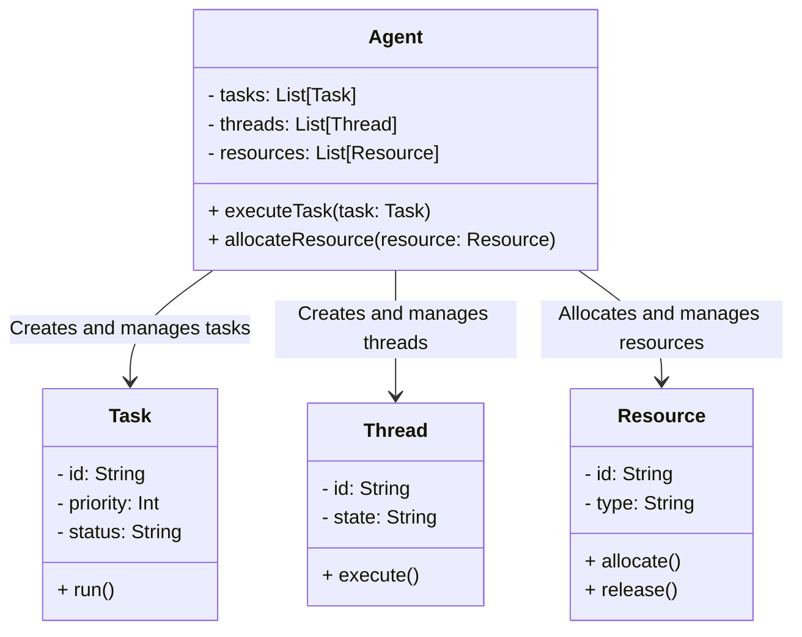
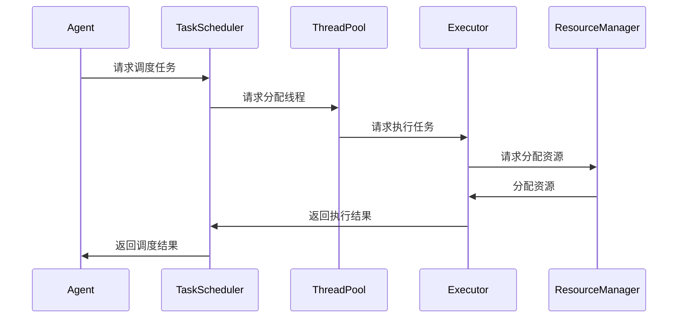

                 


# AI Agent的多任务并行处理技术

> 关键词：AI Agent、多任务处理、并行计算、分布式系统、异步处理

> 摘要：本文深入探讨了AI Agent在多任务并行处理技术中的应用，从核心概念、算法原理、系统架构到项目实战，全面解析了多任务并行处理的技术细节和实现方法。文章结合理论与实践，通过丰富的案例分析和代码实现，帮助读者掌握AI Agent在多任务并行处理中的关键技术和最佳实践。

---

# 第一部分: AI Agent的多任务并行处理技术概述

# 第1章: AI Agent的多任务并行处理背景与概念

## 1.1 AI Agent的基本概念
### 1.1.1 AI Agent的定义
AI Agent（人工智能代理）是指能够感知环境、自主决策并执行任务的智能实体。它能够通过传感器获取信息，利用算法进行分析和推理，并通过执行器与环境交互。

### 1.1.2 AI Agent的核心特征
- **自主性**：能够在没有外部干预的情况下自主运行。
- **反应性**：能够实时感知环境变化并做出响应。
- **目标导向性**：具有明确的目标，并能够为实现目标而采取行动。
- **学习能力**：能够通过经验优化自身的行为和决策。

### 1.1.3 AI Agent的分类与应用场景
AI Agent可以分为**简单反射型代理**、**基于模型的反射型代理**、**目标驱动型代理**、**效用驱动型代理**和**学习型代理**。其应用场景包括自动驾驶、智能助手、机器人控制、分布式系统协调等。

---

## 1.2 多任务并行处理的背景与挑战
### 1.2.1 多任务处理的背景
随着AI技术的快速发展，AI Agent需要在复杂环境中执行多个任务，例如自动驾驶汽车需要同时处理路径规划、障碍物检测和决策优化等任务。

### 1.2.2 多任务并行处理的挑战
- **资源竞争**：多个任务需要共享计算资源，可能导致资源分配不均。
- **任务优先级**：如何在有限的资源下合理分配任务优先级。
- **任务协调**：多个任务之间需要协调，避免冲突和干扰。

### 1.2.3 多任务并行处理的必要性
在现代AI系统中，单任务处理已经无法满足需求，多任务并行处理能够提高系统的效率和响应速度，使其能够更好地适应复杂的动态环境。

---

## 1.3 本章小结
本章介绍了AI Agent的基本概念、核心特征和分类，并分析了多任务并行处理的背景和挑战。通过这些内容，读者可以理解AI Agent在多任务并行处理中的重要性。

---

# 第2章: 多任务并行处理的核心概念与联系

## 2.1 核心概念原理
### 2.1.1 多任务处理的基本原理
多任务处理是指在同一时间执行多个任务，这些任务可以在同一时间段内被分解和分配到不同的计算资源上进行处理。

### 2.1.2 并行处理的关键技术
- **多线程**：在同一时间段内同时执行多个线程，利用CPU的多核特性。
- **多进程**：将任务分解为多个独立的进程，每个进程在不同的内存空间中运行。
- **分布式计算**：将任务分配到多个节点上，利用网络进行通信和协作。

### 2.1.3 AI Agent的多任务协调机制
AI Agent需要通过任务调度算法、资源分配策略和任务队列管理来实现多任务的协调和优化。

---

## 2.2 核心概念属性对比表格
下表对比了多任务并行处理中的三个核心概念：并行处理、分布式处理和异步处理。

| 概念       | 并行处理 | 分布式处理 | 异步处理 |
|------------|----------|------------|----------|
| 定义       | 同一时间执行多个任务 | 任务分布在不同节点 | 任务之间无顺序依赖 |
| 优势       | 提高效率 | 资源利用均衡 | 响应速度快 |
| 局限性      | 资源竞争 | 网络延迟 | 同步困难 |

---

## 2.3 ER实体关系图
下图展示了AI Agent的多任务并行处理中的实体关系。

```mermaid
er
actor(Agent) -|> task: 执行任务
actor(thread) -|> task: 并行处理
```

---

## 2.4 本章小结
本章详细介绍了多任务并行处理的核心概念和关键原理，并通过对比分析和实体关系图帮助读者理解这些概念之间的联系。

---

# 第3章: 多任务并行处理的算法原理

## 3.1 算法原理概述
### 3.1.1 并行计算的基本原理
并行计算通过将任务分解为多个子任务，利用多个计算资源同时执行，从而提高计算效率。

### 3.1.2 分布式计算的核心思想
分布式计算将任务分配到多个计算节点上，通过网络通信进行数据交换和协作。

### 3.1.3 多线程与多进程的区别
- **多线程**：多个线程共享同一块内存空间，适合任务之间需要频繁通信的场景。
- **多进程**：每个进程拥有独立的内存空间，适合任务之间相对独立的场景。

---

## 3.2 并行处理算法的数学模型
### 3.2.1 并行计算的数学公式
$$T_{\text{total}} = \frac{T_{\text{serial}}}{N}$$
其中，$T_{\text{total}}$ 表示总时间，$T_{\text{serial}}$ 表示串行时间，$N$ 表示并行任务数。

### 3.2.2 任务调度算法
- **轮转调度算法**：按照时间片轮转的方式分配任务执行时间。
- **优先级调度算法**：根据任务优先级进行调度，优先级高的任务优先执行。

---

## 3.3 任务分配与负载均衡算法
### 3.3.1 负载均衡的核心思想
负载均衡通过动态分配任务，确保各个计算节点的负载均衡，避免资源浪费和性能瓶颈。

### 3.3.2 常见负载均衡算法
- **随机分配算法**：随机选择一个节点分配任务。
- **轮转分配算法**：按顺序将任务分配到不同的节点。
- **基于负载的分配算法**：根据节点当前负载情况动态分配任务。

---

## 3.4 本章小结
本章从算法原理的角度分析了多任务并行处理的技术细节，包括并行计算的基本原理、分布式计算的核心思想、任务调度算法和负载均衡算法。

---

# 第4章: 多任务并行处理的系统分析与架构设计

## 4.1 系统分析
### 4.1.1 项目场景介绍
以一个AI Agent需要同时执行路径规划、环境感知和决策优化的场景为例。

### 4.1.2 系统功能设计
- **任务分解模块**：将主任务分解为多个子任务。
- **任务调度模块**：负责任务的分配和调度。
- **资源管理模块**：管理计算资源，确保负载均衡。

---

## 4.2 系统架构设计
### 4.2.1 领域模型设计


### 4.2.2 系统架构图
```mermaid
graph TD
    Agent --> TaskScheduler: 调度任务
    TaskScheduler --> ThreadPool: 分配线程
    ThreadPool --> Executor: 执行任务
    Executor --> ResourceManager: 管理资源
    ResourceManager --> Agent: 返回结果
```

### 4.2.3 系统接口设计
- **任务调度接口**：`scheduleTask(Task task)`
- **资源分配接口**：`allocateResource(Resource resource)`
- **任务执行接口**：`executeTask(Task task)`

### 4.2.4 系统交互流程图


---

## 4.3 本章小结
本章从系统分析和架构设计的角度，详细介绍了AI Agent多任务并行处理的实现方案，包括领域模型设计、系统架构图和系统交互流程图。

---

# 第5章: 多任务并行处理的项目实战

## 5.1 环境安装与配置
### 5.1.1 安装Python环境
使用Anaconda或Pyenv安装Python 3.8以上版本。

### 5.1.2 安装依赖库
安装`multiprocessing`、`threading`和`socket`等库。

---

## 5.2 系统核心功能实现
### 5.2.1 多线程实现
```python
import threading

def task_func(args):
    print(f"Thread {args['thread_id']} is running task {args['task_id']}")

if __name__ == "__main__":
    threads = []
    for i in range(4):
        args = {
            "thread_id": i+1,
            "task_id": 1
        }
        thread = threading.Thread(target=task_func, kwargs=args)
        thread.start()
        threads.append(thread)
    for thread in threads:
        thread.join()
```

### 5.2.2 分布式任务调度
```python
import socket

def server():
    s = socket.socket(socket.AF_INET, socket.SOCK_STREAM)
    s.bind(('localhost', 8000))
    s.listen()
    while True:
        conn, addr = s.accept()
        with conn:
            data = conn.recv(1024)
            if not data:
                break
            print(f"Received: {data.decode()}")
            conn.send("Message received".encode())

def client():
    s = socket.socket(socket.AF_INET, socket.SOCK_STREAM)
    s.connect(('localhost', 8000))
    message = "Hello, server!"
    s.send(message.encode())
    response = s.recv(1024)
    print(f"Response: {response.decode()}")

if __name__ == "__main__":
    import threading
    server_thread = threading.Thread(target=server)
    client_thread = threading.Thread(target=client)
    server_thread.start()
    client_thread.start()
    server_thread.join()
    client_thread.join()
```

---

## 5.3 代码实现与分析
### 5.3.1 多线程实现分析
上述代码通过`threading`模块实现了多线程任务处理，每个线程负责执行特定的任务。

### 5.3.2 分布式任务调度分析
上述代码通过`socket`模块实现了简单的分布式任务调度，服务器端和客户端通过网络通信进行任务分配和结果返回。

---

## 5.4 本章小结
本章通过具体的代码实现，展示了AI Agent多任务并行处理的实现方法，包括多线程和分布式任务调度的实现。

---

# 第6章: 多任务并行处理的最佳实践与总结

## 6.1 最佳实践
- **任务分解**：合理分解任务，确保任务粒度适中。
- **资源分配**：根据任务需求动态分配资源，避免资源浪费。
- **任务协调**：通过任务调度算法和负载均衡算法优化任务执行效率。

## 6.2 小结
本文从理论到实践，全面解析了AI Agent多任务并行处理的技术细节，通过具体的代码实现和系统设计，帮助读者掌握多任务并行处理的核心技术和最佳实践。

## 6.3 注意事项
- **资源竞争**：多任务并行处理可能导致资源竞争，需要合理分配任务优先级。
- **网络延迟**：分布式任务调度需要考虑网络延迟，确保通信效率。
- **任务同步**：异步任务处理需要注意任务之间的依赖关系，避免死锁和阻塞。

## 6.4 拓展阅读
- 推荐阅读《Concurrency in Practice》和《Distributed Systems Concepts and Design》深入了解多任务并行处理和分布式系统设计。

---

# 结语
通过本文的学习，读者可以掌握AI Agent多任务并行处理的核心技术和实现方法，为后续的项目开发和技术创新打下坚实的基础。

