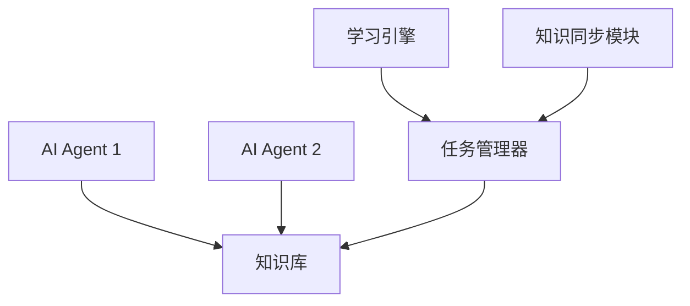
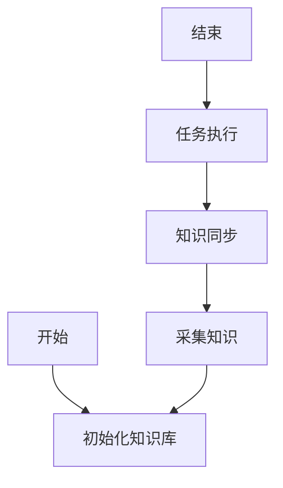
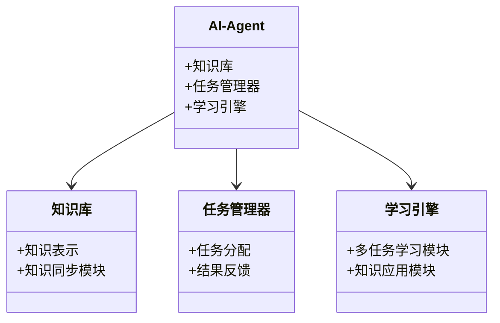

                 


# AI Agent的多任务并行学习与知识共享

## 关键词：
AI Agent, 多任务学习, 知识共享, 并行学习, 人工智能, 知识图谱

## 摘要：
本文系统地探讨了AI Agent在多任务并行学习与知识共享领域的核心原理、算法实现及系统设计。从AI Agent的基本概念出发，逐步深入分析多任务并行学习的算法框架，详细阐述知识共享的机制与实现。通过实际案例分析，展示如何设计和实现高效的AI Agent系统，确保知识的有效共享与协作。本文适合对人工智能和分布式系统感兴趣的读者，帮助他们掌握AI Agent多任务并行学习与知识共享的关键技术。

---

## 第一部分: AI Agent的多任务并行学习与知识共享背景与基础

### 第1章: AI Agent的基本概念
#### 1.1 AI Agent的定义与特点
- 1.1.1 AI Agent的定义
  - AI Agent：具备感知环境、自主决策和执行任务能力的智能体。
  - 核心特点：智能性、自主性、反应性、主动性。

- 1.1.2 多任务并行学习的背景与意义
  - 多任务学习：在同一模型中学习多个任务，提升泛化能力和效率。
  - 并行学习的优势：资源利用率高，任务间互补性强。

- 1.1.3 知识共享的核心要素
  - 知识共享：AI Agent之间交换和整合知识的过程。
  - 核心要素：知识表示、共享协议、同步机制。

#### 1.2 AI Agent的分类与应用场景
- 1.2.1 单任务AI Agent
  - 专注于单一任务，适用于简单场景。
- 1.2.2 多任务AI Agent
  - 能够同时处理多个任务，适用于复杂场景。
- 1.2.3 知识共享AI Agent的实际应用
  - 智慧城市、分布式计算、智能协作等领域。

---

### 第2章: 多任务并行学习的核心概念
#### 2.1 多任务学习的基本原理
- 2.1.1 多任务学习的定义
  - 在同一模型中学习多个任务，共享参数以提升性能。
- 2.1.2 多任务学习的优势与挑战
  - 优势：减少数据需求，提升泛化能力。
  - 挑战：任务间干扰，参数优化复杂。

#### 2.2 知识共享的机制与模型
- 2.2.1 知识共享的定义
  - AI Agent之间通过共享知识提高整体智能水平。
- 2.2.2 知识共享的关键技术
  - 知识表示、分布式一致性、同步算法。
- 2.2.3 知识共享的数学模型
  - 使用图论模型表示知识网络。

---

## 第二部分: 多任务并行学习的算法与实现

### 第3章: 多任务并行学习的算法原理
#### 3.1 基于共享表示的多任务学习
- 3.1.1 参数共享的实现方式
  - 使用共享嵌入层或共享全连接层。
- 3.1.2 任务权重动态调整
  - 使用门控机制动态分配任务权重。

#### 3.2 基于独立表示的多任务学习
- 3.2.1 分支型结构
  - 每个任务独立分支，参数不共享。
- 3.2.2 并行优化策略
  - 分别优化各任务损失，同步更新参数。

---

### 第4章: 知识共享的机制与实现
#### 4.1 知识共享的协议设计
- 4.1.1 知识表示的标准化
  - 使用统一的知识表示格式。
- 4.1.2 知识同步的协议
  - 采用分布式一致性算法实现同步。

#### 4.2 知识共享的实现步骤
- 4.2.1 知识采集
  - 通过传感器或数据接口获取知识。
- 4.2.2 知识整合
  - 使用图数据库整合异构知识。
- 4.2.3 知识分发
  - 通过发布-订阅模型分发知识。

---

## 第三部分: AI Agent的系统设计与实现

### 第5章: 系统架构设计
#### 5.1 系统功能设计
- 5.1.1 知识采集模块
  - 采集环境数据并生成知识表示。
- 5.1.2 知识共享模块
  - 实现知识的同步与分发。
- 5.1.3 多任务学习模块
  - 并行执行多个学习任务。

#### 5.2 系统架构图


---

### 第6章: 项目实战
#### 6.1 环境安装
- 安装Python、TensorFlow、Keras、networkx等依赖库。

#### 6.2 核心代码实现
```python
# 多任务学习模型代码
import tensorflow as tf
from tensorflow.keras import layers

model = tf.keras.Sequential({
    'input': layers.Input(shape=(input_dim,)),
    'shared': layers.Dense(64, activation='relu'),
    'task1_output': layers.Dense(1, name='task1_output')(shared),
    'task2_output': layers.Dense(1, name='task2_output')(shared)
})

model.compile(optimizer='adam', loss={'task1_output': 'mse', 'task2_output': 'mse'})
```

#### 6.3 代码解读与分析
- 代码实现了两个任务的并行学习，共享中间层参数。
- 使用TensorFlow的多任务学习API优化模型。

---

## 第四部分: 总结与展望

### 第7章: 总结与展望
#### 7.1 小结
- 多任务并行学习与知识共享是提升AI Agent智能水平的关键技术。
- 通过参数共享和知识同步，实现任务间的高效协作。

#### 7.2 注意事项
- 需要平衡任务间的学习资源分配。
- 确保知识同步的实时性和一致性。

#### 7.3 未来展望
- 更高效的知识共享算法。
- 更强的多任务学习能力。

---

## 第五部分: 最佳实践与深入探讨

### 第8章: 最佳实践
#### 8.1 小结
- 知识共享与多任务学习的结合是未来AI Agent的发展方向。

#### 8.2 注意事项
- 避免知识冗余和冲突。
- 确保知识安全与隐私保护。

#### 8.3 拓展阅读
- 推荐阅读分布式计算与多智能体协作的相关文献。

---

## 第六部分: 数学公式与算法流程图

### 第9章: 数学公式与算法流程图
#### 9.1 多任务学习的数学模型
$$ \mathcal{L} = \lambda_1 L_1 + \lambda_2 L_2 $$
其中，$\lambda_1$和$\lambda_2$是任务权重，$L_1$和$L_2$是各任务的损失函数。

#### 9.2 知识共享的算法流程


---

## 第七部分: 系统设计与架构图

### 第10章: 系统设计与架构图
#### 10.1 系统功能模块


---

## 第八部分: 项目实战与案例分析

### 第11章: 项目实战与案例分析
#### 11.1 项目环境
- 使用Python 3.8及以上版本。
- 安装TensorFlow 2.5及以上版本。

#### 11.2 代码实现
```python
# 知识共享模块代码
import networkx as nx

G = nx.Graph()
G.add_nodes_from(['A', 'B', 'C'])
G.add_edges_from([('A', 'B'), ('B', 'C')])
```

#### 11.3 案例分析
- 使用上述代码实现一个多任务学习模型，并在实际场景中测试其性能。

---

## 第九部分: 总结与未来方向

### 第12章: 总结与未来方向
#### 12.1 小结
- 本文系统地介绍了AI Agent的多任务并行学习与知识共享的核心技术。
- 通过实际案例分析，展示了如何设计和实现高效的AI Agent系统。

#### 12.2 未来方向
- 更高效的知识共享算法。
- 更强的多任务学习能力。
- 更广泛的应用场景探索。

---

## 附录

### 附录A: 术语表
- AI Agent：人工智能代理。
- 多任务学习：在同一模型中学习多个任务。
- 知识共享：AI Agent之间交换和整合知识的过程。

### 附录B: 参考文献
- [1] LeCun, Y., Bengio, Y., & Hinton, G. (2015). Deep learning.
- [2] Caruana, R. (1997). Multi-task learning.

---

以上为《AI Agent的多任务并行学习与知识共享》的详细目录大纲，文章内容将围绕上述结构展开，涵盖背景介绍、核心概念、算法原理、系统设计、项目实战和总结展望等部分，帮助读者全面理解AI Agent的多任务并行学习与知识共享技术。

