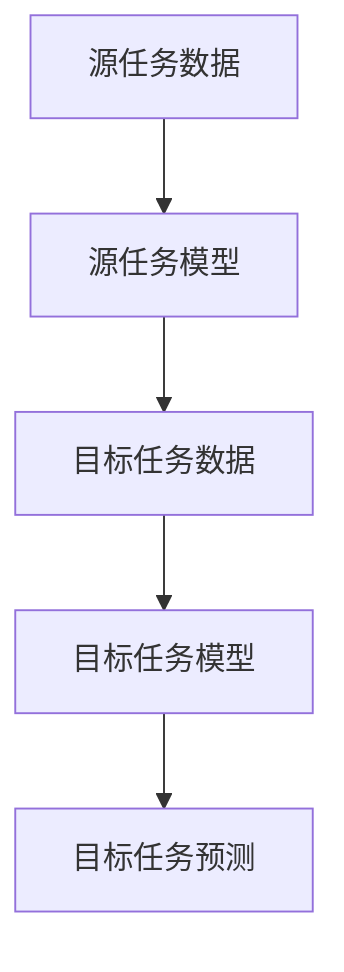
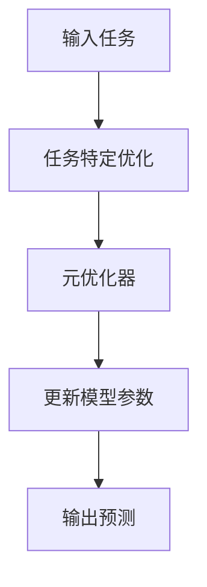
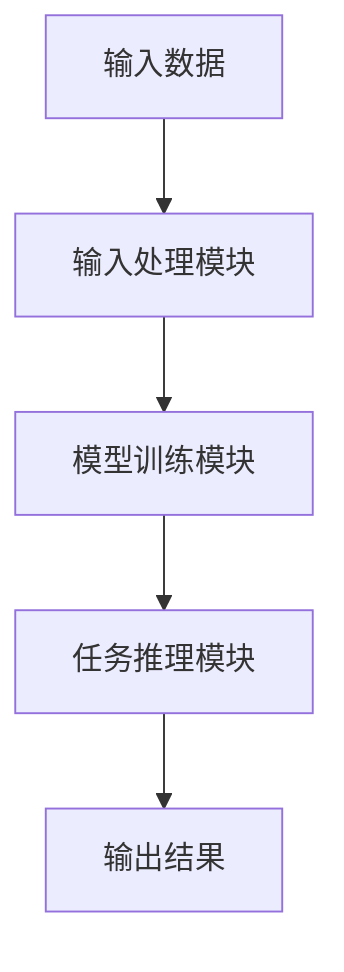

                 


# AI Agent的多任务迁移学习技术

## 关键词：AI Agent, 多任务学习, 迁移学习, 系统架构, 技术实战

## 摘要：  
本文系统地探讨AI Agent在多任务迁移学习中的技术应用与实现。首先，文章介绍了AI Agent的基本概念和多任务迁移学习的核心思想，分析了多任务学习的背景、意义及其面临的挑战。接着，深入讲解了多任务迁移学习的核心概念、算法原理以及系统架构设计，通过具体的案例分析展示了多任务迁移学习的实际应用场景。最后，本文总结了多任务迁移学习的最佳实践经验和未来发展方向，为读者提供全面的技术指导。

---

## 第一章: AI Agent与多任务迁移学习概述

### 1.1 AI Agent的基本概念  
AI Agent（人工智能代理）是指能够感知环境、自主决策并执行任务的智能实体。它具备以下核心特点：  
- **自主性**：能够在无外部干预的情况下独立运作。  
- **反应性**：能够实时感知环境并做出响应。  
- **目标导向**：基于预设目标或学习目标执行任务。  

AI Agent的应用场景广泛，包括智能助手、自动驾驶、机器人控制、推荐系统等。  

#### 1.1.1 多任务学习的基本概念  
多任务学习（Multi-Task Learning, MTL）是指在一个模型中同时学习多个任务，通过共享部分参数或表示，提升模型的泛化能力和学习效率。  

---

### 1.2 多任务迁移学习的背景与意义  
传统单任务学习在处理复杂场景时存在局限性，例如需要大量标注数据且难以泛化到新任务。多任务迁移学习通过共享任务间的知识，有效缓解了这些问题，具有以下优势：  
- **数据效率**：通过共享知识减少数据需求。  
- **任务关联性**：利用任务间的相似性提升学习效果。  
- **泛化能力**：增强模型在新任务中的适应性。  

---

## 第二章: 多任务迁移学习的核心概念  

### 2.1 多任务学习的基本原理  
多任务学习的核心思想是通过共享参数或表示，同时优化多个任务的性能。常见的多任务学习方法包括：  
- **联合优化**：将多个任务的损失函数联合起来优化。  
- **参数共享**：通过共享部分参数来降低模型复杂度。  

#### 2.1.1 任务间共享表示的对比表格  
| 任务 | 参数共享 | 任务独立性 |  
|------|----------|------------|  
| 任务1 | 共享部分参数 | 较高 |  
| 任务2 | 共享部分参数 | 较高 |  
| 任务3 | 共享部分参数 | 较高 |  

---

### 2.2 迁移学习的关键技术  
迁移学习的核心思想是将已学习的知识迁移到新任务中。关键技术包括：  
- **特征提取**：提取任务通用特征。  
- **参数适配**：调整任务特定参数。  

#### 2.2.1 迁移学习的流程图  


---

## 第三章: 多任务迁移学习的算法原理  

### 3.1 基于优化的多任务迁移学习算法  
#### 3.1.1 MAML（Meta Learning）算法  
MAML是一种元学习算法，通过在多个任务上优化模型的优化过程，实现快速适应新任务。  

#### MAML算法流程图  


#### MAML算法代码实现  
```python
import torch

class MetaLearner:
    def __init__(self, model, optimizer):
        self.model = model
        self.optimizer = optimizer

    def forward(self, x, y):
        # 前向传播
        y_pred = self.model(x)
        loss = F.mse_loss(y_pred, y)
        return loss

    def step(self, loss):
        # 后向传播
        self.optimizer.zero_grad()
        loss.backward()
        self.optimizer.step()

# 示例用法
model = MetaLearner(net, optimizer=torch.optim.SGD)
loss = model.forward(x, y)
model.step(loss)
```

---

## 第四章: 系统架构与实现方案  

### 4.1 系统架构设计  
#### 系统功能模块设计  
- **输入处理模块**：接收输入数据并进行预处理。  
- **模型训练模块**：负责多任务迁移学习的模型训练。  
- **任务推理模块**：根据任务需求生成输出。  

#### 系统架构图  


---

## 第五章: 项目实战  

### 5.1 智能助手的多任务学习  
#### 环境配置  
```bash
pip install torch
pip install transformers
```

#### 代码实现  
```python
import torch
from torch import nn, optim

class MultiTaskModel(nn.Module):
    def __init__(self, input_size, output_size):
        super().__init__()
        self.shared = nn.Linear(input_size, 64)
        self.task1 = nn.Linear(64, output_size[0])
        self.task2 = nn.Linear(64, output_size[1])

    def forward(self, x):
        x = torch.relu(self.shared(x))
        out1 = self.task1(x)
        out2 = self.task2(x)
        return out1, out2

model = MultiTaskModel(10, (5,5))
optimizer = optim.Adam(model.parameters(), lr=0.001)
```

---

## 第六章: 最佳实践与未来展望  

### 6.1 最佳实践  
- **任务选择**：选择高度相关的任务以提升迁移效果。  
- **数据预处理**：确保数据质量和分布一致性。  

### 6.2 未来展望  
随着AI Agent技术的不断进步，多任务迁移学习将在更多领域发挥重要作用，如智能机器人、自动驾驶等。

---

## 总结与展望  

本文系统地探讨了AI Agent的多任务迁移学习技术，从理论到实践，为读者提供了全面的技术指导。未来，随着技术的不断发展，多任务迁移学习将推动AI Agent在更多领域实现更广泛的应用。

--- 

**作者简介**：  
作为一名专注人工智能与计算机科学的专家，我致力于分享深度技术洞察，帮助读者理解复杂的技术概念。

