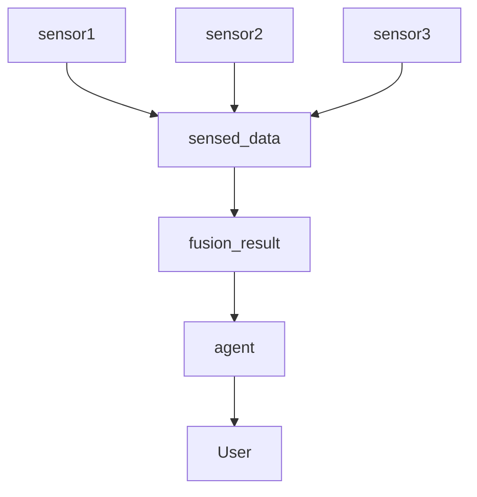
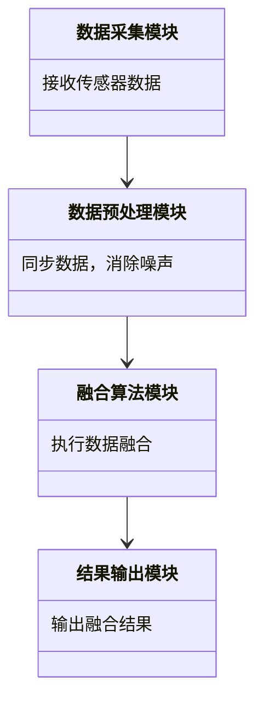
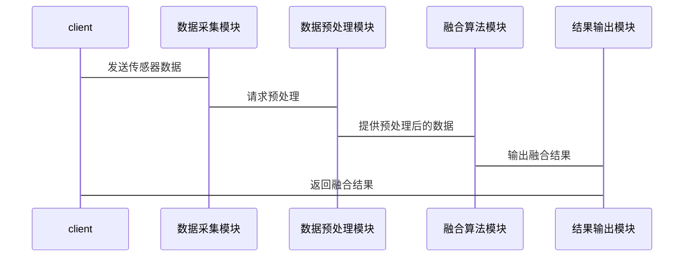

                 


# AI Agent的多传感器数据融合技术

## 关键词：AI Agent, 多传感器数据融合, 数据融合算法, 传感器网络, 智能系统

## 摘要：  
本文深入探讨AI Agent在多传感器数据融合技术中的应用，从基础概念到核心算法，再到系统架构和项目实战，全面解析多传感器数据融合的技术原理和实现方法。通过详细分析数据融合的背景、算法原理、系统架构设计以及实际案例，本文旨在帮助读者理解如何利用多传感器数据融合技术提升AI Agent的感知能力和决策效率。

---

# 第1章 AI Agent与多传感器数据融合概述

## 1.1 多传感器数据融合的背景与意义

### 1.1.1 问题背景：多传感器数据融合的必要性  
在智能系统中，单一传感器提供的信息往往有限，无法满足复杂环境下的感知需求。例如，自动驾驶汽车需要同时融合来自摄像头、激光雷达、雷达和 GPS 的数据，才能准确识别环境、定位自身并做出决策。

### 1.1.2 问题描述：传感器数据的特点与挑战  
传感器数据具有以下特点：  
1. **异构性**：不同传感器的数据格式、精度和语义不同。  
2. **时变性**：传感器数据随环境变化而变化。  
3. **不确定性**：传感器可能存在噪声、干扰或测量误差。  

### 1.1.3 问题解决：数据融合的目标与方法  
数据融合的目标是将多源传感器数据整合，消除冗余、优化信息质量，最终生成一致的、可靠的、完整的感知结果。常用方法包括加权融合、基于图的融合、贝叶斯网络等。

### 1.1.4 边界与外延：数据融合的范围与限制  
数据融合的范围包括数据预处理、特征提取、融合算法设计和结果评估。其限制主要在于传感器精度、数据同步性和计算资源的限制。

### 1.1.5 核心要素：传感器类型、数据特征、融合算法  
传感器类型：如摄像头、激光雷达、红外传感器等。  
数据特征：如时间戳、位置、信号强度等。  
融合算法：如加权融合、卡尔曼滤波等。

## 1.2 AI Agent的基本概念与特点

### 1.2.1 AI Agent的定义与分类  
AI Agent 是能够感知环境、自主决策并执行任务的智能实体。按智能水平可分为反应式 Agent 和认知式 Agent。

### 1.2.2 多传感器数据融合在AI Agent中的作用  
数据融合帮助AI Agent更好地理解环境，提高感知精度和决策的可靠性。

### 1.2.3 数据融合技术的演进与发展趋势  
数据融合技术从简单的时间戳同步发展到复杂的概率图模型，未来将更加注重实时性和分布式计算。

## 1.3 多传感器数据融合的核心概念

### 1.3.1 数据融合的层次与模型  
数据融合可以分为数据级融合、特征级融合和决策级融合。

### 1.3.2 传感器数据的时空一致性问题  
传感器数据的时间同步和空间一致性是数据融合的关键问题。

### 1.3.3 数据融合的不确定性与鲁棒性  
数据融合需要处理传感器噪声和不确定性，确保结果的鲁棒性。

## 1.4 本章小结  
本章介绍了多传感器数据融合的背景、AI Agent的基本概念及其在数据融合中的作用，为后续章节奠定了基础。

---

# 第2章 多传感器数据融合的核心概念

## 2.1 数据融合的原理与机制

### 2.1.1 数据融合的基本原理  
数据融合通过消除冗余和优化信息，生成一致的感知结果。

### 2.1.2 数据融合的四种主要机制  
1. **加权融合**：根据传感器的可信度加权融合数据。  
2. **基于图的融合**：通过图模型表示传感器之间的关系。  
3. **统计融合**：如卡尔曼滤波。  
4. **符号融合**：基于逻辑规则融合数据。

### 2.1.3 数据融合的数学模型  
加权融合模型：  
$$\hat{x} = \sum_{i=1}^n w_i x_i$$  
其中，$w_i$ 是传感器 $i$ 的权重，$x_i$ 是传感器 $i$ 的测量值。

## 2.2 核心概念的特征对比

### 2.2.1 传感器类型与数据特征对比表  
| 传感器类型 | 数据特征 | 优缺点 |  
|------------|-----------|--------|  
| 摄像头     | 图像数据   | 高分辨率，但易受光照影响 |  
| 激光雷达   | 点云数据   | 高精度，但计算量大 |  
| GPS        | 位置数据   | 高精度，但室内定位差 |  

### 2.2.2 数据融合算法的性能对比表  
| 算法类型   | 优缺点 | 适用场景 |  
|------------|--------|----------|  
| 加权融合    | 实现简单，但权重难以确定 | 单一传感器主导场景 |  
| 基于图的融合 | 能处理复杂关系，但计算复杂 | 多源异构数据场景 |  

### 2.2.3 数据融合结果的评价指标  
1. **准确率**：融合结果与真实值的接近程度。  
2. **延迟率**：数据融合的响应时间。  
3. **鲁棒性**：面对噪声和异常的抵抗能力。

## 2.3 ER实体关系图与数据流分析

```mermaid
er
actor: User
agent: AI Agent
sensor1: 传感器1
sensor2: 传感器2
sensor3: 传感器3
sensed_data: 感知数据
fusion_result: 融合结果
```

数据流图：  


## 2.4 本章小结  
本章详细分析了多传感器数据融合的核心概念，包括传感器类型、数据特征和算法性能对比，为后续的算法设计奠定了基础。

---

# 第3章 数据融合算法原理

## 3.1 加权融合算法

### 3.1.1 加权融合的基本原理  
加权融合通过为每个传感器分配权重，综合其测量值，得到最终的融合结果。

### 3.1.2 权重计算的数学模型  
权重计算可以基于传感器的历史精度、当前状态或任务需求。例如：  
$$w_i = \frac{1}{\sigma_i^2}$$  
其中，$\sigma_i$ 是传感器 $i$ 的测量噪声方差。

### 3.1.3 加权融合的实现步骤  
1. **数据预处理**：同步传感器数据的时间戳。  
2. **计算权重**：根据传感器性能确定权重。  
3. **加权融合**：计算加权和，得到融合结果。

### 3.1.4 实际案例：自动驾驶中的加权融合  
自动驾驶系统中，摄像头和激光雷达的融合结果用于目标检测和路径规划。

## 3.2 基于图的融合算法

### 3.2.1 基于图的融合的基本原理  
基于图的融合将传感器数据建模为图的节点，通过边表示数据之间的关系。

### 3.2.2 基于图的融合的实现步骤  
1. **构建图模型**：将传感器数据映射为图的节点。  
2. **确定边权重**：表示节点之间的关系强度。  
3. **图融合**：通过图算法（如图的最短路径）计算融合结果。

### 3.2.3 实际案例：社交网络中的信息融合  
社交网络中，基于图的融合用于识别用户的兴趣一致性。

## 3.3 贝叶斯网络融合算法

### 3.3.1 贝叶斯网络的基本原理  
贝叶斯网络通过概率推理，将多源数据融合为一个概率分布。

### 3.3.2 贝叶斯网络的实现步骤  
1. **构建网络结构**：定义节点和边。  
2. **确定概率参数**：如条件概率表。  
3. **推理计算**：通过证据传播计算融合结果。

### 3.3.3 实际案例：医疗诊断中的数据融合  
医疗系统中，贝叶斯网络融合患者的症状、检查结果和病史数据，辅助诊断。

## 3.4 本章小结  
本章详细介绍了加权融合、基于图的融合和贝叶斯网络三种算法，分析了它们的优缺点和适用场景。

---

# 第4章 系统架构与设计

## 4.1 问题场景介绍

### 4.1.1 系统目标  
设计一个支持多传感器数据融合的AI Agent系统，提升其环境感知和决策能力。

### 4.1.2 项目介绍  
本项目旨在开发一个实时处理多源传感器数据的系统，应用于智能机器人和自动驾驶领域。

## 4.2 系统功能设计

### 4.2.1 功能模块划分  
1. 数据采集模块：接收多传感器数据。  
2. 数据预处理模块：同步数据并消除噪声。  
3. 融合算法模块：执行数据融合。  
4. 结果输出模块：输出融合结果并驱动决策。

### 4.2.2 领域模型（Mermaid 类图）  


## 4.3 系统架构设计

### 4.3.1 系统架构图（Mermaid 架构图）  


### 4.3.2 接口与交互设计  
1. **数据采集接口**：提供传感器数据的接收接口。  
2. **融合算法接口**：提供数据融合的API。  
3. **结果输出接口**：提供融合结果的输出接口。

### 4.3.3 交互流程（Mermaid 序列图）  


## 4.4 本章小结  
本章详细分析了多传感器数据融合系统的架构设计，包括功能模块划分、系统架构图和交互流程。

---

# 第5章 项目实战：多传感器数据融合实现

## 5.1 环境安装与配置

### 5.1.1 开发环境  
- 操作系统：Linux/Windows  
- 开发工具：Python、ROS（Robot Operating System）  
- 依赖库：NumPy、Matplotlib、OpenCV、Pandas

### 5.1.2 传感器配置  
- 摄像头：安装OpenCV驱动  
- 激光雷达：安装LiDAR SDK  
- GPS：配置NMEA协议

## 5.2 系统核心实现源代码

### 5.2.1 数据采集模块

```python
import rospy
from sensor_msgs.msg import Image, PointCloud2

def image_callback(image_msg):
    # 处理图像数据
    pass

def pointcloud_callback(pointcloud_msg):
    # 处理点云数据
    pass

rospy.init_node('data_collector')
rospy.Subscriber('/camera/image', Image, image_callback)
rospy.Subscriber('/lidar/cloud', PointCloud2, pointcloud_callback)
rospy.spin()
```

### 5.2.2 数据预处理模块

```python
import numpy as np

def synchronize_data(image, pointcloud):
    # 同步图像和点云数据的时间戳
    image_time = image.header.stamp
    pc_time = pointcloud.header.stamp
    if abs(image_time - pc_time) > 0.1:
        return None
    return image, pointcloud
```

### 5.2.3 融合算法模块

```python
def weighted_fusion(sensor_data, weights):
    fused_data = 0
    for i in range(len(sensor_data)):
        fused_data += weights[i] * sensor_data[i]
    return fused_data
```

### 5.2.4 结果输出模块

```python
def output_result(fused_data):
    print("Fused Data:", fused_data)
```

## 5.3 代码应用与分析

### 5.3.1 代码实现解读  
上述代码实现了多传感器数据的采集、同步、融合和输出。数据采集模块订阅ROS主题，接收传感器数据；数据预处理模块同步数据；融合算法模块执行加权融合；结果输出模块显示融合结果。

### 5.3.2 实际案例分析  
以自动驾驶为例，摄像头和激光雷达的数据融合用于目标检测和路径规划。通过加权融合算法，系统能够更准确地识别障碍物和道路边界。

## 5.4 本章小结  
本章通过实际项目展示了多传感器数据融合的实现过程，包括环境配置、核心代码和案例分析。

---

# 第6章 最佳实践与小结

## 6.1 最佳实践

### 6.1.1 数据同步的重要性  
确保传感器数据的时间同步是数据融合的基础。

### 6.1.2 权重计算的技巧  
根据传感器的性能和任务需求动态调整权重。

### 6.1.3 算法选择的注意事项  
选择适合应用场景的算法，避免过度复杂的计算。

## 6.2 小结与展望

### 6.2.1 本章内容回顾  
本文从理论到实践，详细讲解了多传感器数据融合的技术和实现。

### 6.2.2 未来研究方向  
未来可以研究分布式数据融合、自适应融合算法和边缘计算中的数据融合技术。

## 6.3 注意事项

### 6.3.1 数据隐私与安全  
确保传感器数据的安全性，防止数据泄露。

### 6.3.2 系统性能优化  
通过并行计算和优化算法提高系统的实时性。

## 6.4 拓展阅读

### 6.4.1 推荐书籍  
1. 《多传感器数据融合原理与应用》  
2. 《AI Agent的智能决策算法》

### 6.4.2 推荐论文  
1. "A Survey on Multi-sensor Data Fusion in Autonomous Vehicles"  
2. "Probabilistic Graphical Models for Sensor Fusion"

## 6.5 本章小结  
本章总结了多传感器数据融合的最佳实践，展望了未来的研究方向，并提供了拓展阅读的建议。

---

# 结语

通过本文的详细讲解，读者可以系统地理解多传感器数据融合的技术原理和实现方法。从理论到实践，从算法到系统设计，本文为AI Agent的开发提供了全面的指导。希望本文能够帮助读者在实际项目中更好地应用多传感器数据融合技术，提升系统的感知和决策能力。

--- 

# END

