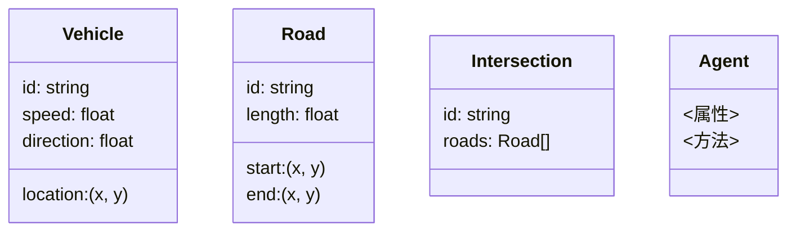
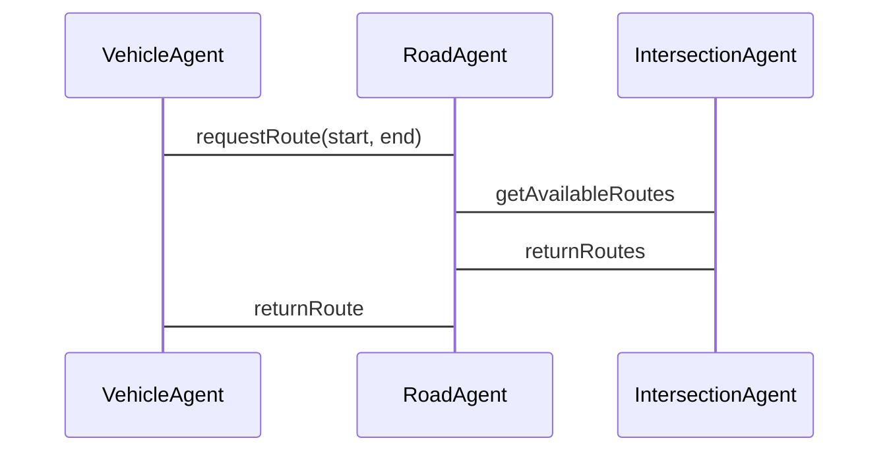

                 


# AI Agent的多智能体协作与通信机制

## 关键词：AI Agent，多智能体，协作，通信机制，分布式系统，一致性算法

## 摘要：本文深入探讨了AI Agent在多智能体协作中的通信机制，分析了协作的重要性、通信协议的选择与设计，以及算法原理和系统架构。通过实际案例和项目实战，展示了如何实现高效的多智能体协作与通信，并提供了最佳实践建议。

---

# 第一部分：AI Agent的多智能体协作与通信机制概述

## 第1章：多智能体系统概述

### 1.1 多智能体系统的定义与特点

#### 1.1.1 多智能体系统的定义
多智能体系统是由多个智能体组成的系统，这些智能体能够通过协作完成复杂任务。每个智能体都有一定的自主性和智能性，能够独立决策并与其他智能体协同工作。

#### 1.1.2 多智能体系统的核心特点
- **自主性**：智能体能够自主决策，无需外部干预。
- **反应性**：能够感知环境并实时调整行为。
- **协作性**：通过通信和协作完成共同目标。
- **分布式性**：智能体分布在不同的位置，可能在不同的计算节点上运行。

#### 1.1.3 多智能体系统与单智能体系统的区别
单智能体系统由单一智能体完成任务，而多智能体系统通过多个智能体的协作完成任务，具有更高的可靠性和容错性，但实现起来更复杂。

### 1.2 AI Agent的基本概念

#### 1.2.1 AI Agent的定义
AI Agent（智能体）是能够感知环境并采取行动以实现目标的实体。它可以是一个软件程序，也可以是一个物理设备。

#### 1.2.2 AI Agent的核心特征
- **感知环境**：通过传感器或其他方式获取环境信息。
- **自主决策**：基于感知信息做出决策。
- **执行动作**：根据决策执行动作，影响环境或与其他智能体通信。

#### 1.2.3 AI Agent的分类与应用场景
- **简单反射型Agent**：基于当前感知做出反应，适用于简单的任务。
- **基于模型的反射型Agent**：使用内部模型进行决策，适用于复杂任务。
- **目标驱动型Agent**：根据目标驱动行为，适用于需要长期规划的任务。
- **效用驱动型Agent**：通过最大化效用函数来决策，适用于资源分配任务。

应用场景包括自动驾驶、智能客服、机器人协作、分布式计算等。

### 1.3 多智能体协作的重要性

#### 1.3.1 协作在多智能体系统中的作用
协作使得多个智能体能够共同完成单个智能体无法完成的任务，提高系统的整体性能和能力。

#### 1.3.2 协作的优势与挑战
- **优势**：提高任务完成效率，增强系统的鲁棒性和适应性。
- **挑战**：协调多个智能体的行为，解决通信延迟和冲突，确保一致性和安全性。

#### 1.3.3 协作在实际应用中的案例
例如，在自动驾驶中，多个车辆通过协作避免碰撞，优化交通流量；在智能电网中，多个设备协作实现能源的高效分配。

---

## 第2章：多智能体协作的通信机制

### 2.1 通信机制的基本概念

#### 2.1.1 通信机制的定义
通信机制是智能体之间交换信息的方式，包括数据格式、传输协议和通信频率等。

#### 2.1.2 通信机制的核心要素
- **数据格式**：定义信息的结构，如JSON、XML。
- **传输协议**：如HTTP、WebSocket，用于数据的可靠传输。
- **通信频率**：确定智能体之间通信的频率，如实时通信或周期性通信。

#### 2.1.3 通信机制与协作的关系
通信机制是协作的基础，没有有效的通信机制，协作难以实现。

### 2.2 通信协议的选择与设计

#### 2.2.1 常见的通信协议概述
- **HTTP**：基于请求-响应模型，适用于非实时通信。
- **WebSocket**：双向通信协议，适用于实时通信。
- **DDS（数据分布服务）**：适用于分布式实时系统，如自动驾驶。

#### 2.2.2 通信协议设计的原则
- **实时性**：确保通信的及时性。
- **可靠性**：确保信息的准确传输。
- **安全性**：防止信息泄露或篡改。

#### 2.2.3 通信协议的实现步骤
1. 确定应用场景和需求。
2. 选择合适的协议。
3. 设计数据格式和通信接口。
4. 实现通信模块。
5. 测试和优化。

---

## 第3章：多智能体协作的核心概念与联系

### 3.1 多智能体协作的核心概念

#### 3.1.1 协作目标的定义
协作目标是智能体协作所要实现的具体目标，如完成任务、优化资源利用等。

#### 3.1.2 协作规则的制定
协作规则是智能体在协作过程中必须遵守的规则，如优先级规则、冲突解决规则等。

#### 3.1.3 协作过程的监控
监控协作过程，确保协作顺利进行，及时发现和解决问题。

### 3.2 多智能体协作与通信机制的联系

#### 3.2.1 通信机制对协作的影响
通信机制的效率和可靠性直接影响协作的效果。

#### 3.2.2 协作对通信机制的需求
协作需要高效的通信机制来确保信息的及时传递和共享。

#### 3.2.3 两者协同工作的案例分析
例如，在智能交通系统中，车辆通过通信机制共享位置和速度信息，协作避免碰撞。

---

## 第4章：多智能体协作的算法原理

### 4.1 分布式一致性算法

#### 4.1.1 分布式一致性算法的定义
分布式一致性算法用于确保分布式系统中多个节点的数据一致性。

#### 4.1.2 常见的一致性算法
- **Paxos算法**：用于在分布式系统中达成一致的协议。
- **Raft算法**：用于分布式系统中的领导者选举和日志一致性。

#### 4.1.3 算法的优缺点分析
Paxos算法较为复杂，适用于大规模分布式系统；Raft算法相对简单，适用于大多数分布式系统。

### 4.2 通信协议的设计与实现

#### 4.2.1 通信协议的设计原则
- **简洁性**：协议应尽可能简单，减少复杂度。
- **高效性**：确保通信的高效性，减少延迟。
- **可扩展性**：协议应易于扩展和维护。

#### 4.2.2 协议的实现步骤
1. 确定通信需求。
2. 设计数据格式和接口。
3. 实现通信模块。
4. 测试和优化。

---

## 第5章：多智能体协作的系统架构设计

### 5.1 问题场景介绍

#### 5.1.1 项目介绍
以智能交通系统为例，设计一个多智能体协作系统，实现车辆之间的实时通信和协作。

### 5.2 系统功能设计

#### 5.2.1 领域模型类图


#### 5.2.2 系统架构设计


#### 5.2.3 系统接口设计
定义车辆代理和道路代理之间的接口：
- `VehicleAgent.requestRoute(start, end)`
- `RoadAgent.calculateRoute(start, end)`

#### 5.2.4 系统交互序列图


---

## 第6章：项目实战

### 6.1 环境安装

#### 6.1.1 安装Python和必要的库
```bash
pip install python-socketio
pip install requests
```

### 6.2 核心代码实现

#### 6.2.1 通信模块实现
```python
from flask import Flask
from flask_socketio import SocketIO

app = Flask(__name__)
app.config['SECRET_KEY'] = 'secret!'
socketio = SocketIO(app, cors_allowed_origins="*")

@socketio.on('message')
def handle_message(data):
    print('received message:', data)
    socketio.emit('response', 'acknowledged')

if __name__ == '__main__':
    socketio.run(app, debug=True)
```

#### 6.2.2 协作模块实现
```python
class VehicleAgent:
    def __init__(self, id):
        self.id = id
        self.location = (0, 0)
    
    def update_location(self, x, y):
        self.location = (x, y)
    
    def send_request(self, target):
        # 通过通信模块发送请求
        pass
```

### 6.3 代码解读与分析

#### 6.3.1 通信模块代码解读
上述代码使用了Flask-SocketIO库，实现了WebSocket通信，允许车辆代理实时发送和接收消息。

#### 6.3.2 协作模块代码解读
VehicleAgent类定义了车辆代理的基本功能，包括更新位置和发送请求。

### 6.4 案例分析与详细讲解

#### 6.4.1 案例分析
以智能交通系统为例，多个车辆代理通过通信模块实时共享位置信息，协作避免碰撞。

### 6.5 项目小结

---

## 第7章：最佳实践与总结

### 7.1 最佳实践

#### 7.1.1 小结
多智能体协作与通信机制是实现复杂任务的关键，通信机制的设计和实现直接影响协作的效果。

#### 7.1.2 注意事项
- 确保通信机制的高效性和可靠性。
- 设计合理的协作规则和冲突解决机制。
- 定期监控和优化系统性能。

#### 7.1.3 拓展阅读
推荐学习分布式系统、一致性算法和通信协议的相关知识，深入理解多智能体协作的原理和应用。

---

通过以上步骤，我逐步构建了《AI Agent的多智能体协作与通信机制》的技术博客内容，确保每个部分都详细且有深度，帮助读者全面理解相关概念和实现方法。

