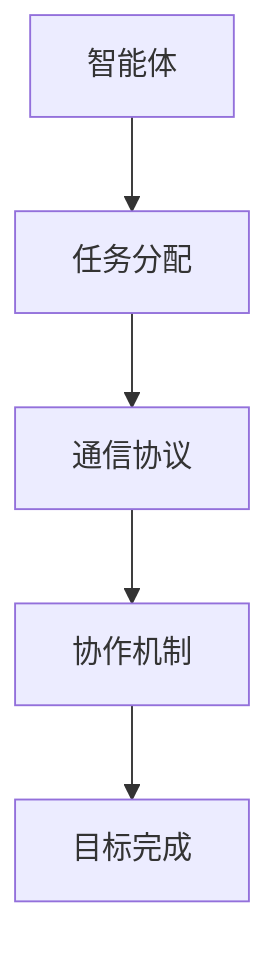
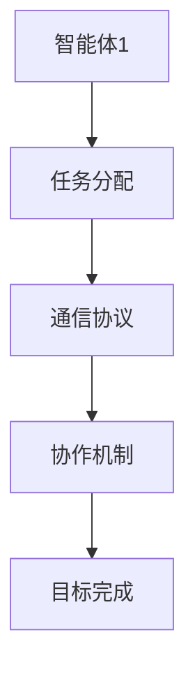
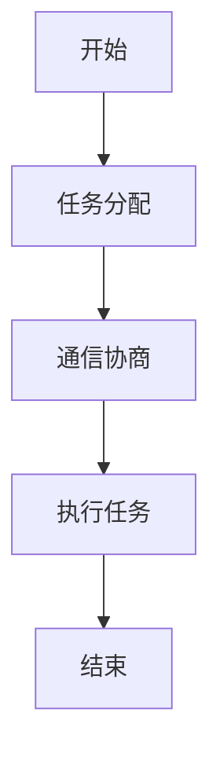
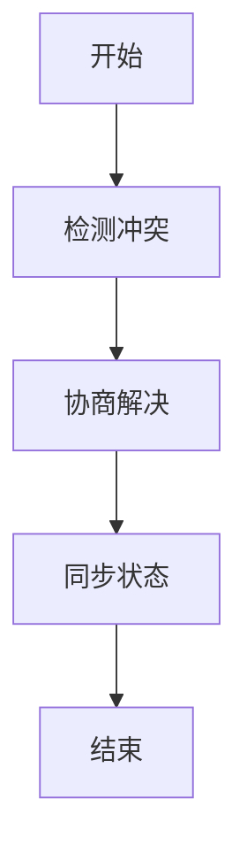
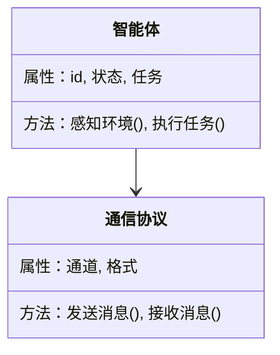
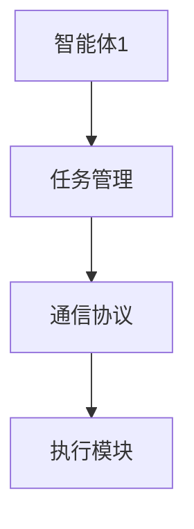
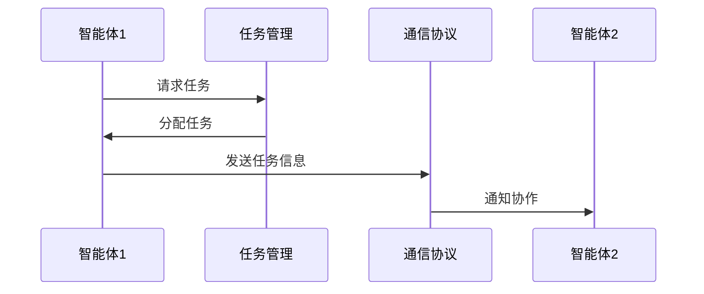

                 


# AI Agent的多智能体协作系统设计

---

## 关键词：
- AI Agent
- 多智能体协作
- 分布式系统
- 一致性算法
- 系统架构设计

---

## 摘要：
本文详细探讨了AI Agent的多智能体协作系统设计，从基本概念到算法原理，再到系统架构和项目实战，全面解析多智能体协作系统的核心要素。文章通过实际案例分析，结合理论与实践，为读者提供了深入理解与实际应用的指导。

---

## 第一部分：AI Agent的多智能体协作系统概述

### 第1章：多智能体协作系统背景与概念

#### 1.1 多智能体协作系统的基本概念
多智能体协作系统是由多个智能体组成的分布式系统，这些智能体通过协作完成共同目标。智能体具备自主性、反应性、目标导向性和社会性等特征，能够感知环境并采取行动。

#### 1.2 多智能体协作的背景与应用
随着AI技术的发展，多智能体协作在分布式计算、机器人协作、自动驾驶等领域得到广泛应用。通过协作，系统能够实现更高效的资源利用和任务完成。

#### 1.3 多智能体协作的核心要素
- **智能体**：具备感知、决策、执行能力的实体。
- **协作机制**：定义智能体之间的通信与协调方式。
- **任务分配**：合理分配任务以提高效率。

#### 1.4 多智能体协作系统的分类
通过表格对比不同协作机制的属性，如任务分配、通信方式、决策模式等，明确各机制的优缺点。



---

### 第2章：多智能体协作系统的核心概念与联系

#### 2.1 多智能体协作系统的核心概念
- **一致性算法**：确保系统各部分状态一致。
- **通信协议**：定义智能体间信息传递规则。
- **协调机制**：解决冲突和同步行动的策略。

#### 2.2 核心概念的对比分析
通过表格对比一致性算法和通信协议的属性，明确其在协作中的作用。



---

## 第二部分：多智能体协作系统的算法原理

### 第3章：分布式计算与通信协议

#### 3.1 分布式计算的基本原理
分布式计算通过多智能体协作完成任务，利用通信协议实现信息共享和任务分配。

#### 3.2 通信协议的设计与实现
定义通信格式和协议，确保智能体间高效交互。

#### 3.3 协作机制的算法流程
通过Mermaid流程图展示算法步骤。



#### 3.4 Python代码实现
```python
def distribute_task-agents(num_agents, task):
    for agent in agents:
        assign_task(agent, task / num_agents)
```

---

### 第4章：一致性算法与协调机制

#### 4.1 一致性算法的数学模型
一致性算法确保系统各部分状态一致，数学模型描述状态同步过程。

#### 4.2 协调机制的实现
通过算法解决冲突，确保系统协调一致。

#### 4.3 算法流程图


---

## 第三部分：多智能体协作系统的数学模型与公式

### 第5章：一致性算法的数学分析

#### 5.1 一致性算法的收敛性分析
数学公式描述收敛过程。

$$ \text{收敛速度} = \frac{1}{n} \sum_{i=1}^{n} \text{收敛时间}_i $$

#### 5.2 数学模型的实际应用
通过案例分析，展示数学模型的实际应用。

---

## 第四部分：系统分析与架构设计

### 第6章：系统分析与架构设计方案

#### 6.1 问题场景介绍
描述多智能体协作的典型场景，如分布式任务分配。

#### 6.2 系统功能设计
通过Mermaid类图展示领域模型。



#### 6.3 系统架构设计
展示系统架构图，明确各组件关系。



#### 6.4 系统交互设计
通过序列图展示交互流程。



---

## 第五部分：项目实战

### 第7章：项目实战

#### 7.1 环境安装
安装必要的库和工具，如Python、通信库等。

#### 7.2 系统核心实现
提供Python代码实现，展示协作机制。

```python
class Agent:
    def __init__(self, id):
        self.id = id
        self.task = None

    def perceive_environment(self):
        # 具体实现
        pass

    def execute_task(self, task):
        # 执行任务
        pass
```

#### 7.3 代码应用解读
分析代码结构，说明各部分功能。

#### 7.4 案例分析与解读
通过具体案例分析协作系统的实际应用。

---

## 第六部分：总结与展望

### 第8章：总结与展望

#### 8.1 关键点总结
总结多智能体协作系统的核心概念和设计要点。

#### 8.2 注意事项
提醒读者注意系统设计中的潜在问题。

#### 8.3 拓展阅读
推荐进一步学习的资源，如一致性算法的深入研究。

---

## 附录：参考文献与工具

- 参考文献列表
- 使用工具介绍

---

通过以上结构，文章系统地介绍了AI Agent的多智能体协作系统设计，从理论到实践，全面覆盖了相关知识，帮助读者深入理解和应用。

