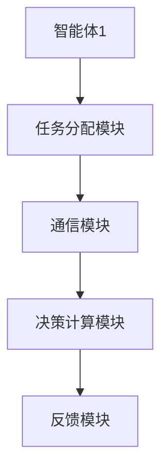
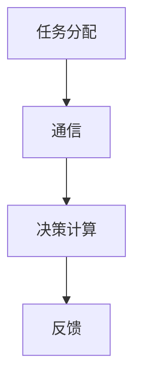

                 


# AI Agent的多智能体协同决策机制

> 关键词：AI Agent，多智能体，协同决策，分布式计算，系统架构，算法实现

> 摘要：本文深入探讨AI Agent在多智能体协同决策机制中的核心原理、算法实现和系统设计。通过详细分析多智能体系统的通信机制、任务分配、算法实现和系统架构，结合实际案例，全面解析AI Agent的多智能体协同决策机制，为读者提供从理论到实践的系统性指导。

---

# 第1章: 多智能体协同决策机制概述

## 1.1 多智能体系统的基本概念

### 1.1.1 多智能体系统的定义与特点

多智能体系统（Multi-Agent System, MAS）是由多个相互作用的智能体组成的系统，这些智能体通过协作完成特定目标。其特点包括分布性、自治性、反应性和协同性。

### 1.1.2 多智能体系统与单智能体系统的区别

单智能体系统中，决策由单一智能体完成，而多智能体系统通过多个智能体的协作完成任务，强调分布式计算和协同决策。

### 1.1.3 多智能体系统的主要应用领域

多智能体系统广泛应用于自动驾驶、智能交通、机器人协作、分布式计算和游戏AI等领域。

## 1.2 AI Agent的基本概念与分类

### 1.2.1 AI Agent的定义与特点

AI Agent是一种能够感知环境并采取行动以实现目标的实体，具有自主性、反应性和社会性。

### 1.2.2 AI Agent的分类与应用场景

AI Agent可以分为简单反射Agent、基于模型的反射Agent、目标驱动Agent和效用驱动Agent，分别应用于不同的场景。

### 1.2.3 AI Agent与传统代理的区别

AI Agent具有学习和适应能力，能够处理复杂环境中的不确定性，而传统代理仅执行预定义任务。

## 1.3 多智能体协同决策机制的背景与意义

### 1.3.1 协同决策机制的定义

协同决策机制是指多个智能体通过协作完成决策的过程，强调信息共享和任务分配。

### 1.3.2 多智能体协同决策的必要性

在复杂环境中，单智能体难以完成所有任务，多智能体协同决策能够提高系统整体效率和灵活性。

### 1.3.3 协同决策机制在实际应用中的意义

协同决策机制能够实现资源优化配置、提高系统的容错性和扩展性。

## 1.4 本章小结

---

# 第2章: 多智能体协同决策的核心概念

## 2.1 多智能体系统的通信机制

### 2.1.1 通信协议的定义与特点

通信协议是智能体之间信息交换的规则，具有确定性、可靠性和高效性。

### 2.1.2 通信机制在协同决策中的作用

通信机制确保智能体之间的信息共享和任务协作，是协同决策的基础。

### 2.1.3 常见的通信协议类型

包括基于消息的通信和基于订阅-发布模型的通信。

## 2.2 多智能体系统的任务分配与协作

### 2.2.1 任务分配的基本原理

任务分配通过优化算法将任务分配给最合适的智能体，确保整体效率最大化。

### 2.2.2 协作过程中的角色分配

角色分配基于智能体的能力和任务需求，确保每个智能体在其角色上发挥最大作用。

### 2.2.3 任务分配的算法与实现

常用算法包括贪心算法和分布式协商算法。

## 2.3 协同决策的数学模型与公式

### 2.3.1 协同决策的基本数学模型

$$ \text{目标函数} = \sum_{i=1}^{n} w_i x_i $$

其中，\( w_i \) 是权重，\( x_i \) 是决策变量。

### 2.3.2 协同决策的公式推导

通过数学优化模型，推导出最优决策方案。

### 2.3.3 协同决策模型的优缺点分析

优点包括高效性和灵活性，缺点包括复杂性和计算成本。

## 2.4 本章小结

---

# 第3章: 多智能体协同决策的算法与实现

## 3.1 分布式计算与多智能体协同

### 3.1.1 分布式计算的基本原理

分布式计算将任务分配给多个计算节点，通过协作完成整体任务。

### 3.1.2 分布式计算在多智能体系统中的应用

应用于分布式任务处理、数据分发和负载均衡。

### 3.1.3 分布式计算的优缺点分析

优点包括高可用性和扩展性，缺点包括复杂性和延迟。

## 3.2 协同决策的算法实现

### 3.2.1 基于博弈论的协同决策算法

通过博弈论模型，模拟智能体之间的决策过程。

### 3.2.2 基于分布式计算的协同决策算法

利用分布式计算技术，实现多智能体协同决策。

### 3.2.3 协同决策算法的实现步骤

包括任务分配、信息共享、决策计算和结果反馈。

## 3.3 协同决策算法的数学模型与公式

### 3.3.1 协同决策算法的基本数学模型

$$ \text{目标函数} = \sum_{i=1}^{n} w_i x_i $$

### 3.3.2 协同决策算法的公式推导

通过数学优化方法，推导出最优决策方案。

### 3.3.3 协同决策算法的优缺点分析

优点包括高效性和灵活性，缺点包括复杂性和计算成本。

## 3.4 本章小结

---

# 第4章: 多智能体协同决策的系统架构与设计

## 4.1 系统架构的基本原理

### 4.1.1 系统架构的定义与特点

系统架构是系统各组成部分的组织结构，具有模块化、可扩展性和可维护性。

### 4.1.2 多智能体协同决策系统的架构类型

包括基于客户机-服务器模式、分布式对等网络和分层架构。

### 4.1.3 系统架构设计的步骤与方法

包括需求分析、模块划分、交互设计和优化调整。

## 4.2 系统功能设计

### 4.2.1 系统功能模块的划分

包括任务分配模块、通信模块、决策计算模块和反馈模块。

### 4.2.2 系统功能模块的交互设计

通过交互图展示各模块之间的协作关系。

### 4.2.3 系统功能模块的实现步骤

包括需求分析、功能设计、编码实现和测试优化。

## 4.3 系统架构的Mermaid图

### 4.3.1 系统架构Mermaid图



### 4.3.2 系统功能模块Mermaid图



## 4.4 本章小结

---

# 第5章: 多智能体协同决策机制的项目实战

## 5.1 项目背景与需求分析

### 5.1.1 项目背景

以智能交通系统为例，实现多智能体协同决策。

### 5.1.2 项目需求分析

包括交通流量监测、路径规划和协同决策。

## 5.2 系统设计与实现

### 5.2.1 系统设计

包括功能模块划分、系统架构设计和接口设计。

### 5.2.2 系统实现

使用Python编写核心模块，包括任务分配、通信和决策计算。

### 5.2.3 代码实现

```python
class Agent:
    def __init__(self, id):
        self.id = id
        self.tasks = []
    
    def assign_task(self, task):
        self.tasks.append(task)
    
    def communicate(self, other_agent):
        # 信息共享逻辑
        pass

# 创建多个智能体
agents = [Agent(i) for i in range(5)]

# 任务分配
for agent in agents:
    agent.assign_task("monitor traffic")
```

### 5.2.4 系统测试与优化

测试系统性能和稳定性，优化算法和架构。

## 5.3 项目小结

---

# 第6章: 总结与展望

## 6.1 本章总结

回顾全文内容，强调多智能体协同决策机制的重要性。

## 6.2 未来研究方向

包括更复杂的协作算法、更高效的通信机制和更智能的系统架构。

## 6.3 最佳实践 tips

包括选择合适的算法、优化系统架构和加强测试。

## 6.4 附录

### 6.4.1 常用数学公式

$$ \text{目标函数} = \sum_{i=1}^{n} w_i x_i $$

### 6.4.2 工具推荐

推荐使用Python和相关框架进行实现。

### 6.4.3 参考文献

列出相关文献和资源。

---

通过以上结构，我们可以系统地学习和理解AI Agent的多智能体协同决策机制，从理论到实践，逐步深入。

