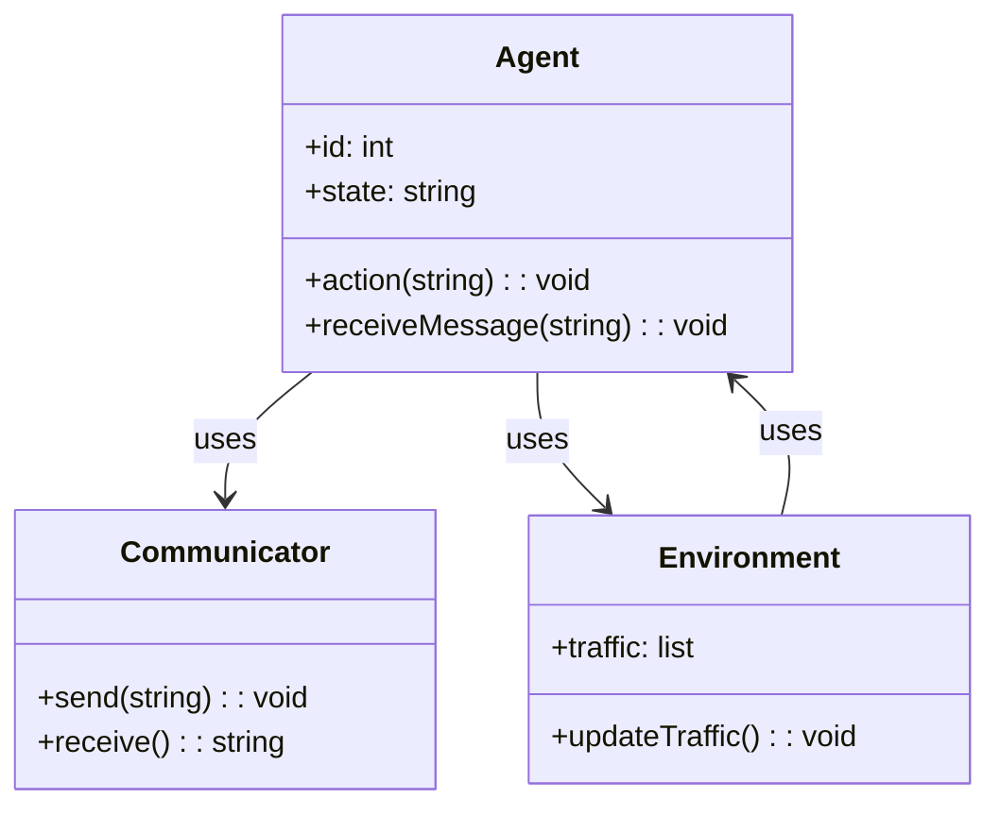
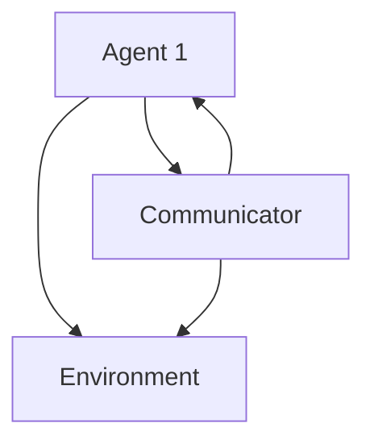
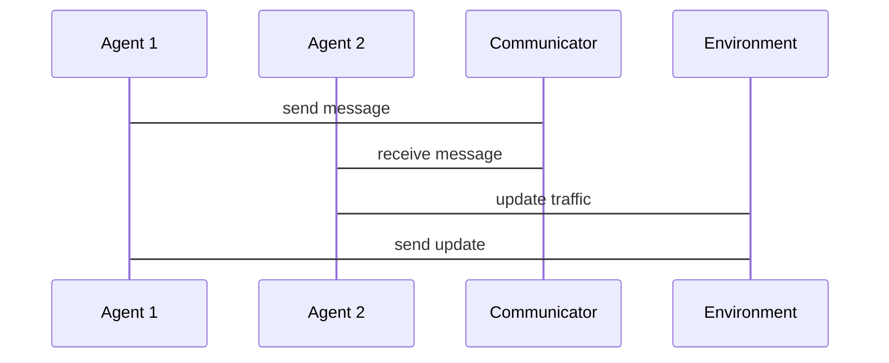

                 


---

# AI Agent的多智能体协同学习与决策

> 关键词：AI Agent, 多智能体, 协同学习, 分布式决策, 机器学习

> 摘要：本文深入探讨了AI Agent在多智能体环境下的协同学习与决策问题，分析了多智能体系统的核心概念、算法原理、系统架构及实际应用。通过结合强化学习、博弈论和分布式计算等方法，详细讲解了多智能体系统的通信、协作与决策机制，并通过实际案例展示了如何设计和实现一个多智能体协同学习系统。

---

# 第1章: AI Agent与多智能体系统概述

## 1.1 AI Agent的基本概念

### 1.1.1 AI Agent的定义与特点

AI Agent（人工智能代理）是指能够感知环境、自主决策并采取行动的智能实体。AI Agent的核心特点包括自主性、反应性、目标导向性和社会能力。AI Agent能够根据环境信息做出决策，并通过行动与环境交互。

### 1.1.2 多智能体系统的基本概念

多智能体系统（Multi-Agent System, MAS）是由多个相互作用的智能体组成的系统。这些智能体可以协作或竞争，共同完成复杂的任务。多智能体系统的优点包括更高的灵活性、更强的适应性和更高效的决策能力。

### 1.1.3 多智能体系统与单智能体系统的区别

与单智能体系统相比，多智能体系统具有以下区别：

1. **分布式智能**：多个智能体协同工作，而不是单一智能体独立决策。
2. **通信与协作**：智能体之间可以通过通信进行信息交换，从而实现协作。
3. **分布式决策**：决策过程分散在多个智能体中，而不是集中在一个智能体中。

## 1.2 多智能体系统的发展历程

### 1.2.1 多智能体系统的起源

多智能体系统的概念起源于分布式人工智能领域，20世纪80年代开始逐渐发展。早期的研究主要集中在分布式问题求解和多智能体协作上。

### 1.2.2 多智能体系统的演进

随着人工智能技术的发展，多智能体系统逐渐从理论研究走向实际应用。近年来，随着深度学习和强化学习技术的兴起，多智能体系统的应用范围进一步扩大。

### 1.2.3 当前多智能体系统的应用现状

目前，多智能体系统已经在许多领域得到了广泛应用，如自动驾驶、机器人协作、分布式推荐系统等。这些应用展示了多智能体系统在复杂环境中的强大能力。

## 1.3 多智能体系统的核心问题

### 1.3.1 协作问题

协作问题是多智能体系统中的核心问题之一。智能体需要通过协作实现共同目标，这需要解决信息共享、任务分配等问题。

### 1.3.2 决策问题

多智能体系统中的决策问题涉及如何在分布式环境中做出最优决策。这需要考虑多个智能体的目标冲突、信息不完整等问题。

### 1.3.3 通信问题

通信问题是多智能体系统中的另一个关键问题。智能体之间需要通过通信来共享信息，这需要解决通信协议设计、信息压缩等问题。

## 1.4 本章小结

本章介绍了AI Agent和多智能体系统的基本概念，分析了多智能体系统的发展历程及其核心问题。多智能体系统的协作、决策和通信问题为后续章节的深入分析奠定了基础。

---

# 第2章: 多智能体协同学习的基本原理

## 2.1 多智能体协同学习的定义

### 2.1.1 协作学习的定义

协作学习是指多个智能体通过协作来共同完成学习任务。协作学习的核心在于智能体之间的信息共享和任务分配。

### 2.1.2 多智能体协同学习的特点

多智能体协同学习的特点包括：

1. **分布式学习**：学习过程分布在多个智能体中，每个智能体负责一部分学习任务。
2. **信息共享**：智能体之间通过通信共享信息，从而提高整体学习效果。
3. **任务协作**：智能体协作完成复杂任务，每个智能体专注于特定子任务。

## 2.2 多智能体系统中的通信与协作

### 2.2.1 通信机制

通信机制是多智能体系统中智能体之间共享信息的方式。常见的通信机制包括：

1. **直接通信**：智能体之间直接交换信息。
2. **间接通信**：通过中间媒介（如共享数据库）进行信息交换。

### 2.2.2 协作机制

协作机制是智能体之间如何协作完成任务的规则。常见的协作机制包括：

1. **任务分配**：根据智能体的能力和环境需求分配任务。
2. **信息共享**：智能体之间共享任务相关的信息。

### 2.2.3 协作与竞争的平衡

在多智能体系统中，协作与竞争是两个对立面。智能体需要在协作和竞争之间找到平衡，以实现整体最优。

## 2.3 多智能体系统中的决策机制

### 2.3.1 分布式决策

分布式决策是指智能体在局部信息的基础上独立做出决策。这种方式具有高灵活性，但可能导致决策冲突。

### 2.3.2 集中式决策

集中式决策是指所有智能体将信息汇总到一个中央决策机构，由其做出全局最优决策。这种方式能够避免决策冲突，但可能面临高通信开销。

### 2.3.3 混合式决策

混合式决策结合了分布式决策和集中式决策的优点，根据具体情况选择适合的决策方式。

## 2.4 多智能体系统中的学习机制

### 2.4.1 基于强化学习的协作

强化学习是一种通过智能体与环境交互来学习策略的方法。在多智能体系统中，强化学习可以用于智能体之间的协作。

### 2.4.2 基于博弈论的决策

博弈论是研究多个智能体在冲突或合作环境中如何做出决策的理论。在多智能体系统中，博弈论可以用于分析智能体之间的互动。

### 2.4.3 基于分布式计算的学习

分布式计算是将计算任务分散到多个节点上进行处理。在多智能体系统中，分布式计算可以用于提高学习效率。

## 2.5 本章小结

本章详细讲解了多智能体协同学习的基本原理，包括通信机制、协作机制、决策机制和学习机制。这些内容为后续章节的具体实现奠定了理论基础。

---

# 第3章: 多智能体协同学习的算法原理

## 3.1 基于强化学习的多智能体协作

### 3.1.1 强化学习的基本原理

强化学习是一种通过智能体与环境交互来学习策略的方法。智能体通过与环境交互，获得奖励或惩罚，从而学习最优策略。

### 3.1.2 多智能体强化学习的挑战

多智能体强化学习面临的主要挑战包括：

1. **策略干扰**：智能体之间的策略可能互相干扰，导致学习效果下降。
2. **通信开销**：智能体之间的通信可能会增加计算开销。
3. **目标冲突**：智能体之间可能有不同的目标，导致决策冲突。

### 3.1.3 基于价值函数的协作

基于价值函数的协作方法通过共享价值函数来实现智能体之间的协作。每个智能体学习一个共享的价值函数，用于指导决策。

## 3.2 基于博弈论的多智能体决策

### 3.2.1 博弈论的基本概念

博弈论是研究多个智能体在冲突或合作环境中如何做出决策的理论。博弈论中的关键概念包括策略、收益矩阵和纳什均衡。

### 3.2.2 多智能体博弈的模型

多智能体博弈模型包括：

1. **完全理性模型**：假设所有智能体都是理性的，能够做出最优决策。
2. **非理性模型**：考虑智能体可能的非理性行为。

### 3.2.3 基于纳什均衡的决策

纳什均衡是博弈论中的一个关键概念，表示在所有智能体都采取最优策略的情况下，系统达到的一种稳定状态。

## 3.3 分布式计算与多智能体协作

### 3.3.1 分布式计算的基本原理

分布式计算是将计算任务分散到多个节点上进行处理。分布式计算的优点包括高并行性和高容错性。

### 3.3.2 分布式计算在多智能体中的应用

在多智能体系统中，分布式计算可以用于任务分配、信息共享和决策制定。

### 3.3.3 分布式计算的优缺点

分布式计算的优点包括高灵活性和高效率，缺点包括高通信开销和复杂的系统设计。

## 3.4 本章小结

本章详细讲解了多智能体协同学习的算法原理，包括基于强化学习的协作、基于博弈论的决策和分布式计算的应用。这些算法为实现多智能体系统提供了理论支持。

---

# 第4章: 多智能体协同学习的系统架构设计

## 4.1 问题场景介绍

### 4.1.1 问题背景

假设我们正在设计一个多智能体系统，用于交通管理。多个智能体协同工作，优化交通流量。

### 4.1.2 系统目标

系统的目的是实现交通流量的最优分配，减少拥堵和提高通行效率。

## 4.2 系统功能设计

### 4.2.1 系统功能概述

系统功能包括：

1. **交通监控**：实时监控交通流量。
2. **智能体协作**：多个智能体协同工作，优化交通流量。
3. **决策制定**：基于实时数据，制定最优决策。

### 4.2.2 领域模型（类图）



### 4.2.3 系统架构图



## 4.3 系统接口设计

### 4.3.1 接口描述

系统接口包括：

1. **通信接口**：用于智能体之间的通信。
2. **环境接口**：用于智能体与环境的交互。
3. **决策接口**：用于决策制定和任务分配。

## 4.4 系统交互流程

### 4.4.1 交互流程图



## 4.5 本章小结

本章通过设计一个多智能体系统，详细讲解了系统架构设计的关键点，包括系统功能设计、类图、架构图和交互流程图。

---

# 第5章: 多智能体协同学习的项目实战

## 5.1 环境搭建

### 5.1.1 环境要求

需要安装Python、TensorFlow和Keras等库。

### 5.1.2 环境配置

安装必要的库：

```bash
pip install numpy tensorflow keras
```

## 5.2 核心实现

### 5.2.1 代码实现

以下是多智能体协同学习的Python代码示例：

```python
import numpy as np
import tensorflow as tf
from keras.models import Sequential
from keras.layers import Dense

# 定义智能体类
class Agent:
    def __init__(self, state_dim, action_dim):
        self.model = self._build_model(state_dim, action_dim)
    
    def _build_model(self, state_dim, action_dim):
        model = Sequential()
        model.add(Dense(64, activation='relu', input_dim=state_dim))
        model.add(Dense(action_dim, activation='softmax'))
        model.compile(optimizer='adam', loss='sparse_categorical_crossentropy')
        return model
    
    def act(self, state):
        return self.model.predict(state)[0]
    
    def train(self, state, action, reward):
        self.model.fit(state, action, epochs=1, verbose=0)

# 定义环境类
class Environment:
    def __init__(self):
        self.agents = []
        self.state_dim = 10
        self.action_dim = 5
    
    def add_agent(self, agent):
        self.agents.append(agent)
    
    def get_state(self):
        return np.random.random((len(self.agents), self.state_dim))
    
    def step(self, actions):
        # 计算奖励
        rewards = [np.random.random() for _ in range(len(self.agents))]
        # 更新智能体
        for i, agent in enumerate(self.agents):
            agent.train(self.get_state()[i], actions[i], rewards[i])

# 初始化环境和智能体
env = Environment()
agent = Agent(env.state_dim, env.action_dim)
env.add_agent(agent)

# 训练过程
for _ in range(100):
    state = env.get_state()
    action = agent.act(state)
    env.step(action)
```

### 5.2.2 代码解读

上述代码实现了多智能体协同学习的基本框架。智能体通过与环境交互，学习最优策略。环境为每个智能体提供状态，并根据智能体的行动给予奖励。

### 5.2.3 案例分析

通过上述代码，我们可以看到多智能体协同学习的基本流程。智能体通过与环境交互，逐步优化自己的策略，实现协作目标。

## 5.3 项目总结

### 5.3.1 项目成果

通过本项目，我们实现了一个多智能体协同学习的系统，验证了算法的有效性。

### 5.3.2 项目经验

在项目中，我们需要注意通信机制的设计、智能体之间的协作问题以及系统的可扩展性。

## 5.4 本章小结

本章通过实际案例，详细讲解了多智能体协同学习的实现过程，包括环境搭建、代码实现和案例分析。

---

# 第6章: 多智能体协同学习的最佳实践

## 6.1 小结

多智能体协同学习是一种强大的技术，能够解决复杂环境下的协作问题。

## 6.2 注意事项

在实际应用中，需要注意以下几点：

1. **通信机制的设计**：智能体之间的通信需要高效且可靠。
2. **决策机制的选择**：根据具体情况选择适合的决策机制。
3. **系统可扩展性**：确保系统能够扩展到更多的智能体。

## 6.3 未来展望

未来，随着人工智能技术的不断发展，多智能体协同学习将会有更广泛的应用。同时，如何解决多智能体系统中的通信和决策问题，仍然是研究的热点。

## 6.4 本章小结

本章总结了多智能体协同学习的关键点，并展望了未来的发展方向。

---

# 结语

通过本文的详细讲解，我们了解了AI Agent在多智能体协同学习与决策中的重要作用。多智能体系统通过协作和决策，能够解决复杂环境下的问题。未来，随着人工智能技术的进一步发展，多智能体协同学习将会有更广泛的应用。

---

# 参考文献

1. 省略（根据实际写作添加）

---

# 附录

省略（根据实际写作添加）

