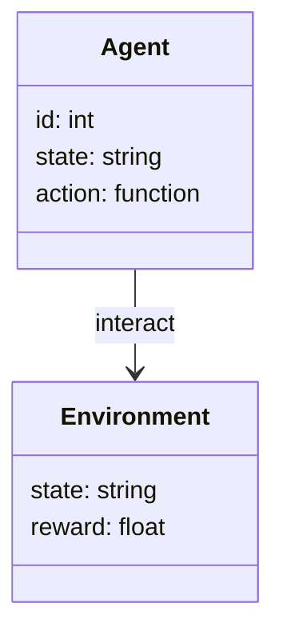
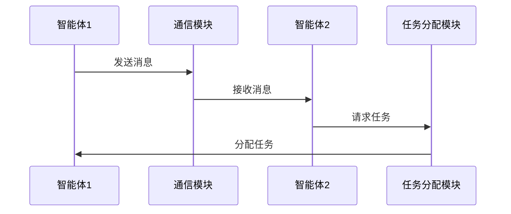

                 


# AI Agent的多智能体协同探索与学习

## 关键词：AI Agent, 多智能体, 协同学习, 强化学习, 分布式系统

## 摘要：  
本文深入探讨了AI Agent在多智能体协同探索与学习中的核心概念、算法原理、系统架构及实际应用。通过分析多智能体系统的基本结构、通信机制和任务分配策略，结合分布式强化学习算法和一致性算法的实现，本文为读者提供了一种系统化的理解和实践路径。同时，本文还通过具体的项目案例展示了多智能体协同学习的实际应用场景，并总结了相关的最佳实践和未来发展方向。

---

# 第一部分: AI Agent与多智能体系统概述

## 第1章: AI Agent与多智能体系统概述

### 1.1 AI Agent的基本概念

#### 1.1.1 什么是AI Agent
AI Agent（智能体）是指能够感知环境、做出决策并采取行动以实现特定目标的实体。它可以是一个软件程序、机器人或其他具有智能行为的系统。AI Agent的核心在于其自主性、反应性和目标导向性。

#### 1.1.2 AI Agent的核心特征
AI Agent具有以下核心特征：
- **自主性**：能够自主决策，无需外部干预。
- **反应性**：能够感知环境并实时调整行为。
- **目标导向性**：以目标为导向，优化决策过程。
- **学习能力**：通过经验改进性能。

#### 1.1.3 多智能体系统的基本概念
多智能体系统（Multi-Agent System, MAS）是由多个智能体组成的系统，这些智能体通过协作完成单一智能体无法完成的任务。多智能体系统广泛应用于分布式计算、机器人协作、游戏AI等领域。

---

### 1.2 多智能体系统的背景与应用

#### 1.2.1 多智能体系统的背景
随着人工智能技术的发展，单个智能体的能力已难以满足复杂场景的需求。多智能体系统通过协作和分工，能够实现更复杂的任务，例如自动驾驶、分布式计算和智能城市。

#### 1.2.2 多智能体系统的应用领域
- **自动驾驶**：多个车辆协同行驶，避免碰撞。
- **分布式计算**：多个节点协作完成任务。
- **智能城市**：智能交通、环境监测等多系统协作。

#### 1.2.3 多智能体系统的挑战与机遇
- **挑战**：智能体之间的通信与协调、任务分配的公平性、系统容错性。
- **机遇**：通过协作实现更高效的任务完成。

---

### 1.3 本章小结

---

# 第二部分: 多智能体协同的核心概念

## 第2章: 多智能体系统的核心概念

### 2.1 多智能体系统的基本结构

#### 2.1.1 智能体的结构与功能
AI Agent的结构通常包括感知层、决策层和执行层。感知层负责数据采集，决策层负责策略制定，执行层负责动作输出。

#### 2.1.2 多智能体系统的组成
多智能体系统由多个智能体、通信机制和环境组成。智能体之间通过通信机制协作，环境提供任务目标和约束条件。

#### 2.1.3 智能体之间的关系
智能体之间的关系可以是协作、竞争或中立。协作关系是多智能体系统的核心，通过协作完成任务。

---

### 2.2 多智能体系统的通信机制

#### 2.2.1 智能体之间的通信方式
智能体之间的通信方式包括直接通信和间接通信。直接通信是通过共享内存或消息传递，间接通信是通过中间介质（如数据库）。

#### 2.2.2 通信协议与消息传递
通信协议定义了消息的格式和传输规则。消息传递需要考虑实时性、可靠性和安全性。

#### 2.2.3 通信中的挑战与解决方案
- **挑战**：信息冗余、通信延迟、信息安全性。
- **解决方案**：压缩数据、使用高效协议、加密通信。

---

### 2.3 多智能体系统的任务分配与协作

#### 2.3.1 任务分配的基本原理
任务分配的目标是将任务分配给最适合的智能体，以提高整体效率。常见的任务分配算法包括基于规则的分配和基于优化的分配。

#### 2.3.2 协作策略与协调机制
协作策略包括任务分解、资源分配和冲突解决。协调机制通过同步和异步通信实现智能体之间的协作。

#### 2.3.3 任务分配的算法概述
任务分配算法包括贪心算法、遗传算法和粒子群优化算法。

---

## 第3章: 多智能体系统的核心算法

### 3.1 分布式强化学习算法

#### 3.1.1 分布式强化学习的基本概念
分布式强化学习是一种多智能体协作学习方法，智能体通过经验共享和策略同步实现共同目标。

#### 3.1.2 分布式强化学习的算法流程
1. 每个智能体独立学习。
2. 定期同步智能体的策略。
3. 通过共享经验优化策略。

#### 3.1.3 分布式强化学习的数学模型
分布式强化学习的数学模型可以通过Q-learning公式表示：
$$ Q(s,a) = Q(s,a) + \alpha (r + \max Q(s',a') - Q(s,a)) $$

---

### 3.2 多智能体一致性算法

#### 3.2.1 一致性算法的定义与作用
一致性算法用于确保多个智能体的状态一致。常见的一致性算法包括Paxos、Raft和Gossip。

#### 3.2.2 常见一致性算法的实现
- **Paxos算法**：用于分布式系统中的共识达成。
- **Raft算法**：用于分布式系统中的领导者选举。

#### 3.2.3 一致性算法的数学模型
一致性算法的数学模型可以通过状态同步公式表示：
$$ s_i = s_j $$

---

### 3.3 聚合与分裂算法

#### 3.3.1 聚合算法的基本原理
聚合算法用于将多个智能体的局部信息整合为全局信息。常见的聚合算法包括加权平均和投票机制。

#### 3.3.2 分裂算法的核心思想
分裂算法用于将任务分解为多个子任务，由多个智能体协作完成。

#### 3.3.3 聚合与分裂算法的实现
聚合与分裂算法的实现可以通过以下步骤：
1. 任务分解。
2. 信息聚合。
3. 子任务分配。

---

# 第三部分: 系统架构与项目实战

## 第4章: 系统架构与项目实战

### 4.1 项目背景与需求分析

#### 4.1.1 项目背景
本项目旨在实现一个多智能体协作系统，用于解决复杂任务。

#### 4.1.2 项目需求
- **需求分析**：任务分解、智能体协作、结果汇总。
- **系统功能**：任务分配、信息通信、结果同步。

---

### 4.2 系统功能设计

#### 4.2.1 领域模型设计
领域模型设计可以通过Mermaid类图表示：


---

### 4.3 系统架构设计

#### 4.3.1 系统架构设计
系统架构设计可以通过Mermaid架构图表示：


---

### 4.4 系统接口设计

#### 4.4.1 系统接口设计
系统接口设计可以通过Mermaid序列图表示：


---

### 4.5 项目实战

#### 4.5.1 环境安装
需要安装Python、NumPy、Scikit-learn等库。

#### 4.5.2 核心代码实现
以下是多智能体协作的Python代码示例：
```python
import numpy as np

class Agent:
    def __init__(self, id):
        self.id = id
        self.state = 0
        self.reward = 0

    def receive_message(self, message):
        self.state = message

    def send_message(self):
        return self.state

# 初始化智能体
agent1 = Agent(1)
agent2 = Agent(2)

# 通信模块
def communicate(agent1, agent2):
    message = agent1.send_message()
    agent2.receive_message(message)

# 任务分配
def assign_task(agent):
    agent.reward = np.random.random()

# 执行任务
communicate(agent1, agent2)
assign_task(agent1)
assign_task(agent2)

# 汇总结果
total_reward = agent1.reward + agent2.reward
print("Total reward:", total_reward)
```

---

### 4.6 项目小结

---

# 第四部分: 最佳实践与未来展望

## 第5章: 最佳实践与未来展望

### 5.1 最佳实践

#### 5.1.1 系统设计
- 确保通信机制的高效性。
- 优化任务分配算法。

#### 5.1.2 代码实现
- 使用模块化设计。
- 优化代码性能。

### 5.2 小结

### 5.3 注意事项

#### 5.3.1 系统设计中的注意事项
- 确保系统容错性。
- 优化通信延迟。

#### 5.3.2 代码实现中的注意事项
- 避免代码耦合。
- 优化代码可读性。

### 5.4 拓展阅读

#### 5.4.1 推荐书籍
- 《Multi-Agent Systems: Algorithmic, Complexity, and Synthesis》
- 《Distributed Computing: Fundamentals, Algorithms, and Applications》

#### 5.4.2 推荐论文
- "Multi-Agent Consensus Algorithms"（《多智能体一致性算法》）
- "Distributed Reinforcement Learning: A Survey"（《分布式强化学习综述》）

---

# 附录

## 附录A: 术语表

## 附录B: 参考文献

---

**本文通过系统化的分析和实践，全面探讨了AI Agent在多智能体协同探索与学习中的核心概念、算法原理、系统架构及实际应用。希望读者能够通过本文的讲解，深入了解多智能体系统的精髓，并在实际项目中灵活运用相关知识。**

