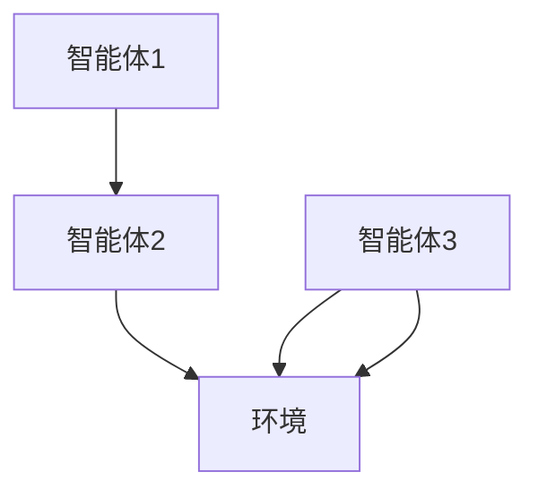
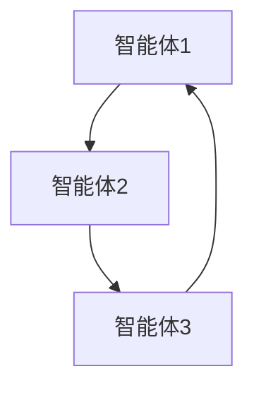
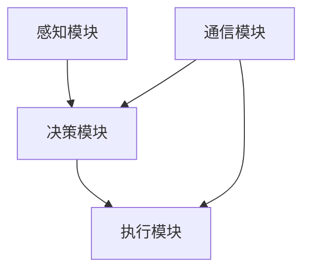
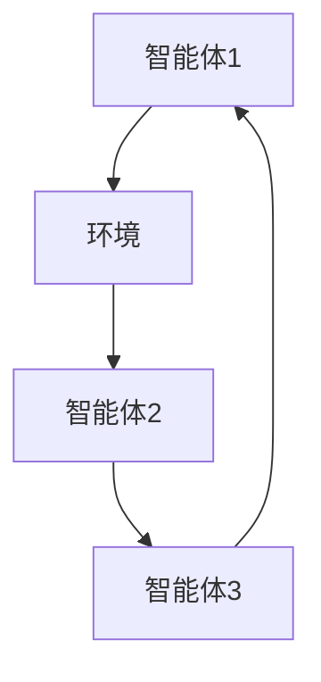

                 


# AI Agent的多智能体博弈与策略学习

> 关键词：AI Agent、多智能体博弈、策略学习、强化学习、纳什均衡、系统架构设计

> 摘要：本文系统地探讨了AI Agent在多智能体博弈中的策略学习方法，从基础概念到算法实现，再到实际应用，深入分析了多智能体博弈的核心原理和策略学习的数学模型。通过丰富的实例和详细的代码实现，展示了如何在实际项目中应用这些理论。

---

# 第一部分: AI Agent与多智能体博弈基础

---

## 第1章: AI Agent的基本概念与背景介绍

### 1.1 AI Agent的定义与核心概念

#### 1.1.1 什么是AI Agent
AI Agent（人工智能代理）是指能够感知环境、做出决策并执行动作的智能实体。AI Agent可以是软件程序、机器人或其他智能系统，其核心目标是通过感知和行动来优化特定目标函数。

#### 1.1.2 AI Agent的核心要素
- **感知（Perception）**：AI Agent通过传感器或其他输入方式获取环境信息。
- **决策（Decision-Making）**：基于感知信息，AI Agent通过算法选择最优动作。
- **行动（Action）**：根据决策结果，AI Agent执行具体动作，影响环境状态。

#### 1.1.3 AI Agent的分类与特点
- **简单反射型Agent**：基于当前输入直接做出反应，不涉及复杂推理。
- **基于模型的反射型Agent**：维护环境模型，基于模型进行决策。
- **目标驱动型Agent**：根据目标函数优化决策。
- **效用驱动型Agent**：通过最大化效用函数实现目标。

---

### 1.2 多智能体系统的基本概念

#### 1.2.1 多智能体系统的定义
多智能体系统（Multi-Agent System, MAS）是由多个相互作用的智能体组成的系统，智能体之间通过通信和协作完成复杂的任务。

#### 1.2.2 多智能体系统的组成部分
- **智能体（Agent）**：独立决策的个体。
- **环境（Environment）**：智能体所处的外部世界。
- **通信机制（Communication）**：智能体之间的信息交换。
- **协作机制（Collaboration）**：智能体之间的协同工作方式。

#### 1.2.3 多智能体系统的应用场景
- **游戏AI**：如MOBA游戏中的英雄协作。
- **分布式计算**：多个AI Agent协同完成复杂任务。
- **机器人协作**：多个机器人在工厂或物流中的协同工作。

---

### 1.3 多智能体博弈的背景与问题描述

#### 1.3.1 博弈论基础
博弈论是研究多个参与者在竞争或合作环境中的决策行为的数学理论。核心概念包括玩家、策略、收益和均衡。

#### 1.3.2 多智能体博弈的定义
多智能体博弈是指多个智能体在共享环境中通过策略互动，以最大化自身目标的过程。

#### 1.3.3 多智能体博弈的核心问题
- **纳什均衡**：多个智能体在最优策略下的稳定状态。
- **策略协调**：确保智能体之间的策略互补。
- **收益分配**：在协作中公平分配收益。

---

## 第2章: 多智能体博弈的核心概念与联系

### 2.1 多智能体博弈的数学模型

#### 2.1.1 博弈论的基本模型
- **参与者（Players）**：参与博弈的智能体。
- **策略（Strategies）**：智能体在不同状态下的决策方式。
- **收益（Payoffs）**：智能体在特定策略下的收益。

#### 2.1.2 多智能体博弈的数学表达
$$P = \{1, 2, \dots, n\}, S_i \in S, u_i(s_1, s_2, \dots, s_n)\}$$
其中，P是参与者集合，S_i是智能体i的策略空间，u_i是智能体i的收益函数。

---

### 2.2 多智能体系统中的实体关系

#### 2.2.1 实体关系图


#### 2.2.2 通信关系图


---

### 2.3 多智能体博弈的策略空间

#### 2.3.1 策略空间的定义
策略空间是智能体所有可能策略的集合，策略可以是离散的或连续的。

#### 2.3.2 策略空间的维度分析
- **单智能体策略空间**：智能体独立决策时的策略集合。
- **多智能体策略空间**：所有智能体策略的笛卡尔积。

#### 2.3.3 策略空间与博弈结果的关系
$$U = \sum_{i=1}^n u_i(s_1, s_2, \dots, s_n)$$
收益总和是所有智能体收益的函数。

---

## 第3章: 多智能体博弈中的策略学习方法

### 3.1 基于强化学习的策略优化

#### 3.1.1 强化学习的基本原理
强化学习通过智能体与环境的交互，学习最优策略以最大化累计奖励。

#### 3.1.2 多智能体强化学习的挑战
- **策略协调**：多个智能体需要协调策略。
- **收益分配**：智能体之间的收益需要公平分配。
- **通信机制**：智能体之间的信息交换。

#### 3.1.3 基于策略梯度的方法
策略梯度方法通过优化策略参数，最大化期望收益。

---

### 3.2 多智能体博弈中的纳什均衡

#### 3.2.1 纳什均衡的定义
纳什均衡是指在多智能体博弈中，所有智能体的策略都是最优反应，即没有智能体可以通过单方面改变策略而获益。

#### 3.2.2 纳什均衡的计算方法
通过计算每个智能体的最优策略，验证是否存在纳什均衡。

#### 3.2.3 纳什均衡与策略学习的关系
纳什均衡是多智能体策略学习的重要目标。

---

### 3.3 基于Q-learning的多智能体策略学习

#### 3.3.1 Q-learning的基本原理
Q-learning通过学习状态-动作价值函数，找到最优策略。

#### 3.3.2 多智能体Q-learning的实现
多个智能体同时学习，通过通信共享信息。

#### 3.3.3 Q-learning在多智能体博弈中的应用
应用于资源分配、任务分配等场景。

---

## 第4章: 多智能体博弈的数学模型与算法实现

### 4.1 多智能体博弈的数学模型

#### 4.1.1 状态空间的定义
状态空间是智能体可能遇到的所有状态的集合。

#### 4.1.2 动作空间的定义
动作空间是智能体在每个状态下可以执行的所有动作的集合。

#### 4.1.3 奖励函数的设计
奖励函数定义了智能体在特定状态和动作下的收益。

---

### 4.2 多智能体博弈的算法实现

#### 4.2.1 基于强化学习的算法实现
- **策略梯度法**：如PG、PPO等。
- **值函数法**：如Q-learning、DQN等。

#### 4.2.2 基于博弈论的算法实现
- **纳什均衡求解**：如基于不动点的算法。
- **均衡优化**：如基于拍卖机制的收益分配。

#### 4.2.3 基于深度学习的算法实现
- **深度强化学习**：如DQN、Deep PPO等。
- **多智能体深度学习**：如MAPO、VDN等。

---

### 4.3 算法实现的数学推导

#### 4.3.1 策略梯度的数学推导
$$\nabla J = \mathbb{E}[r] \nabla \log \pi(a|s)$$

#### 4.3.2 Q-learning的数学推导
$$Q(s, a) = Q(s, a) + \alpha (r + \gamma \max Q(s', a') - Q(s, a))$$

---

## 第5章: 多智能体博弈的系统架构与设计

### 5.1 系统架构设计

#### 5.1.1 系统功能模块划分
- **感知模块**：获取环境信息。
- **决策模块**：计算最优策略。
- **执行模块**：执行决策动作。
- **通信模块**：与其他智能体通信。

#### 5.1.2 系统架构的层次结构


#### 5.1.3 系统架构的实现方式
- **集中式架构**：所有智能体共享一个中央控制模块。
- **分布式架构**：每个智能体独立决策，通过通信协作。

---

### 5.2 系统接口设计

#### 5.2.1 系统输入接口设计
- **环境信息**：当前状态。
- **动作指令**：智能体的决策动作。

#### 5.2.2 系统输出接口设计
- **执行指令**：智能体的执行动作。
- **通信信息**：与其他智能体共享的信息。

---

### 5.3 系统交互流程

#### 5.3.1 交互流程图


---

## 第6章: 项目实战与案例分析

### 6.1 项目背景介绍

#### 6.1.1 项目目标
设计一个多智能体协作系统，实现任务分配和资源优化。

---

### 6.2 系统核心实现源代码

#### 6.2.1 环境配置
```python
import gym
import numpy as np
```

#### 6.2.2 策略网络实现
```python
class PolicyNetwork:
    def __init__(self, input_dim, output_dim):
        self.input_dim = input_dim
        self.output_dim = output_dim
        # 网络结构
        self.model = ...
```

---

### 6.3 代码应用解读与分析

#### 6.3.1 环境配置解读
- 使用Gym库创建环境。
- 配置智能体的输入和输出维度。

#### 6.3.2 策略网络解读
- 策略网络用于生成智能体的策略。
- 输入状态，输出动作概率。

---

### 6.4 实际案例分析

#### 6.4.1 案例分析
通过具体案例展示多智能体协作系统的运行过程。

---

## 第7章: 总结与展望

### 7.1 本章总结
总结全文的核心内容和主要观点。

### 7.2 未来展望
探讨多智能体博弈与策略学习的未来发展方向。

---

## 参考文献
- [1] 王伟, 《强化学习入门》
- [2] 李明, 《多智能体系统》
- [3] 张强, 《博弈论与AI》

---

通过以上目录，文章将系统地介绍AI Agent的多智能体博弈与策略学习的核心内容，从理论到实践，为读者提供全面的指导和深入的分析。

