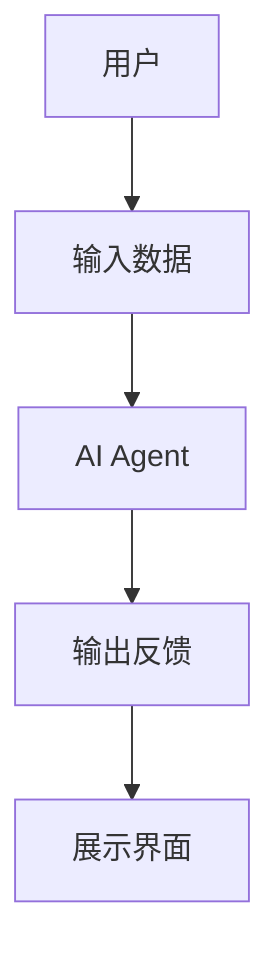
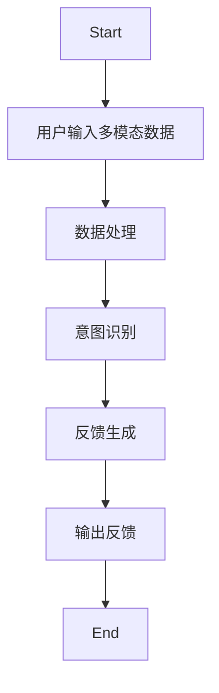
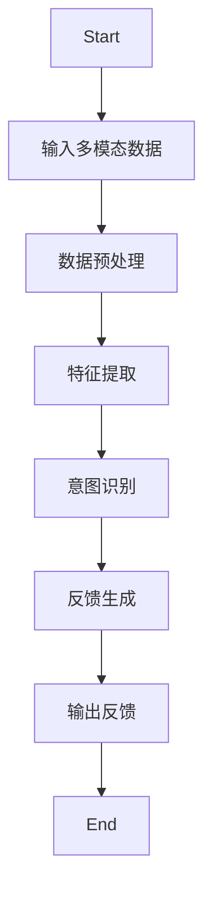
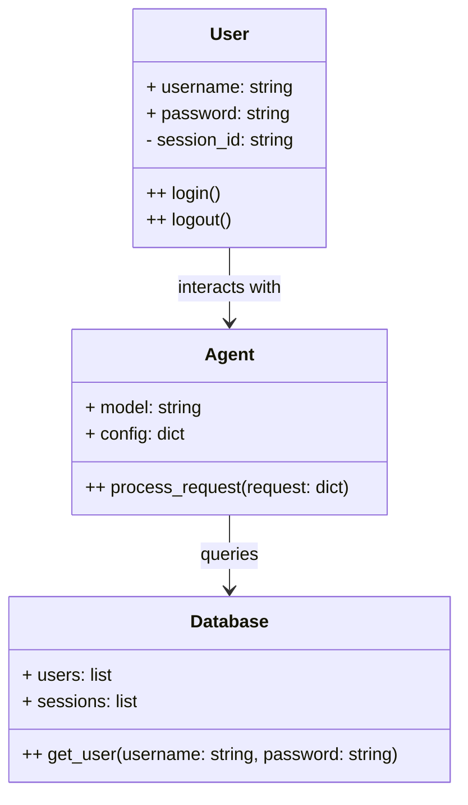
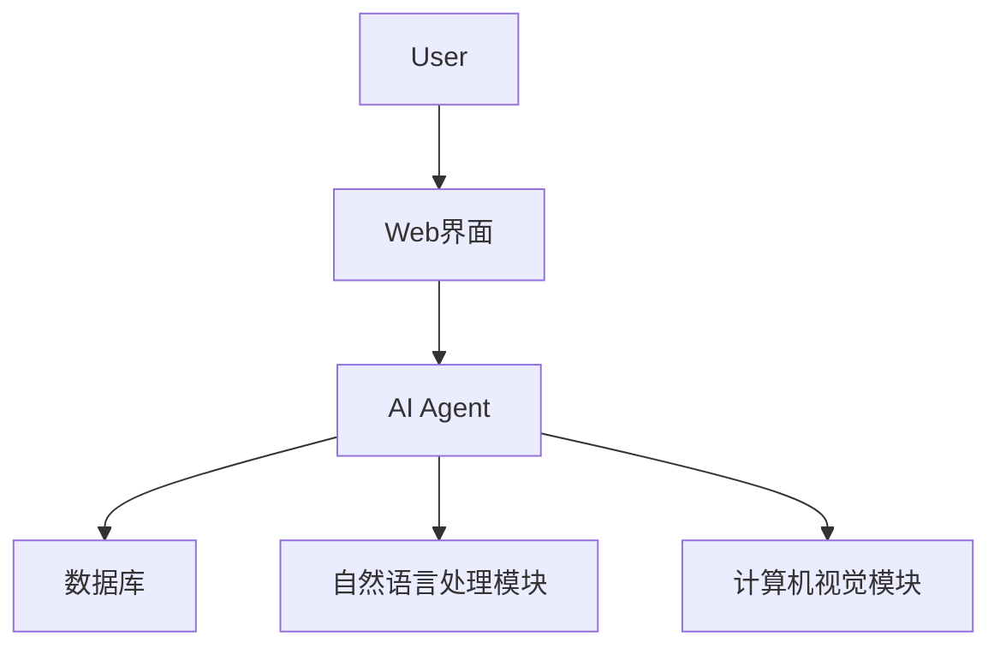
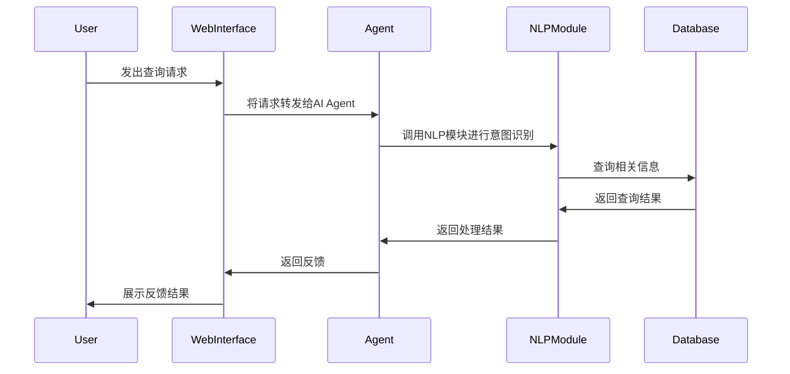

                 


# AI Agent的多模态交互界面设计与实现

## 关键词：AI Agent，多模态交互，界面设计，自然语言处理，计算机视觉，人机交互

## 摘要：本文详细探讨了AI Agent的多模态交互界面设计与实现，从核心概念到算法原理，再到系统架构和项目实战，系统性地分析了多模态交互在AI Agent中的应用。文章结合实际案例，深入剖析了多模态交互的设计目标、实现方法和优化策略，为开发者和研究人员提供了全面的技术参考。

---

# 第一部分: AI Agent的多模态交互界面设计与实现基础

## 第1章: AI Agent与多模态交互概述

### 1.1 AI Agent的基本概念

#### 1.1.1 AI Agent的定义
AI Agent（人工智能代理）是指能够感知环境、自主决策并执行任务的智能实体。它可以是一个软件程序、机器人或其他智能系统，具备以下核心特征：
- **自主性**：能够独立运行，无需人工干预。
- **反应性**：能够实时感知环境并做出响应。
- **主动性**：主动采取行动以实现目标。
- **社会性**：能够与其他Agent或人类进行交互和协作。

#### 1.1.2 AI Agent的核心特点
AI Agent的设计目标是通过智能技术实现特定任务，其核心特点包括：
- **智能化**：基于AI算法，能够进行复杂决策。
- **适应性**：能够根据环境变化调整行为。
- **交互性**：能够与用户或其他系统进行多种模态的交互。

#### 1.1.3 AI Agent的分类与应用场景
AI Agent可以根据功能和应用领域进行分类：
- **任务型Agent**：专注于完成特定任务，如智能助手（Siri、Alexa）。
- **服务型Agent**：提供持续服务，如智能客服系统。
- **娱乐型Agent**：用于游戏、虚拟现实等娱乐场景。
- **教育型Agent**：用于教育辅助、在线学习平台。

应用场景包括智能家居、智能客服、自动驾驶、虚拟助手等。

---

### 1.2 多模态交互的背景与意义

#### 1.2.1 多模态交互的定义
多模态交互是指通过多种感官渠道（如视觉、听觉、触觉等）进行信息交换的方式。与单模态交互（如仅文本或仅语音交互）相比，多模态交互能够更自然地模拟人类的交流方式，提高用户体验。

#### 1.2.2 多模态交互的优势
多模态交互的优势体现在以下几个方面：
- **提高交互效率**：通过结合多种模态信息，AI Agent能够更快地理解用户意图。
- **增强用户体验**：多模态交互更符合人类的自然交流方式，使用户感到更自然和舒适。
- **提高准确性**：通过融合多种模态信息，可以减少单一模态的局限性，提高交互的准确性。

#### 1.2.3 多模态交互在AI Agent中的重要性
在AI Agent中引入多模态交互，能够显著提升其智能化水平和用户友好度。例如：
- **视觉+语音交互**：用户可以通过语音指令和手势操作与AI Agent互动。
- **文本+视觉反馈**：AI Agent可以通过文字和图像向用户展示信息。

---

### 1.3 多模态交互界面设计的目标与挑战

#### 1.3.1 设计目标
多模态交互界面设计的目标包括：
- **用户友好性**：界面设计应直观易用，符合用户的直觉和习惯。
- **高效性**：通过多种模态信息的结合，提高交互效率。
- **一致性**：不同模态的交互方式应保持一致，避免用户混淆。

#### 1.3.2 实现中的主要挑战
实现多模态交互界面的主要挑战包括：
- **技术复杂性**：需要结合多种模态数据处理技术，如自然语言处理（NLP）、计算机视觉（CV）等。
- **用户体验优化**：如何在多模态信息中找到平衡点，避免信息过载或不足。
- **跨平台兼容性**：多模态交互界面需要在不同设备和平台上保持一致性和稳定性。

#### 1.3.3 技术边界与外延
多模态交互界面的设计需要考虑技术边界，例如：
- **硬件支持**：需要摄像头、麦克风等硬件设备支持多模态交互。
- **网络延迟**：实时交互需要低延迟的网络环境支持。
- **隐私保护**：多模态数据的采集和处理需要考虑用户隐私问题。

---

## 第2章: 多模态交互的核心概念与联系

### 2.1 多模态交互的核心原理

#### 2.1.1 多模态数据的融合机制
多模态数据的融合机制包括以下几种：
- **特征级融合**：在特征提取阶段融合不同模态的数据。
- **决策级融合**：在决策阶段融合不同模态的信息。
- **混合融合**：结合特征级和决策级的融合方法。

#### 2.1.2 不同模态数据的特征对比
以下是几种常见模态数据的特征对比：

| 模态类型 | 特征描述 |
|----------|----------|
| 文本      | 高维性、语义性 |
| 语音      | 时变性、情感性 |
| 图像      | 高维性、空间性 |
| 视频      | 综合性、动态性 |

#### 2.1.3 多模态交互的系统架构
多模态交互的系统架构通常包括以下几个部分：
1. **数据采集**：通过摄像头、麦克风等设备采集多模态数据。
2. **数据处理**：对采集到的数据进行预处理和特征提取。
3. **意图识别**：通过AI算法识别用户的意图。
4. **反馈生成**：根据识别的意图生成相应的反馈。
5. **输出展示**：通过多种模态输出反馈信息。

---

### 2.2 多模态交互的ER实体关系图



---

### 2.3 多模态交互的流程图



---

## 第3章: 多模态交互界面设计的算法原理

### 3.1 多模态数据融合算法

#### 3.1.1 注意力机制在多模态融合中的应用
注意力机制是一种常用的多模态数据融合方法，其基本思想是为每个模态分配不同的权重，从而突出重要信息。以下是一个简单的注意力机制公式：

$$
\alpha_i = \frac{e^{score(x_i)}}{\sum_{j=1}^{n} e^{score(x_j)}}
$$

其中，$\alpha_i$ 是第$i$个模态的注意力权重，$score(x_i)$ 是该模态的得分。

#### 3.1.2 模态对齐方法
模态对齐是多模态数据融合中的关键步骤，旨在将不同模态的数据对齐到同一个语义空间。常用的对齐方法包括：
- **线性对齐**：通过线性变换将不同模态的数据对齐。
- **非线性对齐**：通过深度学习模型（如神经网络）进行非线性对齐。

#### 3.1.3 多模态融合的数学模型
以下是一个简单的多模态融合模型：

$$
y = \sum_{i=1}^{n} \alpha_i x_i
$$

其中，$y$ 是融合后的结果，$\alpha_i$ 是第$i$个模态的权重，$x_i$ 是第$i$个模态的数据。

---

### 3.2 多模态交互的算法流程图



---

## 第4章: 多模态交互界面设计的系统分析与架构设计

### 4.1 系统分析

#### 4.1.1 问题场景介绍
假设我们正在开发一个智能客服系统，用户可以通过语音、文本和图像等多种方式与AI Agent交互。

#### 4.1.2 系统功能设计
系统的功能包括：
- **用户身份识别**：通过语音和图像识别用户身份。
- **意图识别**：识别用户的意图（如查询订单、投诉问题等）。
- **信息检索**：根据用户意图检索相关信息。
- **反馈生成**：生成符合用户需求的反馈。

---

### 4.2 系统架构设计

#### 4.2.1 领域模型（Mermaid类图）



---

#### 4.2.2 系统架构图（Mermaid架构图）



---

### 4.3 系统接口设计

#### 4.3.1 用户接口
用户可以通过以下接口与AI Agent交互：
- **文本输入**：用户输入文本查询。
- **语音输入**：用户通过语音进行查询。
- **图像输入**：用户上传图片进行查询。

#### 4.3.2 系统接口
系统接口包括：
- **数据接口**：与数据库交互的接口。
- **NLP接口**：与自然语言处理模块交互的接口。
- **CV接口**：与计算机视觉模块交互的接口。

---

### 4.4 系统交互设计（Mermaid序列图）



---

## 第5章: 多模态交互界面设计的项目实战

### 5.1 项目实战环境安装

#### 5.1.1 环境要求
- Python 3.8+
- PyTorch 1.9+
- OpenCV 4.5+
- transformers库
- Flask框架

#### 5.1.2 安装依赖
```bash
pip install torch==1.9.0
pip install transformers
pip install opencv-python
pip install flask
```

---

### 5.2 核心代码实现

#### 5.2.1 数据预处理代码

```python
import cv2
import torch
from transformers import AutoTokenizer, AutoModel

# 图像预处理
def preprocess_image(image_path):
    image = cv2.imread(image_path)
    image = cv2.resize(image, (224, 224))
    image = image.astype(torch.float32)
    image = torch.unsqueeze(torch.tensor(image), 0)
    return image

# 文本预处理
def preprocess_text(text):
    tokenizer = AutoTokenizer.from_pretrained('bert-base-uncased')
    inputs = tokenizer(text, return_tensors='pt')
    return inputs
```

---

#### 5.2.2 多模态融合代码

```python
import torch
import torch.nn as nn
import torch.nn.functional as F

class MultiModalFusion(nn.Module):
    def __init__(self, image_dim, text_dim, hidden_size):
        super().__init__()
        self.image_proj = nn.Linear(image_dim, hidden_size)
        self.text_proj = nn.Linear(text_dim, hidden_size)
        self.attention = nn.MultiheadAttention(hidden_size, 1)

    def forward(self, image_feats, text_feats):
        image_feats = self.image_proj(image_feats)
        text_feats = self.text_proj(text_feats)
        fused_feats, _ = self.attention(image_feats, text_feats)
        return fused_feats
```

---

### 5.3 实际案例分析

#### 5.3.1 案例背景
假设我们正在开发一个智能客服系统，用户可以通过语音和文本与AI Agent交互。

#### 5.3.2 代码实现与分析
以下是核心代码的实现与分析：
- **数据预处理**：对图像和文本进行预处理，提取特征。
- **多模态融合**：将图像和文本特征进行融合，生成最终的表示。
- **意图识别**：基于融合的特征进行意图识别。

---

### 5.4 项目小结

#### 5.4.1 项目总结
通过本项目，我们实现了多模态交互界面的设计与实现，验证了多模态数据融合算法的有效性。

#### 5.4.2 经验总结
- **技术选型**：选择合适的AI框架和算法是关键。
- **用户体验**：多模态交互设计需要注重用户体验。
- **性能优化**：需要对系统进行性能优化，确保实时性。

---

## 第6章: 最佳实践与未来展望

### 6.1 最佳实践

#### 6.1.1 小结
多模态交互界面设计的关键在于：
- **技术实现**：选择合适的算法和工具。
- **用户体验**：注重用户的交互体验。
- **系统优化**：对系统进行性能优化。

#### 6.1.2 注意事项
- **硬件支持**：确保系统具备足够的硬件支持。
- **数据隐私**：注意用户数据的隐私保护。
- **跨平台兼容性**：确保系统在不同平台上的兼容性。

#### 6.1.3 拓展阅读
建议进一步阅读以下内容：
- 多模态数据融合的最新研究进展。
- 多模态交互的前沿技术。

---

### 6.2 未来展望

#### 6.2.1 多模态交互的未来发展
随着AI技术的不断进步，多模态交互将更加智能化和自然化。

#### 6.2.2 技术趋势
- **更自然的交互方式**：如脑机接口、情感计算等。
- **更高效的算法**：如基于大语言模型的多模态交互。
- **更广泛的应用场景**：如元宇宙、虚拟现实等。

---

## 附录

### 附录A: 项目代码完整实现

```python
# 附录A: 多模态交互界面的完整代码实现
import cv2
import torch
from transformers import AutoTokenizer, AutoModel
import torch.nn as nn
import torch.nn.functional as F

class MultiModalAgent:
    def __init__(self):
        self.tokenizer = AutoTokenizer.from_pretrained('bert-base-uncased')
        self.model = AutoModel.from_pretrained('bert-base-uncased')
        self.image_model = torch.hub.load('pytorch/vision:v0.6.0', 'resnet18', pretrained=True)

    def preprocess_image(self, image_path):
        image = cv2.imread(image_path)
        image = cv2.resize(image, (224, 224))
        image = image.astype(torch.float32)
        image = torch.unsqueeze(torch.tensor(image), 0)
        return image

    def preprocess_text(self, text):
        inputs = self.tokenizer(text, return_tensors='pt')
        return inputs

    def forward(self, text, image_path=None):
        text_inputs = self.preprocess_text(text)
        if image_path is not None:
            image_feats = self.image_model(self.preprocess_image(image_path))
            text_feats = self.model(**text_inputs)
            return self.fuse(text_feats, image_feats)
        else:
            text_feats = self.model(**text_inputs)
            return self.fuse(text_feats)

    def fuse(self, text_feats, image_feats=None):
        if image_feats is not None:
            fused_feats = torch.cat((text_feats.last_hidden_state, image_feats), dim=1)
        else:
            fused_feats = text_feats.last_hidden_state
        return fused_feats
```

---

### 附录B: 模型训练与优化

```python
# 附录B: 模型训练与优化代码
import torch
import torch.optim as optim
from torch.utils.data import DataLoader
from dataset import MultiModalDataset

def train_model(model, optimizer, criterion, dataloader, num_epochs):
    for epoch in range(num_epochs):
        model.train()
        for inputs, labels in dataloader:
            optimizer.zero_grad()
            outputs = model(inputs)
            loss = criterion(outputs, labels)
            loss.backward()
            optimizer.step()
    return model
```

---

## 结语

通过本文的系统性分析，我们深入探讨了AI Agent的多模态交互界面设计与实现的核心技术与方法。从理论基础到算法实现，从系统架构到项目实战，我们为读者提供了全面的技术参考。未来，随着AI技术的不断发展，多模态交互将更加智能化和自然化，为人类与机器的交互带来更多的可能性。

