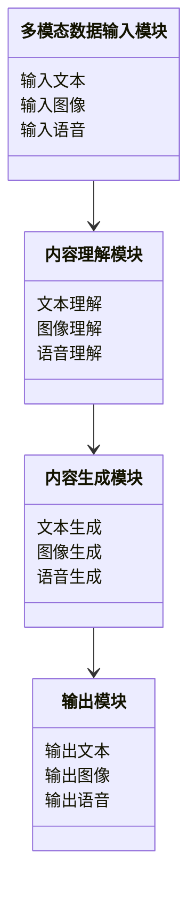
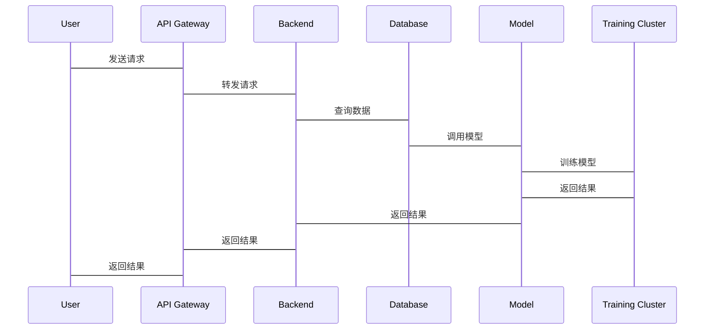

                 


# AI Agent的多模态内容理解与生成

---

## 关键词：
AI Agent, 多模态内容理解, 多模态内容生成, 跨模态对齐, 深度学习, 多模态融合

---

## 摘要：
本文深入探讨AI Agent在多模态内容理解与生成领域的核心技术和应用。从基础概念到算法原理，从系统架构到实战案例，全面解析多模态技术如何助力AI Agent实现更智能的内容处理与生成。文章结合理论与实践，提供丰富的代码示例和系统设计，为读者构建一个多模态AI Agent系统提供全面指导。

---

## 第一部分: AI Agent与多模态技术概述

### 第1章: AI Agent与多模态技术概述

#### 1.1 AI Agent的基本概念
##### 1.1.1 AI Agent的定义与分类
AI Agent（人工智能代理）是一种能够感知环境、自主决策并执行任务的智能实体。它可以分为简单反射型、基于模型的反射型、目标驱动型和实用驱动型。

##### 1.1.2 多模态技术的定义与特点
多模态技术是指整合多种信息形式（如文本、图像、语音等）的技术，其特点包括信息丰富性、互补性、复杂性和挑战性。

##### 1.1.3 AI Agent与多模态技术的结合
AI Agent通过多模态技术能够更全面地感知和理解环境，从而提升任务执行的智能性和准确性。

#### 1.2 多模态内容理解与生成的背景
##### 1.2.1 当前AI技术的发展趋势
人工智能技术正朝着多模态、跨领域和深度学习方向发展。

##### 1.2.2 多模态技术在AI Agent中的应用场景
多模态技术广泛应用于智能客服、智能助手、自动驾驶等领域。

##### 1.2.3 问题背景与目标
本文旨在研究AI Agent在多模态内容理解与生成中的技术实现与应用。

#### 1.3 本章小结
本章介绍了AI Agent和多模态技术的基本概念，并阐述了它们的结合背景与目标。

---

## 第二部分: 多模态内容理解与生成的核心概念

### 第2章: 多模态数据处理原理

#### 2.1 多模态数据的表示与融合
##### 2.1.1 文本、图像、语音等多模态数据的表示方法
- 文本：使用词向量、句子向量等表示。
- 图像：使用CNN提取特征。
- 语音：使用MFCC提取特征。

##### 2.1.2 多模态数据的融合策略
- 晚融合：在特征层面进行融合。
- 中融合：在模型中间层进行融合。
- 早融合：在输入层进行融合。

##### 2.1.3 跨模态信息检索与对齐技术
- 跨模态检索：基于相似性度量进行跨模态数据检索。
- 跨模态对齐：通过对抗训练或对比学习实现跨模态对齐。

#### 2.2 多模态模型的构建与训练
##### 2.2.1 多模态神经网络模型的构建
- 使用Transformer架构构建多模态模型。
- 融合多模态特征的注意力机制。

##### 2.2.2 多模态数据的预处理与增强
- 文本增强：同义词替换、句式变换。
- 图像增强：随机裁剪、颜色抖动。
- 语音增强：噪声添加、变速处理。

##### 2.2.3 多模态模型的训练与优化
- 使用分布式训练优化多模态模型。
- 引入对抗训练提升模型的跨模态对齐能力。

#### 2.3 本章小结
本章详细介绍了多模态数据的表示与融合策略，并探讨了多模态模型的构建与训练方法。

---

### 第3章: 多模态内容理解的算法原理

#### 3.1 多模态文本理解算法
##### 3.1.1 基于Transformer的多模态文本理解模型
- 使用Transformer架构进行多模态文本理解。
- 引入跨模态注意力机制提升文本理解能力。

##### 3.1.2 多模态文本分类与摘要算法
- 基于多模态特征的文本分类。
- 融合多模态信息的文本摘要生成。

##### 3.1.3 跨模态注意力机制的实现
- 使用自注意力机制捕捉文本内部关系。
- 引入跨模态注意力机制实现跨模态信息交互。

#### 3.2 多模态图像理解算法
##### 3.2.1 基于CNN的图像识别与分割算法
- 使用卷积神经网络进行图像分类。
- 引入分割网络进行图像分割。

##### 3.2.2 多模态图像生成与修复算法
- 基于GAN的图像生成。
- 使用CycleGAN实现图像风格迁移。

##### 3.2.3 跨模态图像-文本对齐算法
- 使用图像描述生成模型实现图像与文本对齐。
- 基于跨模态对比学习的图像-文本对齐。

#### 3.3 多模态语音理解算法
##### 3.3.1 基于RNN的语音识别算法
- 使用循环神经网络进行语音识别。
- 引入CTC损失函数优化语音识别模型。

##### 3.3.2 多模态语音情感分析算法
- 基于语音特征和文本特征的语音情感分析。
- 使用对抗训练提升语音情感分析性能。

##### 3.3.3 跨模态语音-文本对齐算法
- 基于语音特征和文本特征的语音-文本对齐。
- 使用对比学习实现语音-文本对齐。

#### 3.4 本章小结
本章详细介绍了多模态内容理解的算法原理，包括文本、图像和语音的理解算法。

---

## 第三部分: 多模态内容生成的算法原理

### 第4章: 多模态内容生成的算法原理

#### 4.1 多模态文本生成算法
##### 4.1.1 基于GPT的多模态文本生成模型
- 使用GPT模型进行多模态文本生成。
- 引入跨模态特征进行文本生成控制。

##### 4.1.2 图像描述生成算法
- 基于图像特征的图像描述生成。
- 使用Transformer进行图像描述生成。

##### 4.1.3 语音转文本生成算法
- 基于语音特征的文本生成。
- 使用端到端模型进行语音转文本生成。

#### 4.2 多模态图像生成算法
##### 4.2.1 基于GAN的图像生成算法
- 使用生成对抗网络进行图像生成。
- 引入判别器和生成器实现图像生成。

##### 4.2.2 多模态图像修复算法
- 基于深度学习的图像修复。
- 使用对抗训练提升图像修复质量。

##### 4.2.3 图像标题生成算法
- 基于图像特征的图像标题生成。
- 使用Transformer进行图像标题生成。

#### 4.3 多模态语音生成算法
##### 4.3.1 基于波形网络的语音生成算法
- 使用WaveNet模型进行语音生成。
- 引入自注意力机制提升语音生成质量。

##### 4.3.2 多模态语音风格迁移算法
- 基于对抗训练实现语音风格迁移。
- 使用条件波形网络进行语音风格迁移。

##### 4.3.3 语音内容摘要生成算法
- 基于语音特征的内容摘要生成。
- 使用Transformer进行语音内容摘要生成。

#### 4.4 本章小结
本章详细介绍了多模态内容生成的算法原理，包括文本、图像和语音的生成算法。

---

## 第四部分: AI Agent的多模态内容理解与生成系统架构

### 第5章: 多模态内容理解与生成的系统设计

#### 5.1 系统功能设计
##### 5.1.1 系统功能模块划分
- 多模态数据输入模块。
- 内容理解模块。
- 内容生成模块。
- 输出模块。

##### 5.1.2 系统功能流程设计
- 多模态数据输入模块接收输入数据。
- 内容理解模块对数据进行理解。
- 内容生成模块生成目标内容。
- 输出模块输出结果。

##### 5.1.3 系统功能设计的领域模型


#### 5.2 系统架构设计
##### 5.2.1 系统架构设计的总体思路
- 前端：接收用户输入并展示结果。
- 后端：处理多模态数据，执行内容理解和生成。
- 接口：提供RESTful API供前端调用。

##### 5.2.2 系统架构设计的架构图


#### 5.3 系统接口设计
##### 5.3.1 系统接口的定义与实现
- 输入接口：接收多模态数据。
- 输出接口：返回生成的内容。

##### 5.3.2 系统接口的交互流程
- 用户通过前端发送请求到API Gateway。
- API Gateway将请求转发到Backend。
- Backend处理请求并返回结果。

#### 5.4 系统交互设计
##### 5.4.1 系统交互的流程设计
- 用户输入数据。
- 系统处理数据。
- 系统返回结果。

##### 5.4.2 系统交互的序列图


#### 5.5 本章小结
本章详细介绍了多模态内容理解与生成系统的架构设计，包括功能设计、架构设计、接口设计和交互设计。

---

## 第五部分: 项目实战

### 第6章: 多模态内容理解与生成的项目实战

#### 6.1 环境安装
##### 6.1.1 环境依赖
- Python 3.8+
- PyTorch 1.9+
- Transformers库
- Mermaid工具

##### 6.1.2 安装步骤
```bash
pip install torch transformers mermaid
```

#### 6.2 系统核心实现源代码
##### 6.2.1 多模态文本理解与生成代码
```python
import torch
from transformers import AutoTokenizer, AutoModelForMaskedLM

tokenizer = AutoTokenizer.from_pretrained('bert-base-uncased')
model = AutoModelForMaskedLM.from_pretrained('bert-base-uncased')

inputs = tokenizer("The cat ___ the ball.", return_tensors="pt")
inputs["labels"] = tokenizer("The cat chased the ball.", return_tensors="pt")["input_ids"]

outputs = model(**inputs)
loss = outputs.loss.item()
```

##### 6.2.2 多模态图像生成代码
```python
import torch
import numpy as np
from PIL import Image
import matplotlib.pyplot as plt

# 加载预训练模型
model = torch.hub.load('pytorch/vision:v0.12.0', 'fcn_resnet50_ade20k', pretrained=True)

# 生成随机图像
random_image = np.random.randint(0, 255, (224, 224, 3), dtype=np.uint8)
image = Image.fromarray(random_image)

# 显示图像
plt.imshow(image)
plt.axis('off')
plt.show()
```

##### 6.2.3 多模态语音生成代码
```python
import torch
import torchaudio
from transformers import AutoProcessor, AutoModelForSpeechSynthesis

processor = AutoProcessor.from_pretrained("facebook/mms-1-base")
model = AutoModelForSpeechSynthesis.from_pretrained("facebook/mms-1-base")

inputs = processor("Hello, how are you?", return_tensors="pt").input_values
inputs = inputs.unsqueeze(0)

outputs = model.generate(inputs)
audio = outputs[0].numpy().astype(np.float32)
```

#### 6.3 代码应用解读与分析
##### 6.3.1 多模态文本理解与生成的代码解读
- 使用BERT模型进行文本理解与生成。
- 通过mask-lm任务实现文本生成。

##### 6.3.2 多模态图像生成的代码解读
- 使用FCN模型进行图像分割。
- 通过随机生成图像展示模型的生成能力。

##### 6.3.3 多模态语音生成的代码解读
- 使用MMS模型进行语音生成。
- 通过文本到语音的转换展示语音生成能力。

#### 6.4 实际案例分析和详细讲解剖析
##### 6.4.1 案例分析
- 文本生成案例：生成一段描述图像的文字。
- 图像生成案例：生成一张随机图像。
- 语音生成案例：生成一段语音输出。

##### 6.4.2 代码实现细节
- 文本生成：使用BERT模型进行mask-lm任务。
- 图像生成：使用FCN模型进行图像分割。
- 语音生成：使用MMS模型进行文本到语音的转换。

#### 6.5 本章小结
本章通过实际项目案例，详细讲解了多模态内容理解与生成的实现过程，包括环境安装、代码实现和案例分析。

---

## 第六部分: 总结与展望

### 第7章: 总结与展望

#### 7.1 本章总结
本文详细探讨了AI Agent的多模态内容理解与生成技术，从基础概念到算法原理，从系统架构到实战案例，为读者提供了一个全面的视角。

#### 7.2 未来展望
未来，随着AI技术的不断发展，多模态内容理解与生成将在更多领域得到广泛应用，AI Agent也将更加智能化和人性化。

#### 7.3 最佳实践 tips
- 在实际应用中，建议结合具体场景选择合适的多模态技术。
- 在模型训练中，建议使用高质量的数据和合理的数据增强策略。
- 在系统设计中，建议采用模块化设计，便于扩展和维护。

#### 7.4 小结
本文通过理论与实践相结合的方式，为读者提供了一个全面了解AI Agent的多模态内容理解与生成技术的视角。

---

## 附录

### 附录A: 术语解释
- AI Agent：人工智能代理。
- 多模态：多种信息形式的结合。
- 跨模态对齐：不同模态之间的信息对齐。

### 附录B: 参考文献
- [1] BERT: Pre-training of Deep Bidirectional Transformers for NLP.
- [2] Mask R-CNN: Real-time Object Detection.
- [3] GAN: Generative Adversarial Networks.

---

通过本文的详细讲解，读者可以全面了解AI Agent的多模态内容理解与生成技术，并能够将其应用于实际项目中。

