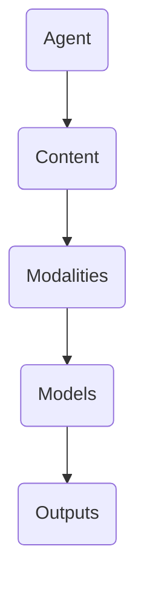
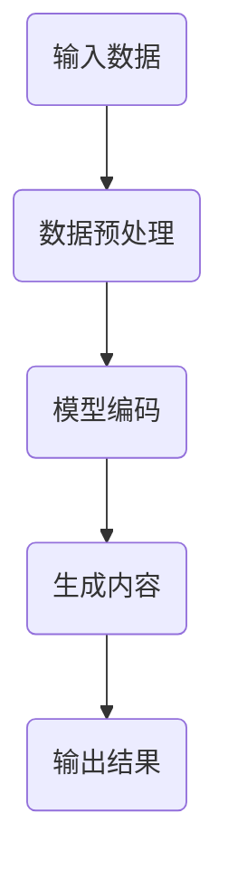
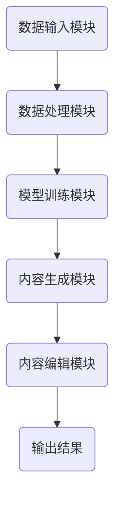

                 


# AI Agent的多模态内容生成与编辑系统

## 关键词：AI Agent, 多模态生成, 内容编辑, 生成模型, 系统架构, 项目实战

## 摘要：  
本文深入探讨了AI Agent在多模态内容生成与编辑系统中的应用。从背景介绍到核心概念，从算法原理到系统架构，从项目实战到最佳实践，全面剖析了多模态内容生成与编辑的技术细节。文章结合理论与实践，通过丰富的图表、代码示例和数学公式，帮助读者理解AI Agent如何实现多模态内容的高效生成与编辑，并提供实际案例分析，帮助读者更好地掌握相关技术。

---

## 第一部分: AI Agent的多模态内容生成与编辑系统概述

## 第1章: AI Agent与多模态内容生成的背景介绍

### 1.1 问题背景与描述

#### 1.1.1 当前内容生成与编辑的痛点
随着人工智能技术的快速发展，内容生成与编辑已经成为许多领域的核心需求。然而，传统的内容生成方式存在以下痛点：
- **单一模态的局限性**：传统生成模型通常仅专注于文本、图像或语音中的一种模态，难以满足用户的多维度需求。
- **生成质量不稳定**：生成内容的质量受数据质量、模型训练目标和参数的影响，难以保证一致性和稳定性。
- **缺乏交互性**：用户在生成内容后，难以对生成结果进行实时反馈和调整，导致生成结果与用户需求存在偏差。

#### 1.1.2 多模态内容生成的需求
多模态内容生成的需求主要来源于以下几个方面：
- **用户需求多样化**：用户在生成内容时，往往需要结合多种模态的信息，例如生成一段带有图像和文字的多媒体内容。
- **提升生成质量**：通过结合多种模态的信息，可以提升生成内容的丰富性和准确性。
- **增强交互性**：多模态生成系统可以通过实时反馈和调整，提升生成过程的交互性和用户体验。

#### 1.1.3 AI Agent在内容生成中的作用
AI Agent（人工智能代理）作为一种能够感知环境、理解用户需求并执行任务的智能体，在多模态内容生成中具有重要作用：
- **多模态数据的整合与处理**：AI Agent可以将多种模态的数据（如文本、图像、语音等）进行整合和处理，生成高质量的多模态内容。
- **动态调整与优化**：AI Agent可以根据用户的反馈实时调整生成策略，优化生成结果，满足用户的个性化需求。

### 1.2 多模态内容生成的核心概念

#### 1.2.1 多模态数据的定义与特点
多模态数据是指包含多种信息形式（如文本、图像、语音、视频等）的数据。其特点包括：
- **信息丰富性**：多模态数据能够提供更全面的信息，帮助生成系统更好地理解上下文。
- **互补性**：不同模态的数据可以互补，提升生成内容的多样性和准确性。
- **复杂性**：多模态数据的处理需要跨模态的整合与协调，技术实现较为复杂。

#### 1.2.2 AI Agent的定义与能力
AI Agent是一种智能体，能够感知环境、理解用户需求并执行任务。其核心能力包括：
- **感知能力**：通过多种传感器或接口获取环境中的信息。
- **理解能力**：通过自然语言处理、计算机视觉等技术理解多模态数据。
- **决策能力**：根据理解的输入信息，生成多模态输出内容。
- **交互能力**：与用户或系统进行实时交互，动态调整生成策略。

#### 1.2.3 多模态内容生成的边界与外延
多模态内容生成的边界与外延需要明确以下几个方面：
- **生成范围**：多模态生成系统可以生成哪些类型的内容，例如文本、图像、语音等。
- **生成目标**：生成内容的用途是什么，例如用于营销、教育、娱乐等场景。
- **生成过程**：生成过程是否需要用户参与，生成结果是否需要实时调整。

### 1.3 多模态内容生成系统的核心要素

#### 1.3.1 数据输入与处理
多模态生成系统需要处理多种类型的数据，例如：
- **文本数据**：包括用户输入的关键词、文本描述等。
- **图像数据**：包括图片、视频等视觉信息。
- **语音数据**：包括用户的语音指令或生成的语音内容。

数据处理过程包括数据清洗、格式转换、特征提取等步骤。

#### 1.3.2 模型训练与优化
多模态生成系统的模型训练需要结合多种模态的数据，采用深度学习技术进行优化。训练目标包括：
- **多模态特征学习**：学习不同模态数据之间的关联性。
- **生成模型优化**：提升生成内容的质量和多样性。

#### 1.3.3 内容生成与编辑
内容生成与编辑是多模态生成系统的核心环节，包括：
- **内容生成**：根据输入数据生成多模态内容。
- **内容编辑**：根据用户反馈实时调整生成内容，优化生成结果。

---

## 第2章: 多模态内容生成的核心概念与联系

### 2.1 AI Agent与多模态生成系统的原理

#### 2.1.1 多模态数据的融合与处理
多模态数据的融合与处理是生成系统的关键步骤。例如，文本和图像数据的融合可以通过以下方式实现：
- **特征对齐**：将文本特征与图像特征对齐，提取共同的语义信息。
- **跨模态推理**：通过推理不同模态之间的关系，生成更丰富的语义信息。

#### 2.1.2 AI Agent的决策与生成机制
AI Agent的决策与生成机制包括以下步骤：
1. **输入感知**：获取用户的输入数据和需求。
2. **多模态分析**：对输入数据进行多模态分析，提取关键特征。
3. **生成策略制定**：根据分析结果制定生成策略。
4. **内容生成**：根据生成策略生成多模态内容。
5. **反馈调整**：根据用户反馈实时调整生成策略，优化生成结果。

#### 2.1.3 内容生成的评价与反馈
内容生成的评价与反馈是提升生成质量的重要环节。评价指标包括：
- **生成内容的质量**：生成内容的准确性、相关性和丰富性。
- **生成过程的效率**：生成内容的速度和实时性。
- **用户满意度**：用户对生成内容的满意度和反馈。

### 2.2 核心概念对比分析

#### 2.2.1 多模态生成与单模态生成的对比
| 特性                | 单模态生成       | 多模态生成       |
|---------------------|------------------|------------------|
| 输入数据            | 单一模态数据     | 多种模态数据     |
| 生成内容            | 单一模态内容     | 多种模态内容     |
| 生成质量            | 受单一模态限制   | 跨模态信息互补   |
| 应用场景            | 文本生成、图像生成 | 多媒体内容生成 |

#### 2.2.2 AI Agent与传统生成模型的对比
| 特性                | 传统生成模型     | AI Agent生成模型 |
|---------------------|------------------|------------------|
| 输入感知            | 无感知           | 有感知           |
| 生成策略            | 固定策略         | 动态调整策略     |
| 交互能力            | 无交互           | 有交互           |
| 应用场景            | 单一任务         | 多任务           |

#### 2.2.3 内容生成与编辑的对比
| 特性                | 内容生成         | 内容编辑         |
|---------------------|------------------|------------------|
| 输入数据            | 生成指令         | 用户反馈         |
| 输出结果            | 生成内容         | 调整后的内容     |
| 实时性              | 生成时实时生成   | 编辑时实时调整   |

### 2.3 系统实体关系图



---

## 第3章: 多模态内容生成的算法原理

### 3.1 基于Transformer的生成模型

#### 3.1.1 Transformer模型的结构
Transformer模型由编码器和解码器组成，其核心结构包括：
- **多头自注意力机制**：用于捕捉输入数据中的长距离依赖关系。
- **前馈神经网络**：用于对输入数据进行非线性变换。

#### 3.1.2 多模态数据的编码与解码
多模态数据的编码与解码过程如下：
1. **编码阶段**：将多模态数据编码为统一的特征向量。
2. **解码阶段**：根据编码后的特征向量生成多模态内容。

#### 3.1.3 模型的训练与优化
模型的训练与优化包括以下步骤：
- **数据预处理**：将多模态数据转换为模型可接受的格式。
- **模型训练**：使用训练数据对模型进行训练，优化生成质量。
- **模型评估**：通过验证集和测试集评估模型的生成能力。

### 3.2 基于扩散模型的内容生成

#### 3.2.1 扩散模型的基本原理
扩散模型通过逐步添加噪声并逐步去噪来生成数据。其核心步骤包括：
1. **噪声添加**：将噪声逐步添加到输入数据中。
2. **去噪过程**：逐步去除噪声，生成最终的生成数据。

#### 3.2.2 多模态数据的扩散过程
多模态数据的扩散过程需要结合多种模态的信息，例如：
- **文本与图像的联合扩散**：在生成文本和图像时，同时考虑两者的关联性。

#### 3.2.3 模型的改进与应用
扩散模型的改进包括：
- **多模态扩散模型**：将多种模态的信息融入扩散过程中，提升生成质量。
- **高效扩散模型**：通过优化扩散步骤和参数，提升生成效率。

### 3.3 算法流程图



### 3.4 Python核心代码实现

```python
import torch
import torch.nn as nn

class MultiModalTransformer(nn.Module):
    def __init__(self, input_size, hidden_size):
        super(MultiModalTransformer, self).__init__()
        self.encoder = nn.TransformerEncoder(...)
        self.decoder = nn.TransformerDecoder(...)
        self.model = nn.Sequential(
            nn.Linear(input_size, hidden_size),
            nn.ReLU(),
            nn.Linear(hidden_size, output_size)
        )

    def forward(self, x):
        encoded = self.encoder(x)
        decoded = self.decoder(encoded)
        output = self.model(decoded)
        return output

# 示例数据
input_data = torch.randn(1, input_size)
model = MultiModalTransformer(input_size, hidden_size)
output = model(input_data)
print(output)
```

---

## 第4章: 多模态内容生成的系统分析与架构设计

### 4.1 系统功能设计

#### 4.1.1 数据输入与处理模块
- **功能描述**：接收多种模态的数据输入，进行预处理和特征提取。
- **核心代码示例**：
  ```python
  def preprocess_data(data):
      # 数据预处理代码
      return processed_data
  ```

#### 4.1.2 模型训练与优化模块
- **功能描述**：对生成模型进行训练和优化，提升生成质量。
- **核心代码示例**：
  ```python
  def train_model(model, data_loader):
      optimizer = torch.optim.Adam(model.parameters(), lr=0.001)
      criterion = nn.CrossEntropyLoss()
      for epoch in range(num_epochs):
          for batch in data_loader:
              outputs = model(batch)
              loss = criterion(outputs, labels)
              optimizer.zero_grad()
              loss.backward()
              optimizer.step()
  ```

#### 4.1.3 内容生成与编辑模块
- **功能描述**：根据用户需求生成多模态内容，并支持实时编辑和调整。
- **核心代码示例**：
  ```python
  def generate_content(model, input_prompt):
      with torch.no_grad():
          output = model.generate(input_prompt)
      return output
  ```

### 4.2 系统架构设计

#### 4.2.1 系统功能模块划分
- **数据输入模块**：负责接收多种模态的数据输入。
- **模型训练模块**：负责对生成模型进行训练和优化。
- **内容生成模块**：负责根据用户需求生成多模态内容。
- **内容编辑模块**：负责根据用户反馈实时调整生成内容。

#### 4.2.2 系统架构图



---

## 第5章: 项目实战——基于AI Agent的多模态内容生成系统

### 5.1 环境安装与配置

#### 5.1.1 安装Python与相关库
- 安装Python 3.8及以上版本。
- 安装深度学习框架（如TensorFlow、PyTorch）。
- 安装自然语言处理库（如Hugging Face Transformers）。

#### 5.1.2 安装其他依赖项
- 安装多模态数据处理库（如OpenCV、librosa）。
- 安装可视化库（如Matplotlib、Seaborn）。

### 5.2 系统核心实现

#### 5.2.1 数据预处理代码
```python
import cv2
import librosa

def process_image(image_path):
    # 图像预处理代码
    return processed_image

def process_audio(audio_path):
    # 音频预处理代码
    return processed_audio
```

#### 5.2.2 模型训练代码
```python
import torch
import torch.nn as nn

class MultiModalGenerator(nn.Module):
    def __init__(self, ...):
        super(MultiModalGenerator, self).__init__()
        # 定义生成模型的结构

    def forward(self, x):
        # 前向传播过程
        return output

def train_model(model, ...):
    # 模型训练过程
    pass
```

#### 5.2.3 内容生成与编辑代码
```python
def generate_content(model, input_data):
    # 内容生成代码
    return generated_content

def edit_content(model, input_feedback):
    # 内容编辑代码
    return edited_content
```

### 5.3 代码应用解读与分析

#### 5.3.1 数据预处理模块
数据预处理模块负责将原始数据转换为模型可接受的格式。例如：
- 图像数据：将图像缩放到特定大小，归一化处理。
- 文本数据：将文本转换为向量表示，如词嵌入。

#### 5.3.2 模型训练模块
模型训练模块负责对生成模型进行训练和优化。例如：
- 使用深度学习框架（如PyTorch）构建生成模型。
- 定义损失函数和优化器，进行反向传播和参数更新。

#### 5.3.3 内容生成与编辑模块
内容生成与编辑模块负责根据用户需求生成多模态内容，并支持实时编辑和调整。例如：
- 根据用户的输入生成文本、图像或语音内容。
- 根据用户的反馈实时调整生成策略，优化生成结果。

### 5.4 实际案例分析与详细讲解

#### 5.4.1 案例背景
假设我们正在开发一个多模态内容生成系统，用于生成多媒体新闻报道。用户可以通过输入文本描述生成相应的新闻标题、配图和音频描述。

#### 5.4.2 系统实现步骤
1. **数据预处理**：将用户输入的文本描述进行分词、嵌入等处理。
2. **模型训练**：使用预处理后的数据训练生成模型，优化生成质量。
3. **内容生成**：根据用户的输入生成新闻标题、配图和音频描述。
4. **内容编辑**：根据用户的反馈实时调整生成内容，优化生成结果。

#### 5.4.3 系统运行结果
- 新闻标题：生成高质量的新闻标题，准确反映新闻内容。
- 配图：生成与新闻内容相关的高质量图像。
- 音频描述：生成与新闻内容相关的音频描述，提升用户体验。

### 5.5 项目小结

#### 5.5.1 核心代码总结
```python
import torch
import torch.nn as nn

class MultiModalGenerator(nn.Module):
    def __init__(self, ...):
        super(MultiModalGenerator, self).__init__()
        # 定义生成模型的结构

    def forward(self, x):
        # 前向传播过程
        return output

def train_model(model, ...):
    # 模型训练过程
    pass
```

#### 5.5.2 项目实现的关键点
- 数据预处理的准确性：数据预处理的质量直接影响生成模型的效果。
- 模型训练的稳定性：模型训练过程需要稳定，生成结果需要一致。
- 内容生成的实时性：生成过程需要快速响应，满足用户的实时需求。

---

## 第6章: 多模态内容生成系统的最佳实践

### 6.1 小结与总结

#### 6.1.1 本章内容回顾
本文从AI Agent的多模态内容生成与编辑系统的背景介绍到核心概念，从算法原理到系统架构，从项目实战到最佳实践，全面剖析了多模态内容生成与编辑的技术细节。

#### 6.1.2 本文的核心观点
- 多模态内容生成与编辑是未来人工智能技术的重要发展方向。
- AI Agent在多模态内容生成中的作用不可忽视，能够显著提升生成质量与用户体验。
- 多模态生成系统的实现需要结合多种技术，包括深度学习、自然语言处理和计算机视觉等。

### 6.2 注意事项与常见问题

#### 6.2.1 开发中的注意事项
- 数据质量：多模态数据的质量直接影响生成结果。
- 模型选择：选择合适的生成模型，提升生成质量。
- 系统优化：优化系统性能，提升生成效率。

#### 6.2.2 常见问题与解决方案
- **问题一**：生成内容的质量不稳定。
  - 解决方案：优化模型训练过程，增加训练数据量。
- **问题二**：生成过程的实时性不足。
  - 解决方案：优化系统架构，提升生成效率。
- **问题三**：用户反馈的处理不够及时。
  - 解决方案：改进反馈机制，实时调整生成策略。

### 6.3 拓展阅读与深入学习

#### 6.3.1 相关领域的最新研究
- 多模态生成模型的最新研究进展。
- AI Agent在其他领域的应用研究。

#### 6.3.2 推荐的技术博客与论文
- 推荐阅读Hugging Face Transformers的官方文档。
- 推荐阅读多模态生成模型的最新论文。

---

## 结论

本文通过详细的分析与实践，深入探讨了AI Agent在多模态内容生成与编辑系统中的应用。从理论到实践，从系统架构到项目实现，全面剖析了多模态内容生成的技术细节。未来，随着人工智能技术的不断发展，多模态生成系统将变得更加智能化和高效化，为用户带来更优质的内容生成与编辑体验。

--- 

如果需要进一步的详细解读或代码实现，请随时告知！

