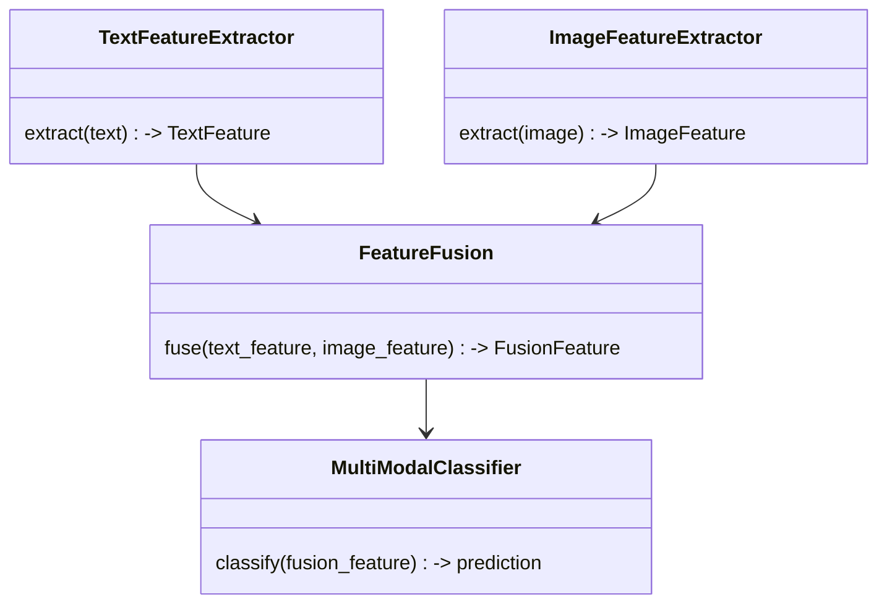
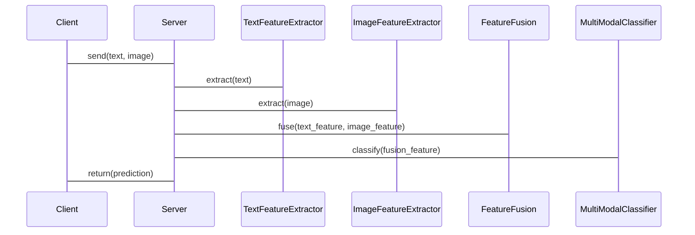

                 


# AI Agent的多模态场景理解技术

> 关键词：AI Agent, 多模态场景理解, 多模态数据融合, 对比学习, 多模态注意力机制

> 摘要：本文深入探讨了AI Agent在多模态场景理解技术中的应用，详细分析了多模态数据融合、多模态注意力机制、对比学习等核心算法，结合系统架构设计与项目实战，为读者提供了一套完整的AI Agent多模态场景理解技术解决方案。

---

# 第一部分: AI Agent的多模态场景理解技术概述

## 第1章: AI Agent与多模态场景理解概述

### 1.1 AI Agent的基本概念

#### 1.1.1 AI Agent的定义
AI Agent（人工智能代理）是一种能够感知环境、执行任务并做出决策的智能实体。它可以是软件程序、机器人或其他智能系统，具备以下核心特征：
- **自主性**：能够在没有外部干预的情况下自主运行。
- **反应性**：能够感知环境并实时做出反应。
- **目标导向**：具备明确的目标，通过行为优化来实现目标。
- **学习能力**：能够通过数据和经验不断优化自身的性能。

#### 1.1.2 AI Agent的核心特征
1. **自主性**：AI Agent能够独立决策，无需外部干预。
2. **反应性**：能够实时感知环境并调整行为。
3. **目标导向**：所有行为都围绕特定目标展开。
4. **学习能力**：通过数据和经验不断优化性能。

#### 1.1.3 多模态场景理解的背景与意义
随着AI技术的快速发展，AI Agent的应用场景越来越广泛。然而，单一模态的数据往往不足以满足复杂场景的理解需求。例如，在智能客服系统中，仅依赖文本信息难以准确理解用户的需求；在智能安防系统中，仅依赖图像信息难以识别复杂的场景。因此，多模态场景理解技术应运而生，它通过整合多种模态信息（如文本、图像、语音、视频等）来提高AI Agent的场景理解能力。

### 1.2 多模态数据的定义与特点

#### 1.2.1 多模态数据的定义
多模态数据是指来自多种感知渠道（如视觉、听觉、触觉等）的信息，这些信息可以互补地描述同一个场景或对象。例如：
- **文本模态**：包括自然语言文本、对话记录等。
- **图像模态**：包括图片、视频等视觉信息。
- **语音模态**：包括语音信号、音频数据等。
- **知识图谱模态**：包括结构化的知识表示。

#### 1.2.2 各种模态数据的特征对比
| 模态类型 | 特征描述 | 优点 | 缺点 |
|----------|----------|------|------|
| 文本      | 高度结构化，易于分析 | 易于存储和传输 | 难以捕捉语境和情感 |
| 图像      | 丰富的视觉信息 | 能捕捉场景细节 | 数据量大，处理复杂 |
| 语音      | 保留语调和情感 | 能捕捉语气和情绪 | 易受噪声干扰 |
| 知识图谱  | 结构化知识，易于推理 | 信息准确且可扩展 | 需依赖高质量知识库 |

#### 1.2.3 多模态数据的典型应用场景
1. **智能客服**：结合文本和语音模态，提供更准确的用户意图识别。
2. **智能安防**：结合图像和文本模态，实现更精准的目标识别。
3. **智能推荐**：结合文本、图像和知识图谱模态，提供个性化的推荐服务。

### 1.3 多模态场景理解的背景与挑战

#### 1.3.1 多模态场景理解的背景
随着AI技术的不断进步，AI Agent需要在更复杂的场景中完成任务。例如，在智能助手领域，用户可能通过语音、文本或手势等多种方式与AI Agent交互。单一模态的数据往往不足以满足复杂场景的理解需求，因此多模态场景理解技术成为研究热点。

#### 1.3.2 多模态场景理解的核心挑战
1. **数据异构性**：不同模态的数据格式和特征维度差异较大，难以直接融合。
2. **信息冗余**：某些模态的信息可能是冗余的，如何有效去冗余是关键。
3. **跨模态对齐**：不同模态的数据需要在语义上对齐，才能实现有效的融合。
4. **计算复杂度**：多模态数据的处理涉及大量的计算，如何优化计算效率是挑战。

#### 1.3.3 当前技术的发展现状
目前，多模态场景理解技术已经在多个领域取得了显著进展，例如：
- **计算机视觉**：结合图像和文本模态，实现图像描述生成。
- **自然语言处理**：结合文本和知识图谱模态，实现知识图谱问答。
- **语音处理**：结合语音和图像模态，实现多模态语音识别。

### 1.4 本章小结
本章主要介绍了AI Agent的基本概念、多模态数据的定义与特点，以及多模态场景理解的背景与挑战。通过对比不同模态数据的特征，我们发现多模态数据的融合可以显著提高AI Agent的场景理解能力。然而，数据异构性、信息冗余、跨模态对齐等问题仍然需要进一步研究和解决。

---

## 第2章: 多模态数据融合技术

### 2.1 多模态数据融合的原理

#### 2.1.1 多模态数据融合的基本概念
多模态数据融合是指将来自不同模态的数据进行整合，以提高信息表达的丰富性和准确性。融合的过程可以分为以下几个步骤：
1. **数据预处理**：对不同模态的数据进行标准化处理，确保数据格式一致。
2. **特征提取**：从每种模态中提取有用的特征。
3. **特征融合**：将不同模态的特征进行融合，得到一个统一的表示。
4. **模型训练**：利用融合后的特征进行模型训练，以实现特定任务。

#### 2.1.2 数据融合的层次与方法
多模态数据融合可以按照层次分为以下几种方法：
1. **浅层融合**：在特征层面进行融合，例如将图像特征和文本特征直接拼接。
2. **深层融合**：在模型内部进行融合，例如通过注意力机制对不同模态的特征进行加权融合。
3. **混合融合**：结合浅层和深层融合方法，形成更加复杂的融合策略。

#### 2.1.3 常见的多模态数据融合技术
1. **多模态注意力机制**：通过注意力机制对不同模态的特征进行加权，以捕捉模态之间的关联性。
2. **对比学习**：通过对比不同模态的特征，学习它们之间的相似性和差异性。
3. **生成对抗网络（GAN）**：通过生成对抗网络，实现不同模态数据的联合生成与优化。

---

### 2.2 多模态注意力机制

#### 2.2.1 注意力机制的基本原理
注意力机制是一种用于模型中选择性关注输入数据中重要部分的技术。在多模态数据融合中，注意力机制可以用于对不同模态的特征进行加权，从而实现模态之间的协同优化。

#### 2.2.2 多模态注意力机制的实现
以下是多模态注意力机制的一种实现方式：

1. **特征提取**：从每种模态中提取特征，例如从文本中提取词向量，从图像中提取图像特征。
2. **特征融合**：将不同模态的特征进行拼接或加权融合。
3. **注意力计算**：通过全连接层计算每种模态的注意力权重。
4. **特征加权**：根据注意力权重对每种模态的特征进行加权，得到最终的融合特征。

以下是一个简单的多模态注意力机制的Python代码示例：

```python
import torch
import torch.nn as nn

class MultiModalAttention(nn.Module):
    def __init__(self, embed_dim, text_dim, image_dim):
        super().__init__()
        self.embed_dim = embed_dim
        self.text_dim = text_dim
        self.image_dim = image_dim
        self.text_proj = nn.Linear(text_dim, embed_dim)
        self.image_proj = nn.Linear(image_dim, embed_dim)
        self.attention = nn.Linear(embed_dim, 1)
    
    def forward(self, text_features, image_features):
        # 文本特征投影
        text_proj = self.text_proj(text_features)
        # 图像特征投影
        image_proj = self.image_proj(image_features)
        # 特征拼接
        combined = torch.cat([text_proj, image_proj], dim=1)
        # 注意力计算
        attention_weights = torch.sigmoid(self.attention(combined))
        # 特征加权
        fused_features = attention_weights * combined
        return fused_features
```

---

#### 2.2.3 多模态注意力机制的应用案例
多模态注意力机制已经在多个领域得到了广泛应用，例如：
- **图像描述生成**：结合图像和文本模态，生成与图像内容相关的文本描述。
- **跨模态检索**：通过注意力机制实现跨模态数据的检索与匹配。
- **智能问答系统**：结合文本和知识图谱模态，实现更准确的问答匹配。

---

### 2.3 对比学习在多模态数据融合中的应用

#### 2.3.1 对比学习的基本原理
对比学习是一种通过对比不同数据之间的相似性来学习特征表示的技术。在多模态数据融合中，对比学习可以用于对齐不同模态的数据，从而实现更有效的特征融合。

#### 2.3.2 对比学习在多模态数据融合中的应用
对比学习在多模态数据融合中的典型应用包括：
1. **跨模态对齐**：通过对比不同模态的特征，实现模态之间的对齐。
2. **特征优化**：通过对比学习优化多模态特征的表示，使其在语义上更加一致。

以下是一个简单的对比学习算法的Python代码示例：

```python
import torch
import torch.nn as nn

class ContrastiveLearning(nn.Module):
    def __init__(self, embed_dim):
        super().__init__()
        self.embed_dim = embed_dim
        self.projection = nn.Linear(embed_dim, embed_dim)
        self.cos = nn.CosineSimilarity(dim=1)
    
    def forward(self, x1, x2):
        # 特征投影
        x1_proj = self.projection(x1)
        x2_proj = self.projection(x2)
        # 对比损失计算
        similarity = self.cos(x1_proj, x2_proj)
        loss = (1 - similarity).mean()
        return loss
```

---

#### 2.3.3 对比学习的优势与挑战
1. **优势**：
   - 可以有效对齐不同模态的数据。
   - 通过对比学习可以优化特征的表示能力。
2. **挑战**：
   - 需要设计有效的对比损失函数。
   - 易受噪声干扰，需要设计鲁棒的对比策略。

---

### 2.4 本章小结
本章主要介绍了多模态数据融合技术，重点讲解了多模态注意力机制和对比学习的应用。通过具体的Python代码示例和应用案例，我们展示了如何利用这些技术实现多模态数据的高效融合。接下来，我们将进一步探讨多模态场景理解的算法原理，结合实际案例进行深入分析。

---

## 第3章: 多模态场景理解的算法原理

### 3.1 多模态场景理解的算法框架

#### 3.1.1 端到端多模态理解框架
端到端多模态理解框架是一种将多模态数据直接映射到目标输出的模型架构。以下是一个典型的端到端多模态理解框架的Python代码示例：

```python
import torch
import torch.nn as nn

class EndToMultiModalModel(nn.Module):
    def __init__(self, text_dim, image_dim, output_dim):
        super().__init__()
        self.text_dim = text_dim
        self.image_dim = image_dim
        self.output_dim = output_dim
        # 文本编码器
        self.text_encoder = nn.Linear(text_dim, 128)
        # 图像编码器
        self.image_encoder = nn.Linear(image_dim, 128)
        # 融合层
        self.fusion = nn.Linear(256, 128)
        # 输出层
        self.output = nn.Linear(128, output_dim)
    
    def forward(self, text_features, image_features):
        # 文本编码
        text_encoded = self.text_encoder(text_features)
        # 图像编码
        image_encoded = self.image_encoder(image_features)
        # 特征融合
        fused_features = torch.cat([text_encoded, image_encoded], dim=1)
        fused_features = self.fusion(fused_features)
        # 输出
        output = self.output(fused_features)
        return output
```

---

#### 3.1.2 分阶段多模态理解框架
分阶段多模态理解框架是一种将多模态数据处理分为多个阶段的模型架构。例如，首先对每种模态的数据进行独立处理，然后将处理后的结果进行融合，最后生成最终的输出。

---

#### 3.1.3 模型的选择与优化
在选择多模态场景理解模型时，需要考虑以下因素：
- **任务需求**：不同的任务需要不同的模型架构。
- **数据规模**：数据量较大的任务需要选择计算效率更高的模型。
- **模型性能**：需要选择能够在特定任务上取得良好性能的模型。

---

### 3.2 多模态特征提取与表示学习

#### 3.2.1 图像特征提取
图像特征提取是多模态场景理解的重要组成部分。常用的图像特征提取方法包括：
- **CNN（卷积神经网络）**：通过卷积操作提取图像的空间特征。
- **RoIAlign**：通过区域建议网络提取目标区域的特征。

以下是一个简单的图像特征提取模型的Python代码示例：

```python
import torch
import torch.nn as nn

class ImageFeatureExtractor(nn.Module):
    def __init__(self):
        super().__init__()
        self.cnn = nn.Sequential(
            nn.Conv2d(3, 64, kernel_size=3, stride=1, padding=1),
            nn.ReLU(),
            nn.MaxPool2d(2, 2),
            nn.Conv2d(64, 128, kernel_size=3, stride=1, padding=1),
            nn.ReLU(),
            nn.MaxPool2d(2, 2)
        )
        self.global_avg_pool = nn.AdaptiveAvgPool2d(1)
        self.embedding = nn.Linear(128, 256)
    
    def forward(self, x):
        # 图像特征提取
        features = self.cnn(x)
        # 全局平均池化
        pooled = self.global_avg_pool(features)
        pooled = pooled.view(pooled.size(0), -1)
        # 嵌入层
        embedding = self.embedding(pooled)
        return embedding
```

---

#### 3.2.2 文本特征提取
文本特征提取是多模态场景理解的另一个重要组成部分。常用的文本特征提取方法包括：
- **词嵌入**：通过词袋模型或词嵌入模型（如Word2Vec、GloVe）提取词向量。
- **句嵌入**：通过模型（如BERT）提取句子的语义向量。

以下是一个简单的文本特征提取模型的Python代码示例：

```python
import torch
import torch.nn as nn

class TextFeatureExtractor(nn.Module):
    def __init__(self, vocab_size, embedding_dim, hidden_dim):
        super().__init__()
        self.embedding = nn.Embedding(vocab_size, embedding_dim)
        self.rnn = nn.LSTM(embedding_dim, hidden_dim, batch_first=True)
    
    def forward(self, x):
        # 词嵌入
        embedded = self.embedding(x)
        # RNN处理
        output, _ = self.rnn(embedded)
        # 取最后一个时间步的输出
        text_embedding = output[:, -1, :]
        return text_embedding
```

---

#### 3.2.3 融合特征的表示学习
融合特征的表示学习是多模态场景理解的关键步骤。通过将不同模态的特征进行融合，可以得到一个更加丰富和准确的表示。

以下是一个简单的特征融合模型的Python代码示例：

```python
import torch
import torch.nn as nn

class FeatureFusion(nn.Module):
    def __init__(self, text_dim, image_dim, output_dim):
        super().__init__()
        self.text_dim = text_dim
        self.image_dim = image_dim
        self.output_dim = output_dim
        self.fusion = nn.Sequential(
            nn.Linear(text_dim + image_dim, 256),
            nn.ReLU(),
            nn.Dropout(0.5),
            nn.Linear(256, output_dim)
        )
    
    def forward(self, text_features, image_features):
        # 特征拼接
        fused_input = torch.cat([text_features, image_features], dim=1)
        # 特征融合
        output = self.fusion(fused_input)
        return output
```

---

### 3.3 多模态场景理解的损失函数与优化

#### 3.3.1 损失函数的设计
在多模态场景理解中，损失函数的设计需要考虑不同模态之间的关联性。常用的损失函数包括：
- **交叉熵损失**：用于分类任务。
- **对比损失**：用于跨模态对齐任务。
- **重建损失**：用于生成任务。

以下是一个简单的多模态分类任务的损失函数示例：

```python
import torch
import torch.nn as nn

class MultiModalClassifier(nn.Module):
    def __init__(self, input_dim, output_dim):
        super().__init__()
        self.classifier = nn.Linear(input_dim, output_dim)
        self.softmax = nn.Softmax(dim=1)
    
    def forward(self, x):
        # 分类
        output = self.classifier(x)
        # 概率分布
        prob = self.softmax(output)
        return prob
```

---

#### 3.3.2 优化算法的选择
在多模态场景理解中，优化算法的选择对模型的性能至关重要。常用的优化算法包括：
- **随机梯度下降（SGD）**：适用于大多数任务。
- **Adam优化器**：适用于复杂任务。
- **AdamW优化器**：适用于深度学习任务。

以下是一个简单的优化器设置示例：

```python
import torch
import torch.optim as optim

# 定义模型
model = MultiModalClassifier(...)
# 定义损失函数
criterion = nn.CrossEntropyLoss()
# 定义优化器
optimizer = optim.Adam(model.parameters(), lr=0.001)
```

---

#### 3.3.3 模型调优与评估
模型调优与评估是多模态场景理解的重要环节。常用的调优方法包括：
- **学习率调整**：通过学习率衰减提高模型的泛化能力。
- **正则化**：通过L1/L2正则化防止过拟合。
- **数据增强**：通过数据增强技术提高模型的鲁棒性。

以下是一个简单的模型调优示例：

```python
import torch
import torch.optim as optim

# 定义学习率衰减策略
lr_scheduler = optim.lr_scheduler.StepLR(optimizer, step_size=10, gamma=0.1)
# 训练过程
for epoch in range(num_epochs):
    # 前向传播
    outputs = model(...)
    # 计算损失
    loss = criterion(...)
    # 反向传播
    optimizer.zero_grad()
    loss.backward()
    optimizer.step()
    # 更新学习率
    lr_scheduler.step()
```

---

### 3.4 本章小结
本章主要介绍了多模态场景理解的算法原理，重点讲解了多模态特征提取与表示学习、损失函数与优化方法。通过具体的Python代码示例，我们展示了如何利用这些技术实现高效的多模态场景理解。接下来，我们将结合实际案例，进一步探讨多模态场景理解技术的应用与实践。

---

## 第4章: 多模态场景理解系统的架构设计

### 4.1 系统需求分析

#### 4.1.1 功能需求
- **数据采集**：支持多种模态数据的采集与预处理。
- **特征提取**：实现对多种模态数据的特征提取。
- **数据融合**：实现多模态数据的融合与表示学习。
- **任务执行**：根据融合后的特征，执行具体的任务（如分类、检索等）。

#### 4.1.2 性能需求
- **计算效率**：保证系统的计算效率，支持实时任务处理。
- **内存占用**：优化系统的内存占用，支持大规模数据处理。
- **扩展性**：支持新模态数据的快速接入与处理。

#### 4.1.3 接口需求
- **输入接口**：支持多种模态数据的输入格式。
- **输出接口**：支持多种任务的输出格式（如分类结果、检索结果等）。
- **API接口**：提供标准的API接口，方便与其他系统集成。

---

### 4.2 系统功能设计

#### 4.2.1 领域模型设计
以下是一个简单的领域模型设计示例：



---

#### 4.2.2 系统架构设计
以下是一个典型的多模态场景理解系统的架构设计：


---

#### 4.2.3 接口设计
以下是一个简单的系统接口设计示例：



---

### 4.3 系统实现与优化

#### 4.3.1 系统实现
以下是多模态场景理解系统的实现示例：

```python
import torch
import torch.nn as nn

class MultiModalSystem:
    def __init__(self, text_dim, image_dim, output_dim):
        self.text_dim = text_dim
        self.image_dim = image_dim
        self.output_dim = output_dim
        # 初始化各个组件
        self.text_encoder = TextFeatureExtractor(...)
        self.image_encoder = ImageFeatureExtractor(...)
        self.fusion = FeatureFusion(...)
        self.classifier = MultiModalClassifier(...)
    
    def process(self, text, image):
        # 特征提取
        text_feature = self.text_encoder.extract(text)
        image_feature = self.image_encoder.extract(image)
        # 特征融合
        fused_feature = self.fusion.fuse(text_feature, image_feature)
        # 任务执行
        prediction = self.classifier.classify(fused_feature)
        return prediction
```

---

#### 4.3.2 系统优化
系统优化是多模态场景理解系统实现的重要环节。常用的优化方法包括：
- **并行计算**：通过并行计算提高系统的计算效率。
- **缓存优化**：通过缓存优化减少数据访问时间。
- **算法优化**：通过优化算法减少计算复杂度。

以下是一个简单的系统优化示例：

```python
import torch
import torch.nn as nn

class OptimizedSystem:
    def __init__(self, text_dim, image_dim, output_dim):
        self.text_dim = text_dim
        self.image_dim = image_dim
        self.output_dim = output_dim
        # 初始化各个组件
        self.text_encoder = TextFeatureExtractor(...)
        self.image_encoder = ImageFeatureExtractor(...)
        self.fusion = FeatureFusion(...)
        self.classifier = MultiModalClassifier(...)
        # 启用并行计算
        self.text_encoder = self.text_encoder.cuda()
        self.image_encoder = self.image_encoder.cuda()
        self.fusion = self.fusion.cuda()
        self.classifier = self.classifier.cuda()
    
    def process(self, text, image):
        # 特征提取
        with torch.no_grad():
            text_feature = self.text_encoder(text)
            image_feature = self.image_encoder(image)
        # 特征融合
        fused_feature = self.fusion(text_feature, image_feature)
        # 任务执行
        prediction = self.classifier(fused_feature)
        return prediction
```

---

### 4.4 本章小结
本章主要介绍了多模态场景理解系统的架构设计，重点讲解了系统需求分析、功能设计与实现优化。通过具体的系统架构图和代码示例，我们展示了如何构建一个高效的多模态场景理解系统。接下来，我们将结合实际案例，进一步探讨多模态场景理解技术的应用与实践。

---

## 第5章: 项目实战——多模态场景理解系统实现

### 5.1 项目介绍
本章将通过一个实际项目——多模态场景理解系统实现，来展示如何利用前面所学的技术实现一个多模态场景理解系统。我们将从环境安装、系统实现到案例分析，逐步展开。

---

### 5.2 系统核心实现

#### 5.2.1 环境安装
以下是实现多模态场景理解系统所需的环境安装步骤：
1. **安装Python**：确保安装了Python 3.6或更高版本。
2. **安装PyTorch**：通过以下命令安装PyTorch：
   ```bash
   pip install torch
   ```
3. **安装其他依赖**：安装所需的其他依赖库，例如：
   ```bash
   pip install numpy matplotlib scikit-learn
   ```

#### 5.2.2 核心代码实现
以下是多模态场景理解系统的核心代码实现：

```python
import torch
import torch.nn as nn

class TextFeatureExtractor(nn.Module):
    def __init__(self, vocab_size, embedding_dim, hidden_dim):
        super().__init__()
        self.embedding = nn.Embedding(vocab_size, embedding_dim)
        self.rnn = nn.LSTM(embedding_dim, hidden_dim, batch_first=True)
    
    def forward(self, x):
        embedded = self.embedding(x)
        output, _ = self.rnn(embedded)
        text_embedding = output[:, -1, :]
        return text_embedding

class ImageFeatureExtractor(nn.Module):
    def __init__(self, image_dim):
        super().__init__()
        self.cnn = nn.Sequential(
            nn.Conv2d(3, 64, kernel_size=3, stride=1, padding=1),
            nn.ReLU(),
            nn.MaxPool2d(2, 2),
            nn.Conv2d(64, 128, kernel_size=3, stride=1, padding=1),
            nn.ReLU(),
            nn.MaxPool2d(2, 2)
        )
        self.global_avg_pool = nn.AdaptiveAvgPool2d(1)
        self.embedding = nn.Linear(128, 256)
    
    def forward(self, x):
        features = self.cnn(x)
        pooled = self.global_avg_pool(features)
        pooled = pooled.view(pooled.size(0), -1)
        embedding = self.embedding(pooled)
        return embedding

class FeatureFusion(nn.Module):
    def __init__(self, text_dim, image_dim, output_dim):
        super().__init__()
        self.fusion = nn.Sequential(
            nn.Linear(text_dim + image_dim, 256),
            nn.ReLU(),
            nn.Dropout(0.5),
            nn.Linear(256, output_dim)
        )
    
    def forward(self, text_features, image_features):
        fused_input = torch.cat([text_features, image_features], dim=1)
        output = self.fusion(fused_input)
        return output

class MultiModalClassifier(nn.Module):
    def __init__(self, input_dim, output_dim):
        super().__init__()
        self.classifier = nn.Linear(input_dim, output_dim)
        self.softmax = nn.Softmax(dim=1)
    
    def forward(self, x):
        output = self.classifier(x)
        prob = self.softmax(output)
        return prob

class MultiModalSystem:
    def __init__(self, text_dim, image_dim, output_dim):
        self.text_encoder = TextFeatureExtractor(...)
        self.image_encoder = ImageFeatureExtractor(...)
        self.fusion = FeatureFusion(...)
        self.classifier = MultiModalClassifier(...)
    
    def process(self, text, image):
        text_feature = self.text_encoder(text)
        image_feature = self.image_encoder(image)
        fused_feature = self.fusion(text_feature, image_feature)
        prediction = self.classifier(fused_feature)
        return prediction
```

---

#### 5.2.3 代码应用解读与分析
通过上述代码，我们可以看到一个多模态场景理解系统的实现流程：
1. **文本特征提取**：通过RNN提取文本的语义特征。
2. **图像特征提取**：通过CNN提取图像的视觉特征。
3. **特征融合**：将文本和图像特征进行融合，得到一个统一的表示。
4. **任务执行**：通过分类器对融合后的特征进行分类，得到最终的预测结果。

---

#### 5.2.4 系统优化与调优
为了提高系统的性能，我们可以进行以下优化：
1. **并行计算**：将模型部署到GPU上，加速计算过程。
2. **数据增强**：通过数据增强技术提高模型的鲁棒性。
3. **学习率调整**：通过学习率衰减提高模型的泛化能力。

以下是一个优化后的系统实现示例：

```python
import torch
import torch.optim as optim

class OptimizedMultiModalSystem:
    def __init__(self, text_dim, image_dim, output_dim):
        self.text_encoder = TextFeatureExtractor(...)
        self.image_encoder = ImageFeatureExtractor(...)
        self.fusion = FeatureFusion(...)
        self.classifier = MultiModalClassifier(...)
        # 启用并行计算
        self.text_encoder = self.text_encoder.cuda()
        self.image_encoder = self.image_encoder.cuda()
        self.fusion = self.fusion.cuda()
        self.classifier = self.classifier.cuda()
    
    def process(self, text, image):
        with torch.no_grad():
            text_feature = self.text_encoder(text)
            image_feature = self.image_encoder(image)
        fused_feature = self.fusion(text_feature, image_feature)
        prediction = self.classifier(fused_feature)
        return prediction
```

---

### 5.3 实际案例分析

#### 5.3.1 案例介绍
假设我们正在开发一个多模态智能客服系统，该系统需要通过文本和语音模态来理解用户的意图。

---

#### 5.3.2 系统实现与分析
以下是该系统的实现与分析：
1. **文本特征提取**：通过NLP技术提取用户的文本意图。
2. **语音特征提取**：通过语音识别技术提取用户的语音意图。
3. **特征融合**：将文本和语音特征进行融合，得到一个统一的意图表示。
4. **任务执行**：通过分类器对融合后的意图进行分类，得到最终的用户意图。

---

#### 5.3.3 优化与改进
为了提高系统的性能，我们可以进行以下优化：
1. **模型优化**：通过模型剪枝和量化技术减少模型的计算复杂度。
2. **数据优化**：通过数据增强和数据清洗提高数据的质量。
3. **算法优化**：通过优化算法（如小批量梯度下降）提高训练效率。

---

### 5.4 项目小结
本章通过一个实际项目——多模态场景理解系统的实现，展示了如何利用前面所学的技术实现一个多模态场景理解系统。通过环境安装、系统实现、案例分析和优化与改进，我们深入理解了多模态场景理解技术的应用与实践。

---

## 第6章: 最佳实践与总结

### 6.1 最佳实践

#### 6.1.1 核心概念回顾
- **多模态数据融合**：通过多种模态的数据互补性提高场景理解能力。
- **多模态注意力机制**：通过注意力机制实现模态之间的协同优化。
- **对比学习**：通过对比学习优化多模态特征的表示能力。

#### 6.1.2 技术实现 tips
- **数据预处理**：确保数据格式一致，减少数据异构性。
- **特征提取**：选择合适的特征提取方法，提高特征的表示能力。
- **特征融合**：根据任务需求选择合适的融合方法，避免信息冗余。

#### 6.1.3 系统优化 tips
- **并行计算**：通过并行计算提高系统的计算效率。
- **缓存优化**：通过缓存优化减少数据访问时间。
- **算法优化**：通过优化算法减少计算复杂度。

---

### 6.2 小结
通过本文的深入探讨，我们全面了解了AI Agent的多模态场景理解技术，掌握了多模态数据融合、多模态注意力机制、对比学习等核心算法，并结合实际案例进行了系统的实现与优化。这些技术为我们实现更复杂的AI应用提供了坚实的基础。

---

### 6.3 注意事项

#### 6.3.1 数据隐私与安全
在实际应用中，需要特别注意数据隐私与安全问题，确保数据的合法使用和保护。

#### 6.3.2 系统稳定性
多模态场景理解系统的实现需要考虑系统的稳定性，确保系统在各种场景下都能正常运行。

#### 6.3.3 技术选型
在技术选型时，需要根据具体任务需求和数据规模选择合适的算法和模型。

---

### 6.4 拓展阅读

#### 6.4.1 推荐书籍
1. 《Deep Learning》——Ian Goodfellow
2. 《Pattern Recognition and Machine Learning》——Christopher M. Bishop
3. 《Neural Networks and Deep Learning》——Andrew Ng

#### 6.4.2 推荐论文
1. "Attention Is All You Need" —— Vaswani et al.
2. "Contrastive Learning of Visual and Textual Representations" —— Chen et al.
3. "A Unified Framework for Multi-Modal Learning" —— Zhang et al.

---

## 结语
通过本文的深入探讨，我们不仅掌握了AI Agent的多模态场景理解技术的核心概念与实现方法，还通过实际案例进行了系统的实现与优化。希望本文能够为读者在多模态场景理解技术的研究与应用中提供有益的参考与启发。

