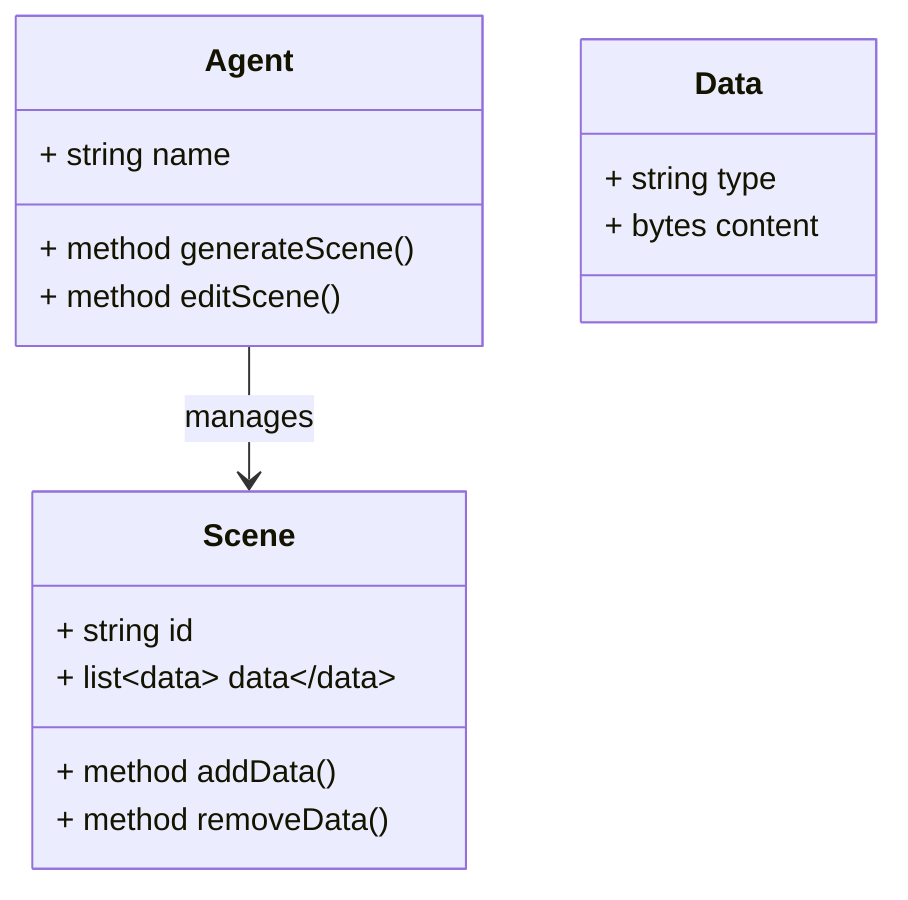
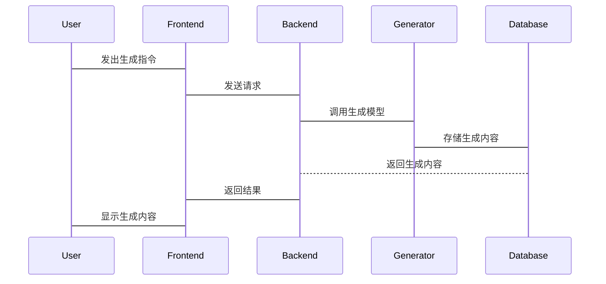

                 


# AI Agent的多模态场景生成与编辑

## 关键词：AI Agent, 多模态场景, 生成模型, 编辑工具, 系统架构

## 摘要：  
本文深入探讨AI Agent在多模态场景生成与编辑中的应用，从核心概念到算法原理，再到系统架构和项目实战，全面解析这一技术的实现与挑战。文章通过详细的理论分析和实际案例，为读者提供从基础到实践的系统化指导。

---

## 第一部分：背景介绍

### 第1章：AI Agent与多模态场景生成概述

#### 1.1 AI Agent的基本概念  
AI Agent（人工智能代理）是指能够感知环境、执行任务并做出决策的智能实体。它通过接收输入数据，分析理解后生成相应的输出或操作，以实现特定目标。AI Agent广泛应用于自动驾驶、智能助手、虚拟客服等领域。  

在多模态场景生成与编辑中，AI Agent需要处理多种类型的数据，如文本、图像、语音、视频等，并根据这些数据生成符合要求的场景或内容。例如，在虚拟现实（VR）中，AI Agent可以根据用户的指令生成一个包含人物、场景和情节的虚拟世界。

#### 1.2 多模态数据的定义与类型  
多模态数据是指包含多种数据类型的综合数据。常见的多模态数据包括：  
1. **文本数据**：如书籍、文章、对话等。  
2. **图像数据**：如照片、图形、图表等。  
3. **语音数据**：如音频、语音命令等。  
4. **视频数据**：如动态视频流。  
5. **结构化数据**：如表格、数据库等。  

在AI Agent的应用中，多模态数据的处理能力是其核心竞争力之一。例如，一个智能助手可以通过分析用户的语音指令和面部表情来生成更个性化的回应。

#### 1.3 问题背景与描述  
随着AI技术的不断发展，AI Agent在多模态场景生成中的应用越来越广泛。然而，多模态数据的复杂性和多样性给AI Agent的生成能力带来了挑战。例如：  
- **数据异构性**：不同数据类型之间的差异性较大，难以统一处理。  
- **生成多样性**：需要生成符合特定语义和风格的多样化内容。  
- **编辑灵活性**：生成的内容需要支持高效的编辑和修改。  

#### 1.4 核心概念与联系  
AI Agent的多模态场景生成与编辑涉及多个核心概念：  
1. **AI Agent**：具备感知和生成能力的智能实体。  
2. **多模态数据**：多种数据类型的综合数据。  
3. **生成模型**：用于生成多样化内容的算法模型。  

这些概念之间的关系可以通过以下对比表格和ER实体关系图展示：

**对比表格**：  
| 概念       | 定义                                                                 | 属性                           | 示例                             |
|------------|----------------------------------------------------------------------|--------------------------------|----------------------------------|
| AI Agent   | 具备感知和生成能力的智能实体。                                      | 智能性、交互性、自主性          | 智能助手、自动驾驶                |
| 多模态数据  | 包含多种数据类型的综合数据。                                        | 文本、图像、语音、视频         | 用户输入、传感器数据            |
| 生成模型   | 用于生成多样化内容的算法模型。                                      | 深度学习、GAN、扩散模型         | 文本生成、图像生成               |

**ER实体关系图**：  
```mermaid
erd
    title 实体关系图
    User: 用户
    Agent: AI Agent
    Scene: 场景
    Data: 数据
    Generator: 生成模型
    User --> Agent: 发出指令
    Agent --> Scene: 生成场景
    Scene --> Data: 包含数据
    Agent --> Generator: 调用生成模型
```

---

## 第二部分：核心概念与联系

### 第2章：核心概念的原理与联系

#### 2.1 核心概念原理  
AI Agent的核心原理是通过感知环境、分析数据、生成内容并执行操作来实现目标。在多模态场景生成中，AI Agent需要整合多种数据源，理解其语义，并通过生成模型创建符合要求的场景。  

**生成模型的原理**：  
生成模型是一种能够生成新数据的算法，常见的生成模型包括生成对抗网络（GAN）、变体自编码器（VAE）和扩散模型。这些模型通过学习数据分布，生成多样化且逼真的内容。  

#### 2.2 概念属性对比表格  
以下表格展示了核心概念之间的属性对比：  

**核心概念对比表格**：  
| 概念       | 输入       | 输出       | 应用场景                     | 示例                             |
|------------|------------|------------|------------------------------|----------------------------------|
| AI Agent   | 用户指令   | 场景生成   | 虚拟现实、智能助手           | 根据用户指令生成虚拟场景         |
| 多模态数据  | 多种数据类型 | 生成内容   | 数据整合、内容生成           | 整合文本、图像生成动态视频       |
| 生成模型   | 数据分布   | 生成内容   | 文本生成、图像生成           | 使用GAN生成逼真的人物图像       |

#### 2.3 ER实体关系图架构  
```mermaid
erd
    title 实体关系图
    Agent: AI Agent
    Scene: 场景
    Data: 数据
    Generator: 生成模型
    Agent --> Scene: 生成
    Scene --> Data: 包含
    Agent --> Generator: 调用
```

---

## 第三部分：算法原理讲解

### 第3章：生成模型的算法原理

#### 3.1 GAN（生成对抗网络）  
GAN由生成器和判别器组成，通过对抗训练生成逼真的数据。  

**工作流程**：  
1. **生成器**：学习将随机噪声映射到数据空间，生成样本。  
2. **判别器**：区分真实样本和生成样本。  
3. **交替训练**：生成器和判别器交替优化，最终生成器生成高质量样本。  

**数学模型**：  
- 生成器的损失函数：  
  $$ \mathcal{L}_G = -\mathbb{E}_{z}[\log(D(G(z)))} $$  
- 判别器的损失函数：  
  $$ \mathcal{L}_D = -\mathbb{E}_{x}[ \log D(x) ] - \mathbb{E}_{z}[ \log(1 - D(G(z))) ] $$  

**Python实现示例**：  
```python
import torch

# 定义生成器和判别器
class Generator(torch.nn.Module):
    def __init__(self, latent_dim, img_size):
        super(Generator, self).__init__()
        self.latent_dim = latent_dim
        self.img_size = img_size
        self.model = torch.nn.Sequential(
            torch.nn.Linear(latent_dim, 256),
            torch.nn.ReLU(),
            torch.nn.Linear(256, img_size),
            torch.nn.Sigmoid()
        )

class Discriminator(torch.nn.Module):
    def __init__(self, img_size):
        super(Discriminator, self).__init__()
        self.model = torch.nn.Sequential(
            torch.nn.Linear(img_size, 256),
            torch.nn.LeakyReLU(0.2),
            torch.nn.Linear(256, 1),
            torch.nn.Sigmoid()
        )
```

#### 3.2 VAE（变体自编码器）  
VAE通过学习数据的 latent representation，生成多样化的内容。  

**工作流程**：  
1. 编码器将输入数据映射到 latent 空间。  
2. 解码器将 latent 空间数据映射回原数据空间，生成样本。  
3. 通过最大化似然和正则化损失优化模型。  

**数学模型**：  
- 编码器的损失函数：  
  $$ \mathcal{L} = \mathbb{E}_{x}[ -\log p(x|z)] + KL(z|q(z)) $$  
  其中，KL项是正则化项，确保 latent 分布接近正态分布。  

**Python实现示例**：  
```python
import torch

class Encoder(torch.nn.Module):
    def __init__(self, input_dim, latent_dim):
        super(Encoder, self).__init__()
        self.model = torch.nn.Sequential(
            torch.nn.Linear(input_dim, 512),
            torch.nn.ReLU(),
            torch.nn.Linear(512, latent_dim * 2)
        )

class Decoder(torch.nn.Module):
    def __init__(self, latent_dim, output_dim):
        super(Decoder, self).__init__()
        self.model = torch.nn.Sequential(
            torch.nn.Linear(latent_dim, 512),
            torch.nn.ReLU(),
            torch.nn.Linear(512, output_dim)
        )
```

#### 3.3 扩散模型  
扩散模型通过逐步添加噪声并学习去除噪声，生成高质量内容。  

**工作流程**：  
1. 前向过程：逐步将数据添加噪声。  
2. 反向过程：学习如何从噪声中恢复原始数据。  

**数学模型**：  
- �正向过程：  
  $$ q(x_t|x_{t-1}) = \mathcal{N}(x_t; \sqrt{1-\beta_t}x_{t-1}, \beta_t I) $$  
- 反向过程：  
  $$ p_\theta(x_{t-1}|x_t) = \mathcal{N}(x_{t-1}; \mu_\theta(x_t,t), \sigma_\theta(t)^2 I) $$  

**Python实现示例**：  
```python
import torch

class DiffusionModel(torch.nn.Module):
    def __init__(self, img_size, beta=0.01):
        super(DiffusionModel, self).__init__()
        self.img_size = img_size
        self.beta = beta
        self.net = torch.nn.Sequential(
            torch.nn.Linear(img_size, 128),
            torch.nn.ReLU(),
            torch.nn.Linear(128, img_size)
        )

    def forward(self, x):
        t = torch.randint(0, 1000, (x.size(0),))
        x = x + torch.randn_like(x) * torch.sqrt(torch.tensor(self.beta, device=x.device))
        return self.net(x)
```

---

## 第四部分：系统分析与架构设计方案

### 第4章：系统架构设计

#### 4.1 问题场景介绍  
多模态场景生成与编辑系统需要处理多种数据类型，并生成符合要求的场景。系统需要具备高效的数据处理能力、强大的生成能力和灵活的编辑能力。  

#### 4.2 系统功能设计  
系统功能模块包括：  
1. 数据预处理模块：处理多模态数据，提取特征。  
2. 生成模型模块：调用生成模型生成内容。  
3. 编辑工具模块：支持用户对生成内容进行编辑和修改。  

**领域模型类图**：  


#### 4.3 系统架构设计  
系统架构采用分层设计，包括前端、后端和数据库。  

**系统架构图**：  
```mermaid
graph TD
    A[前端] --> B[后端API]
    B --> C[生成模型服务]
    B --> D[数据库]
    C --> D: 存储生成内容
```

#### 4.4 接口与交互设计  
系统接口包括：  
1. 用户通过前端发送生成指令。  
2. 后端接收指令，调用生成模型生成内容。  
3. 生成内容存储到数据库，并返回给用户。  

**交互序列图**：  


---

## 第五部分：项目实战

### 第5章：多模态场景生成与编辑系统实现

#### 5.1 环境安装  
需要安装以下工具和库：  
- Python 3.8+  
- PyTorch 1.9+  
- transformers库  
- matplotlib库  

#### 5.2 系统核心实现  
以下是生成模型和编辑工具的实现示例：  

**生成器实现**：  
```python
class Generator(nn.Module):
    def __init__(self, latent_dim, img_size):
        super(Generator, self).__init__()
        self.latent_dim = latent_dim
        self.img_size = img_size
        self.model = nn.Sequential(
            nn.Linear(latent_dim, 256),
            nn.ReLU(),
            nn.Linear(256, img_size),
            nn.Sigmoid()
        )

    def forward(self, z):
        return self.model(z)
```

**编辑工具实现**：  
```python
class SceneEditor:
    def __init__(self, scene):
        self.scene = scene

    def edit(self, edits):
        for key, value in edits.items():
            setattr(self.scene, key, value)
        return self.scene
```

#### 5.3 项目实战案例  
**案例：生成虚拟场景**  
假设用户希望生成一个包含树木、草地和湖泊的虚拟场景。  

1. **数据准备**：收集并处理自然景观的图像和文本数据。  
2. **模型训练**：训练生成模型，使其能够生成符合描述的场景。  
3. **生成与编辑**：通过AI Agent生成初步场景，并根据用户反馈进行调整。  

**详细步骤**：  
- 数据预处理：将图像数据标准化，文本数据进行分词处理。  
- 模型训练：使用GAN进行图像生成，结合VAE进行场景编辑。  
- 生成与编辑：生成初步场景，用户通过编辑工具调整场景细节。  

#### 5.4 项目小结  
通过本项目，读者可以掌握多模态场景生成与编辑的实现方法，包括数据处理、模型训练和系统集成。  

---

## 第六部分：最佳实践与小结

### 第6章：总结与展望

#### 6.1 最佳实践  
- 在数据处理阶段，确保数据的多样性和质量。  
- 在模型选择上，根据具体需求选择合适的生成模型。  
- 在系统设计中，注重模块化和可扩展性。  

#### 6.2 小结  
本文全面介绍了AI Agent的多模态场景生成与编辑技术，从核心概念到算法原理，再到系统架构和项目实战，为读者提供了系统化的指导。  

#### 6.3 注意事项  
- 确保生成内容的合法性和合规性。  
- 处理多模态数据时，注意数据隐私和安全问题。  

#### 6.4 未来展望  
随着AI技术的不断进步，AI Agent的多模态场景生成与编辑将更加智能化和个性化。未来的研究方向包括：  
1. 更高效的生成算法。  
2. 更灵活的编辑工具。  
3. 更广泛的应用场景。  

---

通过本文的学习，读者可以深入理解AI Agent的多模态场景生成与编辑技术，并将其应用于实际项目中。希望本文能为相关领域的研究和实践提供有价值的参考。

