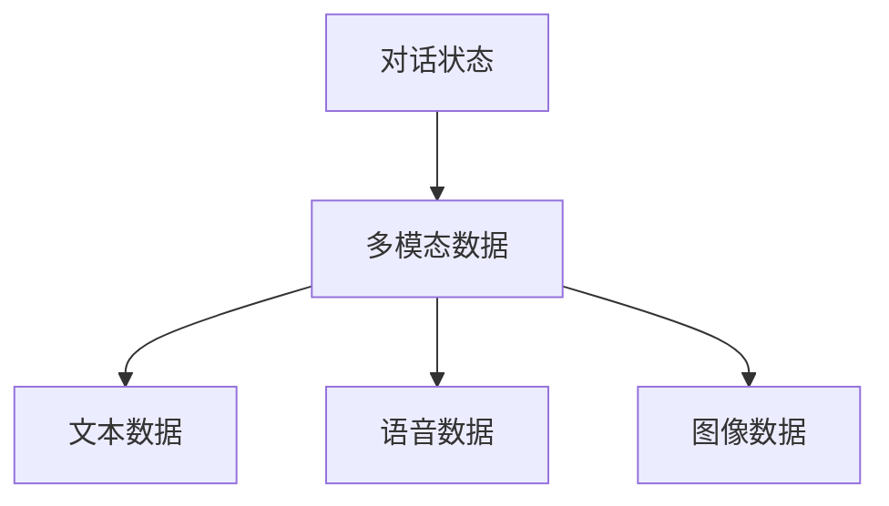
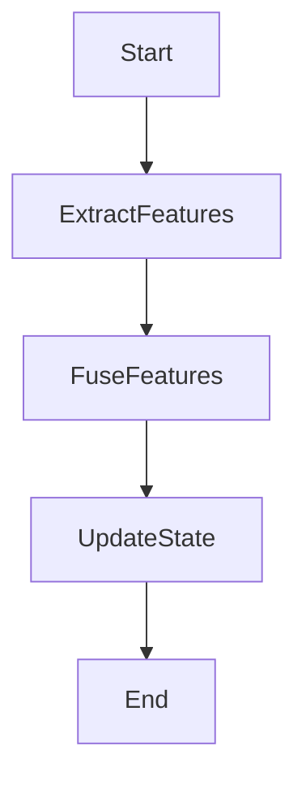
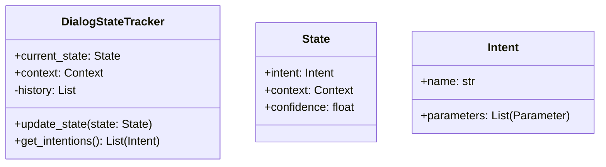
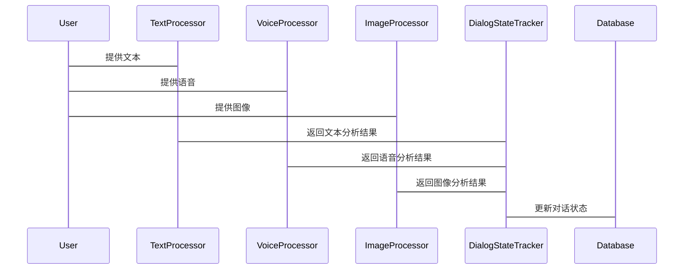

                 


# AI Agent的多模态对话状态跟踪

> **关键词**：AI Agent, 多模态对话, 对话状态跟踪, 多模态数据融合, 对话系统, 状态管理

> **摘要**：  
AI Agent的多模态对话状态跟踪是实现智能对话系统的关键技术。本文从背景、核心概念、算法原理、系统架构到项目实战，全面解析多模态对话状态跟踪的实现方法。通过分析多模态数据与对话状态的关系，探讨基于融合算法的状态跟踪方法，并结合实际案例，深入讲解系统的实现与优化。最终，本文为读者提供一套完整的AI Agent多模态对话状态跟踪的解决方案。

---

## 第1章 多模态对话状态跟踪的背景与基础

### 1.1 AI Agent的基本概念

#### 1.1.1 AI Agent的定义
AI Agent（人工智能代理）是指能够感知环境、执行任务并做出决策的智能实体。它通过与用户或其他系统的交互，实现特定目标。

#### 1.1.2 AI Agent的核心特征
- **自主性**：能够在没有外部干预的情况下运行。
- **反应性**：能够实时感知环境并做出响应。
- **目标导向**：通过实现目标来提供服务。
- **学习能力**：能够通过数据和经验不断优化自身。

#### 1.1.3 AI Agent的应用场景
- 智能客服
- 智能助手（如Siri、Alexa）
- 智能对话机器人

### 1.2 多模态对话的定义与特点

#### 1.2.1 多模态数据的定义
多模态数据是指多种类型的数据的结合，例如文本、语音、图像、视频等。

#### 1.2.2 多模态对话的核心要素
- **文本**：对话的主要内容。
- **语音**：语气、情感信息。
- **图像**：辅助信息（如用户提供的图片）。

#### 1.2.3 多模态对话的独特优势
- 提供更丰富的交互体验。
- 增强对话的语境理解能力。
- 通过多渠道信息提升对话的准确性。

### 1.3 对话状态跟踪的背景与意义

#### 1.3.1 对话状态跟踪的定义
对话状态跟踪是指在对话过程中，实时记录和更新对话的状态信息，以便后续对话的进行。

#### 1.3.2 多模态对话状态跟踪的必要性
- 单一模态数据难以满足复杂对话需求。
- 多模态数据能够提供更全面的状态信息。

#### 1.3.3 状态跟踪在AI Agent中的作用
- 优化对话流程。
- 提高对话的准确性和流畅性。

---

## 第2章 多模态数据与对话状态的关系

### 2.1 多模态数据的分类与特征

#### 2.1.1 文本数据的特征
- 结构化：易于处理和分析。
- 非结构化：信息分散，需要语义分析。

#### 2.1.2 语音数据的特征
- 情感：通过语调和语速反映用户情绪。
- 噪声：环境噪声会影响语音识别。

#### 2.1.3 图像数据的特征
- 语义：图像内容需要被理解。
- 解析：图像识别需要先进的计算机视觉技术。

### 2.2 对话状态的表示方法

#### 2.2.1 状态表示的维度分析
- **当前状态**：对话的当前进展。
- **上下文信息**：对话历史。
- **意图识别**：用户的意图。

#### 2.2.2 状态表示的数学模型
- 使用向量表示状态。
- 使用概率模型表示不确定性。

### 2.3 多模态数据与对话状态的关联

#### 2.3.1 数据模态对状态的影响
- 文本提供具体信息。
- 语音提供情感信息。
- 图像提供辅助信息。

#### 2.3.2 模态间信息的互补性
- 文本和语音结合，提升意图识别的准确性。
- 图像和文本结合，丰富对话内容。

### 2.4 核心概念对比表

| **属性** | **文本数据** | **语音数据** | **图像数据** |
|----------|--------------|--------------|--------------|
| 特征     | 文字内容     | 语调、语速   | 图像内容     |
| 作用     | 提供信息     | 反映情感     | 提供辅助信息 |

### 2.5 实体关系图（ER图）



---

## 第3章 多模态对话状态跟踪的算法原理

### 3.1 多模态数据融合方法

#### 3.1.1 晚融合与早融合
- **晚融合**：分别处理各模态数据，最后整合。
- **早融合**：早期整合各模态数据，提升信息共享。

#### 3.1.2 融合算法
- **加权融合**：根据各模态的重要性分配权重。
- **注意力机制**：动态调整各模态的注意力权重。

### 3.2 对话状态跟踪算法

#### 3.2.1 基于概率模型的跟踪
- 使用马尔可夫链模型，计算状态转移概率。

#### 3.2.2 基于深度学习的跟踪
- 使用循环神经网络（RNN）或Transformer模型，捕捉对话上下文。

### 3.3 算法实现与优化

#### 3.3.1 算法流程图



#### 3.3.2 Python代码示例

```python
import numpy as np

def fuse_modalities(text, voice, image):
    # 文本向量
    text_vec = np.random.rand(100)
    # 语音向量
    voice_vec = np.random.rand(100)
    # 图像向量
    image_vec = np.random.rand(100)
    # 加权融合
    fused_vec = 0.4 * text_vec + 0.3 * voice_vec + 0.3 * image_vec
    return fused_vec

# 示例调用
text = "你好"
voice = "平静"
image = "微笑"
state = fuse_modalities(text, voice, image)
print(state)
```

---

## 第4章 系统架构与设计

### 4.1 问题场景介绍

#### 4.1.1 项目背景
开发一个支持多模态对话的AI Agent。

#### 4.1.2 项目目标
实现多模态对话状态跟踪，提升对话系统的智能性。

### 4.2 系统功能设计

#### 4.2.1 领域模型



#### 4.2.2 系统架构


### 4.3 接口设计与交互流程

#### 4.3.1 接口设计

| **接口名称** | **输入** | **输出** |
|--------------|----------|----------|
| track_state  | text, voice, image | current_state |
| update_state  | new_state | - |

#### 4.3.2 交互流程图



---

## 第5章 项目实战与实现

### 5.1 环境安装与配置

#### 5.1.1 安装依赖
```bash
pip install numpy
pip install scikit-learn
pip install tensorflow
```

#### 5.1.2 环境配置
```bash
export PYTHONPATH=$PYTHONPATH:.
```

### 5.2 核心代码实现

#### 5.2.1 对话状态跟踪器实现

```python
class DialogStateTracker:
    def __init__(self):
        self.current_state = None
        self.history = []

    def update_state(self, text, voice, image):
        # 分析文本、语音、图像
        text_analytics = self._analyze_text(text)
        voice_analytics = self._analyze_voice(voice)
        image_analytics = self._analyze_image(image)
        
        # 融合分析结果
        fused_state = self._fuse_modalities(text_analytics, voice_analytics, image_analytics)
        self.current_state = fused_state
        self.history.append(fused_state)

    def _analyze_text(self, text):
        # 简单的文本分析示例
        return {'intent': 'greeting', 'confidence': 0.8}

    def _analyze_voice(self, voice):
        # 简单的语音分析示例
        return {'emotion': 'neutral', 'confidence': 0.9}

    def _analyze_image(self, image):
        # 简单的图像分析示例
        return {'object': 'smile', 'confidence': 0.7}

    def _fuse_modalities(self, text, voice, image):
        # 简单的加权融合
        intent_confidence = text['confidence'] * 0.4 + voice['confidence'] * 0.3 + image['confidence'] * 0.3
        return {
            'intent': text['intent'],
            'confidence': intent_confidence
        }
```

#### 5.2.2 代码运行与测试

```python
tracker = DialogStateTracker()
tracker.update_state("你好", "平静", "微笑")
print(tracker.current_state)
```

---

## 第6章 最佳实践与总结

### 6.1 小结
- 多模态对话状态跟踪是实现智能对话系统的重要技术。
- 合理设计系统架构和算法，能够提升对话系统的性能。

### 6.2 注意事项
- 数据质量对状态跟踪至关重要。
- 算法选择需要根据具体场景调整。

### 6.3 拓展阅读
- 《Neural Networks for NLP》
- 《Multi-modal Data Fusion for Dialogue Systems》

---

通过以上目录结构和内容安排，我们可以系统地从理论到实践，全面解析AI Agent的多模态对话状态跟踪技术。

