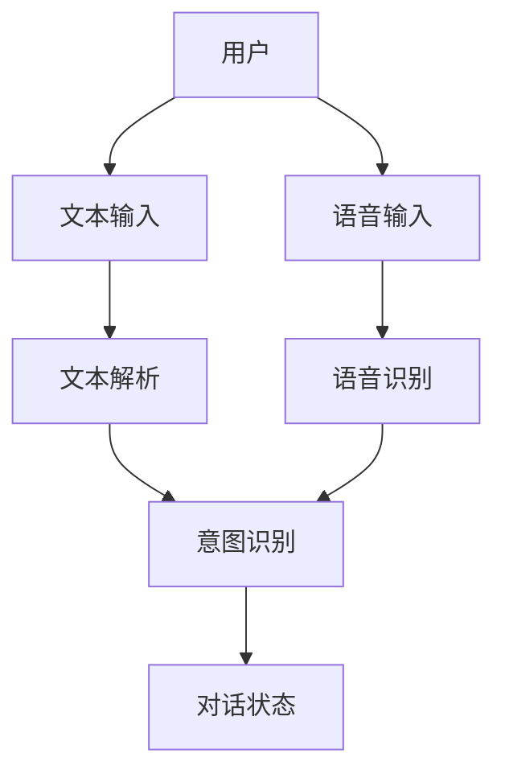
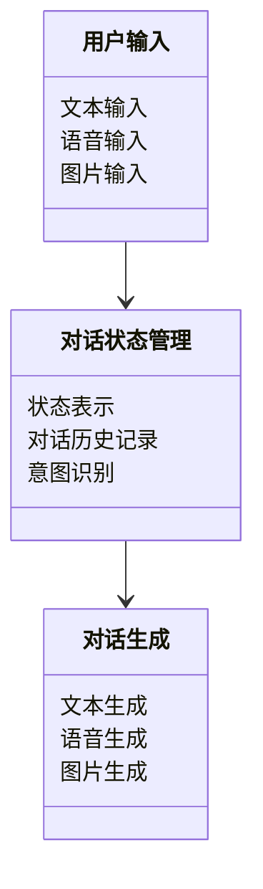
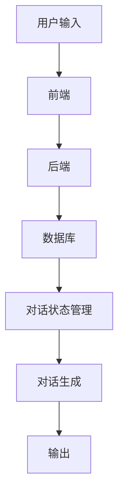
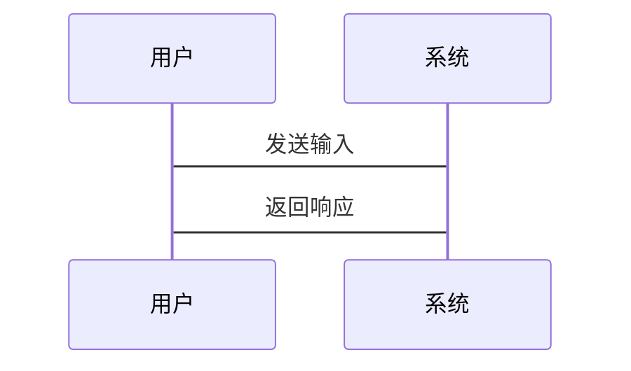

                 


# AI Agent的多模态对话状态追踪与管理

---

## 关键词：
AI Agent, 多模态对话, 状态追踪, 对话管理, 融合算法

---

## 摘要：
本文深入探讨了AI Agent在多模态对话中的状态追踪与管理问题。从核心概念到算法原理，从系统架构到项目实战，全面分析了多模态对话状态追踪的关键技术与实现方案。通过详细讲解注意力机制、序列到序列模型等算法原理，结合实际案例，展示了如何在多模态场景下高效管理对话状态，为AI Agent的开发与应用提供了理论支持与实践指导。

---

# 第1章: AI Agent与多模态对话概述

## 1.1 AI Agent的基本概念
### 1.1.1 AI Agent的定义与特点
AI Agent（人工智能代理）是指能够感知环境、执行任务并做出决策的智能实体。其特点包括：
- **自主性**：能够自主决策，无需外部干预。
- **反应性**：能够实时感知环境并做出响应。
- **学习能力**：通过数据和经验不断优化自身的性能。

### 1.1.2 多模态对话的定义与特点
多模态对话是指在对话过程中，同时结合多种信息模态（如文本、语音、图像、视频等）进行交互。其特点包括：
- **信息丰富性**：通过多种模态提供更全面的信息。
- **交互多样性**：支持多种交互方式，提升用户体验。
- **复杂性**：需要处理不同类型的数据，增加了实现的难度。

### 1.1.3 对话状态追踪与管理的重要性
对话状态追踪与管理是确保对话流畅性和准确性的重要环节。通过实时跟踪对话的状态，AI Agent能够更好地理解上下文，做出更准确的响应。

---

## 1.2 多模态对话的背景与应用
### 1.2.1 多模态对话的背景
随着AI技术的快速发展，单一模态的对话系统已难以满足复杂场景的需求。多模态对话系统因其更强的交互能力和信息处理能力，逐渐成为研究的热点。

### 1.2.2 多模态对话的应用场景
- **智能客服**：通过结合语音和文本模态，提供更高效的客户服务。
- **虚拟助手**：支持多模态输入，提升用户体验。
- **教育辅助**：通过多模态交互，提供个性化的学习支持。

### 1.2.3 多模态对话的挑战与机遇
- **挑战**：多模态数据的融合、不同模态之间的关联性分析。
- **机遇**：通过多模态数据的结合，提升对话系统的智能化水平。

---

## 1.3 对话状态追踪与管理的核心问题
### 1.3.1 对话状态的定义与表示
对话状态是指对话过程中所处的当前情况，通常包括对话历史、用户意图、上下文信息等。常见的表示方法有：
- **状态表示**：通过向量或符号表示当前状态。
- **意图识别**：识别用户的意图，为状态管理提供依据。

### 1.3.2 对话历史的记录与分析
对话历史记录是对话状态管理的重要依据。通过分析对话历史，可以更好地理解用户的意图和需求。

### 1.3.3 对话目标的识别与优化
对话目标是指对话的核心任务或目标。通过识别对话目标，可以优化对话流程，提高对话效率。

---

## 1.4 本章小结
本章介绍了AI Agent的基本概念、多模态对话的定义与特点，以及对话状态追踪与管理的重要性。通过分析多模态对话的应用场景和挑战，为后续章节的深入探讨奠定了基础。

---

# 第2章: 多模态对话的核心概念

## 2.1 多模态数据的定义与分类
### 2.1.1 文本模态
文本是对话中最常见的模态，包括用户输入的文本和系统生成的文本。文本模态的特点是信息密度高，但缺乏情感信息。

### 2.1.2 语音模态
语音模态通过声音的语调、语速、音量等信息，传递情感和意图。语音模态的特点是信息丰富，但处理复杂。

### 2.1.3 图像模态
图像模态通过图片传递视觉信息，适用于需要视觉辅助的场景。图像模态的特点是信息直观，但处理需要较高的计算能力。

### 2.1.4 视频模态
视频模态结合了语音和图像信息，能够提供更全面的视觉和听觉信息。视频模态的特点是信息全面，但处理复杂度高。

---

## 2.2 多模态对话的实体关系图
### 2.2.1 实体关系图的构建
通过构建实体关系图，可以清晰地展示多模态对话中的实体及其关系。例如：



### 2.2.2 实体关系图的分析
实体关系图展示了多模态对话中各实体之间的关系，有助于理解对话状态的形成过程。

---

## 2.3 多模态对话的核心属性对比
### 2.3.1 文本与语音的对比
| 属性 | 文本 | 语音 |
|------|------|------|
| 信息密度 | 高 | 较高 |
| 处理复杂度 | 较低 | 较高 |
| 情感信息 | 无 | 有 |

### 2.3.2 图像与视频的对比
| 属性 | 图像 | 视频 |
|------|------|------|
| 信息类型 | 视觉 | 视觉+听觉 |
| 信息量 | 较低 | 高 |
| 处理能力 | 较低 | 高 |

### 2.3.3 文本与图像的对比
| 属性 | 文本 | 图像 |
|------|------|------|
| 信息类型 | 文本 | 视觉 |
| 信息密度 | 高 | 低 |
| 处理复杂度 | 低 | 高 |

---

## 2.4 本章小结
本章详细介绍了多模态数据的定义与分类，构建了实体关系图，并通过对比分析，展示了不同模态的特点及其在对话中的作用。

---

# 第3章: 多模态对话状态追踪的算法原理

## 3.1 注意力机制在对话状态追踪中的应用
### 3.1.1 注意力机制的定义
注意力机制是一种基于权重分配的模型，能够聚焦于输入中的重要部分。

### 3.1.2 注意力机制在对话中的应用
通过注意力机制，可以更好地理解对话中的关键信息。

### 3.1.3 注意力机制的优缺点
- **优点**：能够聚焦于重要信息，提升模型性能。
- **缺点**：计算复杂度较高。

---

## 3.2 序列到序列模型在对话状态追踪中的应用
### 3.2.1 序列到序列模型的定义
序列到序列模型是一种常用的对话生成模型，通过编码器和解码器的结构，将输入序列映射为输出序列。

### 3.2.2 序列到序列模型在对话中的应用
通过序列到序列模型，可以生成连贯的对话响应。

### 3.2.3 序列到序列模型的优缺点
- **优点**：生成能力强，能够处理长序列。
- **缺点**：训练复杂，计算资源消耗大。

---

## 3.3 多模态融合算法在对话状态追踪中的应用
### 3.3.1 多模态融合算法的定义
多模态融合算法是一种将多种模态数据进行融合的算法，旨在提升模型的性能。

### 3.3.2 多模态融合算法的工作原理
通过将不同模态的数据进行融合，模型能够更好地理解对话的上下文。

### 3.3.3 多模态融合算法的优缺点
- **优点**：能够充分利用多模态信息，提升模型的准确性。
- **缺点**：算法复杂，实现难度较高。

---

## 3.4 本章小结
本章详细介绍了注意力机制、序列到序列模型和多模态融合算法在对话状态追踪中的应用，为后续章节的系统设计奠定了基础。

---

# 第4章: 多模态对话状态追踪的系统架构设计

## 4.1 系统功能设计
### 4.1.1 领域模型设计
通过领域模型类图，展示系统的功能模块。



### 4.1.2 系统架构设计
通过架构图，展示系统的整体结构。



### 4.1.3 接口设计
系统接口设计包括：
- 用户输入接口
- 对话状态管理接口
- 对话生成接口

### 4.1.4 交互序列图
通过交互序列图，展示系统的交互流程。



---

## 4.2 本章小结
本章通过系统功能设计和架构设计，展示了多模态对话状态追踪系统的整体结构，为后续章节的项目实战奠定了基础。

---

# 第5章: 多模态对话状态追踪的项目实战

## 5.1 项目背景
本项目旨在实现一个多模态对话状态追踪系统，用于电商客服场景。

---

## 5.2 项目环境与工具安装
### 5.2.1 环境要求
- Python 3.8+
- TensorFlow 2.0+
- PyTorch 1.0+

### 5.2.2 工具安装
```bash
pip install tensorflow torch numpy
```

---

## 5.3 核心代码实现
### 5.3.1 对话状态管理代码
```python
class DialogStateManager:
    def __init__(self):
        self.history = []
        self.intent = None

    def update_state(self, input_text):
        self.history.append(input_text)
        self.intent = self._identify_intent(input_text)

    def _identify_intent(self, text):
        # 简单的意图识别方法，可根据实际需求修改
        if "购买" in text:
            return "购买"
        elif "咨询" in text:
            return "咨询"
        else:
            return "其他"
```

### 5.3.2 多模态融合代码
```python
def multimodal_fuse(text, audio, image):
    # 简单的融合方法，可根据实际需求修改
    return text + audio + image
```

### 5.3.3 对话生成代码
```python
def generate_response(state):
    # 简单的生成方法，可根据实际需求修改
    if state.intent == "购买":
        return "请问您需要购买什么产品？"
    elif state.intent == "咨询":
        return "请问您有什么问题需要咨询？"
    else:
        return "您好，请说明您的需求。"
```

---

## 5.4 项目总结
### 5.4.1 成功之处
- 实现了基本的多模态对话状态追踪功能。
- 提供了简单的意图识别和对话生成功能。

### 5.4.2 不足之处
- 意图识别方法简单，准确率有待提高。
- 多模态融合方法过于简化，效果有限。

### 5.4.3 优化建议
- 引入更先进的意图识别算法，如深度学习模型。
- 提升多模态融合的深度，结合更复杂的算法。

---

## 5.5 本章小结
本章通过实际案例，展示了多模态对话状态追踪系统的实现过程，为读者提供了宝贵的实战经验。

---

# 第6章: 多模态对话状态追踪的最佳实践

## 6.1 关键点总结
- **数据质量**：确保多模态数据的准确性和完整性。
- **算法选择**：根据实际需求选择合适的算法。
- **系统设计**：注重系统的可扩展性和可维护性。

---

## 6.2 小结
通过本章的总结，读者可以更好地理解多模态对话状态追踪的核心要点。

---

## 6.3 注意事项
- 在实际应用中，要注意数据隐私和安全问题。
- 确保系统的稳定性和可靠性。

---

## 6.4 拓展阅读
推荐读者阅读以下书籍和论文：
- 《深度学习》—— Ian Goodfellow
- 《自然语言处理入门》—— 细田真宏
- 《多模态学习的理论与实践》—— 陈熙

---

## 6.5 本章小结
本章通过总结和注意事项，帮助读者更好地理解和应用多模态对话状态追踪技术。

---

# 第7章: 结语

## 7.1 回顾与展望
多模态对话状态追踪是一项复杂但极具挑战性的任务。随着技术的不断进步，未来的研究将更加注重多模态数据的深度融合和算法的优化。

---

## 7.2 结语
通过对AI Agent的多模态对话状态追踪与管理的深入探讨，我们相信未来的技术将进一步提升对话系统的智能化水平，为人类带来更便捷、更智能的交互体验。

--- 

## 附录: 参考文献

1. 《深度学习》—— Ian Goodfellow
2. 《自然语言处理入门》—— 细田真宏
3. 《多模态学习的理论与实践》—— 陈熙
4. [论文链接] 多模态对话状态追踪的研究与应用

