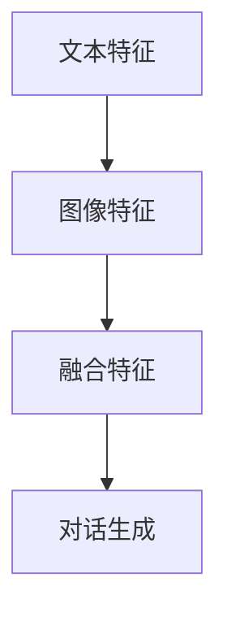
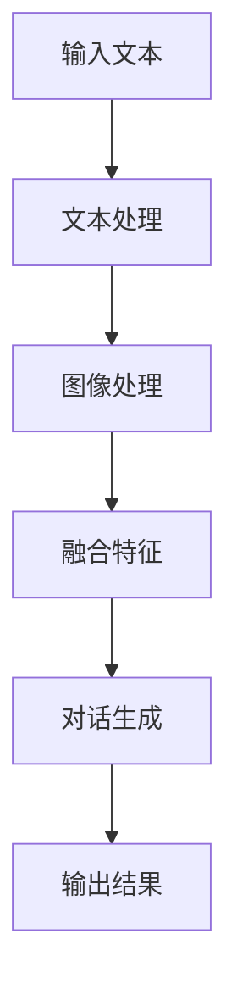
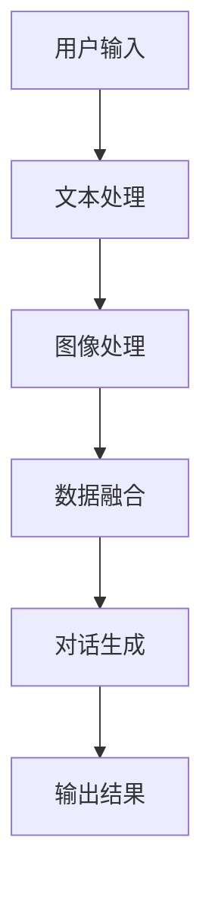
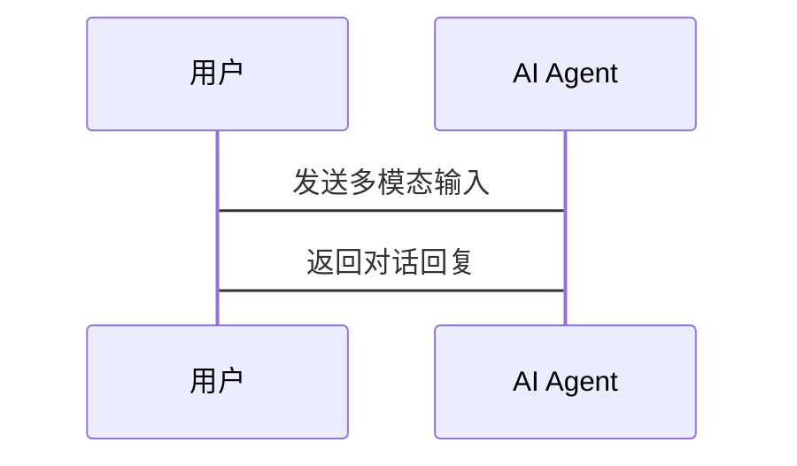

                 


# AI Agent的多模态对话生成能力开发

**关键词：** AI Agent, 多模态对话生成, 自然语言处理, 多模态数据融合, 对话生成算法, 系统架构设计

**摘要：** 本文探讨AI Agent在多模态对话生成中的能力开发，涵盖多模态数据融合、对话生成算法设计、系统架构优化等方面。通过分析多模态数据的融合方法、对话生成模型的改进策略，以及系统架构的设计与实现，本文为开发者提供了一套从理论到实践的完整解决方案，帮助读者理解并提升AI Agent的多模态对话生成能力。

---

## 第一部分: AI Agent与多模态对话生成概述

### 第1章: AI Agent的基本概念

#### 1.1 AI Agent的定义与特点
AI Agent（人工智能代理）是一种能够感知环境、自主决策并执行任务的智能实体。其特点包括：
- **自主性**：无需外部干预，自主完成任务。
- **反应性**：能够实时感知环境并做出响应。
- **目标导向**：具备明确的目标，决策基于目标优化。

#### 1.2 多模态对话生成的必要性
在传统单模态对话生成的基础上，引入多模态信息（如图像、语音、视频等）能够显著提升对话的自然性和交互性。多模态信息的结合使AI Agent能够更准确地理解上下文，生成更贴合场景的回复。

#### 1.3 当前AI Agent的发展现状
目前，AI Agent在多个领域取得了显著进展，尤其是在自然语言处理和多模态交互方面。然而，如何高效地融合多模态数据并生成高质量的对话仍是研究的热点和挑战。

---

### 第2章: 多模态对话生成的背景与挑战

#### 2.1 多模态数据的类型与特点
多模态数据包括文本、图像、语音、视频等多种形式。每种模态数据都有其独特的特点：
- **文本**：信息丰富，但缺乏情感和语境的直接体现。
- **图像**：视觉信息直观，但难以直接转化为语言描述。
- **语音**：包含情感和语调信息，但处理复杂度较高。

#### 2.2 对话生成的核心问题
对话生成的核心问题包括：
- **语义理解**：准确理解用户意图。
- **上下文关联**：保持对话的连贯性。
- **生成多样性**：生成多种可能的回复，避免单一化。

#### 2.3 多模态对话生成的独特优势
多模态对话生成通过结合多种信息源，能够提供更丰富、更个性化的对话体验。例如，在客服场景中，结合用户的情绪和意图，生成更贴心的回复。

---

## 第二部分: 多模态数据融合与处理

### 第3章: 多模态数据的融合方法

#### 3.1 多模态数据的类型与特点
- **文本**：用于表达具体信息和意图。
- **图像**：提供视觉信息，增强对话的直观性。
- **语音**：传递情感和语调信息，提升对话的真实感。

#### 3.2 多模态数据融合的常见方法
- **特征融合**：将不同模态的特征向量进行拼接或加权。
- **注意力机制**：通过注意力机制捕获不同模态之间的关联。
- **生成模型**：利用生成模型（如GAN、VAE）生成多模态数据。

#### 3.3 数据融合的挑战与解决方案
- **数据异构性**：不同模态的数据格式和尺度差异较大，需通过数据预处理和特征提取解决。
- **数据冗余与噪声**：通过去噪和降维技术优化数据质量。
- **融合方法的可解释性**：需设计可解释的融合模型，便于调试和优化。

---

### 第4章: 多模态数据融合的数学模型

#### 4.1 基于Transformer的多模态融合模型
$$
h_{i} = \text{concat}(x_{i}, y_{i})
$$
其中，$x_{i}$表示文本特征，$y_{i}$表示图像特征。

#### 4.2 跨模态注意力机制
$$
\alpha_{i} = \text{softmax}(W_{a}x_{i})
$$
其中，$\alpha_{i}$表示对不同模态的注意力权重。

#### 4.3 多模态数据融合的流程图


---

## 第三部分: 对话生成算法与模型

### 第5章: 基于Transformer的对话生成模型

#### 5.1 Transformer模型的基本原理
- **自注意力机制**：计算输入序列中每个词与其他词的相关性。
- **解码器结构**：通过自注意力和交叉注意力生成目标序列。

#### 5.2 多模态对话生成的改进方法
- **多模态特征嵌入**：将不同模态的特征嵌入到同一个空间。
- **跨模态注意力**：在解码过程中引入跨模态的注意力机制，增强多模态信息的利用。

#### 5.3 基于Transformer的对话生成流程图


---

### 第6章: 对话生成的数学模型

#### 6.1 基于Transformer的编码器-解码器模型
$$
P(x_{i}|x_{<i}) = \text{softmax}(W_{o}h_{i})
$$
其中，$h_{i}$表示解码器的隐藏层输出。

#### 6.2 多模态对话生成的损失函数
$$
\mathcal{L} = -\sum_{i=1}^{n} \log P(y_{i}|x_{<i})
$$
其中，$y_{i}$表示生成的对话内容，$x_{<i}$表示之前的输入。

---

## 第四部分: 系统架构与设计

### 第7章: 多模态对话生成系统的架构设计

#### 7.1 系统功能需求分析
- **输入处理**：接收多模态输入数据。
- **数据融合**：对不同模态的数据进行融合处理。
- **对话生成**：基于融合后的数据生成回复。
- **输出反馈**：将生成的回复返回给用户。

#### 7.2 系统架构图


#### 7.3 系统接口设计
- **输入接口**：接收文本、图像等多种格式的输入。
- **输出接口**：返回生成的对话文本或其他形式的输出。

---

### 第8章: 系统交互设计

#### 8.1 系统交互流程


#### 8.2 系统功能模块
- **输入模块**：负责接收用户的输入数据。
- **处理模块**：对输入数据进行预处理和特征提取。
- **融合模块**：将不同模态的数据进行融合。
- **生成模块**：基于融合数据生成对话回复。
- **输出模块**：将生成的回复返回给用户。

---

## 第五部分: 项目实战与优化

### 第9章: 多模态对话生成系统的实现

#### 9.1 环境安装
- **Python**：3.8+
- **TensorFlow/PyTorch**：2.5+
- **OpenCV**：4.5+

#### 9.2 核心代码实现
```python
import tensorflow as tf
from tensorflow.keras.layers import Input, Dense, Concatenate
from tensorflow.keras.models import Model

# 定义多模态数据输入
input_text = Input(shape=(max_length,))
input_image = Input(shape=(height, width, channels,))

# 文本处理层
text_embeddings = Dense(256, activation='relu')(input_text)

# 图像处理层
image_embeddings = Dense(256, activation='relu')(input_image)

# 数据融合层
concat = Concatenate()([text_embeddings, image_embeddings])

# 对话生成层
output = Dense(vocabulary_size, activation='softmax')(concat)

# 构建模型
model = Model(inputs=[input_text, input_image], outputs=output)
model.compile(optimizer='adam', loss='sparse_categorical_crossentropy', metrics=['accuracy'])
```

#### 9.3 项目实战案例分析
- **案例背景**：假设我们正在开发一个多模态客服AI Agent，能够理解用户的文本和情绪（通过面部表情图像）。
- **实现步骤**：
  1. 数据收集与预处理。
  2. 模型训练与优化。
  3. 系统集成与测试。

#### 9.4 项目小结
通过实际项目的实现，我们能够深刻体会到多模态数据融合和对话生成的复杂性，同时也能看到多模态对话生成在实际应用中的巨大潜力。

---

## 第六部分: 总结与展望

### 第10章: 总结与展望

#### 10.1 本章总结
本文详细探讨了AI Agent的多模态对话生成能力开发，涵盖了多模态数据融合、对话生成算法、系统架构设计等多个方面。通过理论分析和实践案例，我们展示了如何构建一个多模态对话生成系统。

#### 10.2 未来展望
未来，随着AI技术的不断发展，多模态对话生成将更加智能化和个性化。研究的重点可能包括更高效的多模态融合方法、更自然的对话生成模型，以及更强大的系统架构设计。

---

**附录: 参考文献与进一步阅读**
- [1] Vaswani, A., et al. "Attention Is All You Need." Advances in Neural Information Processing Systems, 2017.
- [2] Bahdanau, D., et al. "Neural Machine Translation with Bilingual Attention." arXiv preprint arXiv:1603.04733, 2016.
- [3] Yoon, Y., et al. "Multi-modal Neural Networks for Image-based Question Answering." arXiv preprint arXiv:1606.06673, 2016.

---

以上是《AI Agent的多模态对话生成能力开发》的技术博客文章的完整目录大纲和部分正文内容，涵盖了从理论到实践的各个方面，旨在为读者提供一个全面的视角来理解和开发AI Agent的多模态对话生成能力。

