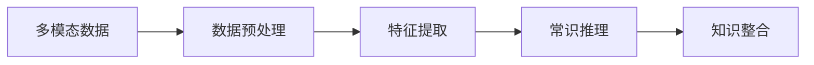
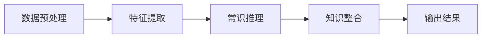
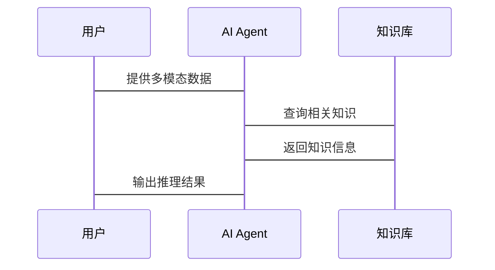

                 


# AI Agent的多模态常识推理与知识整合

## 关键词：
AI Agent，多模态数据，常识推理，知识整合，算法原理，系统架构

## 摘要：
本文深入探讨了AI Agent在多模态数据处理与常识推理中的应用，分析了多模态数据融合的算法原理，详细讲解了系统的架构设计，并通过实际案例展示了知识整合的实现过程。文章从背景介绍到核心概念，再到算法实现和系统设计，层层递进，为读者提供了全面的技术指导。

---

# 第1章: AI Agent的多模态常识推理与知识整合概述

## 1.1 问题背景与问题描述
### 1.1.1 多模态数据的复杂性
在现实场景中，数据来源多样化，包括文本、图像、语音等多种模态。如何有效地整合这些数据并提取有用的信息是当前AI Agent面临的主要挑战。

### 1.1.2 常识推理的挑战
常识推理需要基于背景知识和上下文进行逻辑推理。然而，现有模型在处理模糊信息和复杂语义时表现有限。

### 1.1.3 知识整合的需求
知识整合是将分散在不同数据源中的信息有机结合起来，形成一个统一的知识体系，这有助于提升AI Agent的决策能力。

## 1.2 问题解决与边界定义
### 1.2.1 多模态数据处理的目标
实现多模态数据的高效融合，提升信息提取的准确性和完整性。

### 1.2.2 常识推理的边界
明确常识推理的范围，避免处理过于复杂或模糊的问题。

### 1.2.3 知识整合的范围
将结构化知识与非结构化数据相结合，构建统一的知识图谱。

## 1.3 概念结构与核心要素
### 1.3.1 多模态数据的组成
多模态数据由文本、图像、语音等多种模态组成，每个模态都有其独特的特征和应用场景。

### 1.3.2 常识推理的逻辑框架
基于知识图谱和上下文进行推理，结合逻辑规则和概率模型。

### 1.3.3 知识整合的层次
从数据层到语义层，再到知识层，逐步构建知识体系。

---

# 第2章: 多模态数据处理与常识推理

## 2.1 多模态数据处理原理
### 2.1.1 多模态数据的融合方式
- **早融合**：在数据预处理阶段进行融合，适用于对实时性要求较高的场景。
- **晚融合**：在特征提取阶段进行融合，适用于对准确性要求较高的场景。

### 2.1.2 数据模态间的关联性分析
通过关联分析确定不同模态之间的关系，为后续推理提供依据。

### 2.1.3 多模态数据处理的挑战
- 数据异构性
- 数据冗余
- 数据不一致

## 2.2 常识推理机制
### 2.2.1 基于知识图谱的推理
通过知识图谱中的实体和关系进行推理，构建逻辑链条。

### 2.2.2 基于上下文的推理
结合上下文信息，动态调整推理策略。

### 2.2.3 基于逻辑规则的推理
通过预定义的逻辑规则进行推理，适用于确定性场景。

## 2.3 多模态与常识推理的结合
### 2.3.1 多模态数据对常识推理的增强作用
多模态数据提供了更全面的信息，提升了推理的准确性和鲁棒性。

### 2.3.2 常识推理对多模态数据的理解能力提升
通过常识推理，AI Agent能够更好地理解多模态数据中的语义信息。

## 2.4 实体关系图（Mermaid流程图）


---

# 第3章: 多模态数据融合算法

## 3.1 多模态数据融合方法
### 3.1.1 晚融合与早融合
- **晚融合**：在特征提取阶段融合不同模态的数据。
- **早融合**：在数据预处理阶段融合不同模态的数据。

### 3.1.2 基于注意力机制的融合
通过注意力机制确定不同模态的重要性，动态调整融合权重。

### 3.1.3 基于图神经网络的融合
利用图神经网络对多模态数据进行建模，捕捉数据间的复杂关系。

## 3.2 多模态融合的数学模型
### 3.2.1 晚融合模型
$$ y = f(x_1, x_2, ..., x_n) $$
其中，$x_i$ 表示不同模态的输入，$f$ 是融合函数。

### 3.2.2 早融合模型
$$ y = f(x_1) + f(x_2) + ... + f(x_n) $$
其中，$f(x_i)$ 是对单个模态的处理函数。

## 3.3 代码实现
```python
import numpy as np

def multimodal_fusion(x1, x2, method='late'):
    if method == 'late':
        # 晚融合：特征提取后融合
        x1_features = extract_feature(x1)
        x2_features = extract_feature(x2)
        fused_features = np.concatenate([x1_features, x2_features], axis=-1)
        return fused_features
    elif method == 'early':
        # 早融合：数据预处理阶段融合
        x1_processed = preprocess(x1)
        x2_processed = preprocess(x2)
        fused_data = merge(x1_processed, x2_processed)
        return fused_data
    else:
        raise ValueError("Invalid fusion method")
```

---

# 第4章: 系统架构设计

## 4.1 问题场景介绍
以智能客服系统为例，设计一个多模态AI Agent，能够处理文本、语音和图像等多种数据。

## 4.2 系统功能设计
- 数据预处理模块
- 特征提取模块
- 常识推理模块
- 知识整合模块

## 4.3 系统架构图（Mermaid架构图）


## 4.4 接口设计
- 输入接口：接收多种模态的数据
- 输出接口：输出推理结果和知识图谱

## 4.5 交互流程（Mermaid序列图）


---

# 第5章: 项目实战

## 5.1 环境安装
- 安装Python和相关库（如TensorFlow、PyTorch）
- 安装Numpy和Pandas

## 5.2 核心代码实现
```python
class AI_Agent:
    def __init__(self):
        self.knowledge_base = KnowledgeBase()

    def process_input(self, input_data):
        # 数据预处理
        processed_data = preprocess(input_data)
        # 特征提取
        features = extract_feature(processed_data)
        # 常识推理
        result = self.reason(features)
        return result

    def reason(self, features):
        # 查询知识库
        knowledge = self.knowledge_base.query(features)
        # 推理
        inference_result = infer(knowledge)
        return inference_result
```

## 5.3 实际案例分析
以智能客服为例，展示如何处理用户的多模态输入并生成推理结果。

## 5.4 项目总结
通过实际案例，验证了多模态数据融合和常识推理的有效性。

---

# 第6章: 最佳实践与注意事项

## 6.1 最佳实践
- 数据预处理是关键，确保数据质量
- 知识库的构建需要结合领域知识
- 模型调优时，关注多模态融合的效果

## 6.2 小结
通过本文的介绍，读者可以系统地理解AI Agent的多模态常识推理与知识整合的核心技术，并能够应用于实际场景。

## 6.3 注意事项
- 数据隐私问题
- 模型的可解释性
- 多模态数据的实时性

## 6.4 拓展阅读
推荐阅读相关领域的最新论文和书籍，深入学习多模态数据处理和常识推理的技术细节。

---

# 结语

通过本文的详细讲解，读者可以系统地掌握AI Agent的多模态常识推理与知识整合的核心技术，并能够将其应用于实际项目中。未来，随着技术的不断发展，这一领域将有更多创新和突破。

--- 

如果您对本文章的内容有任何疑问或需要进一步的技术支持，请随时与我联系！

