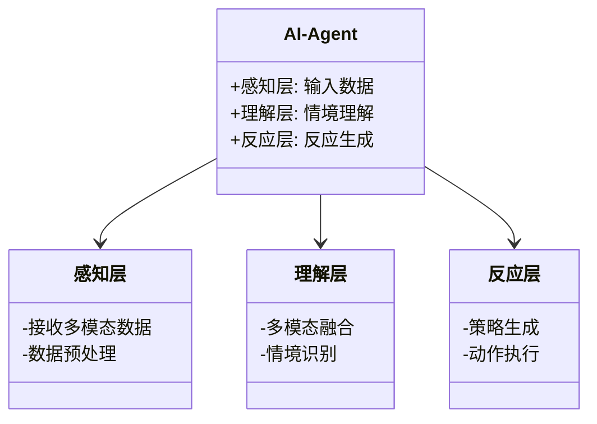
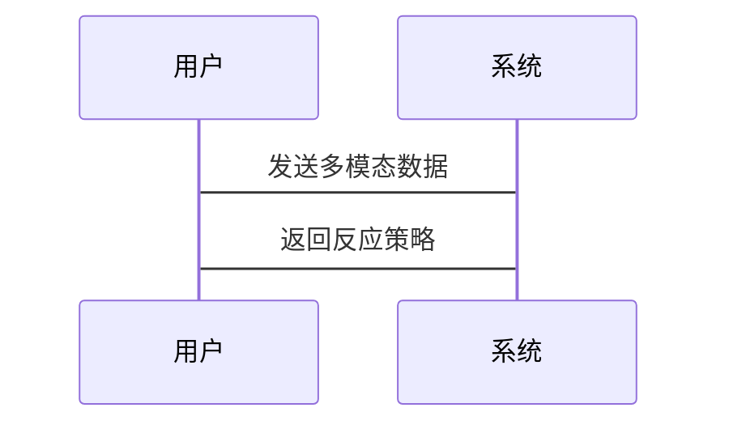

                 


# AI Agent的多模态情境感知与反应系统

**关键词**：AI Agent、多模态、情境感知、反应系统、多模态数据融合

**摘要**：本文深入探讨了AI Agent的多模态情境感知与反应系统的原理和实现。从基本概念到算法原理，从系统架构到项目实战，全面解析了AI Agent如何通过多模态数据融合实现情境理解，并设计高效的反应机制，最终构建一个完整的AI Agent系统。

---

## 第一章: AI Agent的基本概念与背景介绍

### 1.1 问题背景与问题描述

#### 1.1.1 多模态情境感知的必要性
在现实环境中，单一模态的数据往往不足以提供足够的信息来支持决策。例如，在智能安防系统中，仅依赖视频监控可能无法捕捉到声音中的异常情况。因此，结合多模态数据（如图像、文本、语音等）进行情境感知，能够显著提高系统的感知能力。

#### 1.1.2 反应系统的核心目标
反应系统的目标是在感知到情境后，迅速生成合理的反应策略。例如，在自动驾驶中，感知到前方有障碍物后，系统需要快速决策是减速、绕行还是停车。

#### 1.1.3 问题解决的思路与方法
通过多模态数据融合、深度学习模型和强化学习算法，构建一个端到端的AI Agent系统，使其能够实时感知环境并做出反应。

### 1.2 AI Agent的核心概念与组成

#### 1.2.1 AI Agent的定义与特点
AI Agent是一个能够感知环境、自主决策并执行任务的智能实体。其特点包括自主性、反应性、社会性和学习性。

#### 1.2.2 多模态数据的定义与分类
多模态数据指多种类型的数据，如图像、文本、语音等。常见的分类包括视觉模态、听觉模态和语言模态。

#### 1.2.3 情境感知的基本原理
情境感知通过多模态数据融合，识别环境中的实体及其关系，从而理解当前情境。

### 1.3 本章小结
本章介绍了AI Agent的基本概念、多模态数据的定义及其在情境感知中的作用，为后续内容奠定了基础。

---

## 第二章: 多模态数据融合与情境理解

### 2.1 多模态数据融合的原理

#### 2.1.1 数据融合的基本概念
数据融合指将多个数据源的信息整合，以提高系统的感知能力。

#### 2.1.2 多模态数据融合的分类与特点
多模态数据融合可以分为早期融合和晚期融合。早期融合在数据预处理阶段进行，晚期融合则在特征提取阶段进行。

#### 2.1.3 数据融合的数学模型与公式
以下是多模态数据融合的一个简单模型：

$$
y = f(x_1, x_2, \ldots, x_n)
$$

其中，$x_i$表示第$i$个模态的数据，$f$表示融合函数。

### 2.2 情境理解的核心算法

#### 2.2.1 基于深度学习的多模态融合算法
使用深度学习模型（如Transformer）进行多模态融合，能够有效捕捉数据间的关联性。

#### 2.2.2 情境理解的注意力机制
注意力机制通过权重分配，突出重要信息。例如，在图像和文本融合中，注意力机制可以聚焦于关键区域。

#### 2.2.3 情境理解的实体关系图构建
通过构建实体关系图，可以更好地理解情境中的实体及其关系。

---

## 第三章: 反应系统的设计与实现

### 3.1 反应系统的基本原理

#### 3.1.1 反应生成的定义与特点
反应生成是指系统根据感知到的情境，生成相应的反应策略。

#### 3.1.2 基于强化学习的反应生成算法
强化学习通过奖励机制优化反应策略。例如，在游戏AI中，奖励可以是游戏得分。

#### 3.1.3 反应生成的数学模型与公式
强化学习的目标是最大化累积奖励：

$$
J = \mathbb{E}[\sum_{t=1}^T r_t]
$$

其中，$r_t$表示第$t$步的奖励。

### 3.2 反应系统的实现步骤

#### 3.2.1 反应策略的设计与优化
设计反应策略时，需要考虑系统的实时性和准确性。

#### 3.2.2 反应生成的算法实现
使用强化学习算法（如DQN）实现反应生成。

#### 3.2.3 反应系统的优化与调优
通过参数调整和经验回放，优化反应系统的性能。

---

## 第四章: 系统分析与架构设计

### 4.1 系统架构设计

#### 4.1.1 系统功能设计（领域模型）
以下是系统功能的Mermaid类图：



#### 4.1.2 系统架构设计（架构图）
以下是系统架构的Mermaid架构图：


### 4.2 系统接口设计

#### 4.2.1 系统接口设计（接口图）
以下是系统接口的Mermaid序列图：



---

## 第五章: 项目实战

### 5.1 智能客服系统实现

#### 5.1.1 项目环境与工具安装
需要安装Python、TensorFlow、Keras等工具。

#### 5.1.2 核心代码实现
以下是多模态融合的Python代码示例：

```python
import numpy as np
from tensorflow.keras import layers

# 定义多模态融合模型
def multi_modal_fusion(image_input, text_input):
    image_dense = layers.Dense(64, activation='relu')(image_input)
    text_dense = layers.Dense(64, activation='relu')(text_input)
    merged = layers.Concatenate()([image_dense, text_dense])
    output = layers.Dense(1, activation='sigmoid')(merged)
    return output

# 定义模型输入
image_input = layers.Input(shape=(128,))
text_input = layers.Input(shape=(64,))
output = multi_modal_fusion(image_input, text_input)
model = Model(inputs=[image_input, text_input], outputs=output)
model.compile(optimizer='adam', loss='binary_crossentropy')
```

---

## 第六章: 总结与展望

### 6.1 本章总结
本文全面介绍了AI Agent的多模态情境感知与反应系统的原理和实现，通过理论分析和项目实战，展示了系统的构建过程。

### 6.2 未来展望
未来的研究方向包括更高效的数据融合方法、更智能的反应生成算法以及更复杂的系统架构设计。

### 6.3 最佳实践 Tips
1. 数据预处理是关键，需确保数据质量。
2. 选择合适的算法，结合实际场景进行优化。
3. 系统架构设计需考虑可扩展性和可维护性。

---

通过以上章节的内容，我们详细解析了AI Agent的多模态情境感知与反应系统的构建过程，从理论到实践，为读者提供了全面的知识体系。

