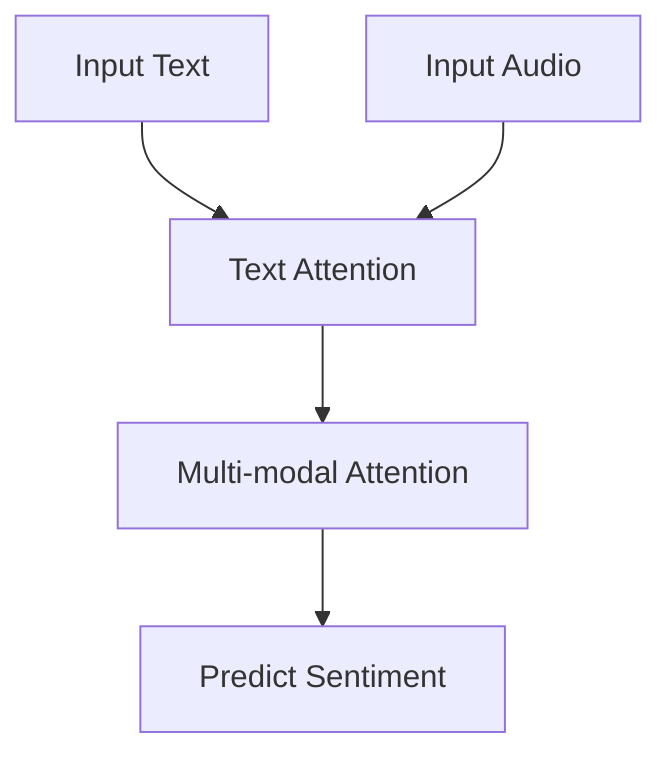
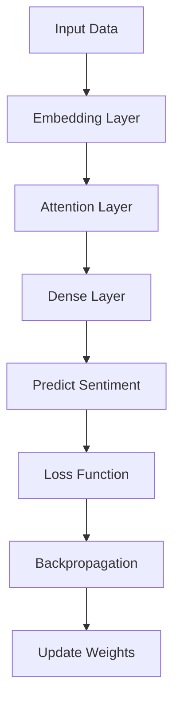
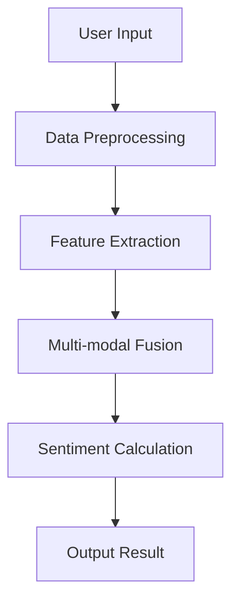

                 

# AI Agent的多模态情感交互系统设计

## 关键词：
AI Agent, 多模态情感交互, 情感计算, 多模态数据融合, 深度学习, 情感表达

## 摘要：
本文系统性地探讨了AI Agent的多模态情感交互系统的设计与实现。首先，从多模态数据融合、情感计算模型等核心概念出发，分析了AI Agent在情感交互中的优势与挑战。接着，详细讲解了多模态数据融合算法、情感计算模型的构建，以及系统架构设计。通过一个实际项目案例，展示了系统设计与实现的全过程，并总结了在教育、医疗、娱乐等领域的高级应用与未来发展趋势。本文旨在为AI Agent的多模态情感交互系统的设计与开发提供全面的技术指导。

---

## 第一部分: 多模态情感交互系统概述

### 第1章: 多模态情感交互的背景与概念

#### 1.1 AI Agent的基本概念
- **1.1.1 AI Agent的定义**：AI Agent是一种智能体，能够感知环境并采取行动以实现目标。
- **1.1.2 多模态交互的定义**：涉及多种输入形式（如文本、语音、图像）的交互方式。
- **1.1.3 情感交互的核心概念**：情感交互是指系统能够理解并回应用户的情感状态。

#### 1.2 多模态情感交互的背景与意义
- **1.2.1 当前AI交互的挑战**：传统单模态交互的局限性。
- **1.2.2 多模态交互的优势**：提升用户体验，实现更自然的互动。
- **1.2.3 情感交互的重要性**：增强人机交互的深度和情感共鸣。

---

## 第二部分: 多模态情感交互系统的核心技术

### 第2章: 多模态数据融合

#### 2.1 多模态数据的融合方法
- **2.1.1 基于特征的融合**：将不同模态的特征向量进行组合。
- **2.1.2 基于决策的融合**：在决策阶段结合不同模态的信息。
- **2.1.3 基于模型的融合**：利用深度学习模型进行联合建模。

#### 2.2 注意力机制在多模态融合中的应用
- **2.2.1 注意力机制的基本原理**：通过权重分配关注重要信息。
- **2.2.2 多模态注意力模型**：如多模态Transformer架构。
- **2.2.3 案例分析**：使用多模态注意力模型进行情感分析。

#### 图2-1: 多模态注意力模型的注意力权重分配

---

### 第3章: 情感计算模型的构建

#### 3.1 情感计算的数学模型
- **3.1.1 基于概率的模型**：如朴素贝叶斯模型。
- **3.1.2 基于深度学习的模型**：如LSTM和Transformer。
- **3.1.3 情感计算的公式推导**：例如，使用词嵌入和注意力机制的情感计算公式。

#### 3.2 情感计算的训练与优化
- **3.2.1 损失函数的选择**：如交叉熵损失。
- **3.2.2 优化算法**：如Adam优化器。
- **3.2.3 模型调参技巧**：如学习率调整和早停策略。

#### 图3-1: 情感计算模型的训练流程

---

## 第三部分: 多模态情感交互系统的算法实现

### 第4章: 多模态数据融合算法

#### 4.1 多模态数据融合方法
- **4.1.1 基于特征的融合**：将文本、语音和图像特征向量进行拼接。
- **4.1.2 基于决策的融合**：在分类器输出层进行融合。
- **4.1.3 基于模型的融合**：使用深度学习模型进行联合建模。

#### 4.2 注意力机制在多模态融合中的应用
- **4.2.1 多模态注意力模型**：如多模态Transformer架构。
- **4.2.2 案例分析**：使用多模态注意力模型进行情感分析。

#### 图4-1: 多模态注意力模型的注意力权重分配

---

### 第5章: 情感计算模型的构建

#### 5.1 情感计算的数学模型
- **5.1.1 基于概率的模型**：如朴素贝叶斯模型。
- **5.1.2 基于深度学习的模型**：如LSTM和Transformer。
- **5.1.3 情感计算的公式推导**：例如，使用词嵌入和注意力机制的情感计算公式。

#### 5.2 情感计算的训练与优化
- **5.2.1 损失函数的选择**：如交叉熵损失。
- **5.2.2 优化算法**：如Adam优化器。
- **5.2.3 模型调参技巧**：如学习率调整和早停策略。

#### 图5-1: 情感计算模型的训练流程

---

## 第四部分: 多模态情感交互系统的系统设计与实现

### 第6章: 系统架构设计

#### 6.1 系统功能设计
- **6.1.1 功能模块划分**：如数据输入模块、特征提取模块、情感计算模块。
- **6.1.2 系统架构设计**：如基于微服务的架构。
- **6.1.3 系统交互流程**：从输入到输出的完整流程。

#### 图6-1: 系统架构设计

---

## 第五部分: 多模态情感交互系统的高级应用与未来展望

### 第7章: 多模态情感交互的高级应用

#### 7.1 教育领域的应用
- **7.1.1 情感支持**：帮助学生缓解压力。
- **7.1.2 个性化教学**：根据学生情绪调整教学策略。

#### 7.2 医疗领域的应用
- **7.2.1 情感支持**：为患者提供情感陪伴。
- **7.2.2 病情监测**：通过情感分析监测患者情绪变化。

#### 7.3 娱乐领域的应用
- **7.3.1 情感陪伴**：智能助手提供情感支持。
- **7.3.2 内容推荐**：根据用户情感状态推荐内容。

---

## 第六部分: 总结与展望

### 第8章: 总结与展望

#### 8.1 总结
- 本文系统性地探讨了AI Agent的多模态情感交互系统的设计与实现。
- 重点介绍了多模态数据融合、情感计算模型构建、系统架构设计等关键技术。

#### 8.2 未来展望
- 情感交互的实时性与准确性有待进一步提升。
- 多模态情感交互在更多领域的应用前景广阔。

---

通过以上思考和规划，我们可以系统性地撰写一篇结构清晰、内容详实的技术博客文章，涵盖从基础概念到系统设计再到实际应用的各个方面。

