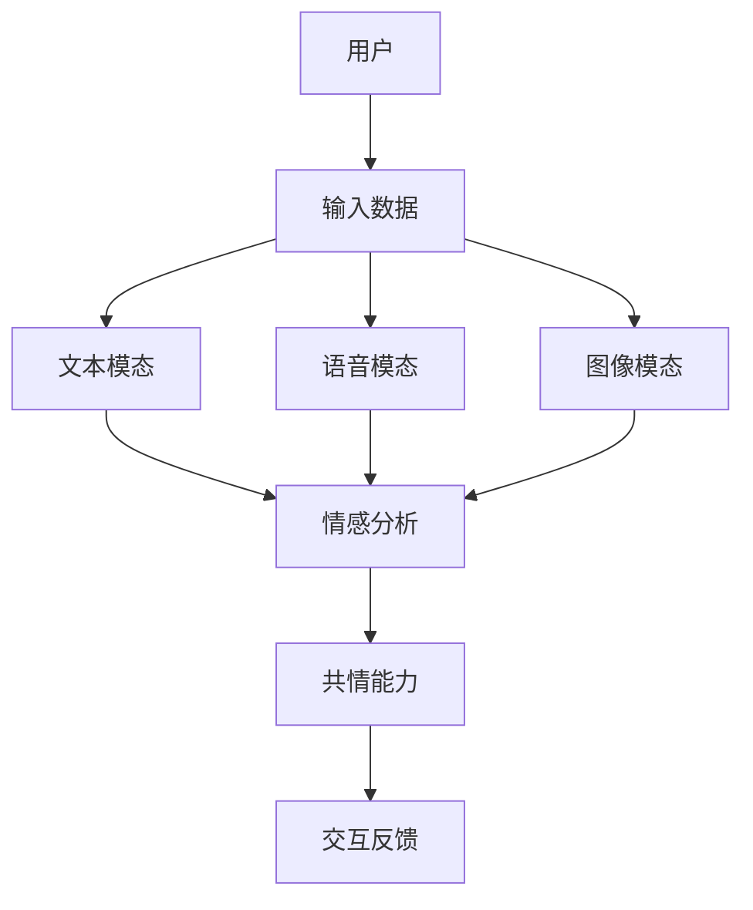
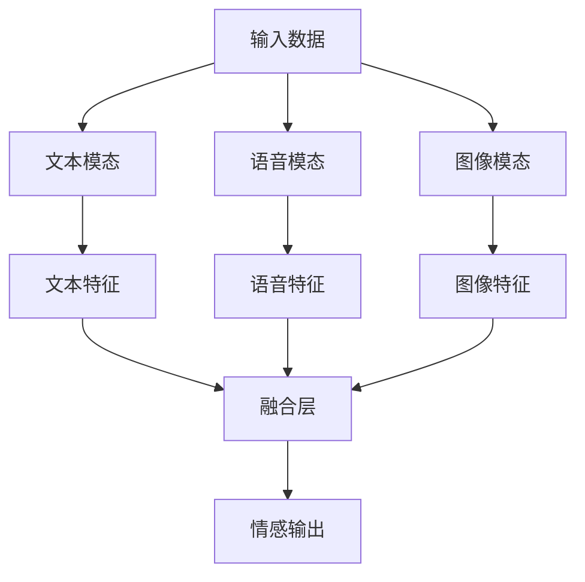
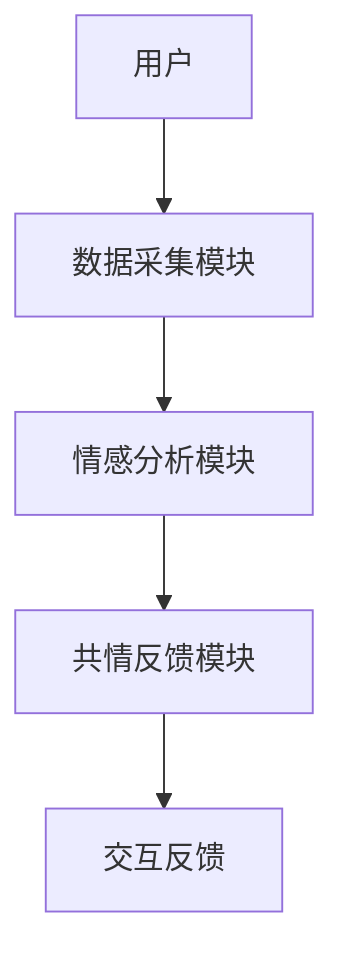

                 


# AI Agent的多模态情感计算与共情能力

## 关键词
- AI Agent
- 多模态情感计算
- 共情能力
- 人机交互
- 情感分析
- 深度学习

## 摘要
随着人工智能技术的不断发展，AI Agent（智能体）在各个领域的应用日益广泛。然而，AI Agent需要具备情感计算与共情能力，才能更好地与人类进行交互。本文详细探讨了多模态情感计算的核心概念、算法原理、系统架构设计以及项目实战。通过分析多模态数据的融合方法和共情模型的构建，本文提出了一个基于深度学习的AI Agent情感计算框架，并通过实际案例展示了其在智能助手中的应用。本文还总结了当前研究的成果与不足，并展望了未来的研究方向。

---

# 目录

1. [背景介绍](#背景介绍)
   - [1.1 多模态情感计算的定义与核心概念](#11-多模态情感计算的定义与核心概念)
   - [1.2 AI Agent与情感计算的关系](#12-ai-agent与情感计算的关系)
   - [1.3 多模态情感计算的应用场景](#13-多模态情感计算的应用场景)
2. [多模态情感计算的核心概念与联系](#多模态情感计算的核心概念与联系)
   - [2.1 多模态数据的融合原理](#21-多模态数据的融合原理)
   - [2.2 情感计算与共情能力的实体关系图](#22-情感计算与共情能力的实体关系图)
   - [2.3 多模态情感计算的算法原理](#23-多模态情感计算的算法原理)
3. [算法原理与实现](#算法原理与实现)
   - [3.1 多模态融合算法](#31-多模态融合算法)
   - [3.2 情感迁移学习算法](#32-情感迁移学习算法)
   - [3.3 共情模型的构建与训练](#33-共情模型的构建与训练)
4. [系统架构与设计](#系统架构与设计)
   - [4.1 系统功能设计](#41-系统功能设计)
   - [4.2 系统架构图](#42-系统架构图)
   - [4.3 系统接口设计](#43-系统接口设计)
5. [项目实战与案例分析](#项目实战与案例分析)
   - [5.1 环境安装与配置](#51-环境安装与配置)
   - [5.2 核心代码实现](#52-核心代码实现)
   - [5.3 实际案例分析](#53-实际案例分析)
6. [总结与展望](#总结与展望)
   - [6.1 全文总结](#61-全文总结)
   - [6.2 未来研究方向](#62-未来研究方向)

---

## 背景介绍

### 1.1 多模态情感计算的定义与核心概念

#### 1.1.1 多模态数据的定义与特征
多模态数据是指来源于不同感官渠道的数据形式，如文本、语音、图像和视频等。这些数据形式各自携带不同的信息，共同构成对同一情感状态的多维度描述。例如，文本可以表达情绪的语调，语音可以传递情感的高低，图像可以反映情感的视觉表现。

| 数据模态 | 特征描述 | 示例 |
|----------|----------|------|
| 文本      | 情感表达的语义信息 | "我非常高兴" |
| 语音      | 情感表达的声学特征 | 高音、快语速 |
| 图像      | 情感表达的视觉特征 | 微笑、眼神交流 |

#### 1.1.2 情感计算的核心概念与目标
情感计算（Affective Computing）是指通过计算技术来识别、理解和模拟人类情感的过程。其核心目标是使计算机能够像人类一样理解和响应情感信息。

- **情感识别**：通过分析多模态数据，识别出用户的情感状态（如快乐、悲伤、愤怒等）。
- **情感推理**：基于情感识别的结果，推断出用户的潜在需求或意图。
- **情感表达**：通过生成文本、语音或图像等形式，模拟情感反馈。

#### 1.1.3 共情能力的定义与实现方式
共情能力是指AI系统能够理解和分享用户情感状态的能力。实现共情能力的关键在于情感计算的准确性以及系统对情感信息的响应能力。

- **情感记忆**：记录用户的情感历史，以便在后续交互中提供更个性化的服务。
- **情感预测**：基于历史数据，预测用户未来的情感状态。

### 1.2 AI Agent与情感计算的关系

#### 1.2.1 AI Agent的基本概念与功能
AI Agent是一种能够感知环境、自主决策并执行任务的智能实体。它可以分为简单反射型Agent和复杂认知型Agent两类。

- **简单反射型Agent**：基于当前输入直接生成响应，如语音助手的基本对话功能。
- **复杂认知型Agent**：具备情感计算和共情能力，能够理解用户情感并提供更智能的服务。

#### 1.2.2 情感计算在AI Agent中的作用
情感计算是AI Agent实现高级人机交互的核心技术。通过情感计算，AI Agent能够更好地理解用户需求，提供更贴心的服务。

- **提升交互体验**：通过情感分析，AI Agent可以调整交互方式，使用户体验更自然。
- **增强决策能力**：情感信息可以作为决策的辅助依据，帮助AI Agent做出更符合用户期望的选择。

#### 1.2.3 共情能力对AI Agent交互的影响
共情能力使得AI Agent能够与用户建立更深层次的情感连接，从而提高交互的满意度和忠诚度。

- **情感反馈**：AI Agent可以通过情感表达（如语气变化、表情生成）来反馈用户的情感状态。
- **个性化服务**：基于用户的情感历史，提供个性化的服务推荐。

### 1.3 多模态情感计算的应用场景

#### 1.3.1 情感计算在人机交互中的应用
- **智能助手**：如Siri、Alexa等语音助手通过情感计算来提高交互的自然性。
- **客服机器人**：通过情感分析识别用户情绪，提供更优质的服务。

#### 1.3.2 共情能力在智能助手中的应用
- **情感陪伴**：AI Agent可以作为情感支持，帮助用户缓解压力。
- **教育辅助**：在教育场景中，AI Agent可以通过情感计算来调整教学策略。

#### 1.3.3 多模态数据在情感分析中的优势
- **信息丰富性**：多模态数据能够提供更全面的情感信息，提高情感分析的准确性。
- **鲁棒性**：通过融合多种模态数据，可以弥补单一模态数据的不足，提高系统的健壮性。

---

## 多模态情感计算的核心概念与联系

### 2.1 多模态数据的融合原理

#### 2.1.1 多模态数据的类型与特点
- **文本模态**：包含丰富的语义信息，但缺乏情感强度的直接体现。
- **语音模态**：通过声学特征（如音调、语速）传递情感信息。
- **图像模态**：通过视觉特征（如面部表情、肢体语言）表达情感。

#### 2.1.2 数据融合的层次与方法
数据融合可以分为浅层融合和深层融合两种方式：

- **浅层融合**：在特征层面进行简单的组合或加权。
- **深层融合**：在模型内部进行多模态特征的联合训练，如使用多任务学习框架。

#### 2.1.3 模态间关系的分析与建模
模态间的关系可以通过相关性分析或因果关系分析来建模。例如，可以通过计算文本模态和语音模态之间的相关性，来确定它们在情感计算中的互补性。

### 2.2 情感计算与共情能力的实体关系图



### 2.3 多模态情感计算的算法原理



---

## 算法原理与实现

### 3.1 多模态融合算法

#### 3.1.1 多模态融合的实现步骤
1. **特征提取**：分别从文本、语音、图像中提取特征。
2. **特征融合**：将提取的特征进行融合，可以采用加权融合或注意力机制。
3. **情感预测**：基于融合后的特征，进行情感分类或回归。

#### 3.1.2 基于注意力机制的多模态融合算法
```python
import tensorflow as tf

class MultiModalAttention(tf.keras.Model):
    def __init__(self, embed_dim, num_heads):
        super(MultiModalAttention, self).__init__()
        self.num_heads = num_heads
        self.embed_dim = embed_dim

    def call(self, inputs):
        # 输入：[text_features, voice_features, image_features]
        text, voice, image = inputs
        features = tf.concat([text, voice, image], axis=-1)
        # 多头注意力机制
        attention_output = self_attention(features, self.num_heads)
        return attention_output
```

#### 3.1.3 多模态融合算法的数学模型
假设我们有三种模态的特征向量：$X_t$（文本）、$X_v$（语音）、$X_i$（图像）。融合层可以将这些特征向量进行线性组合：

$$
X_{\text{fusion}} = \alpha X_t + \beta X_v + \gamma X_i
$$

其中，$\alpha$, $\beta$, $\gamma$ 是融合系数，可以通过训练学习得到。

### 3.2 情感迁移学习算法

#### 3.2.1 迁移学习的定义与优势
迁移学习是一种通过将已学习的知识应用于新任务的学习方法。在情感计算中，迁移学习可以帮助模型在数据 scarce 的情况下依然保持较好的性能。

#### 3.2.2 情感迁移学习的实现步骤
1. **预训练**：在大规模情感数据集上预训练一个情感分类模型。
2. **微调**：在目标数据集上进行微调，适应特定场景的需求。

#### 3.2.3 基于预训练模型的情感迁移学习
```python
import tensorflow as tf
from tensorflow.keras import layers

def transfer_learning_model(pretrained_model, freeze_layers):
    model = tf.keras.Sequential()
    for layer in pretrained_model.layers[:freeze_layers]:
        model.add(layer)
    model.add(layers.Dense(128, activation='relu'))
    model.add(layers.Dense(2, activation='softmax'))
    return model
```

### 3.3 共情模型的构建与训练

#### 3.3.1 共情模型的定义
共情模型是一个能够理解和模拟用户情感状态的模型，通常包括情感识别、情感记忆和情感反馈三个部分。

#### 3.3.2 基于RNN的情感记忆模型
```python
import tensorflow as tf
from tensorflow.keras import layers

class EmotionMemoryModel(tf.keras.Model):
    def __init__(self, vocab_size, embedding_dim, hidden_units):
        super(EmotionMemoryModel, self).__init__()
        self.embedding = layers.Embedding(vocab_size, embedding_dim)
        self.rnn = layers.SimpleRNN(hidden_units)
        self.dense = layers.Dense(1, activation='sigmoid')

    def call(self, inputs):
        x = self.embedding(inputs)
        x = self.rnn(x)
        x = self.dense(x)
        return x
```

#### 3.3.3 情感反馈机制的设计
情感反馈机制通过调整模型的输出来模拟情感表达，例如在文本生成中加入情感词汇。

---

## 系统架构与设计

### 4.1 系统功能设计

#### 4.1.1 系统功能模块
- **数据采集模块**：采集用户的多模态数据（文本、语音、图像）。
- **情感分析模块**：对采集的数据进行情感分析。
- **共情反馈模块**：根据情感分析结果生成情感反馈。

#### 4.1.2 系统功能流程
1. 用户输入多模态数据。
2. 数据采集模块将数据传递给情感分析模块。
3. 情感分析模块生成情感标签。
4. 共情反馈模块根据情感标签生成反馈。

### 4.2 系统架构图



### 4.3 系统接口设计

#### 4.3.1 API接口定义
- **输入接口**：`POST /api/input`
- **输出接口**：`GET /api/output`

#### 4.3.2 数据接口格式
```json
{
    "text": "用户输入的文本",
    "voice": "语音数据的路径",
    "image": "图像数据的路径"
}
```

---

## 项目实战与案例分析

### 5.1 环境安装与配置

```bash
pip install tensorflow==2.5.0
pip install numpy==1.21.0
pip install matplotlib==3.5.0
```

### 5.2 核心代码实现

#### 5.2.1 多模态情感分析模型
```python
import tensorflow as tf
from tensorflow.keras import layers

def multi_modal_model(max_text_length, num_vocabulary):
    text_input = layers.Input(shape=(max_text_length,))
    text_embedding = layers.Embedding(num_vocabulary, 128)(text_input)
    text_rnn = layers.SimpleRNN(64)(text_embedding)
    
    voice_input = layers.Input(shape=(128,))
    voice_dense = layers.Dense(64, activation='relu')(voice_input)
    
    image_input = layers.Input(shape=(224, 224, 3))
    image_model = tf.keras.applications.VGG16(weights='imagenet', include_top=False)(image_input)
    image_dense = layers.Flatten()(image_model)
    image_dense = layers.Dense(64, activation='relu')(image_dense)
    
    merged = layers.Concatenate()([text_rnn, voice_dense, image_dense])
    output = layers.Dense(2, activation='softmax')(merged)
    
    model = tf.keras.Model(inputs=[text_input, voice_input, image_input], outputs=output)
    return model
```

#### 5.2.2 情感反馈生成模块
```python
def generate_emotion_response(emotion_label):
    emotion_map = {
        0: "看起来你有点不开心，有什么我可以帮忙的吗？",
        1: "听起来你非常开心，真是太好了！"
    }
    return emotion_map[emotion_label]
```

### 5.3 实际案例分析

假设用户输入以下数据：
- 文本： "我感到非常难过"
- 语音： 低音、慢语速
- 图像： 面部表情悲伤

模型预测结果为情绪标签 0（悲伤），生成反馈： "看起来你有点不开心，有什么我可以帮忙的吗？"

---

## 总结与展望

### 6.1 全文总结

本文详细探讨了AI Agent的多模态情感计算与共情能力，从理论到实践，系统性地介绍了多模态情感计算的核心概念、算法实现、系统架构设计以及项目实战。通过实际案例分析，展示了如何将多模态情感计算技术应用于智能助手中，提升了人机交互的自然性和智能化水平。

### 6.2 未来研究方向

- **更复杂的多模态融合方法**：探索更高效的多模态数据融合方法，如基于图神经网络的融合模型。
- **情感记忆的深度学习**：研究更复杂的记忆机制，如基于Transformer的序列记忆模型。
- **跨模态情感迁移学习**：探索在跨语言、跨文化场景下的情感计算技术。

---

通过以上内容，本文为AI Agent的多模态情感计算与共情能力的研究提供了全面的理论和技术支持，为未来的进一步研究和应用提供了重要参考。

